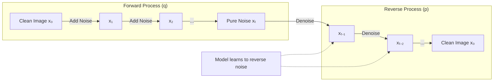
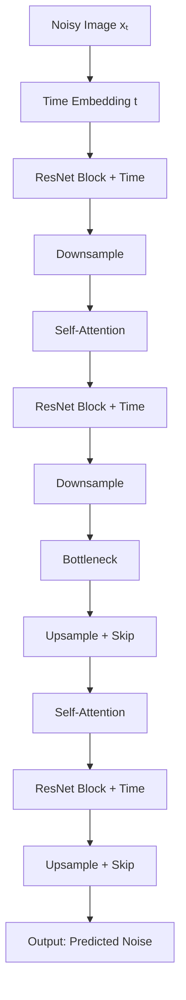
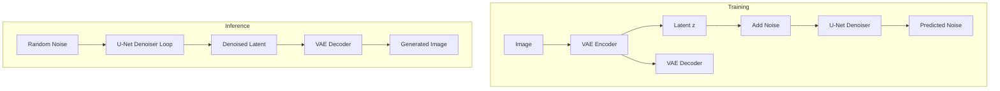
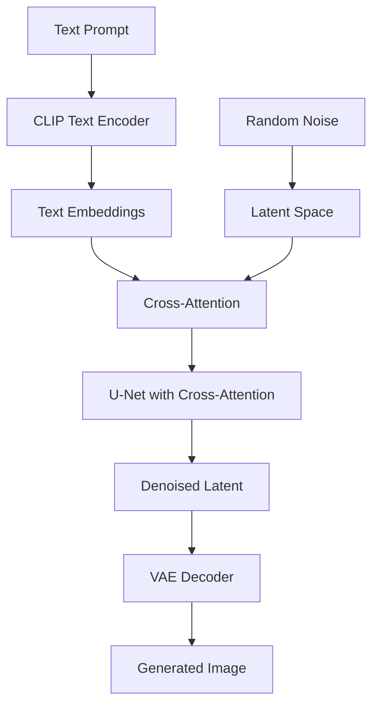
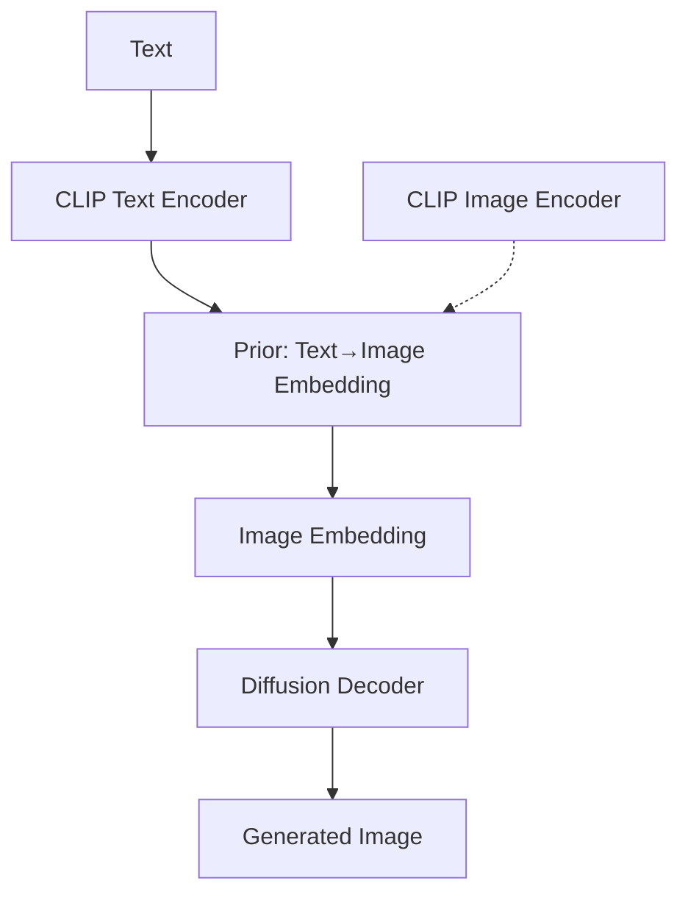
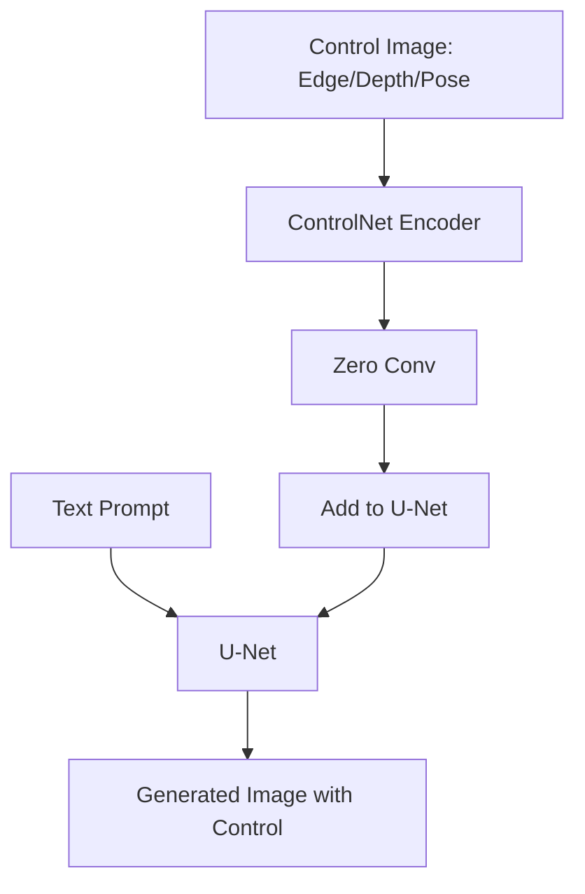

# Diffusion Models

Diffusion models are generative models that learn to create data by reversing a gradual noising process. They have become the dominant approach for image generation, surpassing GANs in quality and diversity.

## Overview



## Mathematical Foundation

### Forward Process (Diffusion)

Gradually add Gaussian noise over T timesteps:

```python
# q(xₜ | xₜ₋₁) = N(xₜ; √(1-βₜ)·xₜ₋₁, βₜ·I)

# Noise schedule: β₁, β₂, ..., βₜ (typically increasing)
# αₜ = 1 - βₜ
# ᾱₜ = α₁ · α₂ · ... · αₜ

# Closed form: sample xₜ directly from x₀
# q(xₜ | x₀) = N(xₜ; √ᾱₜ·x₀, (1-ᾱₜ)·I)

def forward_diffusion(x0, t, noise_schedule):
    """Add noise to x0 at timestep t"""
    alpha_bar = noise_schedule.alpha_bar[t]
    noise = torch.randn_like(x0)
    x_t = sqrt(alpha_bar) * x0 + sqrt(1 - alpha_bar) * noise
    return x_t, noise
```

### Reverse Process (Denoising)

Learn to reverse the noise addition:

```python
# p_θ(xₜ₋₁ | xₜ) = N(xₜ₋₁; μ_θ(xₜ, t), σₜ²·I)

# The model predicts the noise ε_θ(xₜ, t) added at each step
# Then compute xₜ₋₁ from xₜ and predicted noise

def reverse_diffusion_step(model, x_t, t, noise_schedule):
    """One denoising step"""
    predicted_noise = model(x_t, t)
    
    alpha = noise_schedule.alpha[t]
    alpha_bar = noise_schedule.alpha_bar[t]
    beta = noise_schedule.beta[t]
    
    # Compute mean
    mu = (1/sqrt(alpha)) * (x_t - (beta/sqrt(1-alpha_bar)) * predicted_noise)
    
    # Add noise (except at t=0)
    if t > 0:
        noise = torch.randn_like(x_t)
        x_prev = mu + sqrt(beta) * noise
    else:
        x_prev = mu
    
    return x_prev
```

### Training Objective

Simple MSE loss between predicted and actual noise:

```python
def diffusion_loss(model, x0, noise_schedule):
    """Training loss for diffusion model"""
    # Random timestep
    t = torch.randint(0, T, (x0.shape[0],))
    
    # Sample noise
    noise = torch.randn_like(x0)
    
    # Add noise to x0
    x_t = forward_diffusion(x0, t, noise_schedule, noise)
    
    # Predict noise
    predicted_noise = model(x_t, t)
    
    # MSE loss
    loss = F.mse_loss(predicted_noise, noise)
    return loss
```

## DDPM (Denoising Diffusion Probabilistic Models)

The foundational paper that made diffusion models practical.

### Architecture: U-Net with Time Embedding



### Time Embedding

```python
class SinusoidalTimeEmbedding(nn.Module):
    def __init__(self, dim):
        super().__init__()
        self.dim = dim
    
    def forward(self, t):
        # Similar to positional encoding in transformers
        half_dim = self.dim // 2
        emb = math.log(10000) / (half_dim - 1)
        emb = torch.exp(torch.arange(half_dim) * -emb)
        emb = t[:, None] * emb[None, :]
        emb = torch.cat([torch.sin(emb), torch.cos(emb)], dim=-1)
        return emb
```

### Noise Schedules

```python
# Linear schedule (DDPM original)
beta_start = 0.0001
beta_end = 0.02
betas = torch.linspace(beta_start, beta_end, T)

# Cosine schedule (improved DDPM) - better for images
def cosine_schedule(T, s=0.008):
    steps = torch.arange(T + 1)
    f = torch.cos((steps/T + s) / (1+s) * math.pi/2) ** 2
    alphas = f[1:] / f[:-1]
    betas = 1 - alphas
    return torch.clamp(betas, 0, 0.999)
```

## Latent Diffusion Models (LDM)

Instead of operating in pixel space, operate in a compressed latent space.

### Architecture



**Why latent space?**
- Image: 512×512×3 = 786K dimensions
- Latent: 64×64×4 = 16K dimensions (48× smaller!)
- Much faster training and inference
- VAE preserves perceptually important information

### VAE (Variational Autoencoder) Component

```python
class VAE(nn.Module):
    def __init__(self):
        super().__init__()
        self.encoder = Encoder()  # Image → Latent
        self.decoder = Decoder()  # Latent → Image
    
    def encode(self, x):
        mu, log_var = self.encoder(x)
        z = mu + torch.randn_like(mu) * torch.exp(0.5 * log_var)
        return z, mu, log_var
    
    def decode(self, z):
        return self.decoder(z)
```

## Stable Diffusion

The most popular open-source image generation model.

### Architecture Components



### Cross-Attention for Text Conditioning

```python
class CrossAttention(nn.Module):
    def __init__(self, dim, context_dim):
        super().__init__()
        self.to_q = nn.Linear(dim, dim)
        self.to_k = nn.Linear(context_dim, dim)
        self.to_v = nn.Linear(context_dim, dim)
    
    def forward(self, x, context):
        # x: image features (B, HW, C)
        # context: text embeddings (B, seq_len, context_dim)
        q = self.to_q(x)
        k = self.to_k(context)
        v = self.to_v(context)
        
        attn = F.scaled_dot_product_attention(q, k, v)
        return attn
```

### Sampling Process

```python
def stable_diffusion_generate(prompt, num_steps=50, guidance_scale=7.5):
    """Generate image from text prompt"""
    # 1. Encode text
    text_embeddings = clip_encode(prompt)
    
    # 2. Start with random noise
    latents = torch.randn(1, 4, 64, 64)
    
    # 3. Denoising loop
    scheduler = DDIMScheduler(num_steps)
    for t in scheduler.timesteps:
        # Classifier-free guidance
        noise_pred_uncond = unet(latents, t, null_embedding)
        noise_pred_text = unet(latents, t, text_embeddings)
        noise_pred = noise_pred_uncond + guidance_scale * (noise_pred_text - noise_pred_uncond)
        
        # Scheduler step
        latents = scheduler.step(noise_pred, t, latents)
    
    # 4. Decode latent to image
    image = vae_decode(latents)
    return image
```

### Classifier-Free Guidance (CFG)

```python
# Combines conditional and unconditional predictions
# Higher guidance scale = more adherence to prompt but less diversity

noise_pred = noise_uncond + guidance_scale * (noise_cond - noise_uncond)

# guidance_scale = 1.0: No guidance (unconditional)
# guidance_scale = 7.5: Good balance (default)
# guidance_scale = 15+: Strong adherence but artifacts
```

## DALL-E

OpenAI's text-to-image system.

### DALL-E 1 (2021)
- Discrete VAE (dVAE) for image tokens
- Autoregressive transformer (GPT-like)
- 12B parameters
- Generates from text tokens + image tokens

### DALL-E 2 (2022) - unCLIP



### DALL-E 3 (2023)
- Improved prompt understanding
- Better text rendering
- Built into ChatGPT
- Uses synthetic captions for training

## Sampling Methods

### DDPM (Original)
- 1000 steps
- Slow but high quality
- Stochastic sampling

### DDIM (Denoising Diffusion Implicit Models)

```python
# Deterministic sampling, can skip steps
# 50 steps instead of 1000

def ddim_step(x_t, t, t_prev, noise_pred, eta=0):
    """DDIM sampling step (eta=0 is deterministic)"""
    alpha_bar_t = alphas_cumprod[t]
    alpha_bar_prev = alphas_cumprod[t_prev]
    
    # Predict x0
    x0_pred = (x_t - sqrt(1 - alpha_bar_t) * noise_pred) / sqrt(alpha_bar_t)
    x0_pred = x0_pred.clamp(-1, 1)
    
    # Compute x_{t-1}
    sigma = eta * sqrt((1 - alpha_bar_prev) / (1 - alpha_bar_t)) * sqrt(1 - alpha_bar_t / alpha_bar_prev)
    dir_xt = sqrt(1 - alpha_bar_prev - sigma**2) * noise_pred
    x_prev = sqrt(alpha_bar_prev) * x0_pred + dir_xt + sigma * torch.randn_like(x_t)
    
    return x_prev
```

### Euler, DPM-Solver, etc.

| Method | Steps | Quality | Speed |
|--------|-------|---------|-------|
| DDPM | 1000 | Excellent | Very slow |
| DDIM | 50-100 | Good | Medium |
| Euler | 20-50 | Good | Fast |
| DPM-Solver++ | 10-25 | Excellent | Fast |
| UniPC | 5-10 | Good | Very fast |

## Image-to-Image Translation

```python
# img2img: Start from existing image + noise, denoise with prompt
# Use cases: style transfer, inpainting, super-resolution

def img2img(init_image, prompt, strength=0.75):
    # Encode image to latent
    init_latent = vae_encode(init_image)
    
    # Add noise proportional to strength
    noise = torch.randn_like(init_latent)
    t = int(strength * num_steps)
    noisy_latent = scheduler.add_noise(init_latent, noise, t)
    
    # Denoise from timestep t (not from pure noise)
    for t in scheduler.timesteps[t:]:
        noise_pred = unet(noisy_latent, t, text_embedding)
        noisy_latent = scheduler.step(noise_pred, t, noisy_latent)
    
    return vae_decode(noisy_latent)
```

## ControlNet

Adds spatial control to diffusion models.



## Evaluation Metrics

### FID (Fréchet Inception Distance)
```python
# Compare statistics of real and generated images
# Lower FID = better quality
# FID = ||μ_real - μ_fake||² + Tr(Σ_real + Σ_fake - 2√(Σ_real × Σ_fake))

# Typical values:
# Real images vs real images: ~0
# Good GAN: ~10-30
# Good diffusion: ~5-15
```

### IS (Inception Score)
```python
# Measures quality and diversity
# IS = exp(E[KL(p(y|x) || p(y))])
# Higher IS = better quality + diversity
# Limitation: Only uses ImageNet classes
```

### CLIP Score
```python
# Measures text-image alignment
# clip_score = cosine_similarity(clip_image_embed, clip_text_embed)
# Higher = better prompt adherence
```

## Interview Questions

1. **What is a diffusion model?**
   A generative model that learns to create data by reversing a gradual noising process. The forward process adds noise over time; the model learns to denoise step by step.

2. **Why are diffusion models better than GANs?**
   More stable training (no mode collapse), better diversity, higher quality at scale, and easier to control. GANs can be faster at inference but harder to train.

3. **What is latent diffusion?**
   Instead of diffusing in pixel space, compress images to a latent space using a VAE, then apply diffusion there. Much faster and memory-efficient.

4. **Explain classifier-free guidance.**
   During training, randomly drop the text condition. At inference, compute both conditional and unconditional predictions, then extrapolate: `pred = uncond + scale * (cond - uncond)`. Higher scale = stronger prompt adherence.

5. **What is the training objective of DDPM?**
   Predict the noise added to the image. Simple MSE loss between predicted and actual noise. The model learns ε_θ(xₜ, t) ≈ ε where xₜ = √ᾱₜ·x₀ + √(1-ᾱₜ)·ε.

6. **How does ControlNet work?**
   Adds a trainable copy of the U-Net encoder that processes spatial control signals (edges, depth, pose). Uses zero-initialized convolutions to gradually add control without disrupting the pre-trained model.

7. **What is DDIM and how does it differ from DDPM?**
   DDIM is a deterministic sampling method that can skip steps. Instead of stochastic sampling (1000 steps), DDIM can generate in 50-100 steps with similar quality by following a non-Markovian process.

## Common Mistakes

- ❌ Confusing forward process (adding noise) with reverse process (denoising)
- ❌ Not understanding classifier-free guidance and its effect
- ❌ Using too few sampling steps (poor quality) or too many (slow)
- ❌ Forgetting to scale latents when using Stable Diffusion
- ❌ Not using proper noise schedule (linear vs cosine)

## Summary

Diffusion models generate images by learning to reverse a gradual noising process. DDPM established the framework with U-Net denoising. Latent diffusion (used in Stable Diffusion) operates in compressed space for efficiency. Classifier-free guidance enables text control. Modern sampling methods (DDIM, DPM-Solver) enable fast generation.

## Cross-References

- [GANs](../../ml/gan/README.md) - Alternative generative approach
- [CLIP](clip.md) - Text-image alignment for conditioning
- [VAE](../../ml/transformers/gpt.md) - Variational autoencoder component
- [Transformers](../../ml/transformers/README.md) - Attention mechanism in U-Net
- [Stable Diffusion](diffusion.md#stable-diffusion) - Latent diffusion implementation
