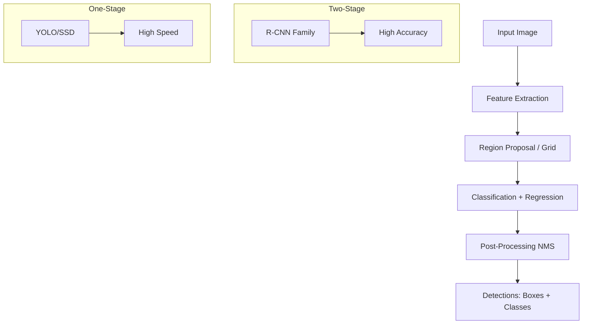
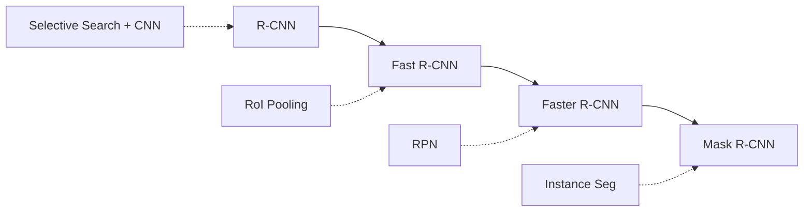
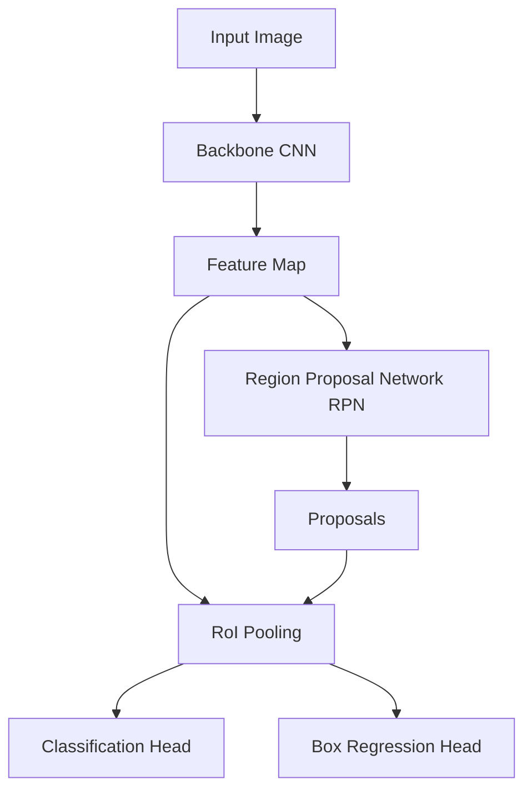
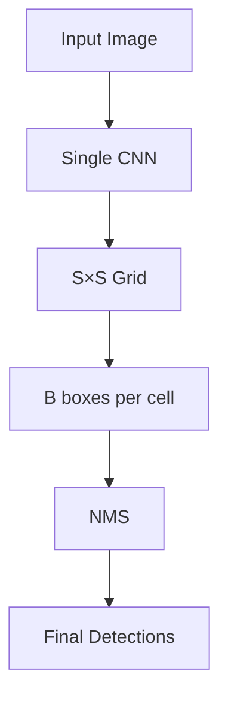
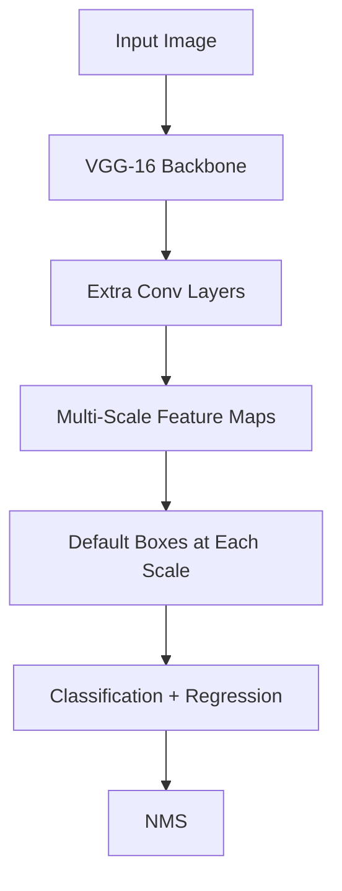
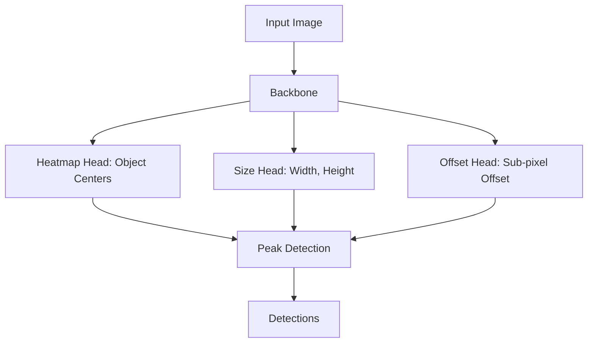
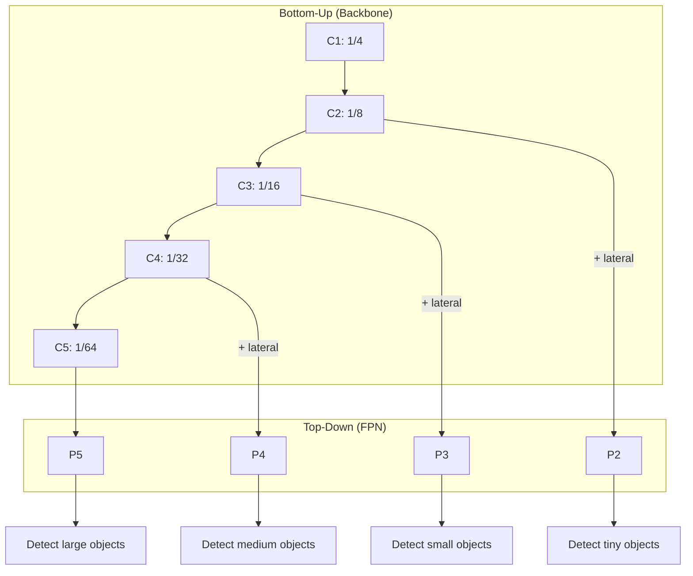

# Object Detection

Object detection is the task of localizing and classifying objects in images by predicting bounding boxes and class labels simultaneously.

## Overview



## Key Concepts

### Bounding Box Representation

```python
# Two common formats
# 1. (x1, y1, x2, y2) - corners
box_corners = [100, 50, 200, 150]  # top-left, bottom-right

# 2. (cx, cy, w, h) - center + size
box_center = [150, 100, 100, 100]  # center_x, center_y, width, height

# Conversion
cx = (x1 + x2) / 2
cy = (y1 + y2) / 2
w = x2 - x1
h = y2 - y1
```

### Intersection over Union (IoU)

```python
def compute_iou(box1, box2):
    """Compute IoU between two boxes [x1, y1, x2, y2]"""
    x1 = max(box1[0], box2[0])
    y1 = max(box1[1], box2[1])
    x2 = min(box1[2], box2[2])
    y2 = min(box1[3], box2[3])
    
    intersection = max(0, x2 - x1) * max(0, y2 - y1)
    area1 = (box1[2]-box1[0]) * (box1[3]-box1[1])
    area2 = (box2[2]-box2[0]) * (box2[3]-box2[1])
    union = area1 + area2 - intersection
    
    return intersection / union
```

IoU thresholds:
- **0.5:** PASCAL VOC standard
- **0.5:0.95:** COCO standard (averaged over thresholds)
- **0.75:** Strict localization

### Anchor Boxes

Pre-defined box templates at different scales and aspect ratios:

```python
# Example: 3 scales × 3 aspect ratios = 9 anchors per location
scales = [128, 256, 512]
aspect_ratios = [0.5, 1.0, 2.0]

# For each feature map location, generate 9 anchors
anchors = []
for scale in scales:
    for ratio in aspect_ratios:
        w = scale * sqrt(ratio)
        h = scale / sqrt(ratio)
        anchors.append([cx, cy, w, h])
```

## Two-Stage Detectors

### R-CNN Family Evolution



### R-CNN (2014)
```
1. Selective Search → ~2000 region proposals
2. CNN feature extraction per region (slow!)
3. SVM classification + bounding box regression

Problem: Very slow (~47s per image)
```

### Fast R-CNN (2015)
```
1. CNN on full image → feature map
2. RoI Pooling extracts features for each proposal
3. Multi-task head: classification + regression

Improvement: Shared feature extraction (fast)
Problem: Still uses external proposals (Selective Search)
```

### Faster R-CNN (2015)



**Region Proposal Network (RPN):**
```python
class RPN(nn.Module):
    def __init__(self, in_channels, num_anchors):
        super().__init__()
        self.conv = nn.Conv2d(in_channels, 512, 3, padding=1)
        self.cls_head = nn.Conv2d(512, num_anchors, 1)  # object/not
        self.reg_head = nn.Conv2d(512, num_anchors * 4, 1)  # box deltas
    
    def forward(self, feature_map):
        x = F.relu(self.conv(feature_map))
        objectness = self.cls_head(x)  # (B, A, H, W)
        box_deltas = self.reg_head(x)  # (B, 4A, H, W)
        return objectness, box_deltas
```

**Box Regression (parameterized deltas):**
```python
# Predict deltas relative to anchors
tx = (x_gt - x_anchor) / w_anchor
ty = (y_gt - y_anchor) / h_anchor
tw = log(w_gt / w_anchor)
th = log(h_gt / h_anchor)

# Decode predictions
x_pred = tx * w_anchor + x_anchor
y_pred = ty * h_anchor + y_anchor
w_pred = exp(tw) * w_anchor
h_pred = exp(th) * h_anchor
```

## One-Stage Detectors

### YOLO (You Only Look Once)

YOLO frames detection as a single regression problem.



**YOLO v1 Grid:**
```
Divide image into S×S grid (e.g., 7×7)
Each cell predicts:
- B bounding boxes (x, y, w, h, confidence)
- C class probabilities

Output: S × S × (B×5 + C)
```

### YOLO Evolution

| Version | Year | Key Innovation | Speed | mAP |
|---------|------|----------------|-------|-----|
| YOLOv1 | 2016 | Unified detection | 45 FPS | 63.4 |
| YOLOv3 | 2018 | Multi-scale, Darknet-53 | 20 FPS | 57.9 |
| YOLOv5 | 2020 | PyTorch, auto-anchor | 140 FPS | 68.9 |
| YOLOv8 | 2023 | Anchor-free, C2f module | 280 FPS | 53.9 |
| YOLOv10 | 2024 | NMS-free, consistent matching | 300+ FPS | 54.4 |

### YOLOv3 Architecture
```python
class YOLOv3(nn.Module):
    def __init__(self, num_classes):
        super().__init__()
        self.backbone = Darknet53()
        self.neck = FPN()  # Feature Pyramid Network
        # 3 detection heads at different scales
        self.head_small = DetectionHead(256, num_classes)   # 13×13
        self.head_medium = DetectionHead(512, num_classes)  # 26×26
        self.head_large = DetectionHead(1024, num_classes)  # 52×52
    
    def forward(self, x):
        features = self.backbone(x)
        c3, c4, c5 = self.neck(features)
        d1 = self.head_large(c3)   # Small objects
        d2 = self.head_medium(c4)  # Medium objects
        d3 = self.head_small(c5)   # Large objects
        return d1, d2, d3
```

### SSD (Single Shot MultiBox Detector)



**Multi-scale detection:**
```
Feature map 38×38: small objects (shoes, bottles)
Feature map 19×19: medium objects (bikes, dogs)
Feature map 10×10: large objects (cars, people)
Feature map 5×5: very large objects (trucks)
Feature map 3×3: huge objects (buses)
Feature map 1×1: image-sized objects
```

### SSD vs YOLO vs Faster R-CNN

| Aspect | Faster R-CNN | SSD | YOLO |
|--------|--------------|-----|------|
| Stages | Two | One | One |
| Speed | 5 FPS | 59 FPS | 45 FPS |
| Accuracy | High | Medium-High | Medium |
| Small objects | Good | Good | Poor (v1) |
| Architecture | RPN + RoI | Multi-scale | Grid-based |

## Anchor-Free Detectors

Modern trend removing anchor box dependency.

### FCOS (Fully Convolutional One-Stage)

```python
# For each location (x, y) on feature map, predict:
# - Classification score
# - 4 distances to box boundaries (l, t, r, b)
# - Centerness score

# Centerness target
centerness = sqrt(min(l, r) / max(l, r) * min(t, b) / max(t, b))
```

### CenterNet



## Non-Maximum Suppression (NMS)

Post-processing to remove duplicate detections.

```python
def nms(boxes, scores, iou_threshold=0.5):
    """Standard NMS"""
    # Sort by confidence score
    indices = scores.argsort(descending=True)
    keep = []
    
    while len(indices) > 0:
        # Pick the highest scoring box
        current = indices[0]
        keep.append(current)
        
        # Compute IoU with remaining boxes
        ious = compute_iou(boxes[current], boxes[indices[1:]])
        
        # Keep boxes with IoU below threshold
        mask = ious < iou_threshold
        indices = indices[1:][mask]
    
    return keep
```

### Soft-NMS
```python
def soft_nms(boxes, scores, sigma=0.5):
    """Decay scores instead of removing boxes"""
    for i in range(len(boxes)):
        ious = compute_iou(boxes[i], boxes[i+1:])
        # Gaussian decay
        scores[i+1:] *= np.exp(-(ious**2) / sigma)
    # Keep all boxes with decayed scores
    return boxes, scores
```

### NMS Variants

| Method | Approach | Pros | Cons |
|--------|----------|------|------|
| Standard NMS | Remove overlapping | Simple, fast | Can remove valid detections |
| Soft-NMS | Decay scores | Better recall | Slightly slower |
| Matrix NMS | Parallel computation | Fast | Complex |
| NMS-Free | Learn to predict unique | No post-processing | Training complexity |

## Feature Pyramid Network (FPN)

Multi-scale feature extraction for detecting objects at different sizes.



## Evaluation Metrics

### mAP (mean Average Precision)

```python
# For each class:
# 1. Sort detections by confidence
# 2. Compute precision-recall curve
# 3. AP = area under PR curve

# mAP = mean of AP across all classes

# COCO metrics:
# mAP@0.5: IoU threshold = 0.5
# mAP@0.75: IoU threshold = 0.75
# mAP@0.5:0.95: Average over IoU thresholds [0.5, 0.55, ..., 0.95]
```

### Precision-Recall Curve
```
Precision = TP / (TP + FP)  "Of all detections, how many are correct?"
Recall = TP / (TP + FN)     "Of all ground truth, how many were found?"

Trade-off: Higher confidence threshold → higher precision, lower recall
```

## Code Example: Faster R-CNN in PyTorch

```python
import torchvision
from torchvision.models.detection import fasterrcnn_resnet50_fpn
from torchvision.models.detection.faster_rcnn import FastRCNNPredictor

# Load pre-trained model
model = fasterrcnn_resnet50_fpn(pretrained=True)

# Modify for custom dataset (e.g., 10 classes + background)
num_classes = 11
in_features = model.roi_heads.box_predictor.cls_score.in_features
model.roi_heads.box_predictor = FastRCNNPredictor(in_features, num_classes)

# Training
images, targets = batch  # targets: list of {boxes, labels}
loss_dict = model(images, targets)  # Returns dict of losses during training
total_loss = sum(loss for loss in loss_dict.values())

# Inference
model.eval()
predictions = model(images)  # Returns list of {boxes, labels, scores}
```

## Interview Questions

1. **What is the difference between one-stage and two-stage detectors?**
   Two-stage (Faster R-CNN): First generates proposals, then classifies/refines. More accurate but slower. One-stage (YOLO, SSD): Directly predicts boxes and classes. Faster but may miss small objects.

2. **Explain anchor boxes and why they're used.**
   Pre-defined box templates at various scales and aspect ratios. They provide reference boxes for the model to predict offsets from, handling the variability in object sizes and shapes.

3. **What is NMS and why is it needed?**
   Multiple detectors often fire on the same object. NMS removes duplicate detections by keeping the highest-scoring box and suppressing others with high IoU overlap.

4. **How does FPN help with multi-scale detection?**
   FPN combines low-resolution semantic features (good for classification) with high-resolution features (good for localization) through top-down pathways and lateral connections.

5. **Explain the RPN in Faster R-CNN.**
   RPN slides a small network over the feature map, predicting objectness scores and box deltas for each anchor. It's a lightweight binary classifier (object vs. background) with box regression.

6. **What are the advantages of anchor-free detectors?**
   Fewer hyperparameters (no anchor design), simpler architecture, often better for unusual aspect ratios, and no need for NMS in some designs.

7. **How is mAP calculated?**
   For each class, compute the precision-recall curve, then calculate the area under it (AP). mAP is the mean of AP across all classes. COCO averages over multiple IoU thresholds.

## Common Mistakes

- ❌ Not using multi-scale training/testing for varying object sizes
- ❌ Ignoring class imbalance (use focal loss for one-stage detectors)
- ❌ Wrong IoU threshold in evaluation vs training
- ❌ Not handling overlapping objects properly in NMS
- ❌ Using wrong coordinate format (x1y1x2y2 vs cxcywh)
- ❌ Forgetting to denormalize boxes after prediction

## Summary

Object detection has evolved from R-CNN (slow, multi-stage) to modern anchor-free detectors (fast, single-stage). Two-stage detectors offer higher accuracy while one-stage detectors prioritize speed. Key innovations include anchor boxes, FPN for multi-scale detection, and NMS for post-processing.

## Cross-References

- [Classification](classification.md) - Single-object recognition
- [Segmentation](segmentation.md) - Pixel-level detection
- [U-Net](segmentation.md#u-net) - Encoder-decoder architecture
- [CLIP](clip.md) - Open-vocabulary detection
- [SAM](sam.md) - Segment anything from prompts
- [ML CNN](../ml/deep-learning/cnn.md)
- [Vision Transformers](../ml/transformers/vit.md)
- [Segmentation](./segmentation.md)
- [CLIP](./clip.md)

