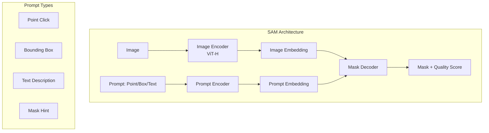
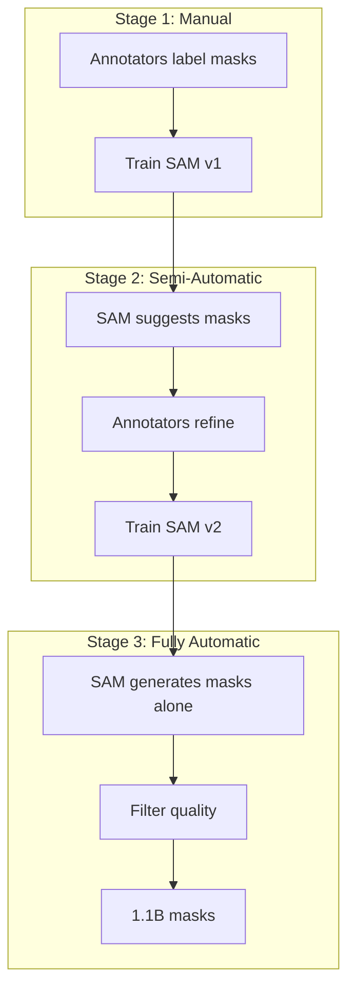

# SAM: Segment Anything Model

SAM (Segment Anything Model) by Meta AI is a foundation model for image segmentation. It can segment any object in any image based on various types of prompts, enabling zero-shot transfer to new domains.

## Overview



## Architecture

### Three Components

```python
class SAM(nn.Module):
    def __init__(self):
        super().__init__()
        self.image_encoder = ImageEncoderViT()    # ViT-H/16
        self.prompt_encoder = PromptEncoder()       # Various prompts
        self.mask_decoder = MaskDecoder()           # Lightweight transformer
    
    def forward(self, image, prompts):
        # 1. Encode image (done once per image)
        image_embedding = self.image_encoder(image)
        
        # 2. Encode prompts
        prompt_embeddings = self.prompt_encoder(prompts)
        
        # 3. Decode masks
        masks, iou_predictions = self.mask_decoder(
            image_embedding, prompt_embeddings
        )
        return masks, iou_predictions
```

### Image Encoder

Heavy component, runs once per image:

```python
class ImageEncoderViT(nn.Module):
    def __init__(self):
        super().__init__()
        # ViT-Huge: 14×14 patches, 1280 dim, 16 heads
        self.vit = ViT(
            img_size=1024,
            patch_size=16,
            embed_dim=1280,
            depth=32,
            num_heads=16,
            global_attn_indexes=[7, 15, 23, 31]  # Window + global attention
        )
        self.neck = nn.Sequential(
            nn.Conv2d(1280, 256, 1),
            nn.LayerNorm2d(256),
            nn.Conv2d(256, 256, 3, padding=1),
            nn.LayerNorm2d(256)
        )
    
    def forward(self, x):
        # x: (B, 3, 1024, 1024)
        embedding = self.vit(x)  # (B, 64, 64, 1280)
        embedding = self.neck(embedding.permute(0, 3, 1, 2))  # (B, 256, 64, 64)
        return embedding
```

### Prompt Encoder

Encodes different types of prompts:

```python
class PromptEncoder(nn.Module):
    def __init__(self, embed_dim=256):
        super().__init__()
        self.point_embedding = nn.Embedding(4, embed_dim)  # pos/neg/box corners
        self.not_a_point = nn.Embedding(1, embed_dim)      # Padding
        
    def encode_points(self, points, labels):
        """Encode point prompts (x, y, label)"""
        # label: 1 = foreground, 0 = background
        point_embeddings = []
        for point, label in zip(points, labels):
            if label == 1:
                point_embeddings.append(self.point_embedding[0])  # FG
            else:
                point_embeddings.append(self.point_embedding[1])  # BG
        return torch.stack(point_embeddings)
    
    def encode_boxes(self, boxes):
        """Encode box prompts (x1, y1, x2, y2)"""
        # Use corner points as embeddings
        top_left = self.point_embedding[2]
        bottom_right = self.point_embedding[3]
        return torch.stack([top_left, bottom_right])
```

### Mask Decoder

Lightweight transformer decoder:

```python
class MaskDecoder(nn.Module):
    def __init__(self, num_multimask_outputs=3):
        super().__init__()
        self.transformer = TwoWayTransformer(depth=2, embed_dim=256)
        self.iou_prediction_head = nn.Linear(256, num_multimask_outputs)
        self.mask_upscaling = nn.Sequential(
            nn.ConvTranspose2d(256, 128, 2, stride=2),
            nn.LayerNorm2d(128),
            nn.GELU(),
            nn.ConvTranspose2d(128, 64, 2, stride=2),
            nn.LayerNorm2d(64),
            nn.GELU(),
            nn.ConvTranspose2d(64, 32, 2, stride=2),
        )
    
    def forward(self, image_embedding, prompt_embeddings):
        # Two-way attention: prompts attend to image, image attends to prompts
        tokens, image_features = self.transformer(
            prompt_embeddings, image_embedding
        )
        
        # Predict IoU scores
        iou_pred = self.iou_prediction_head(tokens)
        
        # Generate masks via dot product
        upscaled_embedding = self.mask_upscaling(image_features)
        masks = (tokens @ upscaled_embedding.flatten(2)).sigmoid()
        
        return masks, iou_pred
```

## Prompt Types

### Point Prompts

```python
# Single click: segment object at point
point = (x=200, y=300)
label = 1  # foreground

# Multiple points: refine segmentation
points = [(200, 300, 1), (250, 350, 1), (100, 100, 0)]
# First two are foreground, last is background

masks, scores = sam.predict(points, labels)
# Returns 3 mask candidates with IoU scores
```

### Box Prompts

```python
# Segment object within bounding box
box = (x1=100, y1=50, x2=400, y2=350)

masks, scores = sam.predict(boxes=box)
# More precise than point prompts
```

### Text Prompts (with CLIP)

```python
# Segment objects described by text
# Requires CLIP integration

def segment_by_text(image, text_prompt, sam, clip_model):
    # 1. Use CLIP to get image features for text
    text_embedding = clip_model.encode_text(text_prompt)
    
    # 2. Find relevant regions using CLIP
    image_features = clip_model.encode_image(image)
    
    # 3. Use region features as SAM prompts
    # (Simplified - actual implementation more complex)
    masks = sam.predict(image_features, text_embedding)
    return masks
```

### Automatic Mask Generation

```python
def automatic_mask_generation(image, sam):
    """Generate masks for all objects in image"""
    # 1. Generate grid of point prompts
    h, w = image.shape[:2]
    points = []
    for y in range(0, h, 32):
        for x in range(0, w, 32):
            points.append((x, y))
    
    # 2. Predict masks for all points
    all_masks = []
    for point in points:
        masks, scores = sam.predict(points=[point])
        all_masks.append((masks, scores))
    
    # 3. Remove duplicates using NMS
    final_masks = mask_nms(all_masks, iou_threshold=0.8)
    
    return final_masks
```

## SA-1B Dataset

SAM was trained on the largest segmentation dataset ever:

```
SA-1B Dataset:
- 11 million images
- 1.1 billion masks
- 100+ masks per image on average
- Diverse: natural, medical, satellite, etc.
- Collected in 3 stages:
  1. Manual annotation (small set)
  2. Semi-automatic (SAM-assisted humans)
  3. Fully automatic (SAM alone)
```

### Data Engine



## SAM 2 (Video)

Extended to video segmentation with temporal memory.


### Memory Mechanism

```python
class MemoryAttention(nn.Module):
    def __init__(self):
        super().__init__()
        self.memory_encoder = nn.TransformerEncoder(...)
        self.memory_bank = []  # Stores past frame features
    
    def forward(self, current_features, prompts):
        # Attend to memory bank for temporal consistency
        memory_context = self.memory_encoder(self.memory_bank)
        
        # Combine with current frame
        combined = cross_attention(current_features, memory_context)
        
        # Store current frame in memory
        self.memory_bank.append(current_features)
        
        return combined
```

## Real-World Applications

### Medical Image Segmentation

```python
# Segment organs, tumors, cells
# Fine-tune SAM on medical images

class MedicalSAM(nn.Module):
    def __init__(self, sam_model):
        super().__init__()
        self.sam = sam_model
        # Add medical-specific adapter
        self.adapter = MedicalAdapter()
    
    def segment(self, mri_scan, point_prompt):
        adapted = self.adapter(mri_scan)
        masks = self.sam.predict(adapted, point_prompt)
        return masks
```

### Video Object Segmentation

```python
# Track and segment objects across video frames
def video_segmentation(video_frames, initial_prompt, sam2):
    masks = []
    for frame in video_frames:
        mask = sam2.predict(frame, memory=True)
        masks.append(mask)
    return masks
```

### Interactive Segmentation

```python
# User clicks on object, SAM segments it
def interactive_segmentation(image):
    # Display image
    # Wait for user click
    point = get_user_click()
    
    # Predict mask
    masks, scores = sam.predict(points=[point])
    
    # Show top mask
    display_mask(masks[0])
    
    # Allow refinement
    while not satisfied:
        new_point = get_user_click()
        masks, scores = sam.predict(
            points=[point, new_point],
            labels=[1, get_label(new_point)]
        )
        display_mask(masks[0])
    
    return masks[0]
```

## Comparison with Other Segmentation Models

| Model | Prompt Types | Zero-Shot | Speed | Training Data |
|-------|-------------|-----------|-------|---------------|
| SAM | Point, Box, Text, Mask | Yes | Medium | SA-1B (1.1B masks) |
| Mask R-CNN | None (closed) | No | Fast | COCO (120K masks) |
| U-Net | None (closed) | No | Fast | Task-specific |
| CLIPSeg | Text | Yes | Fast | Image-text pairs |
| Segment-Everything | Point grid | Yes | Slow | Various |

## Code Example: Using SAM

```python
from segment_anything import SamPredictor, sam_model_registry

# Load model
sam = sam_model_registry["vit_h"](checkpoint="sam_vit_h.pth")
predictor = SamPredictor(sam)

# Set image
predictor.set_image(image)

# Point prompt
masks, scores, logits = predictor.predict(
    point_coords=np.array([[200, 300]]),
    point_labels=np.array([1]),
    multimask_output=True  # Returns 3 masks
)

# Box prompt
masks, scores, logits = predictor.predict(
    box=np.array([100, 50, 400, 350]),
    multimask_output=False  # Returns 1 mask
)

# Automatic mask generation
from segment_anything import SamAutomaticMaskGenerator
mask_generator = SamAutomaticMaskGenerator(sam)
masks = mask_generator.generate(image)
```

## Interview Questions

1. **What is SAM and why is it important?**
   Segment Anything Model is a foundation model for segmentation that can segment any object from any image using various prompts (points, boxes, text). It enables zero-shot transfer to new domains without fine-tuning.

2. **How does SAM handle different prompt types?**
   SAM has a prompt encoder that converts points, boxes, and text into embeddings. These embeddings interact with image features through a lightweight transformer decoder to produce masks.

3. **What is the SA-1B dataset?**
   The largest segmentation dataset with 11M images and 1.1B masks. Built in three stages: manual annotation, semi-automatic (SAM-assisted), and fully automatic.

4. **How does SAM compare to traditional segmentation models?**
   Traditional models (U-Net, Mask R-CNN) are task-specific and closed-vocabulary. SAM is general-purpose and open-vocabulary, but may need fine-tuning for specialized domains.

5. **What is the memory mechanism in SAM 2?**
   SAM 2 extends SAM to video by maintaining a memory bank of past frame features. Each new frame attends to this memory for temporal consistency in tracking.

6. **How would you adapt SAM for medical imaging?**
   Fine-tune with medical-specific adapters or LoRA while keeping the base model frozen. Use domain-specific prompts and train on medical segmentation datasets.

7. **What are the computational requirements of SAM?**
   The image encoder (ViT-H) is heavy (~600M parameters), but runs once per image. The prompt encoder and mask decoder are lightweight and run in real-time per prompt.

## Common Mistakes

- ❌ Re-running the image encoder for each new prompt (should be cached)
- ❌ Not using multimask_output for ambiguous prompts
- ❌ Ignoring IoU prediction scores when choosing masks
- ❌ Using SAM for video without temporal memory (SAM 2)
- ❌ Not adapting SAM for specialized domains (medical, satellite)

## Summary

SAM revolutionized segmentation by creating a foundation model that can segment anything from prompts. The architecture separates heavy image encoding (done once) from lightweight prompt-based decoding. SA-1B dataset enabled zero-shot generalization. SAM 2 extends to video with memory mechanisms.

## Cross-References

- [Segmentation](segmentation.md) - Segmentation fundamentals
- [CLIP](clip.md) - Vision-language alignment for text prompts
- [Vision Transformers](classification.md#vision-transformer-vit) - ViT backbone
- [Object Detection](object-detection.md) - Box prompts from detectors
- [Foundation Models](../sota/README.md) - Large-scale pre-trained models
