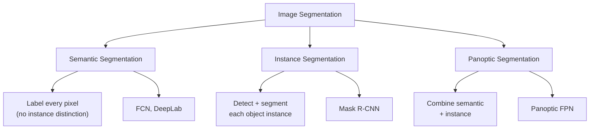
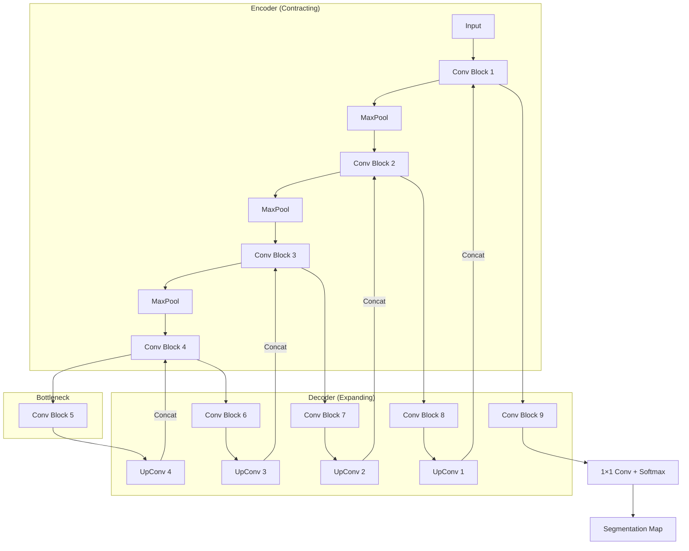
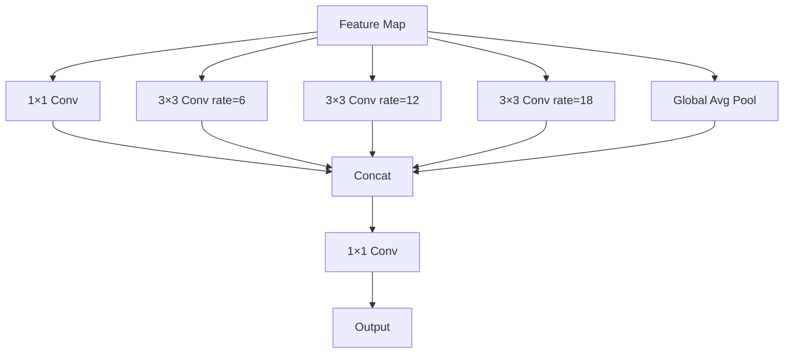
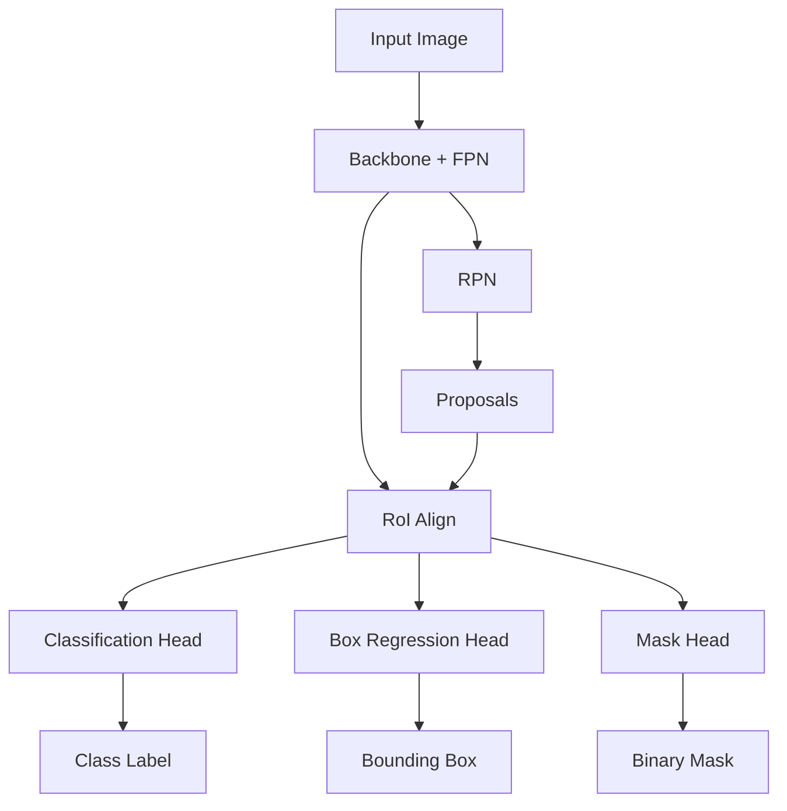

# Image Segmentation

Image segmentation is the task of partitioning an image into meaningful regions, assigning a class label to every pixel. It provides the finest-grained understanding of image content.

## Overview



## Types of Segmentation

### Semantic Segmentation
Every pixel gets a class label, but no distinction between instances.

```
Input Image:              Semantic Output:
┌─────────────┐          ┌─────────────┐
│ 🚗 🚗 🌳    │    →     │ CAR CAR TREE│
│ 🚶 🚗 🌳    │          │ PER CAR TREE│
└─────────────┘          └─────────────┘
Note: Both cars labeled "CAR", no instance IDs
```

### Instance Segmentation
Each object instance gets a unique mask.

```
Input Image:              Instance Output:
┌─────────────┐          ┌─────────────┐
│ 🚗 🚗 🌳    │    →     │ CAR1 CAR2 TREE│
│ 🚶 🚗 🌳    │          │ PER1 CAR3 TREE│
└─────────────┘          └─────────────┘
Note: Each car has a unique ID
```

### Panoptic Segmentation
Combines semantic (stuff: sky, road) and instance (things: cars, people).

```
Stuff classes: sky, road, grass, building (no instance boundaries)
Thing classes: car, person, bicycle (with instance boundaries)

Panoptic Quality (PQ) = SQ × RQ
SQ: Segmentation Quality (mean IoU of matched segments)
RQ: Recognition Quality (F1 score of detection)
```

## U-Net

The most important architecture for segmentation, originally designed for biomedical imaging.

### Architecture



### Key Features

1. **Skip Connections:** Concatenate encoder features with decoder features at each level
2. **Symmetric Architecture:** Encoder and decoder have mirror structure
3. **Pixel-wise Classification:** Output same spatial size as input

### U-Net Implementation

```python
class UNet(nn.Module):
    def __init__(self, in_channels, num_classes):
        super().__init__()
        
        # Encoder
        self.enc1 = self.conv_block(in_channels, 64)
        self.enc2 = self.conv_block(64, 128)
        self.enc3 = self.conv_block(128, 256)
        self.enc4 = self.conv_block(256, 512)
        
        # Bottleneck
        self.bottleneck = self.conv_block(512, 1024)
        
        # Decoder
        self.upconv4 = nn.ConvTranspose2d(1024, 512, 2, stride=2)
        self.dec4 = self.conv_block(1024, 512)
        self.upconv3 = nn.ConvTranspose2d(512, 256, 2, stride=2)
        self.dec3 = self.conv_block(512, 256)
        self.upconv2 = nn.ConvTranspose2d(256, 128, 2, stride=2)
        self.dec2 = self.conv_block(256, 128)
        self.upconv1 = nn.ConvTranspose2d(128, 64, 2, stride=2)
        self.dec1 = self.conv_block(128, 64)
        
        # Output
        self.output = nn.Conv2d(64, num_classes, 1)
    
    def conv_block(self, in_ch, out_ch):
        return nn.Sequential(
            nn.Conv2d(in_ch, out_ch, 3, padding=1),
            nn.BatchNorm2d(out_ch),
            nn.ReLU(inplace=True),
            nn.Conv2d(out_ch, out_ch, 3, padding=1),
            nn.BatchNorm2d(out_ch),
            nn.ReLU(inplace=True)
        )
    
    def forward(self, x):
        # Encoder
        e1 = self.enc1(x)
        e2 = self.enc2(F.max_pool2d(e1, 2))
        e3 = self.enc3(F.max_pool2d(e2, 2))
        e4 = self.enc4(F.max_pool2d(e3, 2))
        
        # Bottleneck
        b = self.bottleneck(F.max_pool2d(e4, 2))
        
        # Decoder with skip connections
        d4 = self.dec4(torch.cat([self.upconv4(b), e4], dim=1))
        d3 = self.dec3(torch.cat([self.upconv3(d4), e3], dim=1))
        d2 = self.dec2(torch.cat([self.upconv2(d3), e2], dim=1))
        d1 = self.dec1(torch.cat([self.upconv1(d2), e1], dim=1))
        
        return self.output(d1)
```

### Why Skip Connections Matter

Without skip connections, the decoder must reconstruct spatial details from compressed features alone, leading to blurry boundaries. Skip connections provide:
1. **Fine-grained spatial information** from encoder
2. **Better gradient flow** during training
3. **Sharper boundary predictions**

## DeepLab

Uses atrous (dilated) convolutions and CRFs for segmentation.

### Atrous Spatial Pyramid Pooling (ASPP)



**Dilated Convolution:**
```python
# Standard 3×3 conv: receptive field = 3×3
# Dilated 3×3 conv rate=2: receptive field = 5×5
# Dilated 3×3 conv rate=4: receptive field = 9×9

# Same parameters, larger receptive field!
conv = nn.Conv2d(64, 64, 3, padding=2, dilation=2)
```

### DeepLab Versions

| Version | Key Innovation | Year |
|---------|---------------|------|
| DeepLab v1 | Atrous convolution + CRF | 2014 |
| DeepLab v2 | ASPP module | 2016 |
| DeepLab v3 | Multi-scale ASPP | 2017 |
| DeepLab v3+ | Encoder-decoder + ASPP | 2018 |

## Mask R-CNN

Extends Faster R-CNN for instance segmentation by adding a mask prediction branch.

### Architecture



### RoI Align vs RoI Pooling

```python
# RoI Pooling: Quantized (loses precision)
# Input: 7.2×7.2 region → Pool to 2×2
# Problem: Quantization errors misalign features

# RoI Align: Bilinear interpolation (precise)
# Input: 7.2×7.2 region → Sample at exact points
# Use bilinear interpolation for sub-pixel values

class RoIAlign(nn.Module):
    def forward(self, features, rois):
        # For each RoI, divide into bins
        # Use bilinear interpolation to sample
        # No quantization
        pass
```

### Mask Head

```python
class MaskHead(nn.Module):
    def __init__(self, num_classes):
        super().__init__()
        # 4 conv layers + 1 deconv
        self.layers = nn.Sequential(
            nn.Conv2d(256, 256, 3, padding=1),
            nn.ReLU(),
            nn.Conv2d(256, 256, 3, padding=1),
            nn.ReLU(),
            nn.Conv2d(256, 256, 3, padding=1),
            nn.ReLU(),
            nn.Conv2d(256, 256, 3, padding=1),
            nn.ReLU(),
            nn.ConvTranspose2d(256, 256, 2, stride=2),
            nn.ReLU(),
            nn.Conv2d(256, num_classes, 1)
        )
    
    def forward(self, x):
        return torch.sigmoid(self.layers(x))  # Binary mask per class
```

## Modern Segmentation Models

### SegFormer

Transformer-based segmentation with hierarchical encoder.

```python
# Key innovations:
# 1. Mix Transformer (MiT) encoder
# 2. Lightweight MLP decoder
# 3. No positional encoding needed

class SegFormerDecoder(nn.Module):
    def __init__(self, num_classes):
        super().__init__()
        self.linear_fuse = nn.Conv2d(embed_dim * 4, embed_dim, 1)
        self.bn = nn.BatchNorm2d(embed_dim)
        self.linear_pred = nn.Conv2d(embed_dim, num_classes, 1)
    
    def forward(self, features):
        # Upsample all features to same size, concat, fuse
        x = torch.cat([F.interpolate(f, size=features[0].shape[2:], 
                      mode='bilinear') for f in features], dim=1)
        x = self.linear_fuse(x)
        x = self.bn(x)
        return self.linear_pred(x)
```

### Segment Anything Model (SAM)

Foundation model for segmentation. See [SAM](sam.md) for details.

## Evaluation Metrics

### IoU (Intersection over Union)

```python
def compute_iou(pred_mask, gt_mask):
    """IoU for binary masks"""
    intersection = (pred_mask & gt_mask).sum()
    union = (pred_mask | gt_mask).sum()
    return intersection / union
```

### Dice Coefficient

```python
def dice_coefficient(pred_mask, gt_mask):
    """2 × intersection / (pred + gt)"""
    intersection = (pred_mask & gt_mask).sum()
    return 2 * intersection / (pred_mask.sum() + gt_mask.sum())
```

### mIoU (Mean IoU)

```python
def compute_miou(pred_masks, gt_masks, num_classes):
    """Mean IoU across all classes"""
    ious = []
    for cls in range(num_classes):
        pred_cls = (pred_masks == cls)
        gt_cls = (gt_masks == cls)
        ious.append(compute_iou(pred_cls, gt_cls))
    return np.mean(ious)
```

### Panoptic Quality (PQ)

```
PQ = Σ (IoU of matched pairs) / (|TP| + 0.5×|FP| + 0.5×|FN|)

= Segmentation Quality (SQ) × Recognition Quality (RQ)

SQ = mean IoU of matched segments
RQ = F1 score of detection
```

## Loss Functions

### Cross-Entropy Loss (Pixel-wise)

```python
# Standard for semantic segmentation
loss = nn.CrossEntropyLoss()
# Input: (N, C, H, W) - logits per pixel
# Target: (N, H, W) - class per pixel
```

### Dice Loss

```python
def dice_loss(pred, target, smooth=1):
    """Handles class imbalance better than CE"""
    pred = torch.sigmoid(pred)
    intersection = (pred * target).sum()
    return 1 - (2. * intersection + smooth) / (pred.sum() + target.sum() + smooth)
```

### Focal Loss

```python
def focal_loss(pred, target, alpha=0.25, gamma=2):
    """For class imbalance (many background pixels)"""
    ce_loss = F.cross_entropy(pred, target, reduction='none')
    pt = torch.exp(-ce_loss)
    return alpha * (1 - pt) ** gamma * ce_loss
```

### Combined Loss

```python
# Common practice: combine multiple losses
total_loss = 0.5 * cross_entropy_loss + 0.5 * dice_loss
```

## Data Augmentation for Segmentation

```python
# Must apply same transformation to image and mask!
import albumentations as A

transform = A.Compose([
    A.RandomCrop(512, 512),
    A.HorizontalFlip(p=0.5),
    A.RandomBrightnessContrast(p=0.2),
    A.Rotate(limit=15, p=0.5),
    A.Normalize(),
])

# Apply to both image and mask
augmented = transform(image=image, mask=mask)
image = augmented['image']
mask = augmented['mask']
```

## Interview Questions

1. **What is the difference between semantic and instance segmentation?**
   Semantic labels every pixel with a class but doesn't distinguish instances. Instance segmentation detects each object instance and provides a separate mask for each.

2. **Why does U-Net use skip connections?**
   Skip connections preserve fine spatial details lost during pooling/encoding. Without them, the decoder must reconstruct boundaries from compressed features alone, resulting in blurry outputs.

3. **What is atrous/dilated convolution and why use it?**
   Dilated convolution inserts gaps in the kernel, increasing receptive field without increasing parameters or losing resolution. It captures multi-scale context efficiently.

4. **How does Mask R-CNN extend Faster R-CNN?**
   Adds a parallel mask prediction branch to each RoI. Uses RoI Align instead of RoI Pooling for precise spatial alignment. The mask head predicts a binary mask for each detected object.

5. **What is the difference between RoI Pooling and RoI Align?**
   RoI Pooling quantizes coordinates, causing misalignment. RoI Align uses bilinear interpolation to sample at exact floating-point positions, preserving spatial precision.

6. **How do you handle class imbalance in segmentation?**
   Use weighted cross-entropy, dice loss, focal loss, or oversample underrepresented classes. Dice loss is particularly effective because it directly optimizes the overlap metric.

7. **What is panoptic segmentation?**
   Combines semantic segmentation (for "stuff" like sky, road) and instance segmentation (for "things" like cars, people) into a unified output.

## Common Mistakes

- ❌ Applying different augmentations to image and mask
- ❌ Using softmax instead of sigmoid for multi-label segmentation
- ❌ Not handling padding/cropping consistently between image and mask
- ❌ Ignoring boundary pixels (boundary-aware loss helps)
- ❌ Using accuracy as metric (misleading with class imbalance)

## Summary

Segmentation provides pixel-level image understanding. U-Net is the foundational architecture with skip connections for preserving spatial details. DeepLab uses dilated convolutions for multi-scale context. Mask R-CNN extends detection with instance masks. Modern approaches use transformers (SegFormer) and foundation models (SAM).

## Cross-References

- [Classification](classification.md) - Image-level prediction
- [Object Detection](object-detection.md) - Box-level localization
- [CLIP](clip.md) - Open-vocabulary segmentation
- [SAM](sam.md) - Promptable segmentation
- [U-Net Architecture](segmentation.md#u-net) - Encoder-decoder with skip connections
