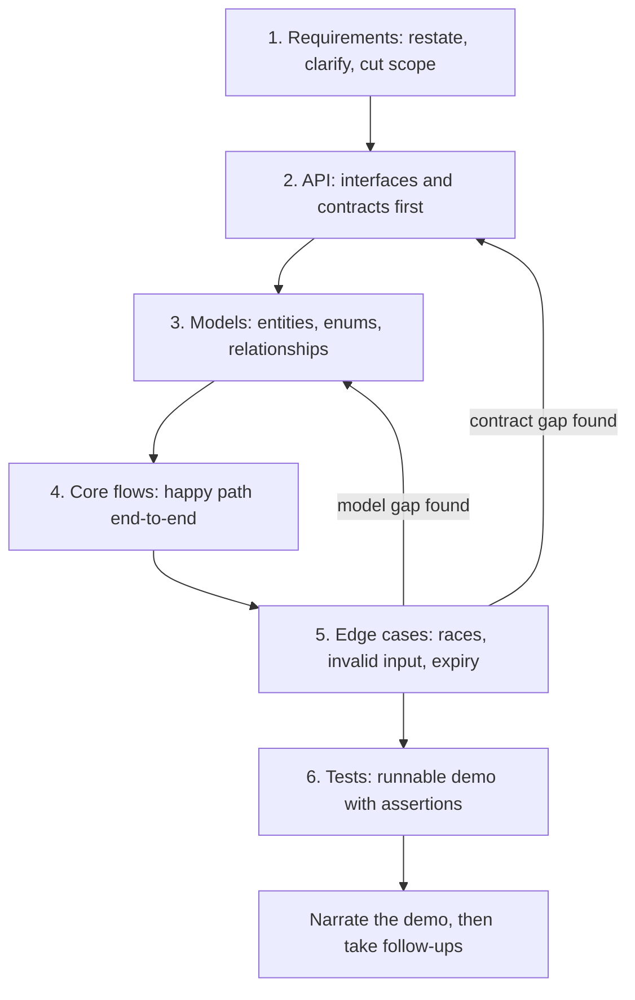
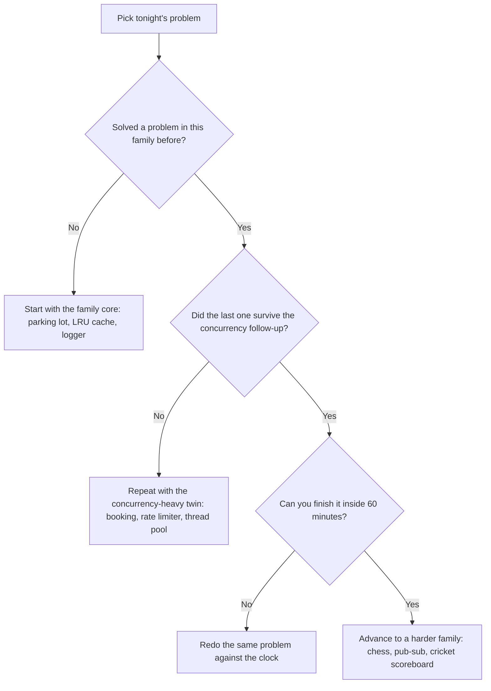

# Machine Coding Round Preparation

## Overview

A machine coding round is a **hands-on coding interview** (typically 60–90 minutes) where you design and implement a working system from scratch in an IDE or shared editor, then defend it in a follow-up discussion. Unlike DSA rounds that test algorithmic thinking, machine coding evaluates your ability to **build real software** — clean code, good design, working functionality, and a credible concurrency story. You will be judged on code a stranger can read, not on whether you reached the optimal complexity class.

Companies like **Flipkart, Uber, Walmart, PhonePe, CRED, Ola, Meesho**, and many startups use this round extensively for SDE-2 and above. The problems look deceptively small — a parking lot, a splitter app, a rate limiter — because the signal is not in the problem but in the hundred small decisions you make while building it. This section contains 23 fully worked problems plus two method pages; this index tells you which to drill and when.

## What interviewers actually evaluate

Every company weights the rubric slightly differently, but the dimensions below appear in almost every real evaluation sheet, and the weights are close to what hiring committees publish internally. Notice that "working code" and "design" together carry roughly half the total — which means a beautiful class diagram that does not run scores worse than a mediocre design that does.

| Dimension | Typical weight | Signals of a strong pass | Signals of a fail |
|---|---|---|---|
| **Working code** | 25–30% | Compiles and runs on first demo; core flows work end-to-end; edge cases handled | Doesn't compile at demo time; happy path broken; no demo possible |
| **OOP design** | 25–30% | Cohesive classes with single responsibilities; interfaces at extension points; enums over stringly-typed state | God classes; `if/else` type switches; getters-and-setters soup; copy-paste logic |
| **Concurrency** | 10–20% | Correct lock granularity; no check-then-act races; honest about thread-safety boundaries | Unsynchronized shared state; deadlocks; "I'd add a lock here" hand-waving |
| **Extensibility** | 10–15% | New strategy/piece/payment type = new class, zero edits to existing logic | New requirement means modifying a switch statement in three places |
| **Tests** | 5–10% | A runnable demo or main with scenarios; assertions on the tricky paths | "I'd write tests if I had time" with no evidence of testable seams |
| **Requirements & communication** | 10–15% | Clarifying questions before coding; scope stated out loud; decisions narrated | Silent coding for 60 minutes; ignored half the problem statement |

The follow-up discussion is where the rubric gets applied in depth, so budget attention for it. Interviewers probe exactly the places you rushed: "what happens if two threads call `reserve` on the last seat?", "add a bike type to your parking lot", "how would you test the expiry logic?". A candidate who left clean seams answers by pointing at code; a candidate who didn't answers by apologizing.

## The problem index

Every problem page in this section follows the same shape: problem statement, requirements, class design, working implementation, and the follow-up questions that problem actually attracts. Difficulty reflects a realistic 60–90 minute round, including the discussion — not just the typing time.

| Problem | Core Concepts | Difficulty | Common Traps |
|---|---|---|---|
| [Parking Lot](./parking-lot.md) | OOP, strategy pattern, spot allocation | Medium | fee computation edges; allocation strategy buried in `if`s; multi-floor spot search |
| [Elevator System](./elevator.md) | state machine, scheduling (SCAN/LOOK) | Medium-Hard | same-direction stop ordering; idle repositioning; door/timer states in the machine |
| [Library Management](./library-management.md) | CRUD, relationships, fines | Medium | copy-level vs title-level state; reservation handoff; fine accrual boundaries |
| [Movie Ticket Booking](./booking-system.md) | seat locks, concurrency, payment window | Medium-Hard | check-then-act race on seats; hold expiry vs payment; double-booking on retry |
| [Car Rental](./car-rental.md) | reservation lifecycle, interval overlap | Medium | half-open interval boundaries; late fees at return; state machine completeness |
| [Splitwise](./splitwise.md) | graphs, settlement, split types | Medium | splits must sum to the total; float rounding; minimizing transactions greedily |
| [Rate Limiter](./rate-limiter.md) | algorithms, concurrency, windowing | Medium-Hard | fixed-window boundary bursts; clock source (wall vs monotonic); per-key lock contention |
| [LRU Cache](./cache-lru.md) | hashmap + doubly-linked list, O(1) ops | Easy-Medium | updating an existing key must not allocate; eviction order; capacity edge cases |
| [Task Scheduler](./task-scheduler.md) | priority queues, dependencies | Medium-Hard | dependency cycles; priority starvation; missed/delayed schedule semantics |
| [Thread Pool](./threadpool.md) | workers, blocking queue, rejection | Hard | rejection policies; graceful vs immediate shutdown; pool-induced deadlock |
| [In-Memory Pub-Sub](./pub-sub.md) | topics, fan-out, backpressure | Hard | slow-consumer isolation; at-most-once honesty; wildcard matching; snapshot iteration |
| [Logger](./logger.md) | levels, formatting, async sinks | Medium | async thread safety; rotation races; filtering before vs after formatting |
| [Meeting Room Scheduler](./meeting-room-scheduler.md) | intervals, recurrence, conflicts | Medium | half-open interval comparison; all-or-nothing recurring series; the check-then-insert lock |
| [Cron Parser](./cron-parser.md) | parsing, calendar arithmetic | Medium | day-of-month/day-of-week OR rule; `N/step` semantics; next-fire-time scan efficiency |
| [Leaderboard](./leaderboard.md) | sorted structures, top-K, concurrency | Medium | tie-breaking; rank-of-player for the long tail; hot-writer contention |
| [Shopping Cart](./shopping-cart.md) | price snapshot, TTL, concurrency | Medium | when the price is fixed; concurrent quantity read-modify-write; coupon composition |
| [Inventory Management](./inventory-management.md) | two-tier counts, event log, oversell | Medium-Hard | `reserve` atomicity under threads; reserved-unit lifecycle; reconciliation as events |
| [Chess](./chess.md) | rules engine, state, extensibility | Hard | pins and discovered check; castling rights tracking; variant extensibility |
| [Tic-Tac-Toe](./tic-tac-toe.md) | game engine, N×N generalization | Easy | generalized win check (not 8 hardcoded lines); human-vs-AI seam; move validation |
| [Snake and Ladder](./snake-and-ladder.md) | simulation, turn management | Easy-Medium | exact-landing win rule; extra-turn-on-six loop; board configuration |
| [Cricket Scoreboard](./cricinfo-scoreboard.md) | domain modeling, event sourcing | Medium-Hard | validating events against match state; undo via replay; derived-stats consistency |
| [Stack Overflow](./stack-overflow.md) | entities, voting, reputation | Medium-Hard | idempotent voting; reputation consistency under races; accepted-answer uniqueness |
| [Vending Machine](./vending-machine.md) | state machine, payment, inventory | Easy-Medium | payment state machine completeness; change-making; out-of-stock mid-transaction |

Two method pages anchor the set: [How to Approach Machine Coding Problems](./approach.md) walks the full four-phase methodology with a worked example, and [Design Principles](./design-principles.md) covers SOLID with machine-coding-specific applications of each principle. Read both before your first problem, then return to them after every third problem — the second read finds different things once you have felt the failure modes yourself.

## The universal answering workflow

Every machine coding problem is answered with the same six-step loop, and interviewers watch for you to execute it visibly. The steps are not ceremonial — each one exists because skipping it produces a specific, predictable failure: skipping requirements produces scope misses, skipping API design produces entangled classes, and skipping the flows step produces code that compiles but cannot be demoed.

The two back-edges are the important part: edge-case analysis is where you discover that your model was missing a state (a `RESERVED` seat, a `CANCELLED` booking) or that your interface contract cannot express something you now need. Fixing those in minute 55 is cheap; discovering them in the follow-up discussion is expensive. Write the API and model sketch on the whiteboard or in comments before writing implementation code, because that sketch is also your communication artifact — interviewers read it while you type.

### What to say while doing it

- Narrate decisions in one sentence each: "I'm using an enum for machine state so the compiler finds unhandled transitions."
- State scope cuts explicitly: "I'm modeling the payment as an interface returning success or failure; I won't implement a gateway."
- Flag concurrency out loud when you touch shared state, even if you single-thread the demo: "in production this map needs a per-key lock."
- If you fall behind, cut features, not quality: a smaller system that runs beats a larger one that doesn't.

## Time-boxing a 90-minute round

Ninety minutes sounds abundant and is not: a typical round spends 15 minutes before the first line of real code and 15 after the last, leaving ~60 to design and implement. The plan below is the one most successful candidates converge on; adjust the middle two blocks based on problem size, but never compress the requirements or demo blocks, because those are where the rubric is scored directly.

| Window | Minutes | Goal | Abort rule if behind |
|---|---|---|---|
| Requirements & scope | 0–10 | Restate the problem, ask clarifying questions, list in-scope vs out-of-scope | Write the scope list and move on — do not wait for permission to proceed |
| API & models | 10–25 | Interfaces, enums, entity relationships on screen; interviewer sanity-check | Sketch in comments instead of code; refine while implementing |
| Core implementation | 25–65 | Happy path working end-to-end, one flow at a time | Drop the least-important feature out loud; keep the build green |
| Edge cases & concurrency | 65–78 | Input validation, the one guaranteed race, expiry/timeout path | Fix the two most-probed cases only; note the rest verbally |
| Tests & demo | 78–88 | Runnable main or tests demonstrating the flows | Demo happy path plus one edge case; narrate the rest |
| Buffer & discussion | 88–90 | Breathe; take follow-ups from the notes you kept | — |

Two habits make this plan hold under pressure. First, keep the code compiling continuously — commit to a runnable state every 15 minutes or so rather than a big-bang integration at minute 80, because debugging a broken build in the demo window is the most common way strong candidates fail this round. Second, write your follow-up notes as you go (the "in real production" list), because the discussion will ask for them and memory fails exactly when you are tired.

## Building a practice plan

A plan beats a playlist: working through the index in alphabetical order wastes reps on problems whose lessons you already have and starves the families you avoid. Pick problems by family (state machines, intervals, concurrency primitives, domain CRUD) and only move on when the family's follow-up questions stop hurting. The flowchart below turns that into a nightly decision, and the tables after it turn it into four weeks.

A four-week plan covers the whole index at realistic depth, assuming 60–90 minutes per session and one rest day between rounds. Weeks 1–2 build design fluency on forgiving problems, week 3 introduces algorithmic cores and first concurrency arguments, and week 4 is full-dress rehearsals on the hardest pages. Treat the plan as a default to deviate from deliberately, not a schedule to obey blindly:

| Week | Problems | Focus |
|---|---|---|
| 1 | [LRU Cache](./cache-lru.md), [Tic-Tac-Toe](./tic-tac-toe.md), [Parking Lot](./parking-lot.md) | API-first sketching, enums over strings, clean entity boundaries |
| 2 | [Library Management](./library-management.md), [Meeting Room Scheduler](./meeting-room-scheduler.md), [Car Rental](./car-rental.md), [Vending Machine](./vending-machine.md) | Relationships, interval logic, full state machines with error paths |
| 3 | [Rate Limiter](./rate-limiter.md), [Task Scheduler](./task-scheduler.md), [Leaderboard](./leaderboard.md), [Splitwise](./splitwise.md), [Cron Parser](./cron-parser.md) | Algorithms living inside classes; first real concurrency arguments |
| 4 | [Movie Ticket Booking](./booking-system.md), [Inventory Management](./inventory-management.md), [Thread Pool](./threadpool.md), [Pub-Sub](./pub-sub.md), [Cricket Scoreboard](./cricinfo-scoreboard.md) | Races, rejection, shutdown, event sourcing; full 90-minute dress rehearsals |

The remaining pages slot in where your weakness is: [Logger](./logger.md) and [Chess](./chess.md) for design decomposition, [Shopping Cart](./shopping-cart.md) and [Stack Overflow](./stack-overflow.md) for entity-heavy modeling, [Snake and Ladder](./snake-and-ladder.md) as a warm-up when you are rusty. Dress rehearsal weeks matter more than problem count — one full timed round with a self-review is worth three untimed solves, because the clock changes which decisions feel expensive. If you can only do one thing per week, protect the timed dress rehearsal and let the reading slide.

### How to run a mock round

| Step | Time | What to do |
|---|---|---|
| Setup | 5 min before | Timer at 90 minutes, clean IDE, one problem statement you have not read recently |
| Round | 90 min | Follow the [time-boxing table](#time-boxing-a-90-minute-round); note actual milestone times vs plan |
| Self-review | 20 min | Diff against the problem page: missed requirements, missing seams, races you did not argue |
| Follow-up drill | 20 min | Answer the page's follow-up questions out loud, including the scale and extensibility axes |
| Log | 5 min | Record which rubric row would have been marked down, and one habit to change next round |

### Language and tooling preparation

- Pick **one language** and stay with it through all practice — Java and Python dominate at companies running these rounds, but the language matters less than your fluency in it.
- Memorize the container idioms: `HashMap` + `LinkedList`/`Deque` in Java, `dict` + `collections.deque` in Python, `unordered_map` + `list` in C++ — LRU, leaderboards, and schedulers all lean on them.
- Know your IDE's test-run, debugger, and refactor shortcuts; you will debug a race at minute 70 and every keystroke counts.
- Practice reading your own code aloud — the demo narration is scored, and it is a separate skill from writing the code.
- If your target company uses a shared online editor instead of a local IDE, do at least a few rounds in that environment; autocomplete-free coding changes pacing noticeably.

### Interview-day routine

- Fifteen minutes before the round, re-read the time-boxing table and nothing else — the plan, not new content, is what keeps minute 45 calm.
- Have your editor, build command, and a blank test file ready before the interviewer joins; setup friction at minute 0 costs design time you cannot get back.
- Open the round by restating the problem in two sentences and listing what you are deliberately out of scope — this sets the evaluation frame in your favor.
- Keep water and the follow-up-notes habit from the mock table; the discussion after the demo is where tired candidates leak points.

## How the follow-up discussion extends the code

The 20–30 minutes after the demo are not an appendix; at many companies they carry as much weight as the code. Interviewers extend the problem along three predictable axes, and you should have pre-formed answers for each in the context of what you built. Practicing these extensions per problem is what separates a drilled candidate from a first-attempt one.

| Extension axis | Example question | What a strong answer does |
|---|---|---|
| **Scale** | "This works for one machine — how does it work for 1,000 concurrent users?" | Names the shared mutable state, proposes ownership/partitioning or an external store, and is honest about what breaks |
| **Concurrency** | "Two threads grab the last seat simultaneously" | Points at the exact check-then-act line in their own code and fixes it with the right primitive, not "add synchronized everywhere" |
| **Extensibility** | "Add a student discount / a new piece type / a UPI payment method" | New class implements an existing interface; zero edits to existing code; if that isn't true, says where the seam is missing |

## Common failure modes

Most failed rounds fail in a way that was predictable from practice habits, which is why this list is worth reading before every mock. Each failure below maps to a scored rubric row, so treating them as checkable defects — not personality traits — is the fastest route to a pass. Audit your last round against these eight and pick at most two to fix before the next one:

- ❌ Coding in silence for 60 minutes — communication is a scored dimension, not a nicety.
- ❌ Over-engineering: five layers and a dependency-injection framework for a 90-minute problem.
- ❌ Under-engineering: everything in one class with static methods; nothing to discuss in follow-ups.
- ❌ A design that cannot run — no `main`, no demo path, nothing testable.
- ❌ Ignoring the problem statement's second half (fines, expiry, change-making) because the first half consumed the time.
- ❌ Hand-waving concurrency with "we'd use a lock here" — the strongest candidates show the lock and argue its granularity.
- ❌ Practicing only untimed solves — the clock is a feature of the round, not a distraction from it.
- ❌ Skipping the demo — an unrunnable design is scored as a failed round even when the classes are elegant.

## Tips for success

1. **Practice on paper first** — sketch class diagrams before coding; the 10-minute API/model block is the highest-leverage time in the round.
2. **Use your IDE well** — know your shortcuts; slow typing is a real cost when 60 minutes of implementation time is the budget.
3. **Start simple** — get a working skeleton with 2–3 classes, then refactor toward the design as flows come alive.
4. **Don't over-engineer** — the interviewer wants working code with clean seams, not a framework; extensibility means interfaces, not infrastructure.
5. **Talk through decisions** — explain *why* you chose a pattern or structure; the reasoning is what gets transcribed into the feedback.
6. **Handle errors gracefully** — null checks, invalid inputs, and state-transition guards are cheap to write and easy to probe.
7. **Write testable code** — even without a test framework, constructor injection and small classes make the demo script trivial.

## How this section connects to the LLD section

Machine coding and LLD interviews overlap heavily but test different altitudes: machine coding wants *running code* in 90 minutes, while the LLD round wants *design depth* — patterns, principles, and trade-off argumentation — often with diagrams instead of a demo. The same problems appear in both sections at different depths, so use them as two passes over one skill. After finishing any problem here, read its LLD twin and note where the discussion differs; the delta is exactly what each round is sampling for.

| Machine coding page | LLD counterpart | What the LLD version adds |
|---|---|---|
| [Parking Lot](./parking-lot.md) | [LLD: Parking Lot](../interview/system-design/lld/parking-lot.md) | pattern-by-pattern derivation, fee-strategy evolution |
| [Elevator](./elevator.md) | [LLD: Elevator](../interview/system-design/lld/elevator.md) | scheduling algorithms in depth, multi-car coordination |
| [Library Management](./library-management.md) | [LLD: Library Management](../interview/system-design/lld/library-management.md) | UML-first treatment, reservation state detail |
| [Movie Ticket Booking](./booking-system.md) | [LLD: Movie Ticket](../interview/system-design/lld/movie-ticket.md) | seat-map modeling and booking-flow class detail |
| [Chess](./chess.md) | [LLD: Chess](../interview/system-design/lld/chess.md) | rules-engine decomposition and move-generation depth |
| [Shopping Cart](./shopping-cart.md) | [LLD: Food Delivery](../interview/system-design/lld/food-delivery.md) | order-lifecycle modeling shared by both domains |

For the underlying theory the problems apply, read [OOP Concepts](../interview/system-design/lld/oop-concepts.md), [SOLID](../interview/system-design/lld/solid.md), [Design Patterns](../interview/system-design/lld/design-patterns.md), and [UML Class Diagrams](../interview/system-design/lld/uml-class-diagrams.md) — these are the vocabulary the follow-up discussion expects you to use. For the concurrency half of the rubric, [Concurrency Design](../interview/system-design/lld/concurrency-design.md) and [Distributed Lock Client](../interview/system-design/lld/distributed-lock-client.md) extend the single-process locking you write here toward real systems, and [Error Handling](../interview/system-design/lld/error-handling.md) covers the failure-path design that machine coding problems increasingly probe.

## Interview Questions

1. **How is a machine coding round different from an LLD round, and how should preparation differ?** Machine coding scores running code in 90 minutes; LLD scores design depth — patterns, principles, trade-offs — often with no runnable artifact at all. Practically, machine coding prep is timed reps with demos and tests, while LLD prep is diagram-first argumentation on the same problems. The overlap is deliberate: the class design you write in one round is the design you defend in the other, so alternating between this section and the [LLD section](../interview/system-design/lld/README.md) doubles the return on each problem.

2. **You realize at minute 50 that your design cannot handle a requirement you missed. What do you do?** Say it out loud, immediately: interviewers score honesty and recovery, not perfection. Then choose the smallest change that makes the design correct — usually adding a state to an enum or an interface at the right seam — and explicitly de-scope something else if time demands it. The failure mode to avoid is silently patching a hack in: the follow-up discussion will find it, and the candidate who narrated the trade-off loses less than the one who hid it.

3. **Why do interviewers keep asking for parking lots and elevators if everyone has seen them?** Because the signal was never novelty — it is what a hundred small decisions reveal about how you work when nothing is hidden. Everyone has seen the parking lot, so differences in execution are pure signal: who clarifies scope, who reaches for an enum, who argues lock granularity, who leaves a runnable demo. If you have genuinely drilled one, say your assumptions out loud and push into the extension axes (pricing strategies, multi-floor contention) rather than pretending the problem is fresh.

4. **How much concurrency is enough in a 90-minute round?** Enough to be correct and honest: identify shared mutable state, protect the one check-then-act sequence that matters (a reservation, a counter, a queue drain), and be explicit about what you would change under real load. A full lock-free implementation is wasted budget, and a blanket `synchronized` on everything costs design points — the scored answer is a well-chosen lock plus a sentence about granularity. Problem pages like [Thread Pool](./threadpool.md) and [Movie Ticket Booking](./booking-system.md) show the level interviewers actually probe.

## Key Takeaways

- The rubric is stable across companies: working code and OOP design carry half the weight, concurrency and extensibility most of the rest.
- The six-step workflow — requirements, API, models, flows, edge cases, tests — is the same loop every time; the back-edges are where designs get fixed.
- Time-boxing is scored behavior: never compress requirements or the demo window, and keep the build green continuously.
- 23 worked problems cover five families; pick by family weakness, and dress-rehearse at full 90 minutes before the real round.
- The follow-up discussion extends along three axes — scale, concurrency, extensibility — and pre-formed answers there separate drilled candidates from first-attempt ones.
- Every problem here has an LLD twin; read both to cover the running-code and design-depth versions of the same skill.

## Cross-References

- [How to Approach Machine Coding Problems](./approach.md) — the four-phase methodology this index summarizes
- [Design Principles](./design-principles.md) — SOLID applied specifically to machine-coding problems
- [LLD Section Index](../interview/system-design/lld/README.md) — the design-depth twin of this section
- [LLD: ATM](../interview/system-design/lld/atm.md) — a state-machine-heavy problem in the same family as vending machine
- [LLD: Notification Service](../interview/system-design/lld/notification-service.md) — the extensible-provider design the pub-sub problem gestures at
- [System Design Case Studies](../interview/system-design/case-studies/README.md) — the same problems at distributed-systems scale
