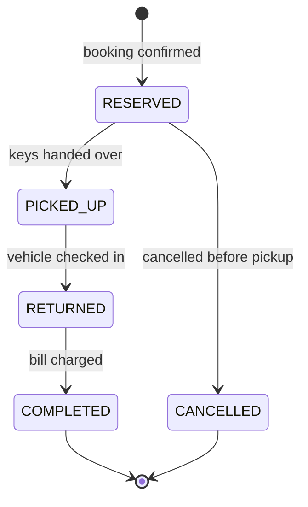

# Car Rental System — Machine Coding Problem

## Problem Statement

Design a car rental system that manages a fleet across multiple city locations, lets customers search for vehicles by city and date range, and books reservations with hard guarantees against double-booking. The system must handle the full reservation lifecycle — booked, picked up, returned, settled — and charge the customer at return time, including late fees for overdue vehicles.

This is a classic 60–90 minute machine-coding round problem (Zoomcar, Hertz, Turo variants). It tests three things at once: clean domain modeling (vehicle vs reservation vs store), a state machine you must enumerate before coding, and interval-overlap logic that most candidates get subtly wrong at boundary conditions. The double-booking question is the usual follow-up, so the concurrency story matters as much as the code.

## Requirements Gathering

### Functional Requirements

1. Multiple stores, each in a city; each store owns a fleet of vehicles
2. Vehicle types (Economy, Sedan, SUV, Luxury) with a different per-day price each
3. Search vehicles by city + date range, optionally filtered by type
4. Create a reservation that holds a specific vehicle for a date range
5. Reservation lifecycle: RESERVED → PICKED_UP → RETURNED → COMPLETED, with CANCELLED from RESERVED
6. Cancellation allowed only before pickup; the date range is released on cancel
7. Pickup hands the vehicle to the customer; return computes the final bill
8. Payment is collected **on return**, not at booking (booking may take a refundable deposit)
9. Late return fees: overdue days billed at 1.5× the daily rate, partial day counts as a full day
10. No vehicle may have two overlapping reservations, ever

### Non-Functional Requirements

- Thread-safe reservation creation — concurrent requests for the same vehicle must serialize
- Search must not lock out bookings; reads can run against a slightly stale fleet view
- Reservation creation < 50 ms; search across a 10,000-vehicle fleet < 100 ms
- Price of an existing reservation is fixed at booking time (rate changes must not affect it)

### Clarifying Questions

- "Is rental granularity per day or per hour?" — assume per day here; hourly is a straightforward change to the interval math
- "Is payment taken at booking or at return?" — assume deposit-free booking, payment at return
- "What is the late-fee policy?" — 1.5× daily rate per overdue day, ceil to whole days
- "Can a customer extend a rental mid-trip?" — yes, as an update that re-runs the conflict check
- "Do we need one-way drop-off between cities?" — a good extension, not core

## Class Design

### Entity Identification

```
Nouns: RentalSystem, Store, Vehicle, VehicleType, Reservation,
       Interval, PaymentService, Bill
Verbs: search, reserve, pickup, return, cancel, isAvailable, charge
```

The key modeling decision: `Vehicle.status` describes the vehicle's **current physical state** (available, rented, under maintenance), while the `Vehicle.reservations` list holds **future commitments**. A car rented today is still searchable for next month — that is why availability is computed from the reservation list, not from the status enum alone. Confusing the two is the most common design mistake in this problem.

### Reservation State Machine



Two rules are easy to miss: RETURNED is a *physical* event and COMPLETED is a *financial* one (payment settled), and cancellation is illegal once the vehicle is picked up — an early return is not a cancellation.

### Pricing Model

| Component | Formula | Example (SUV, 90/day) |
|---|---|---|
| Base | daily_rate × ceil(days) | 3 days → 270.00 |
| Late fee | 1.5 × daily_rate × ceil(overdue_days) | 2 days late → 270.00 |
| Total at return | base + late fee | 540.00 |

The per-day rate is **snapshotted on the Reservation at booking time**. If fleet pricing changes mid-trip, the customer keeps the booked rate; only late-fee math uses the snapshot too, which keeps the bill explainable.

## Implementation

### Python Implementation

```python
import math
import uuid
from dataclasses import dataclass
from datetime import datetime, timedelta
from enum import Enum
from threading import Lock
from typing import Dict, List, Optional


class VehicleType(Enum):
    ECONOMY = 40.0
    SEDAN = 65.0
    SUV = 90.0
    LUXURY = 160.0


class VehicleStatus(Enum):
    AVAILABLE = "available"
    RESERVED = "reserved"
    RENTED = "rented"
    MAINTENANCE = "maintenance"


class ReservationStatus(Enum):
    RESERVED = "reserved"
    PICKED_UP = "picked_up"
    RETURNED = "returned"
    COMPLETED = "completed"
    CANCELLED = "cancelled"


LATE_FEE_MULTIPLIER = 1.5
DAY = timedelta(days=1)


@dataclass
class Interval:
    """Half-open date range [start, end). Touching endpoints do not clash."""
    start: datetime
    end: datetime

    def overlaps(self, other: "Interval") -> bool:
        return self.start < other.end and other.start < self.end


class Vehicle:
    def __init__(self, vehicle_id: str, registration: str,
                 vtype: VehicleType, city: str):
        self.vehicle_id = vehicle_id
        self.registration = registration
        self.vtype = vtype
        self.city = city
        self.status = VehicleStatus.AVAILABLE
        self.reservations: List[Interval] = []   # future commitments
        self.lock = Lock()                       # guards the list above

    def daily_rate(self) -> float:
        return self.vtype.value

    def is_available(self, start: datetime, end: datetime) -> bool:
        wanted = Interval(start, end)
        return all(not wanted.overlaps(r) for r in self.reservations)

    def __repr__(self):
        return (f"{self.vtype.name}[{self.registration}] "
                f"@{self.vehicle_id} ({self.status.value})")


class Reservation:
    def __init__(self, user: str, vehicle: Vehicle,
                 start: datetime, end: datetime):
        self.reservation_id = str(uuid.uuid4())[:8].upper()
        self.user = user
        self.vehicle = vehicle
        self.start = start
        self.end = end
        self.daily_rate = vehicle.daily_rate()   # price snapshot
        self.status = ReservationStatus.RESERVED
        self.created_at = datetime.now()
        self.actual_return: Optional[datetime] = None

    def scheduled_days(self) -> int:
        return max(1, math.ceil((self.end - self.start) / DAY))

    def base_total(self) -> float:
        return round(self.daily_rate * self.scheduled_days(), 2)

    def late_fee(self, returned_at: datetime) -> float:
        overdue = (returned_at - self.end).total_seconds() / 86400
        late_days = max(0, math.ceil(overdue))
        return round(late_days * self.daily_rate * LATE_FEE_MULTIPLIER, 2)

    def __repr__(self):
        return (f"Reservation[{self.reservation_id}] {self.user} "
                f"{self.vehicle.registration} "
                f"{self.start.date()}..{self.end.date()} "
                f"({self.status.value})")


class PaymentService:
    """Mock gateway — returns a transaction id."""

    @staticmethod
    def charge(user: str, amount: float) -> str:
        print(f"    [payment] charged {user} ${amount:.2f}")
        return f"TXN-{str(uuid.uuid4())[:8].upper()}"


class Store:
    def __init__(self, store_id: str, city: str, name: str):
        self.store_id = store_id
        self.city = city
        self.name = name
        self.vehicles: List[Vehicle] = []

    def add_vehicle(self, vehicle: Vehicle):
        self.vehicles.append(vehicle)


class RentalSystem:
    def __init__(self):
        self.stores: Dict[str, Store] = {}            # city -> store
        self.reservations: Dict[str, Reservation] = {}

    def add_store(self, store: Store):
        self.stores[store.city] = store

    def register_vehicle(self, city: str, vehicle_id: str,
                         registration: str, vtype: VehicleType) -> Vehicle:
        vehicle = Vehicle(vehicle_id, registration, vtype, city)
        self.stores[city].add_vehicle(vehicle)
        return vehicle

    # ---- search ----------------------------------------------------
    def search(self, city: str, start: datetime, end: datetime,
               vtype: Optional[VehicleType] = None) -> List[Vehicle]:
        store = self.stores.get(city)
        if not store:
            return []
        results = []
        for v in store.vehicles:
            if v.status == VehicleStatus.MAINTENANCE:
                continue
            if vtype and v.vtype != vtype:
                continue
            if v.is_available(start, end):
                results.append(v)
        return results

    # ---- lifecycle transitions -------------------------------------
    def reserve(self, user: str, city: str, vehicle_id: str,
                start: datetime, end: datetime) -> Reservation:
        if end <= start:
            raise ValueError("end date must be after start date")
        vehicle = self._find(city, vehicle_id)
        with vehicle.lock:               # check-then-act is atomic here
            if vehicle.status == VehicleStatus.MAINTENANCE:
                raise ValueError("vehicle under maintenance")
            if not vehicle.is_available(start, end):
                raise ValueError("vehicle already booked for these dates")
            reservation = Reservation(user, vehicle, start, end)
            vehicle.reservations.append(Interval(start, end))
            vehicle.status = VehicleStatus.RESERVED
        self.reservations[reservation.reservation_id] = reservation
        return reservation

    def pickup(self, reservation_id: str) -> Reservation:
        res = self._get(reservation_id)
        if res.status != ReservationStatus.RESERVED:
            raise ValueError(f"cannot pick up from {res.status.value}")
        res.status = ReservationStatus.PICKED_UP
        res.vehicle.status = VehicleStatus.RENTED
        return res

    def return_vehicle(self, reservation_id: str,
                       returned_at: Optional[datetime] = None) -> float:
        res = self._get(reservation_id)
        if res.status != ReservationStatus.PICKED_UP:
            raise ValueError(f"cannot return from {res.status.value}")
        returned_at = returned_at or datetime.now()
        res.actual_return = returned_at

        base = res.base_total()
        late = res.late_fee(returned_at)
        total = round(base + late, 2)
        PaymentService.charge(res.user, total)

        res.status = ReservationStatus.COMPLETED
        vehicle = res.vehicle
        vehicle.status = VehicleStatus.AVAILABLE
        vehicle.reservations = [
            r for r in vehicle.reservations
            if not (r.start == res.start and r.end == res.end)
        ]
        return total

    def cancel(self, reservation_id: str) -> Reservation:
        res = self._get(reservation_id)
        if res.status != ReservationStatus.RESERVED:
            raise ValueError("only RESERVED bookings can be cancelled")
        res.status = ReservationStatus.CANCELLED
        vehicle = res.vehicle
        vehicle.reservations = [
            r for r in vehicle.reservations
            if not (r.start == res.start and r.end == res.end)
        ]
        if not vehicle.reservations:
            vehicle.status = VehicleStatus.AVAILABLE
        return res

    # ---- helpers ----------------------------------------------------
    def _find(self, city: str, vehicle_id: str) -> Vehicle:
        for v in self.stores[city].vehicles:
            if v.vehicle_id == vehicle_id:
                return v
        raise ValueError(f"vehicle {vehicle_id} not in {city}")

    def _get(self, reservation_id: str) -> Reservation:
        if reservation_id not in self.reservations:
            raise ValueError(f"unknown reservation {reservation_id}")
        return self.reservations[reservation_id]


def main():
    system = RentalSystem()
    system.add_store(Store("ST1", "Bangalore", "Koramangala Hub"))

    system.register_vehicle("Bangalore", "V1", "KA-01-1111", VehicleType.SUV)
    system.register_vehicle("Bangalore", "V2", "KA-01-2222", VehicleType.ECONOMY)

    week1 = datetime(2026, 3, 10)         # Mar 10..13
    week1_end = week1 + 3 * DAY

    matches = system.search("Bangalore", week1, week1_end)
    print("Search results:", matches)

    alice = system.reserve("alice", "Bangalore", "V1", week1, week1_end)
    print("Booked:", alice)

    # Double-booking attempt on the same vehicle and dates
    try:
        system.reserve("bob", "Bangalore", "V1", week1 + DAY, week1_end + DAY)
    except ValueError as e:
        print(f"Conflict correctly rejected: {e}")

    # Adjacent booking (starts exactly at alice's end) is allowed
    adjacent = system.reserve("bob", "Bangalore", "V1",
                              week1_end, week1_end + 2 * DAY)
    print("Adjacent booking OK:", adjacent)

    system.pickup(alice.reservation_id)
    total = system.return_vehicle(alice.reservation_id,
                                  returned_at=week1_end + 2 * DAY)
    print(f"Alice's bill (3 days + 2 late): ${total}")


if __name__ == "__main__":
    main()
```

## Key Flows

### Search → Book

The customer provides a city and a date range. The system iterates the city's fleet, skips maintenance vehicles, and keeps those whose reservation list has no overlap with the requested range. Booking re-runs the same overlap check **inside the vehicle's lock**, so two concurrent requests cannot both pass the check. The winner is committed; the loser gets a clear conflict error.

### Return → Payment

Returning is a three-step transaction: capture the physical event (vehicle back, condition noted), compute the bill from the snapshotted daily rate plus late fees, and charge. Only after a successful charge does the reservation move to COMPLETED and the vehicle back to AVAILABLE. If the payment gateway fails, the reservation stays in RETURNED and a retry job re-attempts the charge — the vehicle is already back, so its availability is restored immediately, but the reservation never silently disappears with money owed.

## Concurrency Model

### The Double-Booking Race

Two users hit "reserve" for the same vehicle and overlapping dates at the same time. Both threads may run `is_available()` and see the slot free. The fix is that the check-then-act sequence runs inside a per-vehicle `Lock`, so the second thread enters the critical section only after the first has committed its `Interval`. Per-vehicle locks (rather than one global lock) keep search on other vehicles uncontended.

### Beyond One Process

| Setting | Mechanism |
|---|---|
| Single process (in-memory) | Per-vehicle `threading.Lock` around check-then-act |
| Single database | `SELECT ... FOR UPDATE` row lock on the vehicle + overlap query, or a unique exclusion constraint (PostgreSQL `EXCLUDE USING gist`) |
| Multi-instance, DB-backed | Rely on the DB constraint as the source of truth; Redis lock (SET NX PX) only as a fast-fail optimization |
| Full distributed | Redis/ZooKeeper lease on `vehicle_id` for the booking duration, with the DB constraint as backstop |

The interview-worthy point: an application-level lock is an optimization, not the guarantee. The database-level exclusion constraint is what makes double-booking *impossible* rather than *unlikely*.

## Edge Cases

| Edge case | Expected behavior |
|---|---|
| Return exactly at `end` | On time — zero late fee |
| Return 1 second after `end` | Ceil → 1 late day charged |
| Booking that ends exactly when another starts | Allowed (half-open intervals) |
| Cancel after pickup | Rejected — only RESERVED is cancellable |
| Search range overlapping a maintenance window | Vehicle excluded from results |
| Payment fails at return | Reservation stays RETURNED; retry charges later |
| End date ≤ start date | Rejected at input validation |
| Extension request overlapping next booking | Rejected with conflict; user picks new end date |
| Vehicle scrapped while RESERVED | Business decision — refund and auto-cancel |

## Test Scenarios

1. **Happy path** — search finds V1, reserve, pickup, on-time return; bill = 3 × rate; status COMPLETED
2. **Overlap rejection** — reserve V1 for Mar 10–13, then attempt Mar 11–14; second call raises `ValueError`
3. **Adjacency allowed** — reserve Mar 13–15 right after Mar 10–13; both succeed
4. **Late return** — return 2.1 days after `end`; late fee = ceil(2.1) × rate × 1.5 = 3 × 90 × 1.5 = 405.00
5. **Cancel releases dates** — cancel a RESERVED booking; the same dates become reservable by another user
6. **Concurrency** — 10 threads reserve the same vehicle and dates; exactly 1 succeeds, 9 raise
7. **Price snapshot** — change SUV rate to 120 after booking; return still bills at 90/day
8. **Lifecycle guards** — pickup twice, return before pickup, cancel after pickup — all raise

## Complexity Analysis

| Operation | Time | Notes |
|---|---|---|
| Search (city fleet) | O(V × R) | V = fleet size, R = avg reservations per vehicle |
| Availability check | O(R) | Linear scan of one vehicle's reservations |
| Reserve | O(R) | Under per-vehicle lock |
| Cancel / return | O(R) | Interval removal from list |
| Search (indexed) | O(R log R) | Keep reservations sorted; binary search first conflict |

For interview scale (hundreds of vehicles, dozens of reservations each), the linear scan is fine. If pressed on scale, mention that per-vehicle reservation lists are small and sorted, so the overlap check degrades to O(log R + k) with `bisect`.

## Extensions and Discussion Points

### 1. Dynamic Pricing

Introduce a `PricingStrategy` per vehicle type with demand multipliers (weekends, festival weeks) and utilization-based discounts for stale inventory. The snapshot rule from this design is what makes dynamic pricing safe — existing bookings are immune to repricing.

### 2. Maintenance Windows

Model maintenance as a special system-owned reservation on the vehicle's timeline. Conflict detection then works unchanged for maintenance, search, and booking — one data structure, three behaviors.

### 3. One-Way Rentals and Relocation

Allow drop-off at a different city. This turns availability into a flow problem over time (cars accumulate in one city), typically handled with scheduled relocation jobs — a nice systems discussion.

### 4. Database Schema

`vehicles(vehicle_id PK, city, type, status)`, `reservations(id PK, vehicle_id FK, user, start, end, daily_rate, status)` with a GiST exclusion constraint `EXCLUDE USING gist (vehicle_id WITH =, tstzrange(start, end) WITH &&)` — the SQL translation of the in-memory overlap check.

## Interview Tips

1. **Separate physical state from commitments** — `status` vs the reservations list; say it out loud before coding
2. **Half-open intervals** — decide `[start, end)` and whether touching ranges are allowed *before* writing `overlaps()`; this is where candidates lose time
3. **Snapshot pricing** — fixing the rate at booking avoids a whole class of billing disputes; mention it unprompted
4. **Lock granularity** — per-vehicle lock, not a global one; then escalate the answer to DB constraints
5. **Late fee math** — state the ceil rule explicitly; interviewers probe the exact boundary
6. **Drive the demo** — a `main()` that shows a rejected double-booking is worth more than extra classes

## References

- [Python `threading` — Lock primitives](https://docs.python.org/3/library/threading.html)
- [Python `datetime` — date arithmetic used for interval math](https://docs.python.org/3/library/datetime.html)
- [Redis SET — NX/PX pattern used as a distributed fast-fail lock](https://redis.io/docs/latest/commands/set/)

## Cross-References

- [Parking Lot](./parking-lot.md) — the closest sibling design: spots, vehicles, fee computation
- [Movie Ticket Booking](./booking-system.md) — hold-then-confirm flow and seat-lock timeouts
- [Splitwise](./splitwise.md) — expense model if you extend rentals into group trips
- [LLD: Uber](../interview/system-design/lld/uber.md) — vehicle/fleet matching at platform scale
- [Concurrency Design](../interview/system-design/lld/concurrency-design.md) — deeper treatment of check-then-act races
