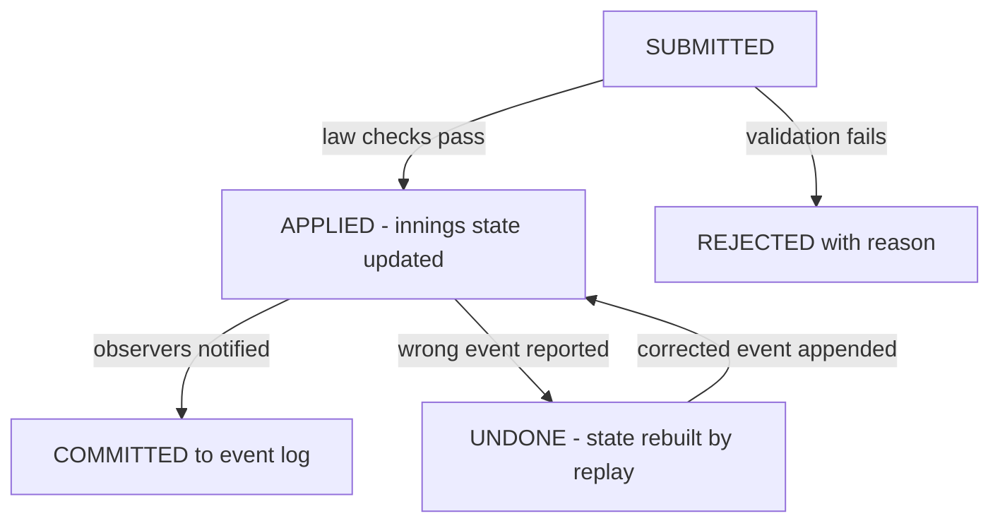

# Live Cricket Scoreboard (Cricinfo-style) — Machine Coding Problem

## Problem Statement

Design an in-memory live cricket scoreboard service that ingests ball-by-ball events from a scorer feed, validates them against the Laws of Cricket, and maintains live state: innings totals, over-by-over log, and per-player batting/bowling statistics. It must expose derived stats (run rate, strike rate, economy), push updates to live clients via observers, attach a commentary feed, support undo of wrong events via event-sourcing replay, and answer top-K batsmen queries. The core interview challenges are precise state modelling under domain rules and making the state a pure function of an append-only event log.

## Requirements Gathering

### Functional Requirements

1. Ingest ball events: dot ball, 1/2/3 runs, FOUR, SIX, wicket, wide, no-ball.
2. Validation per cricket laws: wide/no-ball add 1 penalty run and do NOT count as legal deliveries; an over ends after exactly 6 legal balls; a bowler cannot bowl two consecutive overs; the same bowler bowls the entire over.
3. Maintain state: Innings (total runs, wickets, legal balls), Over (bowler, ball log, runs), PlayerStats for every batter and bowler.
4. Strike rotation: odd runs swap striker; completing an over swaps striker; a dismissal brings the next batter to the crease.
5. Derived stats computed from primitives: current run rate, batsman strike rate, bowler economy — never stored as independent mutable fields.
6. Commentary feed: each event carries a text line; clients can replay the full feed.
7. Observer pattern: live clients subscribe and are pushed every committed state update.
8. Undo/correction: a wrong event is removed from the log and the innings is rebuilt by replaying remaining events (event sourcing); the corrected event is appended.
9. Top-K query: K highest run-scorers, ties broken by strike rate.

### Non-Functional Requirements

- Thread-safe ingestion: one `ScoreboardService` per match, single writer (or one lock) so events apply in feed order.
- Replay correctness: all state must be reconstructible from the event log alone — no hidden mutable shortcuts.
- O(1) amortized ingestion; replay (O(N)) only on corrections, which are rare; top-K in O(N log K) via a heap.

### Clarifying Questions

- "Do we model byes/leg-byes, run-outs mid-run, or free hits?" — declared extensions; core set is the 8 event types above.
- "Where does the feed come from?" — assume an upstream scorer UI; validate anyway, never trust the producer.
- "Can corrections arrive for events from finished overs?" — yes; replay handles arbitrary positions in the log.

## Class Design

### Entity Identification

```
Nouns: Match, Innings, Over, BallEvent, EventType, WicketType,
       BattingStats, BowlingStats, ScoreboardService, ScoreObserver,
       CommentaryFeed, LiveClient
```

### Class Diagram

```
┌──────────────────────────┐
│   ScoreboardService       │
├──────────────────────────┤
│ - innings: Innings        │
│ - eventLog: List          │
│ - observers: List         │
│ - lock: Lock              │
├──────────────────────────┤
│ + ingest(event)           │
│ + correct(badId, new?)    │
│ + topK(k) / subscribe()   │
└──────────┬───────────────┘
           ▼
┌──────────────────────────┐    ┌─────────────────────┐
│        Innings            │    │      Over            │
├──────────────────────────┤    ├─────────────────────┤
│ - striker / nonStriker    │ 1 *│ - overNo, bowler    │
│ - totalRuns, wickets      │───►│ - balls: List<Event │
│ - legalBalls, currentOver │    │ - runs              │
│ - batting{}, bowling{}    │    │ + isComplete()      │
│ + apply(e), scoreLine()   │    └─────────────────────┘
└──────────────────────────┘
┌──────────────────────────┐    ┌─────────────────────┐
│ BattingStats              │    │ BallEvent            │
│ runs, ballsFaced, fours,  │    │ - id, overNo        │
│ sixes, out, dismissal     │    │ - batter, bowler    │
│ + strikeRate (property)   │    │ - event, runsOffBat │
└──────────────────────────┘    │ - wicketType, comm. │
┌──────────────────────────┐    │ + isLegal: bool     │
│ BowlingStats              │    └─────────────────────┘
│ legalBalls, runsConceded, │    ┌─────────────────────┐
│ wides, noBalls, wickets   │    │ ScoreObserver (ABC) │
│ + economy (property)      │    │ ▲ CommentaryFeed    │
└──────────────────────────┘    │ ▲ LiveClient        │
                                └─────────────────────┘
```

### Ball Validation Rules (per Laws of Cricket)

| Event | Validation on arrival | State effect |
|---|---|---|
| DOT (0 runs, legal) | striker set; over not complete; correct over/bowler | striker `balls_faced +1`, over ball count +1 |
| RUNS 1/2/3 | legal delivery | runs added to all tallies; odd runs swap strike |
| FOUR / SIX | legal delivery | boundary counters increment; runs fixed at 4/6 |
| WICKET | legal delivery; wickets < max | wickets +1; striker flagged out; next batter in |
| WIDE | — | +1 penalty run (team + bowler); NOT a legal ball; strike unchanged |
| NO-BALL | — | +1 penalty run; NOT a legal ball; counts as ball faced; runs off bat still credited |

### Ball Event Lifecycle (validation → commit → correction)



## Implementation

### Python Implementation

```python
from enum import Enum
from heapq import nlargest
from threading import Lock
from typing import Dict, List, Optional
import uuid


class EventType(Enum):
    DOT = 0
    RUNS = 1          # 1, 2 or 3 runs — runs_off_bat carries the value
    FOUR = 4
    SIX = 6
    WICKET = -1
    WIDE = -2
    NO_BALL = -3


class WicketType(Enum):
    BOWLED, CAUGHT, LBW, RUN_OUT = "bowled", "caught", "lbw", "run_out"


class BallEvent:
    def __init__(self, over_no: int, batter: str, bowler: str, event: EventType,
                 runs_off_bat: int = 0, wicket_type: Optional[WicketType] = None,
                 commentary: str = ""):
        self.id = uuid.uuid4().hex[:8]
        self.over_no = over_no
        self.batter, self.bowler = batter, bowler
        self.event = event
        self.runs_off_bat = runs_off_bat
        self.wicket_type = wicket_type
        self.commentary = commentary

    @property
    def is_legal(self) -> bool:
        return self.event not in (EventType.WIDE, EventType.NO_BALL)

    @property
    def runs(self) -> int:
        return {EventType.FOUR: 4, EventType.SIX: 6}.get(self.event, self.runs_off_bat)


class BattingStats:
    def __init__(self, player: str):
        self.player = player
        self.runs = self.balls_faced = self.fours = self.sixes = 0
        self.out = False
        self.dismissal = "not out"

    @property
    def strike_rate(self) -> float:
        return (self.runs / self.balls_faced * 100) if self.balls_faced else 0.0


class BowlingStats:
    def __init__(self, player: str):
        self.player = player
        self.runs_conceded = self.legal_balls = self.wickets = 0
        self.wides = self.no_balls = 0

    @property
    def economy(self) -> float:
        return (self.runs_conceded / (self.legal_balls / 6)) if self.legal_balls else 0.0


class Over:
    def __init__(self, over_no: int, bowler: str):
        self.over_no, self.bowler = over_no, bowler
        self.balls: List[BallEvent] = []
        self.runs = 0

    @property
    def legal_balls(self) -> int:
        return sum(1 for b in self.balls if b.is_legal)

    def is_complete(self) -> bool:
        return self.legal_balls >= 6


class Innings:
    def __init__(self, batting_team: str, batters: List[str], total_overs: int = 5):
        self.batting_team, self.total_overs = batting_team, total_overs
        self.batting_order = list(batters)
        self.batting: Dict[str, BattingStats] = {b: BattingStats(b) for b in batters}
        self.bowling: Dict[str, BowlingStats] = {}
        self.striker, self.non_striker = batters[0], batters[1]
        self.next_batter_idx = 2
        self.current_over: Optional[Over] = None
        self.total_runs = self.wickets = self.legal_balls = 0
        self.max_wickets = len(batters) - 1

    def _bowling(self, bowler: str) -> BowlingStats:
        if bowler not in self.bowling:
            self.bowling[bowler] = BowlingStats(bowler)
        return self.bowling[bowler]

    def _swap_strike(self):
        self.striker, self.non_striker = self.non_striker, self.striker

    def _current_over(self, e: BallEvent) -> Over:
        cur = self.current_over
        if cur is not None and not cur.is_complete():
            if e.over_no != cur.over_no:
                raise ValueError(f"Over {cur.over_no} still in progress")
            if e.bowler != cur.bowler:
                raise ValueError("Bowler cannot change mid-over")
            return cur
        if cur is not None and cur.is_complete():
            if e.over_no != cur.over_no + 1:
                raise ValueError(f"Expected over {cur.over_no + 1}, got {e.over_no}")
            if e.bowler == cur.bowler:
                raise ValueError("A bowler cannot bowl consecutive overs")
        if e.over_no > self.total_overs:
            raise ValueError("Innings over allocation exhausted")
        new = Over(e.over_no, e.bowler)
        self.current_over = new
        return new

    def apply(self, e: BallEvent):
        """Validate against the laws, then mutate innings state. Raises on error."""
        over = self._current_over(e)
        bs = self._bowling(e.bowler)
        stat = self.batting[e.batter]

        if e.event in (EventType.WIDE, EventType.NO_BALL):
            self.total_runs += 1 + e.runs
            over.runs += 1 + e.runs
            bs.runs_conceded += 1 + e.runs
            if e.event is EventType.WIDE:
                bs.wides += 1
            else:
                bs.no_balls += 1
                stat.balls_faced += 1          # no-ball counts as a ball faced
            if e.runs:
                stat.runs += e.runs
            over.balls.append(e)
            return                             # not legal: no over/strike change

        if e.batter != self.striker:
            raise ValueError(f"{e.batter} is not on strike ({self.striker} is)")
        if e.event is EventType.WICKET and self.wickets >= self.max_wickets:
            raise ValueError("Innings complete — no wickets left")

        runs = e.runs
        self.total_runs += runs
        over.runs += runs
        over.balls.append(e)
        self.legal_balls += 1
        stat.runs += runs
        stat.balls_faced += 1
        if e.event is EventType.FOUR:
            stat.fours += 1
        if e.event is EventType.SIX:
            stat.sixes += 1
        bs.runs_conceded += runs
        bs.legal_balls += 1

        if e.event is EventType.WICKET:
            self.wickets += 1
            stat.out = True
            stat.dismissal = (e.wicket_type.value if e.wicket_type else "out")
            if self.next_batter_idx < len(self.batting_order):
                self.striker = self.batting_order[self.next_batter_idx]
                self.next_batter_idx += 1
        elif runs % 2 == 1:
            self._swap_strike()

        if over.is_complete():
            self._swap_strike()                # end-of-over swap (double-swap law)

    def score_line(self) -> str:
        o = f"{self.legal_balls // 6}.{self.legal_balls % 6}"
        rr = self.total_runs / (self.legal_balls / 6) if self.legal_balls else 0.0
        return f"{self.batting_team} {self.total_runs}/{self.wickets} ({o} ov) RR {rr:.2f}"

    def batting_card(self) -> str:
        return "\n".join(
            f"{s.player:8s} {s.runs:3d} ({s.balls_faced:2d}b, {s.fours}x4, "
            f"{s.sixes}x6) SR {s.strike_rate:5.1f}  {s.dismissal}"
            for s in self.batting.values())


class ScoreObserver:
    def on_update(self, innings: Innings, event: Optional[BallEvent]) -> None:
        raise NotImplementedError


class CommentaryFeed(ScoreObserver):
    def __init__(self):
        self.lines: List[str] = []

    def on_update(self, innings, event):
        if event is not None:
            self.lines.append(f"Ov {event.over_no}: {event.batter} v "
                              f"{event.bowler} — {event.commentary}")


class LiveClient(ScoreObserver):
    def on_update(self, innings, event):
        print(f"[LIVE] {innings.score_line()}")


class ScoreboardService:
    def __init__(self, batting_team: str, batters: List[str], total_overs: int = 5):
        self._config = (batting_team, list(batters), total_overs)
        self.innings = self._new_innings()
        self.event_log: List[BallEvent] = []
        self.observers: List[ScoreObserver] = []
        self._lock = Lock()

    def _new_innings(self) -> Innings:
        team, batters, overs = self._config
        return Innings(team, batters, overs)

    def subscribe(self, observer: ScoreObserver):
        self.observers.append(observer)

    def ingest(self, e: BallEvent):
        """Validate + apply + commit + notify. Rejects duplicates by event id."""
        with self._lock:
            if any(x.id == e.id for x in self.event_log):
                raise ValueError(f"Duplicate event {e.id}")
            self.innings.apply(e)              # raises on law violations
            self.event_log.append(e)           # committed only after successful apply
        for obs in self.observers:             # notify outside the lock
            obs.on_update(self.innings, e)

    def correct(self, bad_event_id: str, replacement: Optional[BallEvent] = None):
        """Event sourcing: rebuild innings by replaying the log minus the bad event."""
        with self._lock:
            kept = [e for e in self.event_log if e.id != bad_event_id]
            if replacement is not None:
                kept.append(replacement)
            self.innings = self._new_innings()
            for e in kept:
                self.innings.apply(e)          # trusted: already validated once
            self.event_log = kept
        for obs in self.observers:
            obs.on_update(self.innings, replacement)

    def top_k_batsmen(self, k: int) -> List[BattingStats]:
        return nlargest(k, self.innings.batting.values(),
                        key=lambda s: (s.runs, s.strike_rate))


def main():
    service = ScoreboardService("India",
                                ["Rohit", "Gill", "Kohli", "Pant", "Hardik"],
                                total_overs=5)
    feed = CommentaryFeed()
    service.subscribe(feed)
    service.subscribe(LiveClient())

    def ball(over, batter, bowler, ev, **kw):
        service.ingest(BallEvent(over, batter, bowler, ev,
                                 commentary=kw.pop("c", ""), **kw))

    # Over 1: Bumrah to Rohit/Gill
    ball(1, "Rohit", "Bumrah", EventType.DOT, c="Beaten outside off")
    ball(1, "Rohit", "Bumrah", EventType.FOUR, c="Cover drive, four")
    ball(1, "Rohit", "Bumrah", EventType.WIDE, c="Down the leg side")
    ball(1, "Rohit", "Bumrah", EventType.RUNS, runs_off_bat=1, c="Single to mid-on")
    ball(1, "Gill", "Bumrah", EventType.SIX, c="Over long-on")
    ball(1, "Gill", "Bumrah", EventType.RUNS, runs_off_bat=2, c="Pushed, two")
    ball(1, "Rohit", "Bumrah", EventType.DOT, c="Defended")
    # Over 2: Siraj (different bowler), Gill on strike
    ball(2, "Gill", "Siraj", EventType.FOUR, c="Flicked past square leg")
    ball(2, "Gill", "Siraj", EventType.WICKET,
         wicket_type=WicketType.BOWLED, c="Cleaned up")
    ball(2, "Pant", "Siraj", EventType.RUNS, runs_off_bat=1, c="Off the mark")

    six_id = service.event_log[4].id                       # SIX was actually a FOUR
    service.correct(six_id, BallEvent(1, "Gill", "Bumrah", EventType.FOUR,
                                      commentary="Corrected: four"))
    print(service.innings.batting_card())
    print("Top 2:", [(s.player, s.runs) for s in service.top_k_batsmen(2)])


if __name__ == "__main__":
    main()
```

## Key Flows

### Ball ingestion pipeline

Each event passes through validate → apply → commit → notify. Validation enforces the laws (over arithmetic, bowler constraints, strike ownership) before any mutation, so a rejected event leaves zero trace. Only after `apply` succeeds is the event appended to the log and observers notified — observers are called outside the lock so a slow live client can never stall ingestion.

### Strike rotation

Strike is derived state with two triggers: odd runs swap immediately, and completing six legal balls swaps again. The end-of-over swap composes correctly with the odd-run swap (a 1 off the last ball swaps twice, so the original striker faces the next over), which is exactly the real-law behaviour. A dismissal replaces the striker with the next batter in the order before the end-of-over swap is considered.

### Correction via replay

`correct()` filters the bad event out of the log, appends the replacement, and rebuilds the innings from scratch by replaying the log in order. This is event sourcing in miniature: the log is the single source of truth and all state is a fold over it, so undo needs no inverse functions and can never drift. Replay is O(N) over one innings' events (a few hundred), which is why it is reserved for rare corrections rather than the hot path.

## Edge Cases

| Case | Expected behavior |
|---|---|
| Wide as the would-be last ball of the over | Penalty run added, over continues — legal-ball count unchanged |
| Odd run off the last ball | Two swaps (odd-run + end-of-over) — original striker resumes |
| Same bowler named for the next over | Rejected ("cannot bowl consecutive overs") |
| Bowler changed mid-over | Rejected |
| Event for over 3 while over 2 is incomplete | Rejected ("over still in progress") |
| Wicket when no wickets remain | Innings-complete rejection; further events invalid |
| Batter not on strike submits a legal ball | Rejected with the current striker named |
| Duplicate event id replayed by the feed | Rejected (idempotence by event id) |
| SIX wrongly recorded as FOUR (or vice versa) | `correct()` swaps the event; all tallies recompute |

## Test Scenarios

```python
def test_strike_rotation_double_swap():
    inn = Innings("India", ["A", "B", "C"], total_overs=2)
    for _ in range(5):
        inn.apply(BallEvent(1, "A", "X", EventType.DOT))
    inn.apply(BallEvent(1, "A", "X", EventType.RUNS, runs_off_bat=1))
    assert inn.legal_balls == 6 and inn.striker == "A"   # swapped twice

def test_correction_via_replay():
    s = ScoreboardService("India", ["A", "B", "C"], total_overs=2)
    s.ingest(BallEvent(1, "A", "X", EventType.SIX))
    bad = s.event_log[0].id
    s.correct(bad, BallEvent(1, "A", "X", EventType.DOT))
    assert s.innings.total_runs == 0
    assert [e.event for e in s.event_log] == [EventType.DOT]

def test_top_k_orders_by_runs_then_sr():
    s = ScoreboardService("India", ["A", "B", "C"], total_overs=2)
    s.ingest(BallEvent(1, "A", "X", EventType.SIX))
    s.ingest(BallEvent(1, "B", "X", EventType.FOUR))
    assert [x.player for x in s.top_k_batsmen(2)] == ["A", "B"]
```

## Interview Tips

1. **State is a fold over the event log** — lead with this; it makes undo, audit, and "rebuild after bugfix" all one mechanism instead of three features.
2. **Know the law details interviewers probe** — wides/no-balls are not legal deliveries, penalty run charged to the bowler, no consecutive overs from one bowler, double swap at over end.
3. **Derived stats are properties, never columns** — if run rate is stored and updated separately it will diverge from the totals after a correction.
4. **Observer notifications outside the lock** — the ingestion critical section stays tiny and a hung client cannot block the scorer feed.
5. **Top-K is `nlargest`/heap** — O(N log K); mention a streaming leaderboard or Redis sorted set if N were every batter in the tournament.
6. **Scale-out path** — Kafka topic per match keyed by event id, stateless consumers updating a materialized view, WebSocket fan-out for clients.

## References

- ESPNcricinfo (product being modelled): https://www.espncricinfo.com
- MCC Laws of Cricket — Law 17 (The Over), Law 21 (No Ball), Law 22 (Wide Ball): https://www.lords.org/mcc/laws-of-cricket
- Martin Fowler, "Event Sourcing": https://martinfowler.com/eaaDev/EventSourcing.html

## Cross-References

- [Leaderboard — Machine Coding](./leaderboard.md) — the same top-K query pattern powering the batsmen ranking
- [Logger — Machine Coding](./logger.md) — append-only event log design the correction replay depends on
- [Design Patterns](../interview/system-design/lld/design-patterns.md) — observer pattern wiring live clients to the scoreboard
- [Concurrency Design](../interview/system-design/lld/concurrency-design.md) — single-writer discipline and lock scope for ingestion
- [Task Scheduler — Machine Coding](./task-scheduler.md) — scheduling retry/timeout jobs around live feeds
