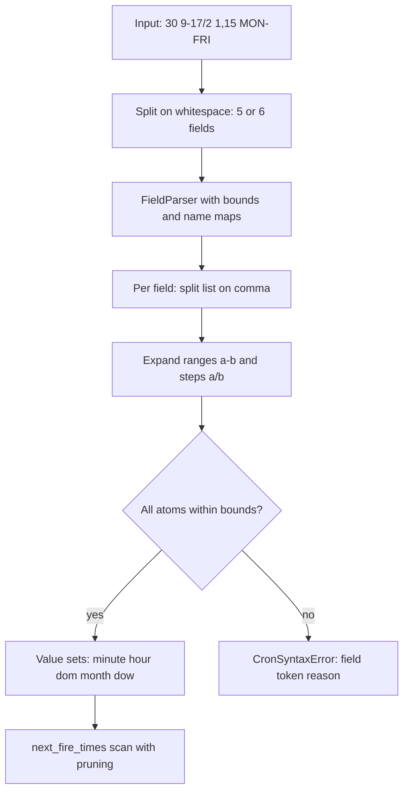

# Cron Expression Parser — Machine Coding Problem

## Problem Statement

Parse a standard 5-field cron expression (minute, hour, day-of-month, month, day-of-week) supporting `*`, ranges (`1-5`), steps (`*/15`), lists (`1,3,5`), and day-of-week/month names (`MON`, `JAN`), then compute the next N fire times from a given instant. Reject invalid expressions with a precise, field-level error. The extension ask: accept the 6-field variant with a seconds field.

This is a parsing-plus-calendar-arithmetic problem, and interviewers use it to test three layers: a clean field parser (tokenizer + validator), the correct interpretation of the fiddly cron rules (day-of-month/day-of-week OR rule, `0` vs `7` Sunday, `N/step` semantics), and an efficient next-fire-time scan that does not iterate minute-by-minute over years. The same field-grammar skills recur in rate-limit windows and schedule rules, so pair it with [Task Scheduler](./task-scheduler.md) where the parsed expression feeds a real dispatch loop.

## Requirements Gathering

### Functional Requirements

1. `CronExpression(expr)` parses the 5 fields; whitespace is normalized (tabs, repeated spaces).
2. Each field accepts `*`, single values (`9`, `MON`), lists (`1,3,5`), ranges (`9-17`), and steps (`*/15`, `10-30/5`, `5/15`).
3. Names: months `JAN..DEC`, weekdays `SUN..SAT`, case-insensitive; DOW `7` normalizes to `0` (both are Sunday).
4. `matches(dt)` and `next_fire_times(after, n)` — membership test, plus the next n strictly-after instants computed by calendar pruning, not brute force.
5. Errors are precise: which field, which token, and why (`CronSyntaxError` with `field`, `token`, `reason`).
6. Extension: 6-token input means the first field is seconds (Quartz convention); 5-token input stays seconds-free.

### Non-Functional Requirements

- Parse once, query many: field value-sets are computed at construction and reused by every query.
- `next_fire_times` must terminate even for expressions that never fire (`0 0 30 2 *`), with a clear error.
- A next-fire query on any sane expression completes in microseconds: pruning skips whole months/days/hours.

### Clarifying Questions

- "5 or 6 fields?" — support both; 6 means seconds first (Quartz/Spring convention), never seconds-last.
- "What timezone?" — the parser is timezone-agnostic: it matches the wall-clock fields of the datetime you pass; the caller owns the zone (see the timezone section).
- "Vixie cron quirks — do we honor them?" — yes: DOM/DOW OR rule, `7 == 0` Sunday, `N/step` = `N-max/step`. Document each choice; implementations genuinely differ here. Next-fire results are strictly after the given instant so a scheduler cannot double-fire.

## Cron Field Grammar

| Field | Position | Range | Names | Notes |
|---|---|---|---|---|
| minute | 1st of 5 | 0-59 | — | |
| hour | 2nd | 0-23 | — | |
| day of month | 3rd | 1-31 | — | combined with DOW by the OR rule |
| month | 4th | 1-12 | JAN-DEC | |
| day of week | 5th | 0-7 | SUN-SAT | 0 and 7 are both Sunday |

Operator semantics, with the Vixie-cron reading this page implements (see [crontab(5)](https://man7.org/linux/man-pages/man5/crontab.5.html)):

| Syntax | Meaning | Example |
|---|---|---|
| `*` | every value in range | `*` in hour = 0..23 |
| `a-b` | inclusive range | `9-17` = 9,10,...,17 |
| `*/s` | range-start to max, step s | `*/15` = 0,15,30,45 |
| `a-b/s` | range with step | `10-30/5` = 10,15,20,25,30 |
| `a/s` | `a`-to-max with step s (not just `a`!) | `5/15` = 5,20,35,50 |
| `a,b,c` | union of atoms/ranges | `1,15,20-22` |

The DOM/DOW rule: if **both** day fields are restricted (neither is a literal `*`), the expression fires when **either** matches. If only one is restricted, it alone controls. This is the single most-tested cron quirk — `30 2 1,15 * 5` fires on the 1st, the 15th, **and** every Friday.

## Class Design

### Entity Identification

```
Nouns: CronExpression, FieldSpec, CronSyntaxError, FieldParser,
       ValueSet (per-field sets), NextFireScanner
Verbs: parse, expand, validate, matches, next_fire_times, prune
```

### Class Diagram

```
┌────────────────────────────────────────────────┐
│                CronExpression                  │
├────────────────────────────────────────────────┤
│ - expr: str                                    │
│ - seconds: Set[int] | None   (6-field mode)    │
│ - minute, hour: Set[int]                       │
│ - dom: Set[int], dom_star: bool                │
│ - month: Set[int]                              │
│ - dow: Set[int], dow_star: bool                │
├────────────────────────────────────────────────┤
│ + matches(dt): bool                            │
│ + next_fire_times(after, n): List[datetime]    │
│ - _day_matches(dt): bool                       │
│ - _next_in(sorted_values, cur): int | None     │
└────────────────────────────────────────────────┘

┌──────────────────────────────┐
│ parse_field(name, text)      │  module-level helper
├──────────────────────────────┤
│ -> (Set[int], is_star: bool) │
│ uses FIELD_SPECS[name]       │
│ = (lo, hi, name_map)         │
└──────────────────────────────┘

┌────────────────────────────────────────────────┐
│ CronSyntaxError(ValueError)                    │
├────────────────────────────────────────────────┤
│ + field: str   + token: str   + reason: str    │
└────────────────────────────────────────────────┘
```

## Implementation (Python)

```python
from datetime import datetime, timedelta

DOW_NAMES = {"SUN": 0, "MON": 1, "TUE": 2, "WED": 3,
             "THU": 4, "FRI": 5, "SAT": 6}
MONTH_NAMES = {"JAN": 1, "FEB": 2, "MAR": 3, "APR": 4, "MAY": 5, "JUN": 6,
               "JUL": 7, "AUG": 8, "SEP": 9, "OCT": 10, "NOV": 11, "DEC": 12}

FIELD_SPECS = {
    "second":       (0, 59, None),
    "minute":       (0, 59, None),
    "hour":         (0, 23, None),
    "day_of_month": (1, 31, None),
    "month":        (1, 12, MONTH_NAMES),
    "day_of_week":  (0, 7, DOW_NAMES),
}


class CronSyntaxError(ValueError):
    def __init__(self, field: str, token: str, reason: str):
        self.field, self.token, self.reason = field, token, reason
        super().__init__(f"invalid {field} '{token}': {reason}")


def _atom(field: str, tok: str, names, lo: int, hi: int) -> int:
    t = tok.strip().upper()
    if names and t in names:
        v = names[t]
    else:
        try:
            v = int(t)
        except ValueError:
            raise CronSyntaxError(field, tok, "not a number or name")
    if not lo <= v <= hi:
        raise CronSyntaxError(field, tok, f"out of range {lo}-{hi}")
    return v


def parse_field(field: str, text: str):
    """Returns (value_set, is_star). is_star is True only for literal '*'."""
    lo, hi, names = FIELD_SPECS[field]
    if text.strip() == "*":
        return set(range(lo, hi + 1)), True
    values = set()
    for token in text.split(","):
        range_part, step = token, 1
        if "/" in token:
            range_part, step_s = token.split("/", 1)
            if "/" in step_s:
                raise CronSyntaxError(field, token, "multiple '/' steps")
            try:
                step = int(step_s)
            except ValueError:
                raise CronSyntaxError(field, token, "step is not a number")
            if step <= 0:
                raise CronSyntaxError(field, token, "step must be >= 1")
        if range_part == "*":
            start, end = lo, hi
        elif "-" in range_part:
            a, b = range_part.split("-", 1)
            start = _atom(field, a, names, lo, hi)
            end = _atom(field, b, names, lo, hi)
            if start > end:
                raise CronSyntaxError(field, token, "reversed range")
        else:
            start = _atom(field, range_part, names, lo, hi)
            end = hi if step > 1 else start   # Vixie: '5/15' == '5-max/15'
        values.update(range(start, end + 1, step))
    if not values:
        raise CronSyntaxError(field, text, "no values")
    if field == "day_of_week" and 7 in values:
        values.discard(7)                     # 7 and 0 are both Sunday
        values.add(0)
    return values, False


class CronExpression:
    def __init__(self, expr: str):
        self.expr = " ".join(expr.split())    # normalize whitespace
        fields = self.expr.split(" ")
        self.seconds = None
        if len(fields) == 6:                  # Quartz convention: seconds first
            self.seconds = parse_field("second", fields[0])[0]
            fields = fields[1:]
        if len(fields) != 5:
            raise CronSyntaxError("expression", self.expr,
                                  f"expected 5 or 6 fields, got {len(fields)}")
        self.minute = parse_field("minute", fields[0])[0]
        self.hour = parse_field("hour", fields[1])[0]
        self.dom, self.dom_star = parse_field("day_of_month", fields[2])
        self.month = parse_field("month", fields[3])[0]
        self.dow, self.dow_star = parse_field("day_of_week", fields[4])

    # ---------------- matching ----------------

    def _day_matches(self, dt: datetime) -> bool:
        dom_ok = dt.day in self.dom
        cron_dow = (dt.weekday() + 1) % 7     # Mon..Sat -> 1..6, Sun -> 0
        dow_ok = cron_dow in self.dow
        if self.dom_star and self.dow_star:
            return True
        if self.dom_star:
            return dow_ok
        if self.dow_star:
            return dom_ok
        return dom_ok or dow_ok               # Vixie OR rule

    def matches(self, dt: datetime) -> bool:
        if self.seconds is not None and dt.second not in self.seconds:
            return False
        if dt.minute not in self.minute or dt.hour not in self.hour:
            return False
        if dt.month not in self.month:
            return False
        return self._day_matches(dt)

    # ---------------- next-fire scan ----------------

    @staticmethod
    def _next_in(sorted_values, cur):
        for v in sorted_values:
            if v > cur:
                return v
        return None

    def _jump_to_next_month(self, cur: datetime) -> datetime:
        y, m = (cur.year + 1, 1) if cur.month == 12 else (cur.year, cur.month + 1)
        return cur.replace(year=y, month=m, day=1, hour=0,
                           minute=0, second=0, microsecond=0)

    def _jump_to_next_day(self, cur: datetime) -> datetime:
        return (cur + timedelta(days=1)).replace(
            hour=0, minute=0, second=0, microsecond=0)

    def next_fire_times(self, after: datetime, n: int = 1) -> list:
        out = []
        if self.seconds is not None:
            cur = (after + timedelta(seconds=1)).replace(microsecond=0)
        else:
            cur = (after + timedelta(minutes=1)).replace(second=0, microsecond=0)
        limit = after + timedelta(days=366 * 5)   # never-firing detector
        while len(out) < n:
            if cur > limit:
                raise ValueError(
                    f"expression {self.expr!r} has no fire time within 5 years")
            if cur.month not in self.month:               # prune whole months
                cur = self._jump_to_next_month(cur)
                continue
            if not self._day_matches(cur):                # prune whole days
                cur = self._jump_to_next_day(cur)
                continue
            if cur.hour not in self.hour:                 # prune hours
                nh = self._next_in(sorted(self.hour), cur.hour)
                cur = cur.replace(hour=nh, minute=0, second=0, microsecond=0) \
                    if nh is not None else self._jump_to_next_day(cur)
                continue
            if cur.minute not in self.minute:             # prune minutes
                nm = self._next_in(sorted(self.minute), cur.minute)
                cur = cur.replace(minute=nm, second=0, microsecond=0) \
                    if nm is not None else \
                    (cur + timedelta(hours=1)).replace(minute=0, second=0,
                                                       microsecond=0)
                continue
            if self.seconds is not None and cur.second not in self.seconds:
                ns = self._next_in(sorted(self.seconds), cur.second)
                cur = cur.replace(second=ns) if ns is not None else \
                    (cur + timedelta(minutes=1)).replace(second=0)
                continue
            out.append(cur)                               # exact match
            cur = cur + (timedelta(seconds=1) if self.seconds is not None
                         else timedelta(minutes=1))       # strictly-after advance
        return out
```

## Key Flows

### Parse pipeline



### Next-fire-time scan with calendar pruning

The naive approach — increment a datetime one minute at a time and test `matches` — is O(minutes until fire) and turns `0 0 29 2 *` into a 3-year loop per query. The scan instead prunes hierarchically, testing the coarsest unit first: if the month is not in the set, jump to the first day of the next month; if the day cannot match (including the DOM/DOW OR rule), jump to midnight of the next day; if the hour cannot match, jump to the next valid hour today or tomorrow's midnight; same for minutes and seconds. Each jump re-enters the loop at the top, so a February-only expression does at most a handful of iterations per year skipped. Worst case is bounded by the 5-year never-firing detector, which converts "the scheduler went silent" into an explicit, testable error.

### Timezone handling

The parser is deliberately timezone-agnostic: it matches the wall-clock fields of whatever `datetime` it is handed, so the *caller* owns zone policy. Production schedulers store the IANA zone with the job definition and evaluate in that zone — Quartz attaches a `TimeZone` per trigger for exactly this reason. Two DST traps to name in an interview: first, evaluating in UTC makes a `0 9 * * MON-FRI` job fire at 09:00 UTC, not 09:00 local — wrong whenever the zone's offset changes; second, aware-datetime arithmetic (`+ timedelta`) is absolute-time, so wall-clock scans should run on naive local values and attach the zone afterwards, accepting that a spring-forward gap (02:30 does not exist) simply never matches, while a fall-back repeat fires once on the earlier occurrence unless the scheduler tracks last-run. Documenting these two sentences is what separates a real scheduler design from a toy.

## Error Taxonomy

| Input | Error | Reason string |
|---|---|---|
| `61 * * * *` | minute | `out of range 0-59` |
| `0 0 0 * *` | day_of_month | `out of range 1-31` (days start at 1) |
| `*/0 * * * *` | minute | `step must be >= 1` |
| `5-1 * * * *` | minute | `reversed range` |
| `abc * * * *` | minute | `not a number or name` |
| `0 5 * * FOO` | day_of_week | `not a number or name` (unknown name) |
| `1-59/2/3 * * * *` | minute | `multiple '/' steps` |
| `5, * * * *` | minute | `not a number or name` (empty token) |
| `* * *` | expression | `expected 5 or 6 fields, got 3` |
| `* * * * * * *` | expression | `expected 5 or 6 fields, got 7` |

## Worked Examples

| Expression | Fires |
|---|---|
| `*/15 * * * *` | every 15th minute: :00, :15, :30, :45 |
| `0 9 * * MON-FRI` | 09:00 on weekdays |
| `30 2 1,15 * 5` | 02:30 on the 1st, the 15th, and every Friday (OR rule) |
| `0 0 29 2 *` | midnight on Feb 29 — leap years only |
| `0 12 */2 * *` | 12:00 every 2nd day of the month |
| `0 0 1 JAN *` | midnight on January 1st (month names) |
| `*/10 9-11 13 * FRI` | every 10 min from 09:00–11:50 on Friday the 13th |
| `*/30 * * * * *` (6-field) | every 30th second |

## The 6-Field (Seconds) Extension

Quartz and Spring put **seconds first**; Vixie cron has no seconds field at all, so the 6-token form is a documented extension rather than a standard. The implementation handles it with one change: parse an extra `second` field into `self.seconds` and switch the scan's base step from one minute to one second, reusing every pruning level by inserting a seconds check below minutes. Costs to mention: per-second granularity multiplies the scan space by 60 in the worst case (still microseconds thanks to pruning), and timestamps returned now carry a meaningful `second` component, so consumers that assumed minute precision need `replace(second=0)` comparisons. Further extensions, in the order an interviewer usually asks: `@hourly`-style macros (expand to fixed expressions), Quartz's `?` no-op for DOM/DOW (map to literal `*` for the star-flag), and last/weekday operators (`L`, `1W`) which require real calendar queries instead of value sets.

## Edge Cases

| Case | Behavior | Why |
|---|---|---|
| `0 0 30 2 *` | Parses fine; `next_fire_times` raises after the 5-year bound | Feb 30 never exists — fail loudly, not silently |
| DOW `7` | Normalized into the `0` (Sunday) set | crontab(5) allows 0 and 7 |
| `5/15` in minute | `{5, 20, 35, 50}` | `a/step` means a-to-max, not just `a` |
| Both DOM and DOW restricted | OR of the two day sets | Vixie rule; Quartz differs — state your choice |
| Literal `*` vs `*/2` in DOM | Only literal `*` counts as unrestricted for the OR rule | Common implementation choice (croniter, Vixie) |
| `after` exactly on a fire time | Next result is strictly after | Prevents scheduler double-fire |
| Leap year | Feb 29 matches only when it exists | Day-set membership is calendar-checked |

## Test Scenarios

```python
import pytest
from datetime import datetime
from cron_parser import CronExpression, CronSyntaxError, parse_field

def test_parse_sets_and_steps():
    expr = CronExpression("*/15 9-17 1,15 * MON-FRI")
    assert expr.minute == {0, 15, 30, 45}
    assert expr.hour == set(range(9, 18))
    assert expr.dom == {1, 15}
    assert expr.dow == {1, 2, 3, 4, 5}              # MON-FRI
    assert not expr.dom_star and not expr.dow_star  # both restricted -> OR rule

def test_slash_atom_and_dow_normalization():
    assert parse_field("minute", "5/15")[0] == {5, 20, 35, 50}   # a/step = a..max
    assert parse_field("day_of_week", "7")[0] == {0}
    assert parse_field("day_of_week", "SUN")[0] == {0}
    assert parse_field("day_of_week", "5-7")[0] == {5, 6, 0}

def test_error_taxonomy():
    for bad_expr, field in [("61 * * * *", "minute"),
                            ("0 0 0 * *", "day_of_month"),
                            ("*/0 * * * *", "minute"),
                            ("0 5 * * FOO", "day_of_week"),
                            ("* * *", "expression")]:
        with pytest.raises(CronSyntaxError) as e:
            CronExpression(bad_expr)
        assert e.value.field == field

def test_next_fire_every_15_minutes():
    expr = CronExpression("*/15 * * * *")
    after = datetime(2025, 3, 10, 10, 7)
    assert expr.next_fire_times(after, 3) == [
        datetime(2025, 3, 10, 10, 15),
        datetime(2025, 3, 10, 10, 30),
        datetime(2025, 3, 10, 10, 45)]

def test_next_fire_skips_weekend():
    expr = CronExpression("0 9 * * MON-FRI")
    after = datetime(2025, 3, 14, 12, 0)            # Friday afternoon
    assert expr.next_fire_times(after, 1) == [datetime(2025, 3, 17, 9, 0)]

def test_dom_dow_or_rule():
    expr = CronExpression("30 2 1,15 * 5")          # 1st, 15th, or Friday
    after = datetime(2025, 3, 2, 3, 0)
    assert expr.next_fire_times(after, 3) == [
        datetime(2025, 3, 7, 2, 30),                # Friday
        datetime(2025, 3, 14, 2, 30),               # Friday
        datetime(2025, 3, 15, 2, 30)]               # the 15th (DOM, OR rule)

def test_feb_29_leap_year_only():
    expr = CronExpression("0 0 29 2 *")
    assert expr.next_fire_times(datetime(2025, 1, 1), 1) == [
        datetime(2028, 2, 29, 0, 0)]

def test_never_firing_expression_raises():
    expr = CronExpression("0 0 30 2 *")             # Feb 30 does not exist
    with pytest.raises(ValueError):
        expr.next_fire_times(datetime(2025, 1, 1), 1)

def test_six_field_seconds_variant():
    expr = CronExpression("*/30 * * * * *")
    assert expr.next_fire_times(datetime(2025, 3, 10, 10, 0, 0), 3) == [
        datetime(2025, 3, 10, 10, 0, 30),
        datetime(2025, 3, 10, 10, 1, 0),
        datetime(2025, 3, 10, 10, 1, 30)]
```

## Interview Questions

1. **How do you compute the next fire time without brute force?** The scan prunes hierarchically from the coarsest unit: month set → day set (with the OR rule) → hour set → minute set → seconds. Each mismatch jumps the candidate forward by a whole month, day, hour, or minute and re-enters the check, so a leap-day expression skips years in a handful of iterations. A 5-year bound converts expressions that can never fire into an explicit error instead of an infinite loop.
2. **Explain the day-of-month / day-of-week interaction.** When both fields are restricted — neither is a literal `*` — cron fires when either matches, so `30 2 1,15 * 5` hits the 1st, the 15th, and every Friday. When only one is restricted it alone controls, and `* *` means every day. I track a `dom_star`/`dow_star` flag per field at parse time and apply the OR in `_day_matches`; only a literal star counts, so `*/2` in DOM is treated as restricted, which matches Vixie cron and croniter.
3. **Where exactly do cron implementations disagree, and how did you pick?** Three hot spots: `a/step` semantics (I implement a-to-max per Vixie, so `5/15` gives {5,20,35,50}, not {5}); the star-flag for the OR rule (literal `*` only; Quartz's `?` is a synonym with the same intent); and 6-field ordering (seconds first, Quartz/Spring style). Naming the disagreement and stating a choice is worth more than silently picking one.
4. **How do you handle timezones and DST?** The parser matches wall-clock fields of the datetime it is given, so the zone belongs to the caller; a real scheduler stores the IANA zone with the job and evaluates in it, like Quartz's per-trigger `TimeZone`. The two traps are evaluating in UTC (a `0 9 * * MON` job would drift from 09:00 local) and aware-datetime `timedelta` arithmetic being absolute-time rather than wall-clock, so the scan runs on naive local values; spring-forward gaps never match, and fall-back repeats fire once.
5. **What would you change to persist and scale this?** Parse once at registration and store the five value-sets next to the job — re-parsing per fire is the common waste. For scale, compute the next fire per job into a priority queue (heap by next-fire time, as in [Task Scheduler](./task-scheduler.md)) and re-insert after each fire; the parser itself stays single-threaded and pure, so it needs no locks.

## Key Takeaways

- Parse once into per-field value sets; `matches` and the scan are pure set membership afterwards.
- The scan prunes month → day → hour → minute → second; never iterate minute-by-minute over years.
- Bound the scan (5 years) so never-firing expressions (`0 0 30 2 *`) fail loudly with a testable error.
- DOM/DOW: both restricted ⇒ OR; only literal `*` is unrestricted; `7` folds into `0`.
- `a/step` is a-to-max in Vixie cron (`5/15` = {5,20,35,50}) — a favorite trap question.
- Errors carry `(field, token, reason)` — precision of the error taxonomy is part of the score.
- 6-field = seconds first (Quartz/Spring); it changes scan granularity, not architecture. Timezone policy belongs to the caller; wall-clock semantics and DST folds are scheduler concerns.

## Interview Tips

1. **Write the field-spec table first** (`name, lo, hi, names`); every parser branch and every error falls out of it, and it shows the design before code.
2. **Implement `_day_matches` before `next_fire_times`** — the OR rule and star flags live there, and the scan just reuses it.
3. **Test the trap cases unprompted**: `5/15`, DOW `7`, DOM+DOW OR, Feb 29, never-firing. Volunteers who test these get follow-up questions instead of gotchas.
4. **If time runs short**, ship the 5-field parser + scan and describe the seconds extension verbally — a working core with named extensions beats a half-broken 6-field version.

## References

- crontab(5) man page — field ranges, `7 == 0` Sunday, DOM/DOW OR rule: https://man7.org/linux/man-pages/man5/crontab.5.html
- Quartz Scheduler — CronTrigger tutorial (6-field seconds-first grammar, per-trigger TimeZone): https://www.quartz-scheduler.org/documentation/quartz-2.3.0/tutorials/crontrigger.html
- RFC 5545 (iCalendar), RRULE recurrence grammar — the richer recurrence family: https://datatracker.ietf.org/doc/rfc5545/
- Python `datetime` — `weekday()`, `replace()`, `timedelta` semantics used by the scan: https://docs.python.org/3/library/datetime.html

## Cross-References

- [Task Scheduler](./task-scheduler.md) — consumes parsed schedules; cron output feeds its priority queue.
- [Rate Limiter](./rate-limiter.md) — the other "time-window arithmetic" machine-coding staple.
- [Logger](./logger.md) — sibling problem; same async-worker skeleton wraps scheduled jobs.
- [Cron and systemd Timers](../linux/admin/cron.md) — the daemon that runs this grammar in production.
- [Distributed Cron](../distributed/fundamentals/distributed-cron.md) — what changes when many nodes share one schedule.
- [Time](../distributed/fundamentals/time.md) — clocks, skew, and monotonicity behind scheduling decisions.
