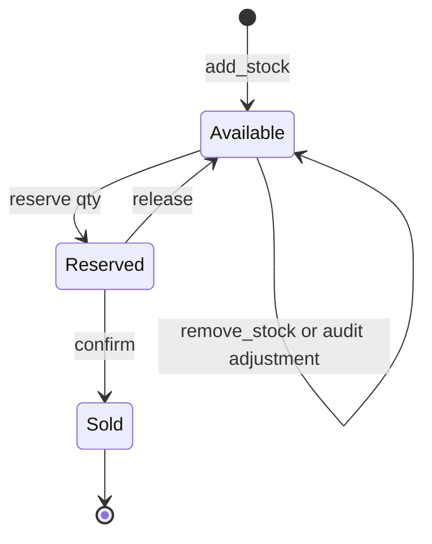

# Warehouse Inventory Management — Machine Coding Problem

## Problem Statement

Design an in-memory warehouse inventory service: stock is tracked per SKU with a **two-tier count** (available vs reserved), all mutations are recorded as an append-only **event log** (add, remove, reserve, confirm, release, adjustment), and reservations must never oversell under concurrent access. The service needs low-stock threshold alerts, a per-SKU movement history, and an audit/reconciliation flow that converts a physical recount into an adjustment event.

This problem appears in machine-coding rounds at companies with order flows (e-commerce, retail, logistics). The differentiator is not the CRUD surface — it is whether you model the *lifecycle of reserved units* correctly and whether your `reserve` path is atomic under a thread race. The same two-tier accounting shows up in [Booking System](./booking-system.md) (seats/rooms) and [Vending Machine](./vending-machine.md) (physical slots), so this page doubles as the reusable core for those variants.

## Requirements Gathering

### Functional Requirements

1. Create SKUs with an initial low-stock threshold; `add_stock` / `remove_stock` change on-hand quantity.
2. Two-tier counts per SKU: `available` (sellable now) and `reserved` (held for in-flight orders).
3. `reserve(sku, qty, order_ref)` — atomically move qty from available → reserved; fail (not oversell) if insufficient.
4. `confirm(sku, order_ref)` — order fulfilled: reserved units leave the system permanently (sale).
5. `release(sku, order_ref)` — order cancelled or expired: reserved units return to available.
6. Low-stock alert: fire registered observer callbacks when `available <= threshold` after any mutation.
7. Movement history per SKU: the full event log, newest-last, with before/after counts per event.
8. `audit(sku, counted_on_hand)` — reconciliation: physical recount → discrepancy → `ADJUSTMENT` event so the ledger self-corrects.

### Non-Functional Requirements

- Oversell prevention is a hard invariant: sum of successful reservations for a SKU can never exceed stock.
- Thread-safe under concurrent reservation attempts on the same SKU (the tested race); every quantity change traceable to one event with an order reference.

### Clarifying Questions

- "When a unit is reserved, is it still physically in the warehouse?" — yes; `available + reserved` = on-hand. Only `confirm` (ship) removes units.
- "What happens when a reservation is abandoned (payment never completes)?" — a TTL sweeper calls `release`; mention it, implement the release primitive. Audits can run while orders are live: recount measures on-hand = available + reserved, and the adjustment lands on available.

## Class Design

### Entity Identification

```
Nouns: InventoryService, SKU, StockItem, StockEvent, EventType,
       Reservation, LowStockObserver, AuditReport
Verbs: add_stock, remove_stock, reserve, confirm, release, audit,
       register_alert, get_history, get_snapshot
```

### Class Diagram

```
┌───────────────────────────────────────────────┐
│               InventoryService                │
├───────────────────────────────────────────────┤
│ - items: Map[sku, StockItem]                  │
│ - registry_lock: Lock   (guards items map)    │
│ - alert_callbacks: List[Callable]             │
├───────────────────────────────────────────────┤
│ + create_sku(sku, threshold)                  │
│ + add_stock(sku, qty, ref)                    │
│ + remove_stock(sku, qty, ref)                 │
│ + reserve(sku, qty, ref): bool                │
│ + confirm(sku, ref): int                      │
│ + release(sku, ref): int                      │
│ + audit(sku, counted_on_hand): int            │
│ + get_history(sku): List[StockEvent]          │
│ + get_snapshot(sku): (available, reserved)    │
└──────────────┬────────────────────────────────┘
               │ one item per SKU, its own lock
               ▼
┌───────────────────────────────────────────────┐
│                  StockItem                    │
├───────────────────────────────────────────────┤
│ - sku: str                                    │
│ - available: int        (sellable now)        │
│ - reserved: int         (held for orders)     │
│ - reservations: Map[ref, qty]                 │
│ - low_stock_threshold: int                    │
│ - lock: Lock            (per-SKU stripe lock) │
│ - events: List[StockEvent]  (movement log)    │
└───────────────────────────────────────────────┘

┌───────────────────────────────────────────────┐
│                 StockEvent                    │
├───────────────────────────────────────────────┤
│ - ts: float   - sku: str   - event_type       │
│ - qty: int    - ref: str                      │
│ - available_after: int                        │
│ - reserved_after: int                         │
└───────────────────────────────────────────────┘

Enums: EventType { STOCK_ADDED, STOCK_REMOVED, RESERVED,
                   RESERVATION_CONFIRMED, RESERVATION_RELEASED, ADJUSTMENT }
```

## Implementation (Python)

```python
import threading
import time
from dataclasses import dataclass, field
from enum import Enum
from typing import Callable, Dict, List, Tuple


class EventType(Enum):
    STOCK_ADDED = "STOCK_ADDED"
    STOCK_REMOVED = "STOCK_REMOVED"
    RESERVED = "RESERVED"
    RESERVATION_CONFIRMED = "RESERVATION_CONFIRMED"
    RESERVATION_RELEASED = "RESERVATION_RELEASED"
    ADJUSTMENT = "ADJUSTMENT"


class InventoryError(Exception):
    pass


class UnknownSkuError(InventoryError):
    pass


class UnknownReservationError(InventoryError):
    pass


class InsufficientStockError(InventoryError):
    pass


@dataclass
class StockEvent:
    ts: float
    sku: str
    event_type: EventType
    qty: int                    # signed delta for ADJUSTMENT, positive otherwise
    ref: str                    # order id / restock id / audit id
    available_after: int
    reserved_after: int


@dataclass
class StockItem:
    sku: str
    available: int = 0
    reserved: int = 0
    low_stock_threshold: int = 5
    lock: threading.Lock = field(default_factory=threading.Lock, repr=False)
    events: List[StockEvent] = field(default_factory=list, repr=False)
    reservations: Dict[str, int] = field(default_factory=dict, repr=False)

    def on_hand(self) -> int:
        return self.available + self.reserved


class InventoryService:
    def __init__(self, alert_callbacks: List[Callable] = None):
        self._items: Dict[str, StockItem] = {}
        self._registry_lock = threading.Lock()   # guards the sku -> item map
        self._alert_callbacks = list(alert_callbacks or [])

    def register_alert(self, cb: Callable[[str, int, int], None]) -> None:
        self._alert_callbacks.append(cb)         # cb(sku, available, threshold)

    # ---------------- SKU lifecycle ----------------

    def create_sku(self, sku: str, threshold: int = 5) -> None:
        with self._registry_lock:
            if sku in self._items:
                raise InventoryError(f"SKU already exists: {sku}")
            self._items[sku] = StockItem(sku=sku, low_stock_threshold=threshold)

    def _item(self, sku: str) -> StockItem:
        item = self._items.get(sku)
        if item is None:
            raise UnknownSkuError(f"unknown SKU: {sku}")
        return item

    # ---------------- event + alert helpers ----------------

    def _record(self, item: StockItem, etype: EventType, qty: int, ref: str) -> None:
        item.events.append(StockEvent(
            time.time(), item.sku, etype, qty, ref,
            item.available, item.reserved))

    def _fire_alerts(self, item: StockItem) -> None:
        """Called AFTER releasing item.lock — user code must not run under it."""
        if item.available <= item.low_stock_threshold:
            for cb in self._alert_callbacks:
                cb(item.sku, item.available, item.low_stock_threshold)

    # ---------------- stock in / out ----------------

    def add_stock(self, sku: str, qty: int, ref: str = "restock") -> None:
        if qty <= 0:
            raise ValueError("qty must be positive")
        item = self._item(sku)
        with item.lock:
            item.available += qty
            self._record(item, EventType.STOCK_ADDED, qty, ref)
        self._fire_alerts(item)

    def remove_stock(self, sku: str, qty: int, ref: str = "shrinkage") -> None:
        if qty <= 0:
            raise ValueError("qty must be positive")
        item = self._item(sku)
        with item.lock:
            if qty > item.available:
                raise InsufficientStockError(
                    f"remove {qty} > available {item.available} for {sku}")
            item.available -= qty
            self._record(item, EventType.STOCK_REMOVED, qty, ref)
        self._fire_alerts(item)

    # ---------------- reservation lifecycle ----------------

    def reserve(self, sku: str, qty: int, ref: str) -> bool:
        """Atomic check-and-decrement: the anti-oversell critical section."""
        if qty <= 0:
            raise ValueError("qty must be positive")
        item = self._item(sku)
        with item.lock:                          # check-then-act inside ONE lock
            if item.available < qty:
                return False                     # never oversell
            item.available -= qty
            item.reserved += qty
            item.reservations[ref] = qty
            self._record(item, EventType.RESERVED, qty, ref)
        self._fire_alerts(item)
        return True

    def confirm(self, sku: str, ref: str) -> int:
        item = self._item(sku)
        with item.lock:
            qty = item.reservations.pop(ref, None)
            if qty is None:
                raise UnknownReservationError(f"no reservation for {ref} on {sku}")
            item.reserved -= qty
            self._record(item, EventType.RESERVATION_CONFIRMED, qty, ref)
            return qty

    def release(self, sku: str, ref: str) -> int:
        item = self._item(sku)
        with item.lock:
            qty = item.reservations.pop(ref, None)
            if qty is None:
                raise UnknownReservationError(f"no reservation for {ref} on {sku}")
            item.reserved -= qty
            item.available += qty
            self._record(item, EventType.RESERVATION_RELEASED, qty, ref)
            return qty

    # ---------------- audit / reconciliation ----------------

    def audit(self, sku: str, counted_on_hand: int, ref: str = "audit") -> int:
        item = self._item(sku)
        with item.lock:
            system_on_hand = item.available + item.reserved
            delta = counted_on_hand - system_on_hand
            if delta != 0:
                item.available += delta          # shrink or grow available only
            self._record(item, EventType.ADJUSTMENT, delta, ref)
        self._fire_alerts(item)
        return delta

    # ---------------- reads ----------------

    def get_history(self, sku: str, limit: int = None) -> List[StockEvent]:
        item = self._item(sku)
        with item.lock:
            history = list(item.events)          # defensive copy
        return history[-limit:] if limit else history

    def get_snapshot(self, sku: str) -> Tuple[int, int]:
        item = self._item(sku)
        with item.lock:
            return item.available, item.reserved
```

## Key Flows

### Reservation lifecycle (per SKU)



1. **Reserve** is the only place available can go down without an event saying why: check `available >= qty`, then decrement available, increment reserved, and record `ref → qty` so `confirm`/`release` need no quantity argument. All of this happens inside one `item.lock` acquisition — the check-then-act is atomic.
2. **Confirm** pops the reservation and decrements `reserved` only; the units were already removed from `available` at reserve time, so double-decrementing is impossible.
3. **Release** is `confirm`'s mirror: pops the reservation, moves qty back to available, fires the alert check because availability improved past the threshold.
4. **Audit** compares a physical recount against `available + reserved` and writes the discrepancy as one signed `ADJUSTMENT` event on `available`; the reserved ledger is untouched because those units still belong to live orders.

### Why two tiers, not one

One flat `qty` counter cannot distinguish "nobody wants it" from "someone holds it" — so cancellation restores stock, the low-stock alert fires on phantom availability, and analytics cannot compute fill rate. The two-tier split costs one extra integer per SKU and one dict of live reservations, and it makes `on_hand = available + reserved` the single reconciliation identity the audit depends on.

## Oversell Prevention Under Concurrency

The classic failure is the interleaved check-then-act: two threads both read `available = 1`, both pass the `if`, both decrement, and the system sells one unit twice. The fix is making the check and the mutation a single critical section on a per-SKU lock. Per-SKU striping (one lock per `StockItem`) lets different SKUs update fully in parallel while serializing contention only where it exists — the same reasoning as stripe-locks in a hash map. Under the GIL even `available -= qty` is not atomic enough, because the check must observe the *post*-decrement value of competing threads, so a lock (not a bare read-modify-write) is the correct primitive here.

| Approach | Oversell-safe? | Trade-off |
|---|---|---|
| Check then write, no lock | No — classic lost update | Broken by definition |
| Single global lock | Yes | All SKUs serialize; needless contention |
| Per-SKU lock (this design) | Yes | Contention scoped to hot SKUs only |
| Optimistic versioning (CAS/retry) | Yes with retry loop | Retries under contention; good when conflicts are rare |
| DB conditional update `WHERE available >= qty` | Yes | Pushes atomicity to the database row lock |

If the interviewer pushes to scale beyond one process, the answer is the conditional-update pattern: the reservation becomes `UPDATE stock SET available = available - :qty WHERE sku = :sku AND available >= :qty` and success is measured by rows-affected, not by a pre-check. The in-memory per-SKU lock and the SQL conditional update are the same idea expressed at different layers.

## Audit and Reconciliation

Physical systems drift: theft, breakage, scan errors, returns received into the wrong bin. Reconciliation is a first-class flow, not a bug fix. The `audit` method takes the counted on-hand quantity, computes `delta = counted - (available + reserved)`, and appends an `ADJUSTMENT` event so the movement history shows both the drift and its correction. Two interview-grade subtleties: first, the adjustment lands on `available` rather than `reserved`, because reserved units are contractually committed to orders and shrinking them silently would strand in-flight order fulfillments; second, an audit that runs while reservations are live must compare against on-hand (both tiers), not against `available` alone, or every live reservation looks like shrinkage. The append-only event log this design produces is the same primitive that event-sourced systems rebuild state from — see [Event Sourcing](../backend/patterns/event-sourcing.md).

## Edge Cases

| Case | Behavior | Why |
|---|---|---|
| `reserve` more than available | Returns `False`, no state change | Oversell is a hard invariant |
| `reserve` with qty ≤ 0 | `ValueError` before touching state | Reject nonsense at the boundary |
| `confirm` / `release` with unknown ref | `UnknownReservationError` | Reservation map is the source of truth |
| `confirm` twice for the same ref | Second call raises (`pop` returns `None`) | Reservation is consumed exactly once |
| `release` after `confirm` | Raises — units already shipped | Lifecycle has no reverse edge from Sold |
| `add_stock` with negative qty | `ValueError` | Inbound/outbound are separate methods |
| `remove_stock` below available | Raises `InsufficientStockError` | Shrinkage cannot eat reserved units |
| Audit while reservations live | Compares against `available + reserved` | Recount measures physical on-hand |
| Alert fires on `available == threshold` | Yes (`<=`, not `<`) | Threshold means "reorder at or below" |

## Test Scenarios

```python
import threading
import time
from inventory import (InventoryService, EventType, InsufficientStockError,
                       UnknownReservationError)

def test_reserve_confirm_removes_units_exactly_once():
    svc = InventoryService()
    svc.create_sku("SKU-1")
    svc.add_stock("SKU-1", 10, "restock-1")
    assert svc.reserve("SKU-1", 4, "order-A") is True
    assert svc.get_snapshot("SKU-1") == (6, 4)     # two-tier counts
    svc.confirm("SKU-1", "order-A")
    assert svc.get_snapshot("SKU-1") == (6, 0)     # available untouched by confirm
    with raises(UnknownReservationError):
        svc.confirm("SKU-1", "order-A")            # cannot confirm twice

def test_reserve_release_returns_units():
    svc = InventoryService()
    svc.create_sku("SKU-2")
    svc.add_stock("SKU-2", 5)
    svc.reserve("SKU-2", 5, "order-B")
    assert svc.reserve("SKU-2", 1, "order-C") is False   # nothing left
    svc.release("SKU-2", "order-B")
    assert svc.get_snapshot("SKU-2") == (5, 0)

def test_oversell_race_under_threads():
    """20 threads x 20 reserve attempts on 10 units -> exactly 10 succeed."""
    svc = InventoryService()
    svc.create_sku("SKU-3")
    svc.add_stock("SKU-3", 10)
    successes, lock = [], threading.Lock()
    def worker(tid):
        for i in range(20):
            if svc.reserve("SKU-3", 1, f"o-{tid}-{i}"):
                with lock:
                    successes.append(1)
    threads = [threading.Thread(target=worker, args=(t,)) for t in range(20)]
    for t in threads: t.start()
    for t in threads: t.join()
    assert len(successes) == 10                    # never 11, never 9
    assert svc.get_snapshot("SKU-3") == (0, 10)
    assert sum(e.qty for e in svc.get_history("SKU-3")
               if e.event_type is EventType.RESERVED) == 10

def test_low_stock_alert_fires_once_per_crossing():
    alerts = []
    svc = InventoryService(alert_callbacks=[lambda s, a, t: alerts.append((s, a))])
    svc.create_sku("SKU-4", threshold=3)
    svc.add_stock("SKU-4", 10)
    assert alerts == []                            # 10 > 3
    svc.reserve("SKU-4", 8, "order-D")             # available 2 <= 3
    assert alerts == [("SKU-4", 2)]

def test_audit_reconciles_drift_with_adjustment_event():
    svc = InventoryService()
    svc.create_sku("SKU-5")
    svc.add_stock("SKU-5", 10)
    svc.reserve("SKU-5", 2, "order-E")             # on-hand = 8, available = 8
    delta = svc.audit("SKU-5", counted_on_hand=7, ref="audit-1")  # one stolen
    assert delta == -1
    assert svc.get_snapshot("SKU-5") == (7, 2)     # reserved untouched
    last = svc.get_history("SKU-5")[-1]
    assert last.event_type is EventType.ADJUSTMENT and last.qty == -1

def test_movement_history_is_complete_and_ordered():
    svc = InventoryService()
    svc.create_sku("SKU-6")
    svc.add_stock("SKU-6", 5, "r1")
    svc.reserve("SKU-6", 2, "o1")
    svc.release("SKU-6", "o1")                     # cancelled, never confirmed
    history = svc.get_history("SKU-6")
    assert [e.event_type for e in history] == [
        EventType.STOCK_ADDED, EventType.RESERVED, EventType.RESERVATION_RELEASED]
    assert history[0].available_after == 5 and history[-1].available_after == 5
```

(`raises` is `pytest.raises`; in a bare-assert harness replace it with a `try/except` block. Per-SKU lock striping is additionally exercised by running the oversell race on two SKUs concurrently — snapshots stay independent.)

## Interview Questions

1. **Why keep `available` and `reserved` separately instead of one quantity?** One counter cannot express "physically present but promised to an order", so cancellation cannot restore stock and the low-stock alert would fire on units that are already spoken for. Two tiers make `available + reserved` the reconciliation identity, let `confirm` decrement only `reserved`, and give analytics a real fill-rate signal. The extra cost is one integer plus a reservations map per SKU.
2. **Walk me through how your `reserve` prevents oversell.** The check `available >= qty` and the mutation `available -= qty; reserved += qty` run inside a single acquisition of the per-SKU lock, so no thread can observe the pre-check state of a competing thread's mid-update. A thread that loses the race sees the decremented `available` and gets `False`. Under multiple processes the same critical section becomes a conditional database update or a Redis Lua script — the invariant is the atomicity of check-then-act, not the lock itself.
3. **Why does the alert fire outside the SKU lock?** Callbacks are user code that might be slow, log to disk, or even call back into the service — running them under `item.lock` would block every other mutation on that SKU and risks deadlock. The design captures the decision inside the critical section and fires after release; the alert may be microseconds stale, which is acceptable for a threshold notification.
4. **How does the audit flow avoid corrupting live orders?** The recount is compared against on-hand (`available + reserved`), not just `available`, so live reservations are not misread as shrinkage. The resulting delta adjusts `available` only, keeping the contract with in-flight orders intact, and the discrepancy is written as a signed `ADJUSTMENT` event so the ledger shows both the drift and the correction.
5. **How would you add reservation expiry?** Store a deadline per reservation and run a small reaper thread (or lazy sweep on read) that calls `release(ref)` for expired entries; `release` is already idempotent-per-ref because the reservation is popped once. For correctness under crashes, the reservation map and event log need persistence — the in-memory structure is the spec a database table would implement.

## Key Takeaways

- Two-tier counts (`available` / `reserved`) with `on_hand = available + reserved` as the reconciliation identity.
- `reserve` is the anti-oversell critical section: check and mutate under one per-SKU lock; losing threads get `False`, never negative stock.
- `confirm` decrements reserved only; `release` mirrors it back to available; both consume the `ref → qty` reservation map exactly once.
- Every mutation appends a signed event with after-counts — movement history and audit come free.
- Audit compares recount against on-hand and adjusts `available` only; reserved units belong to live orders.
- Fire user callbacks (alerts) outside the SKU lock; capture the decision inside it.
- Cross-process version of the same invariant: `UPDATE ... WHERE available >= qty` (rows-affected = success), or a Redis Lua script.

## Interview Tips

1. **Write `reserve` first and say "this is the critical section"** — it signals you know where the interview is actually scored.
2. **Keep the reservations map** (`ref → qty`): it lets `confirm(ref)` take no quantity, kills the double-confirm bug, and makes expiry a clean `release(ref)`.
3. **Own the lifecycle vocabulary**: add → reserve → confirm/release → adjust; drawing the state diagram takes 30 seconds and prevents confirm/release mix-ups.
4. **Anchor to the real world**: event log ↔ [event sourcing](../backend/patterns/event-sourcing.md), conditional update ↔ inventory rows in OLTP databases, alerts ↔ reorder-point systems.

## References

- Martin Fowler, *Event Sourcing* (the event-log pattern used for movement history): https://martinfowler.com/eaaDev/EventSourcing.html
- Redis programmability (Lua scripts for atomic check-and-decrement across processes): https://redis.io/docs/latest/develop/interact/programmability/
- Python `threading` — `Lock`/`Condition` semantics used for the per-SKU critical sections: https://docs.python.org/3/library/threading.html

## Cross-References

- [Booking System](./booking-system.md) — same reserve/confirm/release lifecycle applied to seats and rooms.
- [Vending Machine](./vending-machine.md) — physical stock slots with the same sold-out invariants.
- [Logger](./logger.md) — sibling machine-coding problem; its async appender mirrors the alert-callback plumbing.
- [Rate Limiter](./rate-limiter.md) — another atomically-consumed-count resource; token bucket ↔ stock units.
- [Event Sourcing](../backend/patterns/event-sourcing.md) — theory behind the append-only movement log.
- [Order Management (real world)](../interview/system-design/real-world/order-management.md) — system-design view of the order flow that drives these reservations.
- [Redis](../dbms/caching/redis.md) — where the per-SKU critical section lives in a distributed deployment.
