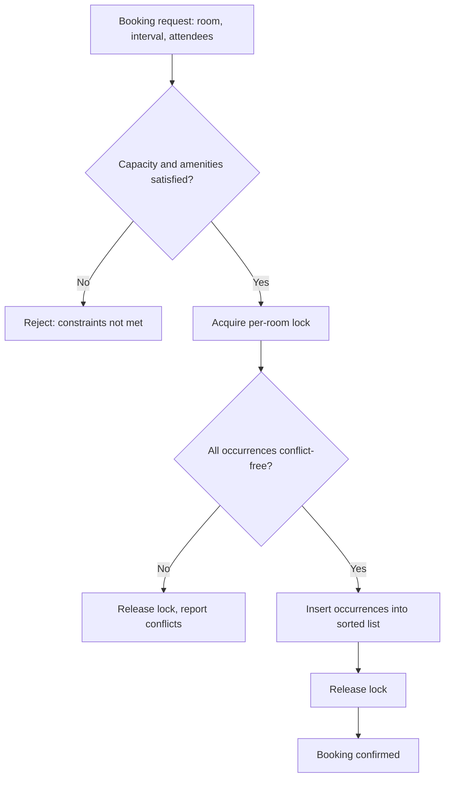

# Meeting Room Scheduler — Machine Coding Problem

## Problem Statement

Design a meeting room booking system for an office: employees book rooms for time intervals, the system detects conflicts against existing bookings, supports recurring meetings (daily/weekly series), cancellations of single occurrences or whole series, availability queries across rooms, and a calendar view per room. Rooms have constraints — seating capacity and equipment such as VC units — that a booking must satisfy.

This problem appears constantly in machine-coding rounds because it looks easy and then punishes you in three specific places: the half-open interval comparison, the all-or-nothing semantics of booking a recurring series, and the concurrency argument about which lock protects the "check-then-insert" step. It is the DSA "meeting rooms" interview question wearing a system-design coat — and the interviewer expects you to connect the two: the sorted-interval trick from algorithms becomes the O(log n) conflict check in the design.

## Requirements Gathering

### Functional Requirements

1. Rooms with attributes: room id, name, capacity, set of amenities (VC, whiteboard, projector)
2. Book a room for `[start, end)`; a booking records organizer, title, attendees
3. Reject a booking if the room already has an overlapping booking in that interval
4. Enforce constraints: attendee count ≤ capacity, requested amenities ⊆ room amenities
5. Recurring bookings: daily or weekly series of N occurrences, booked atomically (all-or-nothing)
6. Cancel one occurrence of a series, or the entire series
7. Availability query: given an interval (plus capacity/amenities), list all free rooms
8. Calendar view: for one room and one day, list bookings in chronological order

### Non-Functional Requirements

- Conflict check O(log n) per room using a sorted interval list (n = bookings in the room)
- Thread-safe booking — two users clicking "book" on the same slot must yield exactly one winner
- Booking latency < 20 ms; availability across 500 rooms × 5,000 bookings < 100 ms
- No partial state: either every occurrence of a series is booked or none is

### Clarifying Questions

- "What time granularity — 15-minute slots, or free intervals?" — free intervals here; slot grids are a simplification, not a requirement
- "Can two meetings share a room if one is a no-show?" — no; no-show handling is an extension
- "Buffer between meetings for cleanup?" — easy to add: inflate the new interval by the buffer before checking
- "Time zones?" — assume one office time zone; multi-timezone recurrence is a DST discussion worth mentioning
- "Can booking exceed working hours?" — configurable policy, default no

## Class Design

### Entity Identification

```
Nouns: RoomScheduler, Room, MeetingBooking, Interval,
       RecurrenceRule, Amenity, BookingStatus
Verbs: book, cancel, isFree, findAvailable, getCalendar, expand
```

The design keeps conflict logic in exactly one place: `Room.is_free(interval)` against a **sorted-by-start list of bookings**. Everything else — single booking, series booking, availability query, calendar view — is composition over that primitive. Keeping one source of truth for overlap is what makes the concurrency argument tractable later.

### Interval Overlap — the Core Primitive

All times are half-open `[start, end)`: a meeting ending at 10:00 does not conflict with one starting at 10:00. Two intervals `A` and `B` overlap iff `A.start < B.end and B.start < A.end`. Getting the strictness of these inequalities right is worth 10 minutes of the interview — write it down before coding.

### Booking Request Flow



Note the lock is acquired **after** the cheap validation but **before** any conflict check — validating under the lock wastes contention; checking without the lock reintroduces the race.

### Data Structure Choice for Conflict Checks

| Approach | Conflict check | Insert | Notes |
|---|---|---|---|
| Unsorted list, linear scan | O(n) | O(1) | Fine for tiny rooms, but no fast availability |
| Sorted list + binary search | O(log n) | O(n) list shift | Best read/write mix for one room; n ≈ 20/day |
| Skip list / balanced BST | O(log n) | O(log n) | Pays off at 10⁴+ bookings per room |
| Interval tree | O(log n + k) | O(log n) | k = number of reported conflicts; ideal for "show me conflicts" |

For a single room, daily bookings number in the dozens — the sorted list is the right engineering call, and you can say so: "I'd revisit this if a room accumulated thousands of bookings." Binary search on the starts array finds the insertion point; only the predecessor and successor of that point need overlap tests.

## Implementation

### Python Implementation

```python
import uuid
from bisect import bisect_left, insort
from dataclasses import dataclass
from datetime import datetime, timedelta
from enum import Enum
from threading import Lock
from typing import Dict, List, Optional, Set


class Amenity(Enum):
    VC = "video_conferencing"
    WHITEBOARD = "whiteboard"
    PROJECTOR = "projector"


@dataclass
class Interval:
    """Half-open [start, end)."""
    start: datetime
    end: datetime

    def overlaps(self, other: "Interval") -> bool:
        return self.start < other.end and other.start < self.end

    def __repr__(self):
        return f"[{self.start:%a %H:%M} .. {self.end:%H:%M})"


class RecurrenceRule:
    def __init__(self, freq: str, count: int):
        assert freq in ("daily", "weekly")
        self.freq = freq
        self.count = count

    def expand(self, first: Interval) -> List[Interval]:
        """Expand a series into concrete occurrences."""
        step = timedelta(days=1 if self.freq == "daily" else 7)
        out = []
        for i in range(self.count):
            out.append(Interval(first.start + i * step,
                                first.end + i * step))
        return out


class BookingStatus(Enum):
    ACTIVE = "active"
    CANCELLED = "cancelled"


@dataclass
class Occurrence:
    interval: Interval
    series_id: str           # links an occurrence back to its series
    status: BookingStatus = BookingStatus.ACTIVE


class MeetingBooking:
    def __init__(self, organizer: str, title: str, room: "Room",
                 occurrences: List[Interval],
                 rule: Optional[RecurrenceRule] = None):
        self.booking_id = str(uuid.uuid4())[:8].upper()
        self.organizer = organizer
        self.title = title
        self.room = room
        self.rule = rule
        self.occurrences: Dict[datetime, Occurrence] = {
            iv.start: Occurrence(iv, self.booking_id) for iv in occurrences
        }

    def cancelled_all(self) -> bool:
        return all(o.status == BookingStatus.CANCELLED
                   for o in self.occurrences.values())


class Room:
    def __init__(self, room_id: str, name: str, capacity: int,
                 amenities: Set[Amenity], buffer_minutes: int = 0):
        self.room_id = room_id
        self.name = name
        self.capacity = capacity
        self.amenities = amenities
        self.buffer = timedelta(minutes=buffer_minutes)
        self.bookings: List[Occurrence] = []   # sorted by interval.start
        self.lock = Lock()

    def satisfies(self, attendees: int,
                  required: Set[Amenity]) -> Optional[str]:
        if attendees > self.capacity:
            return f"capacity {self.capacity} < {attendees} attendees"
        if not required.issubset(self.amenities):
            missing = {a.name for a in required - self.amenities}
            return f"missing amenities: {sorted(missing)}"
        return None

    def _conflict_free(self, iv: Interval) -> bool:
        """Binary-search the sorted list; test only the 2 neighbours."""
        padded = Interval(iv.start - self.buffer, iv.end + self.buffer)
        starts = [o.interval.start for o in self.bookings]
        idx = bisect_left(starts, padded.start)

        if idx > 0 and self.bookings[idx - 1].interval.overlaps(padded):
            return False
        if (idx < len(self.bookings)
                and self.bookings[idx].interval.overlaps(padded)):
            return False
        return True

    def conflicts(self, intervals: List[Interval]) -> List[Interval]:
        return [iv for iv in intervals if not self._conflict_free(iv)]

    def add(self, occ: Occurrence):
        insort(self.bookings, occ, key=lambda o: o.interval.start)

    def remove(self, occ: Occurrence):
        self.bookings.remove(occ)


class RoomScheduler:
    def __init__(self):
        self.rooms: Dict[str, Room] = {}
        self.bookings: Dict[str, MeetingBooking] = {}

    def add_room(self, room: Room):
        self.rooms[room.room_id] = room

    # ---- booking ----------------------------------------------------
    def book(self, organizer: str, title: str, room_id: str,
             start: datetime, end: datetime, attendees: int,
             amenities: Optional[Set[Amenity]] = None,
             rule: Optional[RecurrenceRule] = None) -> MeetingBooking:
        room = self.rooms.get(room_id)
        if not room:
            raise ValueError(f"unknown room {room_id}")
        if end <= start:
            raise ValueError("end must be after start")
        if start < datetime.now():
            raise ValueError("cannot book in the past")

        problem = room.satisfies(attendees, amenities or set())
        if problem:
            raise ValueError(f"room does not qualify: {problem}")

        first = Interval(start, end)
        intervals = rule.expand(first) if rule else [first]

        with room.lock:                       # check-then-insert atomic
            clashes = room.conflicts(intervals)
            if clashes:
                raise ValueError(
                    f"room {room.name} busy at: {clashes}")

            booking = MeetingBooking(organizer, title, room,
                                     intervals, rule)
            for iv in intervals:
                room.add(Occurrence(iv, booking.booking_id))
        self.bookings[booking.booking_id] = booking
        return booking

    # ---- cancellation -------------------------------------------------
    def cancel(self, booking_id: str,
               occurrence_start: Optional[datetime] = None):
        booking = self.bookings.get(booking_id)
        if not booking:
            raise ValueError(f"unknown booking {booking_id}")
        room = booking.room
        with room.lock:
            if occurrence_start is None:      # cancel whole series
                for occ in booking.occurrences.values():
                    occ.status = BookingStatus.CANCELLED
                    if occ in room.bookings:
                        room.remove(occ)
            else:                             # cancel one occurrence
                occ = booking.occurrences.get(occurrence_start)
                if not occ:
                    raise ValueError("no such occurrence in series")
                occ.status = BookingStatus.CANCELLED
                if occ in room.bookings:
                    room.remove(occ)

    # ---- queries --------------------------------------------------------
    def find_available(self, start: datetime, end: datetime,
                       attendees: int,
                       amenities: Optional[Set[Amenity]] = None
                       ) -> List[Room]:
        free = []
        for room in self.rooms.values():
            if room.satisfies(attendees, amenities or set()):
                continue
            if not room.conflicts([Interval(start, end)]):
                free.append(room)
        return free

    def get_calendar(self, room_id: str, day: datetime) -> str:
        room = self.rooms[room_id]
        day_start = day.replace(hour=0, minute=0, second=0, microsecond=0)
        day_end = day_start + timedelta(days=1)
        rows = []
        for occ in room.bookings:
            if not (day_start <= occ.interval.start < day_end):
                continue
            series = self.bookings.get(occ.series_id)
            label = series.title if series else "?"
            rows.append(f"  {occ.interval}  {label} "
                        f"by {series.organizer if series else '?'}")
        header = f"Calendar — {room.name} ({room.room_id}) {day:%Y-%m-%d}"
        return "\n".join([header] + (rows or ["  (no meetings)"]))


def main():
    sched = RoomScheduler()
    sched.add_room(Room("R1", "Falcon", 8,
                        {Amenity.VC, Amenity.WHITEBOARD}))
    sched.add_room(Room("R2", "Eagle", 20, {Amenity.VC, Amenity.PROJECTOR}))

    nine = datetime.now().replace(hour=9, minute=0, second=0, microsecond=0)
    ten = nine + timedelta(hours=1)

    b1 = sched.book("alice", "Standup", "R1", nine, ten, attendees=6)
    print(f"Booked {b1.booking_id}: Standup in Falcon 9-10")

    try:
        sched.book("bob", "Sync", "R1",
                   nine + timedelta(minutes=30), ten + timedelta(hours=1),
                   attendees=4)
    except ValueError as e:
        print(f"Conflict rejected: {e}")

    # Abutting meeting (10-11 right after 9-10) is allowed
    sched.book("carol", "Planning", "R1", ten,
               ten + timedelta(hours=1), attendees=8)
    print("Abutting booking accepted.")

    # Recurring weekly series for 3 weeks, all-or-nothing
    series = sched.book("dave", "Design Review", "R2", nine, ten,
                        attendees=15,
                        rule=RecurrenceRule("weekly", 3))
    print(f"Series {series.booking_id}: {len(series.occurrences)} occurrences")

    print(sched.get_calendar("R1", nine))
    free = sched.find_available(ten, ten + timedelta(hours=1), attendees=5,
                                amenities={Amenity.VC})
    print("Free rooms 10-11 with VC:", [r.name for r in free])


if __name__ == "__main__":
    main()
```

## Key Flows

### Booking a Series (All-or-Nothing)

A weekly design review for 8 weeks is expanded into 8 concrete intervals *before* any check. The room's conflict detector then verifies all 8; if even one clashes, the whole request fails and the error reports exactly which occurrences collided. Committing occurrences one-by-one would strand the organizer with a half-booked series — the classic partial-failure bug interviewers probe. Expansion is eager (bounded by a sane cap, say 52 occurrences); lazy expansion with a range query is the scaling answer if asked.

### Availability Query

`find_available` iterates rooms, applies the cheap constraint filter first (capacity, amenities — no locking, no time math), then runs the interval check only for surviving rooms. Filtering before time math is a deliberate ordering: constraints are O(1) set operations while conflict checks are O(log n) with a lock consideration.

### Calendar View

Per-room calendar is a filtered read of the already-sorted booking list: everything starting within the day comes out in chronological order for free — a benefit of keeping the list sorted by start time. For a week/month view, the same iteration with a wider window works unchanged.

## Concurrency Model

### Optimistic vs Pessimistic Locking

| Aspect | Pessimistic (per-room lock) | Optimistic (version + retry) |
|---|---|---|
| Mechanism | `Lock` held across check + insert | Read version, check, write with `WHERE version = v` |
| Under contention | Second booker waits, then fails | Both fail first try; one retries and wins |
| Overhead | Lock acquisition even when idle | Retry loop on conflict |
| Deadlock risk | Real if you take multiple room locks | None |
| Best for | Low/medium contention, simple invariants | Read-heavy, long-lived transactions |

This design uses pessimistic per-room locks because the check-and-insert is fast (microseconds) and contention is per-room — two people fighting over "Falcon at 9am" is rare, and when it happens, serializing is exactly the desired semantics. If booking spans multiple rooms (a "split across two rooms" feature), never take two locks directly: sort room ids and acquire in order, or fail one side and release — lock-ordering bugs are the standard follow-up here. In a database-backed version, the optimistic path is `UPDATE room SET version = v+1 WHERE id = ? AND version = v` around the insert, and the pessimistic path is `SELECT ... FOR UPDATE` on the room row; both are safe, and the right answer is "either, with the trade-offs I just named."

## Edge Cases

| Edge case | Expected behavior |
|---|---|
| Meeting ends exactly when next starts | Allowed — half-open `[start, end)` |
| Recurring series partially conflicts | Whole series rejected; conflicts listed |
| Cancel one occurrence of a series | Other occurrences stay ACTIVE |
| Cancel an already-cancelled occurrence | Idempotent — no error |
| Booking in the past | Rejected at validation |
| Attendees exceed room capacity | Rejected before interval check |
| Room missing a required amenity | Rejected with named missing amenity |
| Zero-length meeting (start == end) | Rejected — empty interval |
| Buffer policy (10 min cleanup) | Intervals padded before conflict test |
| DST day (23/25-hour day) | Weekly recurrence by timedelta skips; real systems use calendar-aware RRULE expansion |

## Test Scenarios

1. **Happy path** — book Falcon 9–10 for 6 people; confirm in calendar view
2. **Overlap rejection** — 9:30–11:00 attempt on the same room raises with the conflict interval
3. **Adjacency** — 10:00–11:00 after 9:00–10:00 succeeds
4. **Capacity gate** — 25 attendees against Falcon (8 cap) rejected with the capacity message
5. **Amenity gate** — VC required, room without VC rejected even if free
6. **Series atomicity** — weekly ×4 where week 3 clashes; no occurrence of the series exists afterwards
7. **Single-occurrence cancel** — cancel week 2 of a series; weeks 1, 3, 4 remain bookable-visible
8. **Whole-series cancel** — cancel series; room calendar shows all slots free again
9. **Concurrency** — 20 threads book the same slot; exactly one succeeds
10. **Availability** — find_available returns Eagle (not Falcon) for a slot Falcon holds

## Complexity Analysis

| Operation | Complexity | Notes |
|---|---|---|
| Conflict check per room | O(log n) | Binary search + 2 neighbour tests |
| Insert occurrence | O(n) | `insort` shifts list; acceptable at n ≈ 100 |
| Book single | O(log n) | One interval, one room |
| Book series (m occurrences) | O(m log n) | m checks before any insert |
| Cancel | O(n) | List removal |
| Availability across R rooms | O(R log n) | Constraint filter prunes first |
| Calendar for a day | O(n) | Linear scan of sorted list |

With m occurrences in a series and the check-then-insert both inside one lock hold, the critical section is O(m log n) — short enough that pessimistic locking is safe; a 52-week series takes microseconds.

## Extensions and Discussion Points

### 1. Resource Constraints Beyond Rooms

Model projectors, VC bridges, and catering as independent bookable resources with their own sorted interval lists; a meeting then acquires one lock per resource in sorted-id order. This generalizes "room" to "resource" and is the natural segue to the distributed-lock discussion.

### 2. Waitlist and Auto-Rebooking

When a booking is cancelled, offer the slot to a waitlist of requests that fit the freed interval — a priority queue per room keyed by request time. This mirrors the seat-waitlist extension in ticket booking and shows product thinking.

### 3. Recurring Meetings Done Right

Real calendars use iCalendar RRULE semantics (BYDAY, COUNT, UNTIL, EXDATE) with calendar-aware expansion rather than naive `timedelta` arithmetic. Saying "my expand() is the toy version of RFC 5545 recurrence, and DST is why production systems expand lazily near the queried window" earns credit.

### 4. Multi-Office and Time Zones

Store instants in UTC, keep the recurrence rule in the room's local zone, and expand occurrences per-zone. The conflict check is unchanged — it operates on instants, which is one more argument for putting overlap logic in exactly one class.

## Interview Tips

1. **Write the overlap predicate first** — `A.start < B.end and B.start < A.end`, half-open, on the whiteboard before any class
2. **Sorted list + binary search is the expected answer** — connect it explicitly to the DSA "meeting rooms" question; interval tree is the follow-up
3. **Series booking must be atomic** — all occurrences checked, then inserted, in one critical section; partial commits are the trap
4. **Name your lock and its scope** — per-room, held across check + insert; then contrast optimistic locking and when you'd switch
5. **Filter cheap constraints before time math** — capacity/amenities before interval checks
6. **Bring up DST and RRULE yourself** — it converts a hidden gotcha into a demonstrated strength

## References

- [RFC 5545 — iCalendar, recurrence rules (RRULE)](https://datatracker.ietf.org/doc/html/rfc5545)
- [Interval tree — Wikipedia](https://en.wikipedia.org/wiki/Interval_tree)
- [Python `bisect` — binary search on sorted lists](https://docs.python.org/3/library/bisect.html)

## Cross-References

- [Movie Ticket Booking](./booking-system.md) — seat holds and timeouts, the other great conflict-heavy design
- [Task Scheduler](./task-scheduler.md) — interval and priority scheduling mechanics
- [Rate Limiter](./rate-limiter.md) — windowed accounting, another interval-math family
- [LLD: Concurrency Design](../interview/system-design/lld/concurrency-design.md) — optimistic vs pessimistic locking in depth
- [LLD: Distributed Lock Client](../interview/system-design/lld/distributed-lock-client.md) — when the room is one node of many
- [Sweep Line](../dsa/chapters/ch93-sweep-line.md) — the algorithmic foundation of interval overlap
