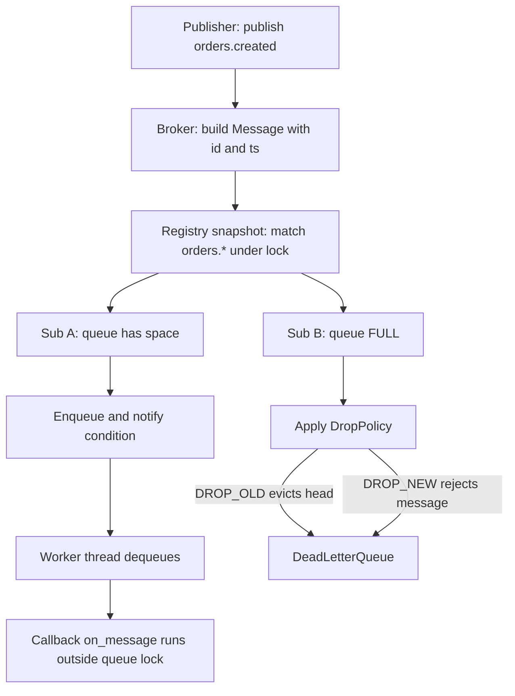

# In-Memory Pub-Sub Broker — Machine Coding Problem

## Problem Statement

Design an in-memory publish-subscribe (pub-sub) broker: publishers send messages to named topics, and subscribers receive those messages based on topic patterns. The broker must support topic creation, subscribe/unsubscribe, fan-out delivery in both synchronous and asynchronous modes, wildcard subscriptions (`orders.*`), slow-consumer isolation via bounded per-subscriber queues with a drop policy, a dead-letter list, and a thread-safe subscription registry.

This is the canonical "design an event bus" machine-coding round. Interviewers use it to check three things: whether you separate *message routing* (matching, fan-out) from *message transport* (queues, threads), whether you are honest about delivery guarantees (in-memory means at-most-once — no persistence), and whether you can defend concurrency decisions (lock granularity, snapshot iteration) under follow-up questioning.

## Requirements Gathering

### Functional Requirements

1. `create_topic(name)` — manage the topic namespace; topic names are dot-separated (`orders.created.eu`). `delete_topic` is a natural extension but not required.
2. `publish(topic, payload)` — deliver one message to **all** currently matching subscribers (fan-out, not work-queue semantics).
3. `subscribe(pattern, callback)` — register a subscriber; pattern supports `*` (exactly one segment) and `#` (one or more trailing segments, must be last), e.g. `orders.*.eu` matches `orders.created.eu`.
4. `unsubscribe(subscription)` — after it returns, no further messages are delivered to that subscriber.
5. Delivery modes per subscription: **synchronous** (publisher thread calls the callback inline) or **asynchronous** (per-subscriber bounded queue + worker thread).
6. Slow-consumer isolation: bounded per-subscriber queue with a configurable drop policy (`DROP_OLD` / `DROP_NEW`), plus a dead-letter list recording dropped or callback-failed messages with subscriber id, timestamp, and reason.
7. Message metadata: monotonic id, topic, payload, publish timestamp.

### Non-Functional Requirements

- Thread-safe: publish, subscribe, unsubscribe concurrently; publish latency independent of the slowest subscriber (isolation).
- Bounded memory: no unbounded queue growth anywhere in the system.
- Registry lock is never held while user callbacks run (deadlock/latency hazard); standard library only.

### Clarifying Questions

- "Is delivery best-effort or guaranteed? What happens on crash?" — in-memory: at-most-once, lost on crash; persistence is out of scope.
- "Can a subscriber receive messages published before it subscribed?" — no; subscriptions are point-in-time, no replay (contrast Kafka consumer offsets). One bad subscriber must not affect others — that is what isolation and the dead-letter list are for.

## Class Design

### Entity Identification

```
Nouns: Broker, Topic, Message, Subscription, WildcardPattern,
       SubscriptionQueue, DropPolicy, DeadLetterQueue, WorkerThread
Verbs: create_topic, publish, subscribe, unsubscribe, offer, drain, match
```

### Class Diagram

```
┌─────────────────────────────────────────────┐
│               InMemoryPubSub                 │
├─────────────────────────────────────────────┤
│ - topics: Set[str]                           │
│ - subscriptions: List[Subscription]          │
│ - registry_lock: RLock                       │
│ - dlq: DeadLetterQueue                       │
├─────────────────────────────────────────────┤
│ + create_topic(name)                         │
│ + subscribe(pattern, cb, opts): Subscription │
│ + unsubscribe(sub)                           │
│ + publish(topic, payload): int               │
└──────────────┬──────────────────────────────┘
               │ holds snapshot during fan-out
               ▼
┌─────────────────────────────────────────────┐
│              Subscription                    │
├─────────────────────────────────────────────┤
│ - pattern: str   - drop_policy: DropPolicy   │
│ - callback: Callable[Message]                │
│ - queue: Deque[Message]  (bounded)           │
│ - cond: Condition      - worker: Thread      │
├─────────────────────────────────────────────┤
│ + receive(msg)   + close()   - run()         │
└─────────────────────────────────────────────┘

┌──────────────────┐   ┌───────────────────────┐
│     Message      │   │   DeadLetterQueue     │
├──────────────────┤   ├───────────────────────┤
│ - id: int        │   │ - items: Deque        │
│ - topic: str     │   │ - lock: Lock          │
│ - payload: Any   │   │ + add(sub, msg, why)  │
│ - ts: float      │   │ + len(): int          │
└──────────────────┘   └───────────────────────┘

Enums: DropPolicy { DROP_OLD, DROP_NEW }
```

## Implementation (Python)

```python
import threading, time, itertools
from collections import deque
from dataclasses import dataclass
from enum import Enum
from typing import Any, Callable, List, Optional

_msg_seq = itertools.count()      # count.next is atomic under the GIL
_sub_seq = itertools.count()


@dataclass
class Message:
    topic: str
    payload: Any
    id: int
    ts: float


class DropPolicy(Enum):
    DROP_OLD = "drop_old"   # evict oldest queued message, admit the new one
    DROP_NEW = "drop_new"   # reject the new message

# ---------------- wildcard matching ----------------

def matches(pattern: str, topic: str) -> bool:
    """'x' literal; '*' exactly one segment; '#' one-or-more trailing segments."""
    p_segs = pattern.split(".")
    t_segs = topic.split(".")
    for i, seg in enumerate(p_segs):
        if seg == "#":
            if i != len(p_segs) - 1:
                raise ValueError("# must be the last segment")
            return len(t_segs) > i  # at least one trailing segment
        if i >= len(t_segs):
            return False
        if seg != "*" and seg != t_segs[i]:
            return False
    return len(p_segs) == len(t_segs)

def validate_pattern(pattern: str) -> None:
    segs = pattern.split(".")
    if not all(segs):
        raise ValueError(f"empty segment in pattern: {pattern!r}")
    if "#" in segs and segs[-1] != "#":
        raise ValueError("# must be the last segment")


# ---------------- dead-letter list ----------------

class DeadLetterQueue:
    """Bounded, thread-safe record of messages that could not be delivered."""

    def __init__(self, capacity: int = 1000):
        self._items: deque = deque(maxlen=capacity)
        self._lock = threading.Lock()

    def add(self, sub_id: int, msg: Message, reason: str) -> None:
        with self._lock:
            self._items.append((time.time(), sub_id, msg, reason))

    def __len__(self) -> int:
        with self._lock:
            return len(self._items)

# ---------------- subscription ----------------

class Subscription:
    """One subscriber binding: pattern + delivery mode + bounded queue + worker."""

    def __init__(self, pattern: str, callback: Callable[[Message], None],
                 queue_size: int = 128, drop_policy: DropPolicy = DropPolicy.DROP_OLD,
                 async_delivery: bool = True, dlq: Optional[DeadLetterQueue] = None):
        validate_pattern(pattern)
        self.pattern = pattern
        self.callback = callback
        self.queue: deque = deque()
        self.max_size = queue_size
        self.drop_policy = drop_policy
        self.async_delivery = async_delivery
        self.dlq = dlq
        self.sub_id = next(_sub_seq)
        self.delivered = 0
        self.dropped = 0
        self._cond = threading.Condition()
        self._closed = False
        self._worker = threading.Thread(
            target=self._run, name=f"sub-{self.sub_id}", daemon=True)

    def receive(self, msg: Message) -> None:
        if self.async_delivery:
            self._offer(msg)
        else:
            self._deliver_inline(msg)

    def _offer(self, msg: Message) -> bool:
        """Enqueue under the per-subscription lock; apply drop policy when full."""
        with self._cond:
            if len(self.queue) >= self.max_size:
                self.dropped += 1
                if self.drop_policy is DropPolicy.DROP_NEW:
                    if self.dlq:
                        self.dlq.add(self.sub_id, msg, "queue_full_drop_new")
                    return False
                self.queue.popleft()            # DROP_OLD: evict head
                if self.dlq:
                    self.dlq.add(self.sub_id, msg, "queue_full_drop_old_evicted_head")
            self.queue.append(msg)
            self._cond.notify()
            return True

    def _deliver_inline(self, msg: Message) -> None:
        try:
            self.callback(msg)
            self.delivered += 1
        except Exception as exc:  # one bad subscriber must not kill the fan-out loop
            self.dropped += 1
            if self.dlq:
                self.dlq.add(self.sub_id, msg, f"callback_error: {exc}")

    def _run(self) -> None:
        while True:
            with self._cond:
                while not self.queue and not self._closed:
                    self._cond.wait(timeout=0.5)
                if not self.queue:
                    if self._closed:
                        return
                    continue
                msg = self.queue.popleft()
            self._deliver_inline(msg)  # callback runs OUTSIDE the queue lock

    def start(self) -> None:
        if self.async_delivery:
            self._worker.start()

    def close(self) -> None:
        with self._cond:
            self._closed = True
            self._cond.notify()
```

### Broker

```python
# ---------------- broker ----------------

class InMemoryPubSub:
    def __init__(self, dlq_capacity: int = 1000):
        self._topics: set = set()
        self._subscriptions: List[Subscription] = []
        self._lock = threading.RLock()      # guards topics + subscription list
        self.dlq = DeadLetterQueue(dlq_capacity)

    def create_topic(self, name: str) -> None:
        if not name or not all(name.split(".")):
            raise ValueError(f"bad topic name: {name!r}")
        with self._lock:
            self._topics.add(name)

    def subscribe(self, pattern: str, callback: Callable[[Message], None],
                  queue_size: int = 128, drop_policy: DropPolicy = DropPolicy.DROP_OLD,
                  async_delivery: bool = True) -> Subscription:
        sub = Subscription(pattern, callback, queue_size, drop_policy,
                           async_delivery, self.dlq)
        with self._lock:
            self._subscriptions.append(sub)
        sub.start()
        return sub

    def unsubscribe(self, sub: Subscription) -> None:
        sub.close()                          # worker drains-or-exits first
        with self._lock:
            try:
                self._subscriptions.remove(sub)
            except ValueError:
                pass                         # idempotent unsubscribe

    def publish(self, topic: str, payload: Any) -> int:
        msg = Message(topic=topic, payload=payload,
                      id=next(_msg_seq), ts=time.time())
        with self._lock:                     # snapshot under lock...
            targets = [s for s in self._subscriptions
                       if matches(s.pattern, topic)]
        for sub in targets:                  # ...fan-out outside the lock
            sub.receive(msg)
        return msg.id
```

## Key Flows

### Publish fan-out (async subscriber)



1. `publish` assigns a monotonic id, takes the registry lock only long enough to *snapshot* matching subscriptions, then releases it.
2. Each target subscription gets the message via `receive`: async → bounded queue + notify; sync → inline callback with exception capture.
3. A full queue is resolved locally by that subscription's drop policy; the broker and other subscribers never notice. Anything dropped or failed lands in the shared dead-letter list with a reason string.

### Synchronous vs asynchronous delivery

| Aspect | Sync (inline) | Async (queue + worker) |
|---|---|---|
| Where callback runs | Publisher thread | Subscription worker thread |
| Publish latency | Sum of all callbacks | ~queue append cost |
| Backpressure | None — publisher blocked in callback | Bounded queue + drop policy |
| Failure blast radius | One raising subscriber hits the fan-out loop (caught, DLQ'd) | Contained in worker |
| Ordering per subscriber | Publish order | FIFO queue order |

## Delivery Guarantees in Memory: At-Most-Once

An in-memory broker gives at-most-once semantics by construction: a message exists only in process memory (registry snapshot → queue → callback). If the process crashes after `publish` returns but before a worker drains its queue, that message is gone — there is no log to replay. Retrying would risk duplicates, which turns the guarantee into at-least-once *only if* the receiver is idempotent; the broker itself cannot provide exactly-once without persistence plus transactional acks. State this explicitly in interviews — claiming more than the design supports is the most common failure in this round. The upgrade path (persistent log, consumer offsets, acks) is what systems like Kafka add, not an in-memory bus.

| Capability | In-memory broker (this page) | [Kafka](../backend/messaging/kafka.md) | [RabbitMQ](../backend/messaging/rabbitmq.md) |
|---|---|---|---|
| Persistence | None — process memory | Durable log on disk | Durable queues (tunable) |
| Delivery guarantee | At-most-once | At-least-once (idempotent producer → effectively-once) | At-least-once with acks |
| Replay history | No | Yes — offsets, retention window | No — consumed messages gone |
| Wildcards | `*` / `#` patterns | None — client-side filtering | Topic-exchange routing keys |
| Fan-out | Snapshot of matching subs | Consumer groups + partitions | Exchange bindings |

NATS takes the middle ground: at-most-once core with optional JetStream persistence, and subject tokens like `orders.*` — see [NATS](../backend/messaging/nats.md). The conceptual overview of the pattern itself lives in [Pub/Sub Patterns](../distributed/messaging/pubsub.md).

## Thread-Safety of the Subscription Registry

- **One RLock for the registry** (topics + subscription list); it protects `subscribe`/`unsubscribe` against each other and against the read in `publish`.
- **Snapshot iteration**: `publish` builds the target list *under* the lock, then fans out *outside* it — a subscriber whose callback blocks cannot stall other publishers or an in-progress unsubscribe. A subscribe that commits after the snapshot misses that message (documented point-in-time semantics); an unsubscribe mid-fan-out delivers at most one more buffered message before `close()` takes effect.
- **Per-subscription lock**: each `Subscription` has its own `Condition`; contention is scoped to one slow consumer, and the worker's callback runs outside that lock so enqueue never waits on a callback.
- **Java equivalent**: registry as `CopyOnWriteArrayList` gives lock-free snapshot reads at the cost of copying on each subscribe — ideal when subscriptions change rarely but publishes are hot.
- **Deadlock avoidance rule**: never call user code while holding the registry lock; never acquire two subscriptions' locks nested.

## Edge Cases

| Case | Behavior | Why |
|---|---|---|
| Publish to topic with no subscribers | No-op, returns msg id | Fan-out over empty snapshot |
| `subscribe("orders.#")` then publish `orders` | Not delivered | `#` matches one-or-more trailing segments |
| Pattern `orders.#.eu` | Rejected at subscribe time | `#` must be last segment |
| Subscriber callback raises | Caught, message → DLQ, loop continues | Isolation between subscribers |
| Queue full, `DROP_OLD` | Head evicted → DLQ, new message enqueued | Fresh data preferred for telemetry |
| Queue full, `DROP_NEW` | New message → DLQ | Preserve backlog for audit-type consumers |
| `unsubscribe` during fan-out | At most one more message, then silence | Snapshot already contains the sub |
| Message ordering | FIFO per subscriber queue, no cross-subscriber guarantee | Threads interleave deliveries |

## Test Scenarios

```python
import time
from pubsub import (InMemoryPubSub, DropPolicy, matches, Message)

def test_wildcard_matching():
    assert matches("orders.*", "orders.created")
    assert not matches("orders.*", "orders.created.eu")   # '*' is one segment
    assert matches("orders.#", "orders.created.eu")
    assert not matches("orders.#", "orders") and matches("orders.*.eu", "orders.created.eu")

def test_fan_out_all_matching_subscribers():
    bus = InMemoryPubSub()
    seen_a, seen_b = [], []
    bus.subscribe("orders.*", seen_a.append)
    bus.subscribe("orders.#", seen_b.append)
    bus.publish("orders.created", {"id": 1})
    time.sleep(0.2)                                        # let workers drain
    assert len(seen_a) == 1 and len(seen_b) == 1
    assert seen_a[0].payload == {"id": 1}

def test_unsubscribe_stops_delivery():
    bus, seen = InMemoryPubSub(), []
    sub = bus.subscribe("orders.*", seen.append)
    bus.publish("orders.created", 1)
    time.sleep(0.1)
    bus.unsubscribe(sub)
    bus.publish("orders.created", 2)
    time.sleep(0.1)
    assert len(seen) == 1

def test_slow_consumer_drops_do_not_block_publish():
    bus = InMemoryPubSub()
    def slow(msg): time.sleep(0.5)                         # worker falls behind
    sub = bus.subscribe("telemetry.*", slow, queue_size=2,
                        drop_policy=DropPolicy.DROP_OLD)
    t0 = time.perf_counter()
    for i in range(50):
        bus.publish("telemetry.cpu", i)
    assert time.perf_counter() - t0 < 0.5                  # publish never blocked
    time.sleep(1.0)
    assert sub.dropped > 0 and len(bus.dlq) > 0

def test_sync_mode_delivers_inline_and_isolates_errors():
    bus = InMemoryPubSub()
    seen, good = [], []
    def bad(msg): raise RuntimeError("boom")
    bus.subscribe("orders.*", bad, async_delivery=False)
    bus.subscribe("orders.*", good.append, async_delivery=False)
    bus.publish("orders.created", 42)
    assert len(good) == 1 and len(seen) == 0               # inline, error isolated
    assert len(bus.dlq) == 1

def test_concurrent_publish_and_subscribe():
    import threading
    bus, count = InMemoryPubSub(), []
    def publisher():
        for i in range(1000):
            bus.publish("orders.created", i)
    def late_subscriber():
        time.sleep(0.01)
        bus.subscribe("orders.#", lambda m: count.append(m.id))
    t1 = threading.Thread(target=publisher)
    t2 = threading.Thread(target=late_subscriber)
    t1.start(); t2.start(); t1.join(); t2.join()
    time.sleep(0.5)
    assert 0 < len(count) <= 1000                          # point-in-time semantics
```

## Interview Questions

1. **Why is your broker at-most-once, and what would at-least-once require?** A message lives only in volatile memory between `publish` and callback; a crash silently destroys anything queued. At-least-once requires persisting messages before acking the publisher and tracking per-subscriber consumption so undelivered messages can be redelivered after restart — that plus idempotent receivers, because redelivery after partial failure can duplicate. Exactly-once further needs deduplication keys or transactional consumption. This is precisely the gap between an event bus and a log-backed broker like Kafka.
2. **Why snapshot the subscription list instead of iterating under the lock?** Fan-out runs user callbacks; holding the registry lock during a slow or blocked callback stalls every publisher and every subscribe/unsubscribe. The snapshot bounds lock hold time to a list scan, so the registry stays contended-free. The semantic cost is a small race window: a subscriber added mid-publish misses that one message, which matches the documented point-in-time contract.
3. **How does your design isolate a slow consumer?** Each subscription owns a bounded deque plus its own condition variable and worker thread. The publisher only appends under that subscription's lock — O(1) — and the drop policy resolves a full queue locally: `DROP_OLD` evicts the head, `DROP_NEW` rejects the incoming message. Either way the event lands in the dead-letter list with a reason, so drops are observable rather than silent.
4. **Why does `#` have to be the last pattern segment?** Matching `#` mid-pattern (`orders.#.eu`) forces backtracking over an unbounded number of segments, which complicates the matcher for little practical value — real systems (MQTT, AMQP topic exchanges) restrict `#` to the tail for the same reason. The single-level `*` wildcard anywhere in the pattern keeps per-segment matching O(segments) with no backtracking.

## Key Takeaways

- Separate routing (pattern match + snapshot fan-out) from transport (per-subscription bounded queue + worker); each has independent failure modes.
- In-memory ⇒ at-most-once, no replay; say so explicitly instead of implying queue semantics.
- Registry lock guards structure only; never run callbacks under it — snapshot then fan out.
- Per-subscriber bounded queue + drop policy is the standard slow-consumer isolation; every drop must be observable (DLQ + counters).
- Wildcards: `*` = one segment, `#` = one-or-more trailing; keep `#` last to avoid backtracking.
- Kafka/RabbitMQ trade in-memory immediacy for persistence, offsets, and acks — cite them when asked "how would this scale out".

## Interview Tips

1. **State the delivery guarantee before you code** — "this is at-most-once, here's why" earns more than silently building an unbounded queue.
2. **Draw the two locks first** (registry RLock, per-subscription Condition) and explain which code runs under each; it preempts the concurrency grilling.
3. **Have the drop-policy trade-off ready**: fresh-data-first (`DROP_OLD`) for metrics, backlog-first (`DROP_NEW`) for audit trails.
4. **Know one real wildcard system by name** — NATS subject tokens or MQTT/AMQP topic keys — to anchor your grammar choice.
5. **If asked to scale out**, the answer is partitioned durable log + consumer groups (Kafka model), not more threads. To add at-least-once in-process, persist messages before dispatch and track per-subscriber ack offsets — the routing layer (matcher, drop policy, DLQ) survives untouched.

## References

- RabbitMQ topic exchange routing keys (wildcard model): https://www.rabbitmq.com/tutorials/tutorial-five-python.html
- Apache Kafka — design and delivery semantics: https://kafka.apache.org/documentation/
- MQTT v5.0 OASIS standard (topic filters, `+`/`#` wildcards): https://docs.oasis-open.org/mqtt/mqtt/v5.0/os/mqtt-v5.0-os.html
- Python `queue`/`threading` primitives used here: https://docs.python.org/3/library/queue.html and https://docs.python.org/3/library/threading.html

## Cross-References

- [Task Scheduler](./task-scheduler.md) — consumes an event bus for fire-and-forget job dispatch.
- [Logger](./logger.md) — sibling machine-coding problem with the same async-queue + worker structure.
- [Rate Limiter](./rate-limiter.md) — token-bucket design; often paired with pub-sub in system rounds.
- [Pub/Sub Patterns (theory)](../distributed/messaging/pubsub.md) — conceptual pattern overview this page implements in-memory.
- [Kafka](../backend/messaging/kafka.md) — log-backed broker semantics contrasted above.
- [RabbitMQ](../backend/messaging/rabbitmq.md) — topic-exchange wildcard routing contrasted above.
- [Messaging Systems (HLD)](../interview/system-design/hld/messaging-systems.md) — system-design-level treatment of brokers.
