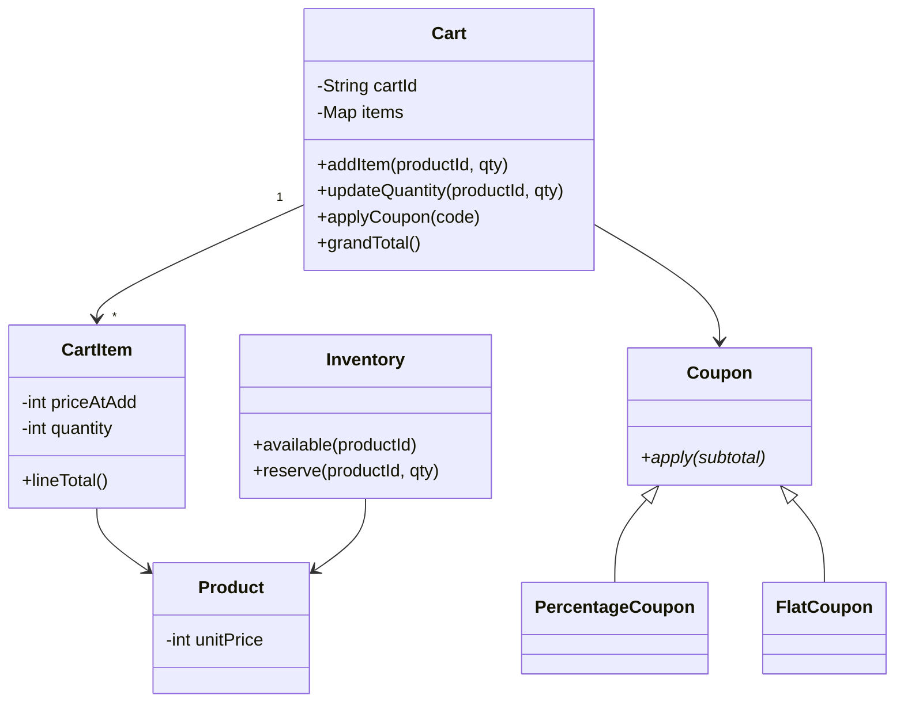

# Shopping Cart — Machine Coding Problem

## Problem Statement

Design an e-commerce shopping cart service: users add products, update quantities, apply coupons, and check out. The cart must validate quantity against inventory, snapshot prices at add-to-cart time so later price changes do not silently reprice the user's cart, expire stale carts on a TTL, and hand off cleanly to the order service at checkout — including under concurrent updates from the same user's two devices.

This problem shows up in machine-coding rounds at every consumer-internet company (Flipkart, Amazon, Myntra variants) precisely because the "simple" cart hides the four questions that separate seniors from juniors: when is the price fixed, what does quantity validation mean against a moving inventory, how do coupons compose, and which lock protects a read-modify-write on quantity. The checkout handoff then bridges LLD into the idempotency and order-system conversations.

## Requirements Gathering

### Functional Requirements

1. Products with id, name, and unit price; inventory with available stock per product
2. Add a product to the cart with a quantity — validated against available stock
3. Update quantity (set or increment), remove item; view cart with subtotal, discount, grand total
4. Price snapshot: the unit price is captured at add-to-cart; mid-cart price changes do not alter existing items
5. Coupons: percentage (with a cap) and flat (with a minimum order value); stacking policy is explicit
6. Cart expiry: a cart unused for 30 minutes becomes EXPIRED; it can be restored with revalidation
7. Checkout: reserve inventory, create an order via the order service, mark the cart CONVERTED; repeated submissions of the same checkout are idempotent

### Non-Functional Requirements

- Thread-safe quantity updates — read-modify-write on quantity must be atomic
- Cart operations < 20 ms at p99; support millions of live carts in memory/cache
- Checkout must never oversell: inventory reservation is the point of no return

### Clarifying Questions

- "Reserve stock at add-to-cart or only at checkout?" — checkout-only here; reserving on add starves other users for abandoned carts
- "What happens if the price dropped since add-to-cart?" — keep the snapshot in the cart; surface 'price dropped' as a UI hint, reprice only at checkout with user consent
- "What TTL — 30 minutes? Does activity refresh it?" — 30 minutes sliding: every mutation refreshes the clock

## Class Design

### Entity Identification

```
Nouns: CartService, Cart, CartItem, Product, Inventory, Coupon, CheckoutService
Verbs: add, update, remove, applyCoupon, expire, checkout, reserve
```

The pivotal design choice is the **price snapshot on `CartItem`**: `line_total` derives from `price_at_add × quantity`, never from the product's current price. Checkout revalidates against live prices and inventory, so the snapshot is an offer, not a liability — and the "price changed" edge case becomes a feature (show savings, ask to refresh).

### Class Relationships



### Coupon Math

| Coupon | Rule | Example (subtotal 2000) |
|---|---|---|
| Percentage | `min(subtotal × pct, cap)` | 10% capped at 150 → 150 |
| Flat | `amount if subtotal ≥ min_order else 0` | flat 250, min 1500 → 250 |
| Stack policy | percentage first on subtotal, then flat on the remainder | 2000 → 1850 → 1600 |

Compute in integer minor units and round the percentage discount down (`subtotal * pct // 100`), so rounding never favors the platform by accident. The final discount is clamped to `0 ≤ discount ≤ subtotal` — a flat coupon larger than the cart must never produce a negative total.

## Implementation

### Python Implementation

```python
import uuid
from abc import ABC, abstractmethod
from datetime import datetime, timedelta
from enum import Enum
from threading import Lock
from typing import Dict, Optional

class CartStatus(Enum):
    ACTIVE = "active"
    EXPIRED = "expired"
    CONVERTED = "converted"

class Product:
    def __init__(self, product_id: str, name: str, unit_price: int):
        self.product_id = product_id
        self.name = name
        self.unit_price = unit_price

class Inventory:
    """Central stock ledger; reserve() is the concurrency boundary."""

    def __init__(self):
        self._stock: Dict[str, int] = {}
        self._lock = Lock()

    def seed(self, product_id: str, quantity: int):
        self._stock[product_id] = quantity

    def available(self, product_id: str) -> int:
        with self._lock:
            return self._stock.get(product_id, 0)

    def reserve(self, product_id: str, quantity: int) -> bool:
        with self._lock:
            if self._stock.get(product_id, 0) < quantity:
                return False
            self._stock[product_id] -= quantity
            return True

    def release(self, product_id: str, quantity: int):
        with self._lock:
            self._stock[product_id] = (
                self._stock.get(product_id, 0) + quantity)

class Coupon(ABC):
    def __init__(self, code: str):
        self.code = code

    @abstractmethod
    def apply(self, subtotal: int) -> int:
        """Return the discount in minor units."""

class PercentageCoupon(Coupon):
    def __init__(self, code: str, percent: int, cap: int):
        super().__init__(code)
        self.percent, self.cap = percent, cap

    def apply(self, subtotal: int) -> int:
        return min(subtotal * self.percent // 100, self.cap)

class FlatCoupon(Coupon):
    def __init__(self, code: str, amount: int, min_order: int):
        super().__init__(code)
        self.amount, self.min_order = amount, min_order

    def apply(self, subtotal: int) -> int:
        return self.amount if subtotal >= self.min_order else 0

class CartItem:
    """Snapshot: repricing the catalog never mutates an open cart."""

    def __init__(self, product: Product, quantity: int):
        self.product = product
        self.quantity = quantity
        self.price_at_add = product.unit_price

    def line_total(self) -> int:
        return self.price_at_add * self.quantity

class Cart:
    def __init__(self, user_id: str, ttl_minutes: int = 30):
        self.cart_id = str(uuid.uuid4())[:8].upper()
        self.user_id = user_id
        self.items: Dict[str, CartItem] = {}   # product_id -> item
        self.coupon: Optional[Coupon] = None
        self.status = CartStatus.ACTIVE
        self.ttl = timedelta(minutes=ttl_minutes)
        self.last_active = datetime.now()
        self.lock = Lock()                      # guards items + coupon

    def touch(self):
        self.last_active = datetime.now()

    def is_expired(self) -> bool:
        return (self.status == CartStatus.ACTIVE
                and datetime.now() - self.last_active > self.ttl)

    def add_item(self, item: CartItem):
        existing = self.items.get(item.product.product_id)
        if existing:
            existing.quantity += item.quantity
        else:
            self.items[item.product.product_id] = item
        self.touch()

    def set_quantity(self, product_id: str, quantity: int):
        if quantity <= 0:
            del self.items[product_id]
        else:
            self.items[product_id].quantity = quantity
        self.touch()

    def remove_item(self, product_id: str):
        self.items.pop(product_id, None)
        self.touch()

    def subtotal(self) -> int:
        return sum(i.line_total() for i in self.items.values())

    def discount(self) -> int:
        if not self.coupon:
            return 0
        return min(self.coupon.apply(self.subtotal()), self.subtotal())

    def grand_total(self) -> int:
        return self.subtotal() - self.discount()

class CartService:
    """Entry point; owns carts, validates stock, enforces expiry."""

    def __init__(self, inventory: Inventory):
        self.inventory = inventory
        self.carts: Dict[str, Cart] = {}
        self._lock = Lock()

    def get_cart(self, user_id: str) -> Cart:
        with self._lock:
            if user_id not in self.carts:
                self.carts[user_id] = Cart(user_id)
            return self.carts[user_id]

    def _stock_check(self, product: Product, extra: int):
        have = self.inventory.available(product.product_id)
        if have < extra:
            raise ValueError(f"insufficient stock for {product.name}: "
                             f"want {extra}, have {have}")

    def add_item(self, user_id: str, product: Product, quantity: int):
        if quantity <= 0:
            raise ValueError("quantity must be positive")
        self._stock_check(product, quantity)
        cart = self.get_cart(user_id)
        with cart.lock:
            cart.add_item(CartItem(product, quantity))

    def update_quantity(self, user_id: str, product: Product, quantity: int):
        cart = self.get_cart(user_id)
        with cart.lock:
            item = cart.items.get(product.product_id)
            if not item:
                raise ValueError("product not in cart")
            self._stock_check(product, max(0, quantity - item.quantity))
            cart.set_quantity(product.product_id, quantity)

    def remove_item(self, user_id: str, product_id: str):
        cart = self.get_cart(user_id)
        with cart.lock:
            cart.remove_item(product_id)

    def apply_coupon(self, user_id: str, coupon: Coupon):
        cart = self.get_cart(user_id)
        with cart.lock:
            if not cart.items:
                raise ValueError("cannot apply coupon to empty cart")
            cart.coupon = coupon

class CheckoutService:
    def __init__(self, cart_service: CartService, inventory: Inventory):
        self.carts = cart_service
        self.inventory = inventory
        self.orders: Dict[str, dict] = {}
        self._seen = set()                      # idempotency keys
        self._lock = Lock()

    def checkout(self, user_id: str,
                 idempotency_key: Optional[str] = None) -> dict:
        with self._lock:
            if idempotency_key and idempotency_key in self._seen:
                return self.orders[idempotency_key]
            if idempotency_key:
                self._seen.add(idempotency_key)

        cart = self.carts.get_cart(user_id)
        if cart.is_expired():
            cart.status = CartStatus.EXPIRED
            raise ValueError("cart expired — restore to continue")

        with cart.lock:
            if not cart.items:
                raise ValueError("cannot check out an empty cart")
            # Re-validate price drift and stock for every line
            for item in cart.items.values():
                live = item.product.unit_price
                if live != item.price_at_add:
                    raise ValueError(f"price of {item.product.name} "
                                     f"changed: {item.price_at_add} -> {live}")
                if self.inventory.available(
                        item.product.product_id) < item.quantity:
                    raise ValueError(f"stock no longer sufficient for "
                                     f"{item.product.name}")

            reserved = []   # point of no return; rollback on failure
            for item in cart.items.values():
                if not self.inventory.reserve(item.product.product_id,
                                              item.quantity):
                    for done in reserved:
                        self.inventory.release(done.product.product_id,
                                               done.quantity)
                    raise ValueError(f"stock ran out for {item.product.name}")
                reserved.append(item)

            order = {
                "order_id": f"ORD-{str(uuid.uuid4())[:8].upper()}",
                "user_id": user_id,
                "items": [(i.product.product_id, i.quantity, i.price_at_add)
                          for i in reserved],
                "total": cart.grand_total(),
                "coupon": cart.coupon.code if cart.coupon else None,
            }
            cart.status = CartStatus.CONVERTED

        if idempotency_key:
            with self._lock:
                self.orders[idempotency_key] = order
        return order

def main():
    inventory = Inventory()
    inventory.seed("P1", 10)
    inventory.seed("P2", 3)
    keyboard = Product("P1", "Keyboard", 150000)    # paise
    monitor = Product("P2", "Monitor", 2500000)

    svc = CartService(inventory)
    checkout = CheckoutService(svc, inventory)
    svc.add_item("alice", keyboard, 2)
    svc.add_item("alice", monitor, 1)
    svc.apply_coupon("alice", PercentageCoupon("SAVE10", 10, cap=100000))
    c = svc.get_cart("alice")
    print(f"Cart total: {c.grand_total()} (subtotal {c.subtotal()}, discount {c.discount()})")

    import threading
    threads = [threading.Thread(
        target=svc.update_quantity, args=("alice", keyboard, 1 + n))
        for n in range(5)]
    for t in threads:
        t.start()
    for t in threads:
        t.join()
    print(f"After concurrent updates: total {svc.get_cart('alice').grand_total()}")

    o1 = checkout.checkout("alice", idempotency_key="Idem-001")
    o2 = checkout.checkout("alice", idempotency_key="Idem-001")
    print(f"Order: {o1['order_id']} total={o1['total']}")
    print("Idempotent retry returned same order:", o1 is o2)
    print("Keyboard stock left:", inventory.available("P1"))

if __name__ == "__main__":
    main()
```

## Key Flows

### Add-to-Cart with Price Snapshot

`add_item` validates the requested quantity against live inventory, then constructs a `CartItem` that copies `product.unit_price` into `price_at_add`. From this moment the cart is a priced offer: repricing the catalog does not mutate open carts. At checkout the service compares snapshot vs live price and fails closed — the user is asked to refresh, which re-snapshots. The alternative (always charging the live price) surprises users; always charging the stale price lets arbitrage bots hoard underpriced stock, so fail-and-confirm is the industry default.

### Checkout Handoff to the Order Service

Checkout is a four-phase pipeline: (1) validate cart state and expiry, (2) re-validate stock and prices, (3) **reserve inventory** — the point of no return where stock decrements atomically, (4) build the order and mark the cart CONVERTED. The idempotency key maps a client-generated token to the first successful order; retries return the original instead of double-charging. In production, reservation and order creation commit in one database transaction or via an outbox event to the order service — a synchronous reserve plus an async "order created" event keeps the cart service decoupled from order internals.

### Expiry (TTL)

Expiry is enforced two ways: lazily (any access checks `is_expired()` and transitions the cart) and by a background sweep every minute that transitions stale ACTIVE carts. Mutations call `touch()` to slide the window. An EXPIRED cart is restorable: the user reactivates, quantities are re-checked against inventory, and snapshots are re-priced if the catalog moved.

## Concurrency Model

### The Read-Modify-Write on Quantity

`cart.items[p].quantity += 1` is not atomic: two threads both read 3, both write 4, one increment is lost. Every mutation therefore runs under the **per-cart `Lock`** — this is the correct granularity, because a user's two devices touch only their own cart, and different carts proceed in parallel. Inventory has its own lock because it is shared across all carts; the two locks nest only during checkout and only in the order cart-lock → inventory-lock, which is deadlock-free as long as no code path takes them in the opposite order. In production the same primitives move to Redis (hash per cart, Lua script for atomic update, EXPIRE for TTL) or to database row locks with a conditional `UPDATE ... WHERE stock >= ?` for reservation.

## Edge Cases

| Edge case | Expected behavior |
|---|---|
| Add quantity > available stock | Rejected with shortfall message |
| Price changed after add | Checkout fails closed, asks user to refresh |
| Coupon applied to empty cart | Rejected |
| Discount exceeds subtotal | Clamped to subtotal — never a negative total |
| Flat coupon below min order | Discount is 0; coupon activates when subtotal grows |
| Cart idle past TTL | EXPIRED; restorable with revalidation |
| Two devices update quantity concurrently | One lock serializes; no lost increments |

## Test Scenarios

1. **Happy path** — add 2 keyboards + 1 monitor, apply 10% coupon (capped), totals match hand-computed math
2. **Stock gate + snapshot** — request 5 monitors when 3 exist (raises); add at 1500, reprice to 1200, totals still show 1500 lines
3. **Coupon cap** — 10% of 2,000,000 paise with cap 100,000 discounts exactly 100,000
4. **Coupon clamp** — flat 3,000 coupon on a 2,000 cart → discount 2,000, total 0
5. **Concurrent increments** — 5 threads bump quantity; final quantity equals the largest requested, with no partial writes
6. **Expiry** — fabricate `last_active` 31 minutes old; cart reports EXPIRED and checkout refuses
7. **Idempotency + converted guard** — two checkouts with the same key return the identical order object; stock decremented once

## Complexity Analysis

| Operation | Complexity | Notes |
|---|---|---|
| Add / update / remove | O(1) | Dict lookup by product id, under cart lock |
| Subtotal, checkout validation | O(k) | k = distinct items; one inventory check per line |
| Checkout reservation | O(k) | One locked reserve per line |
| Expiry sweep | O(C) | C = live carts; runs every minute |

Checkout is O(k) with k ≈ 10–50, so the entire handoff is microseconds of CPU — the real latency lives in the network calls to inventory and order services, which is why the reservation happens once, late, and atomically.

## Extensions and Discussion Points

### 1. Coupon Engine

Generalize `Coupon` into a rule tree: conditions (user segment, category exclusions, payment method), benefit (percent/flat/BOGO), and an explicit composition policy (best-one vs ordered stack with caps). The stacking order matters — percentage-then-flat and flat-then-percentage give different totals, so the policy must be a documented decision, not an accident. A price-change event consumer that diffs against open cart snapshots and pushes "price dropped" notifications is the natural sibling feature here.

### 2. Reserving at Add-to-Cart (Soft Holds)

Some domains (flash sales) reserve stock when the item is added, with a 10-minute hold. That converts the cart into a lease manager — the same TTL machinery, pointed at inventory instead of cart liveness — and trades "no oversell ever" against "carts full of phantom stock."

## Interview Tips

1. **Say "snapshot" early** — fixing price at add-to-cart and revalidating at checkout is the single highest-signal decision in this problem
2. **Money in minor units** — floats for currency is an instant credibility hit; integers or Decimal, rounding down on percentage discounts
3. **Know where each lock lives** — cart lock for quantity RMW, inventory lock for stock, fixed nesting order; then map both onto Redis/DB primitives
4. **Idempotency is the checkout punchline** — client token, first-write-wins, retries return the original order
5. **Expiry = lazy check + sweep, and fail closed at checkout** — one Timer per cart is the anti-pattern; stock or price drift aborts before reservation

## References

- [Python `threading` — locks for the cart and inventory critical sections](https://docs.python.org/3/library/threading.html)
- [Redis EXPIRE — TTL machinery for production carts](https://redis.io/docs/latest/commands/expire/)
- [Redis SET — NX pattern behind reservation-style atomic claims](https://redis.io/docs/latest/commands/set/)

## Cross-References

- [Vending Machine](./vending-machine.md) — inventory-dispensing sibling with a state machine focus
- [Order Management (HLD)](../interview/system-design/real-world/order-management.md) — what the checkout handoff feeds into
- [API Idempotency](../backend/api/api-idempotency.md) — the idempotency-key contract at scale
- [LLD: Concurrency Design](../interview/system-design/lld/concurrency-design.md) — locking and lock-free strategies in depth
