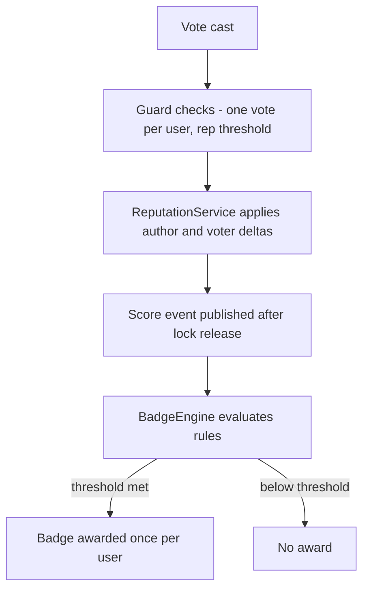

# Stack Overflow Q&A Platform — Machine Coding Problem

## Problem Statement

Design the core backend of a Stack Overflow-style Q&A platform as an in-memory service. Users post questions tagged with topics, other users answer and comment, and the community curates content through up/down voting with reputation consequences, one accepted answer per question, moderation (close/duplicate/reopen), automatic badges, and a full edit history with rollback. The interview version tests entity modelling, idempotent bookkeeping under concurrency, and in-memory indexing — not web plumbing.

## Requirements Gathering

### Functional Requirements

1. Users post questions (title, body, 1–5 tags) and answers attached to exactly one question; one-level comments attach to both.
2. Up/down votes on questions and answers: one active vote per user per post; re-clicking the same vote is a no-op; switching a vote reverses old reputation deltas before applying new ones.
3. Reputation ledger per user driven by the delta table below; every change is traceable to a (user, delta, reason, post) event.
4. Accepted answer: only the question author can accept exactly one answer; acceptance is switchable and reverses the previous reward.
5. Tag index: in-memory inverted index mapping each tag to question ids for O(1) tag search; keyword search over title/body is a linear-scan follow-up.
6. Moderation: a question can be closed with a reason (DUPLICATE, OFF_TOPIC, UNCLEAR, OPINION_BASED); a DUPLICATE close must reference the target question; closed questions reject new answers until reopened.
7. Badges awarded automatically from score events (e.g. "Nice Answer" at 10 upvotes), at most once per user per badge.
8. Every edit appends an immutable revision (version, editor, new body, previous body); rollback to any version is supported.

### Non-Functional Requirements

- Thread-safe voting and reputation updates; concurrent identical votes must never double-apply reputation.
- O(1) average lookups for votes, reputation balance, and tag membership.
- Badge rules must be pluggable event listeners — adding a badge must not touch voting code (open/closed principle).
- Single-node, fully in-memory for the interview; the scale-out path (Postgres, Kafka, Elasticsearch) is a follow-up discussion.

### Clarifying Questions

- "What are the exact reputation deltas?" — pin the table with the interviewer before coding; the numbers matter less than getting the bookkeeping right.
- "Can users vote on their own posts or accept their own answers?" — self-votes are rejected; self-accept grants no rep on real Stack Overflow.
- "Can reputation go negative?" — yes; real Stack Overflow floors the displayed value at 1.
- "Are badges retro-computed or event-driven?" — event-driven here; retroactive recomputation is a batch follow-up.

## Class Design

### Entity Identification

```
Nouns: User, Question, Answer, Comment, Vote, VoteType, Tag, TagIndex,
       CloseReason, ReputationEvent, ReputationService, BadgeRule,
       BadgeEngine, Revision, QASystem
```

### Class Diagram

```
┌──────────────────────────┐
│        QASystem           │
├──────────────────────────┤
│ - questions: Map<id, Q>   │
│ - answers: Map<id, A>     │
│ - tagIndex: TagIndex      │
│ - reputation: RepService  │
│ - badges: BadgeEngine     │
├──────────────────────────┤
│ + postQuestion/postAnswer │
│ + vote(user, post, type)  │
│ + acceptAnswer(asker, a)  │
│ + close / reopen          │
│ + searchByTag(tag)        │
└────────────┬─────────────┘
       ┌─────┴──────┐
       ▼            ▼
┌────────────────┐ ┌────────────────┐
│ Question(Post)  │ │ Answer(Post)   │
│ - title, tags   │◄│ - question      │
│ - answers list  │ │ - isAccepted    │
│ - acceptedId    │ └────────────────┘
│ - closed/reason │
│ - duplicateOf   │ ┌────────────────┐
└────────────────┘ │ Post (base)     │
┌────────────────┐ │ - id,author,body│
│ ReputationSvc   │ │ - votes map     │
│ - balances      │ │ - comments,revs │
│ - ledger        │ │ + score/edit/   │
│ + apply/balance │ │   rollback      │
└────────────────┘ └────────────────┘
┌────────────────┐ ┌────────────────┐
│ TagIndex        │ │ BadgeEngine     │
│ - postings map  │ │ - RULES         │
│ + searchByTag   │ │ + onEvent       │
└────────────────┘ └────────────────┘
```

### Reputation Rules

| Action | Author rep | Voter rep | Notes |
|---|---|---|---|
| Question upvoted | +5 | 0 | |
| Question downvoted | −2 | −1 | voter pays, discouraging drive-by downvotes |
| Answer upvoted | +10 | 0 | answers are worth double — they solve problems |
| Answer downvoted | −2 | −1 | |
| Answer accepted | +15 | 0 | granted by the asker, one answer at a time |
| Vote removed or switched | reverse old deltas | reverse old deltas | keeps the ledger exactly consistent |
| Self-vote / self-accept | rejected | rejected | guarded at the service boundary |

Privilege thresholds modelled from real Stack Overflow: rep ≥ 15 to vote, ≥ 50 to comment.

### Vote → Reputation → Badge Pipeline



## Implementation

### Python Implementation

```python
from enum import Enum
from datetime import datetime
from threading import Lock
from typing import Dict, List, Optional, Set, Tuple
import uuid


class VoteType(Enum):
    UP = 1
    DOWN = -1


class CloseReason(Enum):
    DUPLICATE = "duplicate"
    OFF_TOPIC = "off_topic"
    UNCLEAR = "unclear"
    OPINION_BASED = "opinion_based"


REP_TABLE = {                                  # (kind, vote) -> (author, voter)
    ("question", VoteType.UP): (5, 0),
    ("question", VoteType.DOWN): (-2, -1),
    ("answer", VoteType.UP): (10, 0),
    ("answer", VoteType.DOWN): (-2, -1),
}
ACCEPT_REP = 15
MIN_REP_TO_VOTE = 15


class ReputationEvent:
    def __init__(self, user: str, delta: int, reason: str, post_id: str):
        self.user, self.delta, self.reason = user, delta, reason
        self.post_id, self.at = post_id, datetime.now()


class ReputationService:
    """Ledger of every rep change; balances are O(1) lookups."""

    def __init__(self):
        self._balances: Dict[str, int] = {}
        self._ledger: List[ReputationEvent] = []
        self._lock = Lock()

    def apply(self, user: str, delta: int, reason: str, post_id: str):
        with self._lock:
            self._balances[user] = self._balances.get(user, 0) + delta
            self._ledger.append(ReputationEvent(user, delta, reason, post_id))

    def balance(self, user: str) -> int:
        return self._balances.get(user, 0)


class Comment:
    def __init__(self, author: str, text: str):
        self.id = uuid.uuid4().hex[:8]
        self.author, self.text = author, text
        self.created_at = datetime.now()


class Revision:
    def __init__(self, version: int, editor: str, body: str, previous: str):
        self.version, self.editor, self.body = version, editor, body
        self.previous_body, self.edited_at = previous, datetime.now()


class Post:
    def __init__(self, author: str, body: str):
        self.id = uuid.uuid4().hex[:8]
        self.author, self.body = author, body
        self.created_at = datetime.now()
        self.votes: Dict[str, VoteType] = {}       # voter -> active vote
        self.comments: List[Comment] = []
        self.revisions: List[Revision] = []
        self._lock = Lock()

    @property
    def kind(self) -> str:
        return "answer" if isinstance(self, Answer) else "question"

    @property
    def score(self) -> int:
        return sum(v.value for v in self.votes.values())

    def edit(self, editor: str, new_body: str):
        with self._lock:
            version = len(self.revisions) + 1
            self.revisions.append(Revision(version, editor, new_body, self.body))
            self.body = new_body

    def rollback(self, version: int):
        with self._lock:
            rev = self.revisions[version - 1]
            if rev.version != version:
                raise ValueError(f"No revision {version}")
            self.body = rev.previous_body


class Question(Post):
    def __init__(self, author: str, title: str, body: str, tags: List[str]):
        super().__init__(author, body)
        self.title = title
        self.tags = [t.lower() for t in tags]
        self.answers: List["Answer"] = []
        self.accepted_answer_id: Optional[str] = None
        self.closed = False
        self.close_reason: Optional[CloseReason] = None
        self.duplicate_of: Optional["Question"] = None


class Answer(Post):
    def __init__(self, author: str, body: str, question: Question):
        super().__init__(author, body)
        self.question = question
        self.is_accepted = False


class TagIndex:
    """Inverted index: tag -> question ids. O(1) average tag lookup."""

    def __init__(self):
        self._postings: Dict[str, Set[str]] = {}

    def add(self, q: Question):
        for tag in q.tags:
            self._postings.setdefault(tag, set()).add(q.id)

    def search_by_tag(self, tag: str) -> Set[str]:
        return set(self._postings.get(tag.lower(), set()))


class BadgeRule:
    def __init__(self, name: str, event_type: str, threshold: int):
        self.name, self.event_type, self.threshold = name, event_type, threshold


class BadgeEngine:
    """Event listener: each badge fires at most once per user."""

    RULES = [
        BadgeRule("Nice Question", "question_score", 10),
        BadgeRule("Nice Answer", "answer_score", 10),
        BadgeRule("Popular Question", "question_score", 50),
    ]

    def __init__(self):
        self.awarded: Dict[Tuple[str, str], datetime] = {}
        self._lock = Lock()

    def on_event(self, event_type: str, user: str, value: int):
        for rule in self.RULES:
            if rule.event_type != event_type or value < rule.threshold:
                continue
            with self._lock:
                self.awarded.setdefault((rule.name, user), datetime.now())


class QASystem:
    def __init__(self):
        self.questions: Dict[str, Question] = {}
        self.answers: Dict[str, Answer] = {}
        self.tag_index = TagIndex()
        self.reputation = ReputationService()
        self.badges = BadgeEngine()

    def post_question(self, author, title, body, tags) -> Question:
        if not 1 <= len(tags) <= 5:
            raise ValueError("A question needs 1-5 tags")
        q = Question(author, title, body, tags)
        self.questions[q.id] = q
        self.tag_index.add(q)
        return q

    def post_answer(self, author, question_id, body) -> Answer:
        q = self.questions[question_id]
        if q.closed:
            raise ValueError("Question is closed to new answers")
        a = Answer(author, body, q)
        q.answers.append(a)
        self.answers[a.id] = a
        return a

    def vote(self, voter: str, post: Post, vtype: VoteType):
        if voter == post.author:
            raise ValueError("Cannot vote on your own post")
        if self.reputation.balance(voter) < MIN_REP_TO_VOTE:
            raise ValueError("Insufficient reputation to vote")
        kind = post.kind
        with post._lock:                      # lock order: post -> reputation
            old = post.votes.get(voter)
            if old == vtype:
                return                        # idempotent: never double-apply
            if old is not None:               # switch: reverse old deltas
                a_delta, v_delta = REP_TABLE[(kind, old)]
                self.reputation.apply(post.author, -a_delta, f"undo {old.name}", post.id)
                if v_delta:
                    self.reputation.apply(voter, -v_delta, "vote switched", post.id)
            post.votes[voter] = vtype
            a_delta, v_delta = REP_TABLE[(kind, vtype)]
            self.reputation.apply(post.author, a_delta, f"{vtype.name} vote", post.id)
            if v_delta:
                self.reputation.apply(voter, v_delta, "downvote cast", post.id)
        # publish outside the lock; a stale score only delays a badge, never corrupts rep
        self.badges.on_event(f"{kind}_score", post.author, post.score)

    def accept_answer(self, asker: str, answer: Answer):
        q = answer.question
        if asker != q.author:
            raise ValueError("Only the question author can accept")
        if q.accepted_answer_id == answer.id:
            return                            # idempotent re-accept
        if q.accepted_answer_id:
            prev = self.answers[q.accepted_answer_id]
            prev.is_accepted = False
            self.reputation.apply(prev.author, -ACCEPT_REP, "acceptance removed", prev.id)
        q.accepted_answer_id = answer.id
        answer.is_accepted = True
        self.reputation.apply(answer.author, ACCEPT_REP, "answer accepted", answer.id)

    def close(self, question: Question, reason: CloseReason,
              duplicate_of: Optional[Question] = None):
        if reason == CloseReason.DUPLICATE and duplicate_of is None:
            raise ValueError("Duplicate close needs a target question")
        question.closed, question.close_reason = True, reason
        question.duplicate_of = duplicate_of

    def reopen(self, question: Question):
        question.closed, question.close_reason = False, None
        question.duplicate_of = None

    def search_by_tag(self, tag: str) -> List[Question]:
        ids = self.tag_index.search_by_tag(tag)
        qs = [self.questions[i] for i in ids]
        return sorted(qs, key=lambda q: q.score, reverse=True)


def main():
    qa = QASystem()
    for u in ("alice", "bob", "carol", "dave", "erin"):
        qa.reputation.apply(u, 100, "seed", "-")

    q = qa.post_question("alice", "How does the Python GIL work?",
                         "Does the GIL prevent all parallelism?",
                         ["python", "concurrency"])
    a1 = qa.post_answer("bob", q.id, "It serializes bytecode; IO releases it.")
    qa.post_answer("carol", q.id, "Use multiprocessing for CPU-bound work.")

    qa.vote("carol", a1, VoteType.UP)
    qa.vote("dave", a1, VoteType.UP)
    qa.vote("dave", a1, VoteType.UP)          # idempotent no-op
    qa.vote("erin", q, VoteType.UP)
    qa.accept_answer("alice", a1)
    a1.edit("bob", "The GIL serializes bytecode execution; IO releases it.")
    a1.rollback(1)                            # back to the original body

    dup = qa.post_question("dave", "GIL parallelism?", "Same question again",
                           ["python"])
    qa.close(dup, CloseReason.DUPLICATE, duplicate_of=q)
    print([x.title for x in qa.search_by_tag("python")])
    print("bob rep:", qa.reputation.balance("bob"))
    qa.badges.on_event("answer_score", "bob", 12)   # e.g. from a viral answer
    print("badges:", sorted(k for k in qa.badges.awarded))


if __name__ == "__main__":
    main()
```

## Key Flows

### Casting a vote

The service checks self-vote and privilege guards, then takes the per-post lock. Under the lock it either no-ops (same vote), reverses old deltas then applies new ones (switch), or applies fresh deltas (new vote) — so the ledger is a pure function of the current vote map. The score event fires after lock release so badge checks never extend the critical section; a momentarily stale score only delays a badge, never corrupts reputation.

### Accepting an answer

Acceptance is a two-phase micro-transaction: if another answer was accepted, its reward is reversed and its flag cleared, then the new answer is flagged and rewarded. Re-accepting the same answer is an idempotent no-op, and non-authors are rejected. This mirrors Stack Overflow's invariant that at most one answer per question carries the +15 award.

### Close as duplicate

Closing stores the reason and, for DUPLICATE, a reference to the target question — enabling "view exact duplicates" navigation. Closing freezes new answers but preserves existing votes and comments; reopening clears all three fields. In production this would be vote-driven (5 close votes, 5 reopen votes) rather than a single moderator action.

## Edge Cases

| Case | Expected behavior |
|---|---|
| Concurrent identical upvotes from one user | Per-post lock serializes; second call is a no-op, rep applied once |
| Vote switch UP → DOWN | Old author/voter deltas reversed before new ones applied |
| Self-vote or self-accept | Rejected with a descriptive error |
| DUPLICATE close without a target question | Rejected at the service boundary |
| Answer posted to a closed question | Rejected until reopen |
| Badge threshold crossed twice | Awarded exactly once per user (per-rule key) |
| Rollback of a nonexistent revision | IndexError/ValueError raised |
| User below 15 rep voting | Rejected with "insufficient reputation" |

## Test Scenarios

```python
def test_vote_idempotent_and_switchable():
    qa = QASystem()
    qa.reputation.apply("alice", 100, "seed", "-")
    qa.reputation.apply("bob", 100, "seed", "-")
    q = qa.post_question("alice", "t", "b", ["x"])
    a = qa.post_answer("bob", q.id, "ans")
    qa.vote("alice", a, VoteType.UP)
    qa.vote("alice", a, VoteType.UP)              # no-op
    assert qa.reputation.balance("bob") == 110
    qa.vote("alice", a, VoteType.DOWN)            # switch: +10 reversed, -2 applied
    assert qa.reputation.balance("bob") == 98
    assert qa.reputation.balance("alice") == 99   # downvoter penalty

def test_accept_switch_reverses_reward():
    qa = QASystem()
    q = qa.post_question("alice", "t", "b", ["x"])
    a1, a2 = qa.post_answer("bob", q.id, "1"), qa.post_answer("carol", q.id, "2")
    qa.accept_answer("alice", a1)
    qa.accept_answer("alice", a1)                 # idempotent
    qa.accept_answer("alice", a2)                 # switch
    assert qa.reputation.balance("bob") == 0
    assert qa.reputation.balance("carol") == 15
    assert a2.is_accepted and not a1.is_accepted
```

## Interview Tips

1. **Pin the reputation table first** — interviewers grade the bookkeeping (reversal on switch/undo) far more than feature count.
2. **Idempotency is the hidden requirement** — re-clicking a vote must never double-apply rep; state it explicitly and test it.
3. **Badges are the observer pattern** — if you hard-code badge logic inside `vote()`, you fail the extensibility probe; publish events, subscribe rules.
4. **Lock ordering matters** — always post lock → reputation lock, never the reverse, or two concurrent votes can deadlock.
5. **Tag index is a hash-map inverted index** — say what changes at scale: Elasticsearch for text, Postgres GIN indexes for tags, Kafka for vote fan-out.
6. **Mention real Stack Overflow numbers** — +10/−2/−1 vote deltas, +15 accept, 15-rep vote privilege, 1-rep display floor; grounding design in the real system reads as depth.

## References

- Stack Overflow (product being modelled): https://stackoverflow.com
- Martin Fowler, "Event Sourcing" — the pattern behind the reputation ledger and edit history: https://martinfowler.com/eaaDev/EventSourcing.html
- Gamma, Helm, Johnson, Vlissides — *Design Patterns* (Observer pattern for the badge engine), Addison-Wesley, 1994.

## Cross-References

- [Leaderboard — Machine Coding](./leaderboard.md) — same score-ranked query pattern used for sorting questions by votes
- [Rate Limiter — Machine Coding](./rate-limiter.md) — throttling vote/comment spam and privilege abuse
- [Splitwise — Machine Coding](./splitwise.md) — another ledger-heavy design where idempotent balance updates matter
- [Design Patterns](../interview/system-design/lld/design-patterns.md) — observer pattern behind the badge engine
- [Concurrency Design](../interview/system-design/lld/concurrency-design.md) — lock ordering and idempotent concurrent updates
