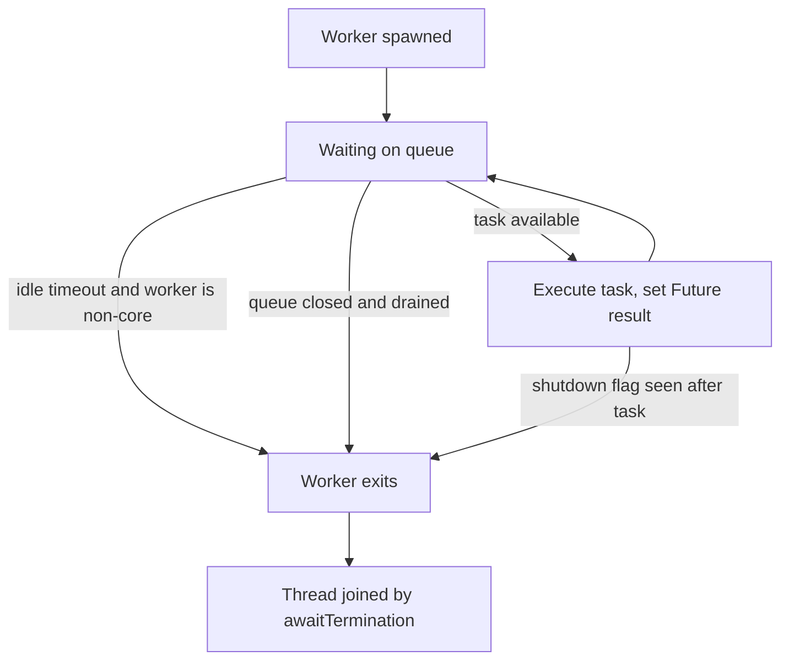

# Thread Pool — Machine Coding Problem (Build Your Own)

## Problem Statement

Build a thread pool from scratch — no `ThreadPoolExecutor`, no `concurrent.futures`. The pool needs core-vs-max worker semantics, a bounded blocking task queue, pluggable rejection policies (Abort / CallerRuns / Discard), graceful and immediate shutdown with `await_termination`, idle-timeout reaping of non-core workers, and Future-style result propagation. The follow-up discussion always covers queue sizing with Little's law and the classic pool-induced deadlocks, so those are designed in rather than bolted on.

## Requirements Gathering

### Functional Requirements

1. `ThreadPool(core, max_workers, queue_size, idle_timeout, policy)` constructor with `0 < core <= max_workers`.
2. `submit(fn, *args) -> Future`; the Future supports `get(timeout)`, `done()`, `cancel()` (pending tasks only), and exception propagation.
3. Bounded blocking queue built on condition variables: producers reject when full, consumers block when empty — no busy-waiting.
4. Java-style scaling: new workers spawn while `live < core`; beyond core, tasks queue; a non-core worker spawns only when the queue is FULL and `live < max`; the submitted task goes to the new worker as its first task (bypassing the full queue).
5. Non-core ("temporary") workers exit after `idle_timeout` of waiting, but only while `live > core`.
6. Rejection when saturated: ABORT raises, CALLER_RUNS executes the task in the submitting thread, DISCARD returns a cancelled Future.
7. `shutdown()`: stop accepting new work, let queued tasks drain, then exit all workers. `shutdown_now()`: stop accepting, cancel all queued tasks, finish in-flight tasks only.
8. `await_termination(timeout)`: join every worker with a deadline; return whether all exited.

### Non-Functional Requirements

- No lost tasks: a task is either executed, or its Future is explicitly cancelled or rejected — never silently dropped.
- Worker count never exceeds `max` even under a thundering herd of submitters (spawn decision is atomic with the live-count check).
- Liveness on shutdown: closing the queue wakes every blocked worker via `notify_all`, so no thread parks forever.
- O(1) submit and O(1) task handoff; memory bounded by queue capacity.

### Clarifying Questions

- "Does the pool grow past core when workers are busy or when the queue is full?" — Java semantics: only when the queue is full; this is the most common misreading.
- "Should CALLER_RUNS block the submitter for the whole task duration?" — yes; that blocking is the backpressure mechanism.
- "Can Python workers be interrupted mid-task?" — no true interruption without cooperative flags; model Java's semantics and document the difference.
- "Hand-rolled Future or `concurrent.futures.Future`?" — hand-rolled; the synchronization inside it is the exercise.

## Class Design

### Entity Identification

```
Nouns: ThreadPool, Worker, BoundedBlockingQueue, Future,
       RejectionPolicy, QueueFull, PoolClosed
```

### Class Diagram

```
┌─────────────────────────────┐
│        ThreadPool            │
├─────────────────────────────┤
│ - core, max: int             │
│ - idleTimeout: float         │
│ - policy: RejectionPolicy    │
│ - queue: BoundedBlockingQueue│
│ - stateLock: RLock           │
│ - liveWorkers: int           │
│ - shutdown: bool             │
│ - workers: List<Worker>      │
├─────────────────────────────┤
│ + submit(fn, args) : Future  │
│ + shutdown()                 │
│ + shutdownNow()              │
│ + awaitTermination(t): bool  │
│ - spawn(temporary, firstTask)│
│ - reject(fn, args, future)   │
└──────────┬──────────────────┘
           │ owns
           ▼
┌─────────────────────────────┐      ┌──────────────────────────┐
│      Worker (Thread)         │      │  BoundedBlockingQueue    │
├─────────────────────────────┤      ├──────────────────────────┤
│ - pool: ThreadPool           │      │ - items: deque           │
│ - temporary: bool            │ uses │ - cap: int               │
│ - firstTask: Task?           │      │ - lock + notFull/notEmpty│
├─────────────────────────────┤      ├──────────────────────────┤
│ + run(): get task -> execute │      │ + tryPut(item)           │
│   loop; exit on shutdown or  │      │ + get(timeout) : Task?   │
│   idle timeout above core    │      │ + drain() / close()      │
└─────────────────────────────┘      └──────────────────────────┘

┌─────────────────────────────┐      ┌──────────────────────────┐
│         Future               │      │    RejectionPolicy       │
├─────────────────────────────┤      ├──────────────────────────┤
│ - done: Event                │      │  ABORT | CALLER_RUNS |   │
│ - result / exception         │      │  DISCARD                 │
│ - cancelled: bool            │      └──────────────────────────┘
├─────────────────────────────┤
│ + get(timeout) / done()      │
│ + cancel()                   │
└─────────────────────────────┘
```

### Worker Lifecycle



## Implementation

### Python Implementation

```python
import itertools
import threading
import time
from enum import Enum
from typing import Any, Callable, List, Optional, Tuple


class QueueFull(Exception):
    """Raised by ABORT policy when the pool is saturated."""


class PoolClosed(Exception):
    """Raised when submitting to a pool that has begun shutdown."""


class RejectionPolicy(Enum):
    ABORT = "abort"
    CALLER_RUNS = "caller_runs"
    DISCARD = "discard"


class Future:
    """Minimal result handle: Event-based completion, exception passthrough."""

    def __init__(self):
        self._done = threading.Event()
        self._result: Any = None
        self._exception: Optional[BaseException] = None
        self.cancelled = False

    def set_result(self, value: Any):
        self._result = value
        self._done.set()

    def set_exception(self, exc: BaseException):
        self._exception = exc
        self._done.set()

    def cancel(self) -> bool:
        if self._done.is_set():
            return False
        self.cancelled = True
        self._done.set()
        return True

    def done(self) -> bool:
        return self._done.is_set()

    def get(self, timeout: Optional[float] = None) -> Any:
        if not self._done.wait(timeout):
            raise TimeoutError("result not ready in time")
        if self.cancelled:
            raise PoolClosed("task was cancelled before running")
        if self._exception is not None:
            raise self._exception
        return self._result


class BoundedBlockingQueue:
    """Fixed-capacity blocking queue on one lock + two conditions."""

    def __init__(self, capacity: int):
        self._items: List[Tuple] = []
        self._cap = capacity
        self._lock = threading.Lock()
        self._not_full = threading.Condition(self._lock)
        self._not_empty = threading.Condition(self._lock)
        self._closed = False

    def try_put(self, item) -> None:
        """Non-blocking insert; raises QueueFull instead of blocking."""
        with self._not_full:
            if self._closed:
                raise PoolClosed("queue is closed")
            if len(self._items) >= self._cap:
                raise QueueFull(f"queue full at capacity {self._cap}")
            self._items.append(item)
            self._not_empty.notify()

    def get(self, timeout: Optional[float] = None):
        """Pop one item, or None on timeout / closed-and-drained."""
        with self._not_empty:
            ready = self._not_empty.wait_for(
                lambda: self._items or self._closed, timeout)
            if not ready and not self._items:
                return None                      # idle timeout signal
            if not self._items:
                return None                      # closed and fully drained
            item = self._items.pop(0)
            self._not_full.notify()
            return item

    def drain(self) -> List[Tuple]:
        with self._not_full:
            items, self._items = self._items, []
            self._not_full.notify_all()
            return items

    def close(self) -> None:
        with self._not_full:
            self._closed = True
            self._not_empty.notify_all()         # wake blocked consumers
            self._not_full.notify_all()


class Worker(threading.Thread):
    _ids = itertools.count()

    def __init__(self, pool: "ThreadPool", temporary: bool,
                 first_task: Optional[Tuple] = None):
        super().__init__(name=f"pool-worker-{next(Worker._ids)}", daemon=True)
        self.pool = pool
        self.temporary = temporary
        self.first_task = first_task

    @staticmethod
    def _execute(task: Tuple):
        fn, args, future = task
        if future.cancelled:                     # cancelled while queued
            return
        try:
            future.set_result(fn(*args))
        except Exception as exc:                 # task failure -> Future, not thread
            future.set_exception(exc)

    def run(self):
        first, self.first_task = self.first_task, None
        if first is not None:
            self._execute(first)                 # Java-style bypass of a full queue
        while True:
            timeout = self.pool.idle_timeout if self.temporary else None
            task = self.pool._queue.get(timeout=timeout)
            if task is None:
                with self.pool._state_lock:      # decide exit under the state lock
                    shutdown = self.pool._shutdown
                    reaped = (self.temporary
                              and self.pool._live_workers > self.pool.core)
                    if shutdown or reaped:
                        self.pool._live_workers -= 1
                        return
                continue                         # core worker keeps waiting
            self._execute(task)


class ThreadPool:
    def __init__(self, core: int = 2, max_workers: int = 4, queue_size: int = 10,
                 idle_timeout: float = 2.0,
                 policy: RejectionPolicy = RejectionPolicy.ABORT):
        if not 0 < core <= max_workers:
            raise ValueError("require 0 < core <= max_workers")
        self.core, self.max = core, max_workers
        self.idle_timeout = idle_timeout
        self.policy = policy
        self._queue = BoundedBlockingQueue(queue_size)
        self._state_lock = threading.RLock()     # RLock: spawn() nests under submit
        self._live_workers = 0
        self._shutdown = False
        self._workers: List[Worker] = []
        self.completed = 0

    @property
    def live_workers(self) -> int:
        return self._live_workers

    def _spawn(self, temporary: bool, first_task: Optional[Tuple] = None):
        w = Worker(self, temporary, first_task)
        self._live_workers += 1                  # atomic with the caller's check
        self._workers.append(w)
        w.start()

    def submit(self, fn: Callable, *args) -> Future:
        """Java ThreadPoolExecutor.execute() ordering:
        core worker -> queue -> non-core worker -> reject."""
        future = Future()
        with self._state_lock:
            if self._shutdown:
                raise PoolClosed("submit after shutdown")
            if self._live_workers < self.core:
                self._spawn(temporary=False)
                self._queue.try_put((fn, args, future))
                return future
        try:
            self._queue.try_put((fn, args, future))
            return future
        except QueueFull:
            pass
        with self._state_lock:
            if self._shutdown:
                raise PoolClosed("submit after shutdown")
            if self._live_workers < self.max:
                self._spawn(temporary=True, first_task=(fn, args, future))
                return future
        return self._reject(fn, args, future)

    def _reject(self, fn, args, future) -> Future:
        if self.policy is RejectionPolicy.DISCARD:
            future.cancel()
            return future
        if self.policy is RejectionPolicy.CALLER_RUNS:
            try:                                 # backpressure: submitter pays
                future.set_result(fn(*args))
            except Exception as exc:
                future.set_exception(exc)
            return future
        raise QueueFull("queue full and max workers busy")   # ABORT

    def shutdown(self):
        """Graceful: stop intake, drain queued tasks, then workers exit."""
        with self._state_lock:
            self._shutdown = True
        self._queue.close()

    def shutdown_now(self):
        """Immediate: stop intake, cancel queued tasks, in-flight tasks finish."""
        with self._state_lock:
            self._shutdown = True
        for fn, args, future in self._queue.drain():
            future.cancel()
        self._queue.close()

    def await_termination(self, timeout: Optional[float] = None) -> bool:
        deadline = None if timeout is None else time.monotonic() + timeout
        for w in self._workers:
            remaining = None
            if deadline is not None:
                remaining = max(0.0, deadline - time.monotonic())
            w.join(remaining)
        return all(not w.is_alive() for w in self._workers)


def main():
    tp = ThreadPool(core=2, max_workers=4, queue_size=2,
                    idle_timeout=0.3, policy=RejectionPolicy.ABORT)
    futures = [tp.submit(lambda n=n: n * n) for n in range(6)]
    print("squares:", [f.get(timeout=2) for f in futures])

    tp2 = ThreadPool(core=1, max_workers=1, queue_size=1,
                     idle_timeout=0.3, policy=RejectionPolicy.CALLER_RUNS)
    gate = threading.Event()
    tp2.submit(gate.wait)                        # occupies the only worker
    tp2.submit(gate.wait)                        # fills the single queue slot
    f = tp2.submit(threading.current_thread)     # rejected -> runs in main thread
    gate.set()
    print("caller-runs executed in:", f.get(timeout=2).name)

    tp.shutdown()                                # graceful: queue drains
    print("terminated:", tp.await_termination(timeout=3))
    tp2.shutdown_now()
    tp2.await_termination(timeout=3)


if __name__ == "__main__":
    main()
```

## Concurrency Model

### Shared state and lock discipline

Exactly two locks exist: the queue's internal lock (with `not_full`/`not_empty` conditions) and the pool's state lock guarding `live_workers`, `shutdown`, and the worker list. The state lock is an `RLock` because `submit` must hold it across the check-and-spawn so two racers cannot both see `live < core` and overshoot `max`. The pool lock never calls into queue-blocking operations, so there is no lock-ordering cycle between the two.

### Waiting without busy-waiting

Workers park on `not_empty` and are woken by `notify()` per inserted item; submitters park on `not_full` and are woken by each `get`. A temporary worker uses a timed wait — `wait_for` returning false is the idle-timeout signal — and re-checks its exit condition under the state lock so reaping cannot drop the pool below core. `close()` uses `notify_all` on both conditions, which is what guarantees liveness: no worker can be parked forever after shutdown begins.

### Failure isolation

A task exception is caught in `Worker._execute` and stored on the Future, never allowed to kill the worker thread. Cancellation is cooperative: a queued task whose Future was cancelled is simply skipped when dequeued. Python cannot forcibly interrupt a running thread (unlike Java's `Thread.interrupt`), so `shutdown_now` guarantees only that queued work is dropped and in-flight work completes — a real Java pool would additionally deliver interrupts to running workers.

## Key Flows

### Submission → worker assignment

`submit` follows the Java `ThreadPoolExecutor.execute()` order verbatim: spawn a core worker if below core, else offer to the queue, else spawn a non-core worker handing it the task directly as `first_task`, else run the rejection policy. Handing the overflowing task to the new worker matters because the queue is by definition full at that point. The result is a pool that stays at core size under steady load and only balloons under burst pressure.

### Graceful shutdown

`shutdown()` flips the flag and closes the queue. Workers finish their current task, keep draining remaining items (the queue still serves items while closed), and exit when they see an empty closed queue. `await_termination` joins each worker with a shared deadline so the caller can bound the wait and get a boolean instead of hanging.

### Immediate shutdown

`shutdown_now()` closes the queue and drains it, cancelling every pending Future so waiting callers wake immediately with a defined error. In-flight tasks are not interrupted (documented Python limitation); their results still propagate through the Future. The drained-and-cancelled contract is what lets callers distinguish "done", "failed", and "never ran".

## Edge Cases

| Case | Expected behavior |
|---|---|
| Submitting the same task object twice | Two independent Futures, two executions — tasks are values, not identities |
| Queue full + all workers busy + ABORT | `QueueFull` raised; Future never completes |
| Same saturation with CALLER_RUNS | Task executes in the submitter thread (check `threading.current_thread`) |
| Same saturation with DISCARD | Returns a cancelled Future; `get()` raises |
| `cancel()` after execution started | Returns False — completed/cancelled is final |
| Idle timeout while pool is at core size | Temporary worker keeps waiting; core workers never time out |
| Task throws an exception | Worker survives; exception surfaces on `future.get()` |
| `submit` during/after shutdown | `PoolClosed` raised |
| More submitters than capacity, exactly at the boundary | Spawn check under `RLock` keeps `live <= max` |
| Worker exception inside `set_result` path | Impossible by construction — `set_result` only flips an Event |

## Test Scenarios

```python
import threading

def test_result_and_exception_propagation():
    tp = ThreadPool(core=1, max_workers=1, queue_size=4)
    def boom(): raise ValueError("task failed")
    good, bad = tp.submit(pow, 2, 10), tp.submit(boom)
    assert good.get(timeout=2) == 1024
    try:
        bad.get(timeout=2); assert False
    except ValueError:
        pass
    tp.shutdown(); assert tp.await_termination(2)

def test_abort_policy_when_saturated():
    gate = threading.Event()
    tp = ThreadPool(core=1, max_workers=1, queue_size=1,
                    policy=RejectionPolicy.ABORT)
    tp.submit(gate.wait)                 # occupies worker
    tp.submit(gate.wait)                 # occupies queue slot
    try:
        tp.submit(gate.wait); assert False
    except QueueFull:
        pass
    gate.set(); tp.shutdown_now()

def test_caller_runs_gives_backpressure():
    gate = threading.Event()
    tp = ThreadPool(core=1, max_workers=1, queue_size=1,
                    policy=RejectionPolicy.CALLER_RUNS)
    tp.submit(gate.wait); tp.submit(gate.wait)
    f = tp.submit(threading.current_thread)      # rejected -> caller executes
    gate.set()
    assert f.get(timeout=2) is threading.main_thread()
    tp.shutdown_now()

def test_graceful_shutdown_drains_queue():
    tp = ThreadPool(core=2, max_workers=2, queue_size=8)
    futures = [tp.submit(lambda n=n: n + 1) for n in range(8)]
    tp.shutdown()
    assert tp.await_termination(3)
    assert sorted(f.get(timeout=2) for f in futures) == list(range(1, 9))

def test_shutdown_now_cancels_pending():
    gate = threading.Event()
    tp = ThreadPool(core=1, max_workers=1, queue_size=4)
    tp.submit(gate.wait)                 # blocks the only worker
    pending = tp.submit(gate.wait)       # stays queued
    tp.shutdown_now()
    gate.set()
    assert pending.cancelled and pending.done()
    tp.await_termination(3)
```

## Queue Sizing Math — Little's Law

Little's law states \\( L = \\lambda W \\): the average number of tasks in the system equals the arrival rate times the average time a task spends in the system (queue + execution). For sizing, split it: busy workers needed is \\( \\lambda S \\) with \\( S \\) the average service time, and the queue absorbs \\( \\lambda W_q \\) where \\( W_q \\) is the tolerable queue delay.

Worked example: an API backend receives 200 tasks/s with a 20 ms average execution. Steady-state busy workers = 200 × 0.02 = 4, so `core = 4` exactly saturates and any burst queues instantly — pick `core = 8` for headroom. If the SLO tolerates 50 ms of queue wait, the buffer must hold about 200 × 0.05 = 10 tasks, so `queue_size = 16` (round up for bursts) is a defensible bound rather than a guess.

| Workload | Thread-count heuristic |
|---|---|
| CPU-bound tasks | cores (or cores + 1 to hide occasional stalls) |
| I/O-bound tasks | cores × (1 + wait/compute) — e.g. 4 cores, 80/20 wait/compute → 20 threads |
| Mixed CPU and I/O | separate pools per class; never one shared queue |
| Unbounded queue | anti-pattern — `max` is never reached and memory grows until OOM |

## Interview Tips

1. **Recite the Java submission order exactly** — core → queue → max → reject; asserting that the pool grows past core as soon as workers are busy is the classic tell of memorized-not-understood.
2. **CALLER_RUNS is backpressure, not a rejection** — the submitter slows down to the pool's pace, which protects downstream systems; ABORT pushes the decision upstream instead.
3. **Unbounded queue deletes your max pool size** — with `LinkedBlockingQueue()` (unbounded), a Java pool never spawns past core; that single sentence wins the question.
4. **Thread-starvation deadlock** — tasks that submit subtasks to the same pool and block on their Futures can deadlock once all workers wait on queued children; fix with separate pools, non-blocking composition, or bounded fan-out.
5. **Little's law turns sizing from vibes to arithmetic** — always express it as threads = arrival rate × service time, then justify headroom and queue capacity from the SLO.
6. **Python vs Java interruption** — say plainly that Python lacks safe thread interruption, so `shutdown_now` cancels queued work and waits out in-flight work, while Java interrupts running threads.

## Interview Questions

1. **Why a bounded queue, and what breaks with an unbounded one?** A bounded queue caps memory and creates the saturation signal that spawns non-core workers and eventually fires the rejection policy. Unbounded, the pool never exceeds core size (the queue-full condition never fires), memory grows with the backlog, and failure shows up as OOM or minutes of latency instead of a fast, actionable rejection. Bound the queue to the tolerable delay from Little's law, not to a round number.
2. **How exactly can a thread pool deadlock?** Thread-starvation deadlock: each task blocks on Futures of subtasks submitted to the same pool. When all workers are blocked waiting, the subtasks sit in the queue with no worker to run them — a cycle of waits with no external thread to break it. Mitigations are separate pools per task class, composing with callbacks instead of blocking gets, or bounding recursion depth; CallerRuns does not fix it because the blocked caller may itself be a worker.
3. **What is the difference between `shutdown()` and `shutdownNow()`, and what does `awaitTermination` add?** `shutdown()` stops intake but lets the queue drain — in-flight and queued tasks all complete; `shutdownNow()` stops intake, drains the queue into cancellations, and (in Java) interrupts running tasks. `awaitTermination(timeout)` converts shutdown from fire-and-forget into a bounded, verifiable operation: the caller learns whether workers actually exited in time. Production code almost always wants `shutdown()` → `awaitTermination` → `shutdownNow()` as an escalation ladder.
4. **Why does an idle-timeout apply only to non-core workers?** Core workers are the steady-state capacity you paid startup cost for; reaping them on a lull would thrash thread creation under a bursty-but-averagely-busy load. Non-core workers exist only to absorb bursts, so retiring them after `idle_timeout` returns memory while keeping the warm core. Java exposes `allowCoreThreadTimeOut(true)` as an opt-in when even the core is too expensive.
5. **How would you propagate a request context (trace id, auth) into pool tasks?** Capture the submitter's context at `submit` time and inject it around the task inside the worker wrapper — `contextvars.copy_context()` in Python or wrapping with a decorated Runnable in Java. Do NOT rely on thread-locals: the executing thread is pooled and shared, so stale context leaks across unrelated tasks. Log the caveat: MDC/context propagation is the number-one production bug when introducing pools.

## References

- Java `ThreadPoolExecutor` — the semantics being re-implemented: https://docs.oracle.com/javase/8/docs/api/java/util/concurrent/ThreadPoolExecutor.html
- Java `BlockingQueue` — bounded blocking queue contract: https://docs.oracle.com/javase/8/docs/api/java/util/concurrent/BlockingQueue.html
- Python `threading` — Condition, Event, and the no-interruption caveat: https://docs.python.org/3/library/threading.html
- Little, J. D. C., "A Proof for the Queuing Formula: L = λW", *Operations Research* 9(3), 1961.

## Cross-References

- [Thread Pools Theory](../concurrency/thread-pools.md) — API tour of `ThreadPoolExecutor` and sizing heuristics; this page is the build-it-yourself complement
- [Task Scheduler — Machine Coding](./task-scheduler.md) — scheduling work on top of executor-style abstractions
- [Rate Limiter — Machine Coding](./rate-limiter.md) — rejection policies are throttling at the executor boundary
- [Concurrency Design](../interview/system-design/lld/concurrency-design.md) — locks, conditions, and liveness reasoning used throughout
