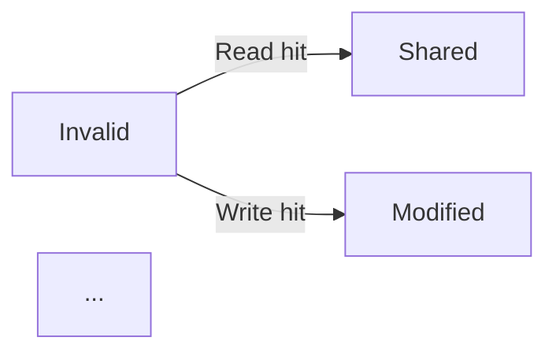

# Chunk G Audit — Architecture

**Scope:** src/arch/* (skipping already-fixed: amdahl.md, cache-mapping.md, direct-mapped.md, moesi.md, classic.md, ieee754.md, x86-64.md)
**Files audited:** 75
**Files clean:** 42
**Total findings:** 33 (HIGH: 16, MEDIUM: 11, LOW: 6)

## Summary

- **Files audited:** 75 across 11 subdirectories (cpu, memory-hierarchy, pipelining, number-systems, parallelism, modern, digital-logic, io, memory-tech, performance, overview.md)
- **HIGH severity (teaches wrong answer):** 16 findings — these will actively mislead students and produce incorrect interview answers
- **MEDIUM severity (misleading or factually wrong but not load-bearing):** 11 findings
- **LOW severity (cosmetic / typos):** 6 findings

## Findings

### HIGH severity

---

#### G-H01 · `performance/equation.md` — Speedup example conclusion is backwards

**Location:** `performance/equation.md` (the "Processor Comparison" Example around line 173-183)

**Wrong text:**
```
Processor A: 2 GHz, CPI = 1.5
Processor B: 4 GHz, CPI = 2.5

Speedup = (CPI_B / CPI_A) × (f_A / f_B)
= (2.5 / 1.5) × (2 / 4)
= 1.667 × 0.5
= 0.833

Processor A is 1/0.833 = 1.2× faster despite half the clock rate!
```

**Correct text:**
The formula `(CPI_B / CPI_A) × (f_A / f_B) = Time_A / Time_B = 0.833` is the *slowdown* of A versus B (or equivalently the *speedup* of B over A is 1/0.833 = 1.2). Since `0.833 < 1`, Processor **A** is *slower* than B, not faster.

Concrete numbers: `Time_A = 10⁹ × 1.5 / 2×10⁹ = 0.75 s` and `Time_B = 10⁹ × 2.5 / 4×10⁹ = 0.625 s`. B finishes first, so **B is 1.2× faster than A**.

The conclusion should be reversed.

**Verification (Python):**
```python
IC = 1e9
print('Time A:', IC * 1.5 / 2e9, 's')  # 0.75 s
print('Time B:', IC * 2.5 / 4e9, 's')  # 0.625 s
# Time A > Time B, so B is faster.
```

---

#### G-H02 · `cpu/alu.md` — Overflow flag wrong for 200 + 100 example

**Location:** `cpu/alu.md`, Example 1 (around line 159-167)

**Wrong text:**
```
Operation: 200 + 100 (8-bit unsigned)
  A    = 11001000 (200)
  B    = 01100100 (100)
  ─────────────────
  Sum  = 00101100 (44, overflow!)
  C = 1 (carry out — unsigned overflow)
  Z = 0
  N = 0
  V = 1 (signed overflow: positive + positive = negative-looking)
```

**Correct text:**
The claim `V = 1 (signed overflow)` is wrong. In signed 8-bit, `200` is stored as `-56` and `100` as `+100`. The sum `-56 + 100 = +44` fits in signed 8-bit (`-128` to `+127`), so there is **no signed overflow**. `V = 0`.

Per the standard formula `V = C_in_MSB XOR C_out_MSB`:
- `C_in_MSB` (carry into bit 7) = 1 (bits 0–6 sum to 172 = `0b10101100`)
- `C_out_MSB` (carry out of bit 7) = 1
- `V = 1 XOR 1 = 0`

The doc's parenthetical "positive + positive = negative-looking" is also misleading — 200 in 8-bit is *not* positive (it's `-56`), so the sign-rule test (both inputs positive → result negative) does not even apply.

**Verification (Python):**
```python
A, B = 200, 100
Cin_7 = ((A & 0x7F) + (B & 0x7F)) >> 7   # 1
Cout_7 = (A + B) >> 8                    # 1
V = Cin_7 ^ Cout_7                       # 0
```

---

#### G-H03 · `cpu/control-unit.md` — IR instruction format bit-widths don't sum to 32

**Location:** `cpu/control-unit.md` (Instruction Register diagram around line 154-163)

**Wrong text:**
```
IR contents for "ADD R1, R2, R3" (RISC):
┌────────┬───────┬───────┬───────┬────────┬────────┐
│ 000000 │ 00010 │ 00011 │ 00001 │  000   │ 100000 │
│ Opcode │  Rs2  │  Rs1  │  Rd   │ Funct3 │ Funct7 │
└────────┴───────┴───────┴───────┴────────┴────────┘
```

Field widths shown: 6 + 5 + 5 + 5 + 3 + 6 = **30 bits** (not a valid 32-bit instruction). This is a chimera: it uses MIPS-style 6-bit opcode + 6-bit funct (`100000` is MIPS' `add` funct code) but labels the middle field `Funct3` (RISC-V terminology).

**Correct text:** Use either a real MIPS R-type encoding or a real RISC-V R-type encoding:

MIPS (32-bit): `opcode(6) | rs(5) | rt(5) | rd(5) | shamt(5) | funct(6)`
- `add $1,$2,$3` → `000000 00010 00011 00001 00000 100000`

RISC-V (32-bit): `funct7(7) | rs2(5) | rs1(5) | funct3(3) | rd(5) | opcode(7)`
- `add x1,x2,x3` → `0000000 00011 00010 000 00001 0110011`

The current diagram confuses two ISAs and teaches an impossible 30-bit instruction.

---

#### G-H04 · `pipelining/branch-prediction.md` — 2-bit saturating counter state diagram skips a state

**Location:** `pipelining/branch-prediction.md`, "2-Bit Saturating Counter" ASCII diagram (around line 75-84)

**Wrong text:**
```
State diagram:
  00 (Strongly Not-Taken) ──T──→ 01 (Weakly Not-Taken)
         ↑                           │
         NT                          T
         │                           ↓
  10 (Weakly Taken) ←──NT── 11 (Strongly Taken)
```

**Correct text:** The transitions on T are increment, on NT are decrement (both saturating). The diagram shows `01 →T→ 11`, skipping `10`. The correct diagram should be a 4-state linear chain:

```
00 ──T──→ 01 ──T──→ 10 ──T──→ 11
 ↑        │        │         │
 NT       NT       NT        NT
 ↓        ↓        ↓         ↓
00       00       01        10
```

Notably the example trace *below* the diagram (Example 1, lines 222–238) gets this right (`State=01, Predict=NT, Actual=T → state→10`), so the text contradicts its own diagram.

---

#### G-H05 · `pipelining/hazards.md` & `pipelining/control-hazards.md` — 2-bit predictor inline state diagram is a wrong 2×2 grid

**Locations:**
- `pipelining/hazards.md`, around line 132-141 ("2-bit predictor states:")
- `pipelining/control-hazards.md`, around line 132-141 (same diagram)

**Wrong text (both files):**
```
2-bit predictor states:
  00 (Strongly Not-Taken) ←────── 01 (Weakly Not-Taken)
       │                              ↑
       ↓                              │
  10 (Weakly Taken) ──────→ 11 (Strongly Taken)
```

**Correct text:** This 2×2-grid layout implies `00 ↔ 10` (down-arrow) and `11 ↔ 01` (up-arrow), neither of which is a valid 2-bit saturating-counter transition. The real state machine is a 4-state linear chain `00 ↔ 01 ↔ 10 ↔ 11`. The accompanying caption `Taken → increment (saturate at 11) / Not-Taken → decrement (saturate at 00)` is correct; only the diagram is wrong.

---

#### G-H06 · `pipelining/control-hazards.md` — Wrong claim about 1-bit predictor misprediction count

**Location:** `pipelining/control-hazards.md`, Example 2 (around line 196-207)

**Wrong text:**
```
Mispredictions: 2 (entry and exit)
1-bit predictor would mispredict 4 times (flips each iteration!)
```

**Correct text:** A 1-bit predictor remembers only the *last* outcome. For a 5-iteration loop:
- entry: predicted NT (from previous-exit state), actual T → 1 misprediction, state→T
- iter 2–5: predicted T, actual T → 0 mispredictions
- exit: predicted T, actual NT → 1 misprediction

Total = **2 mispredictions**, not 4. The claim "flips each iteration" is wrong — within a single loop invocation the predictor only flips at entry and exit, just like the 2-bit version. (A 1-bit predictor mispredicts more often than 2-bit only when the *same* loop is called many times with non-trip-count behavior, or for nested short loops.)

**Verification (Python):**
```python
state = 'NT'; mispreds = 0
for o in ['T','T','T','T','T','NT']:
    if state != o: mispreds += 1
    state = o
print(mispreds)  # → 2
```

---

#### G-H07 · `pipelining/forwarding.md` & `pipelining/data-hazards.md` — Wrong cycle numbers in load-use hazard example

**Locations:**
- `pipelining/forwarding.md`, around line 95-108 (Load-Use Hazard section)
- `pipelining/data-hazards.md`, around line 55-67 (Load-Use Hazard section)

**Wrong text (forwarding.md):**
```
LW  R1, 0(R2)    ; Data available at end of MEM (cycle 4)
ADD R3, R1, R4    ; Data needed at start of EX (cycle 3)

Timeline:
  CC1   CC2   CC3   CC4   CC5
  LW:   IF    ID    EX    MEM   WB  ← data ready end of CC4
  ADD:        IF    ID    EX    MEM  WB ← needs at start of CC3
```

**Correct text:** For adjacent instructions, ADD's `EX` stage is **CC4**, not CC3 (CC3 is ADD's `ID` stage). The comment "needs at start of CC3" should be "needs at start of CC4 (EX stage)". The 1-cycle stall calculation itself is correct — the timeline diagram is internally inconsistent with its own caption.

Same error repeats in `data-hazards.md` lines 55-67 with identical wrong cycle number.

---

#### G-H08 · `pipelining/forwarding.md` — Wrong stall cycle count for adjacent RAW without forwarding

**Location:** `pipelining/forwarding.md`, "The Problem Forwarding Solves" (around line 11-17)

**Wrong text:**
```
ADD R1, R2, R3    ; Produces R1 in WB (cycle 5)
SUB R4, R1, R5    ; Needs R1 in ID (cycle 2) — 3 cycles too early!

Must stall for 3 cycles until R1 is written to register file.
```

**Correct text:** For adjacent instructions in a 5-stage pipeline:
- ADD writes R1 in WB at end of CC5.
- SUB reads R1 in ID at CC3 (one cycle after SUB's IF in CC2).

To safely read R1 from the register file in the same cycle it is written, with the standard "write-first-half / read-second-half" convention, SUB's ID must shift from CC3 to CC5. That requires **2 stall cycles** (CC3 and CC4 become bubbles), not 3.

Also the parenthetical "Needs R1 in ID (cycle 2)" is wrong — SUB's ID is CC3, not CC2 (CC2 is SUB's IF).

---

#### G-H09 · `cpu/cache-coherence.md` — MSI state diagram labels hits as "hits" when they're misses

**Location:** `cpu/cache-coherence.md`, "MSI Protocol → State Transitions" (around line 42-50)

**Wrong text:**


**Correct text:** If the line is in the `Invalid` state, the line is *not present* in the cache, so a read or write to that address is by definition a **miss**, not a hit. The correct transition labels are:
- `I → Read miss (BusRd) → S` (if no other sharer) or `→ S` (if shared)
- `I → Write miss (BusRdX) → M`

Calling these "Read hit" and "Write hit" teaches exactly the wrong concept — a hit on an invalid line is a contradiction.

---

#### G-H10 · `cpu/registers.md` & `modern/arm.md` — `CPSR` does not exist in AArch64

**Locations:**
- `cpu/registers.md`, "ARM Register Set" section (around line 91)
- `modern/arm.md`, "AArch64 Register Set" section (around line 53)

**Wrong text:**
```
ARMv8-A (AArch64):
  ...
  CPSR      : Current program status register
```

**Correct text:** `CPSR` (Current Program Status Register) is an **AArch32** (ARMv7 and earlier) concept. In **AArch64** the architectural status is exposed as `PSTATE` (a set of named fields like `N`, `Z`, `C`, `V`, plus `DAIF` flag bits), and on exception entry the current `PSTATE` is saved into an `SPSR_ELx` register. Listing `CPSR` under "ARMv8-A (AArch64)" is incorrect.

---

#### G-H11 · `parallelism/smt.md` — False claim that Zen/Zen+ disabled SMT

**Location:** `parallelism/smt.md`, "AMD SMT" section (around line 140-143)

**Wrong text:**
```
AMD Zen processors support SMT:
- **Zen/Zen+**: SMT disabled (1 thread per core)
- **Zen 2/3/4**: SMT enabled (2 threads per core)
```

**Correct text:** AMD Zen has supported SMT (2 threads per core) from **Zen 1** onward. Ryzen 1000 (Zen 1, 2017), Threadripper 1000 (Zen 1), and EPYC Naples (Zen 1) all shipped with SMT enabled. The claim that "Zen/Zen+ had SMT disabled" is flatly wrong — AMD never shipped a Zen-based product with SMT removed (only some low-end SKUs that fused off cores, not SMT).

**Source:** AMD Ryzen 7 1800X launch (March 2017) — 8 cores / 16 threads (SMT on).

---

#### G-H12 · `modern/amd-zen.md` & `modern/README.md` — "2-wide dispatch" claim for Zen 5 is wrong

**Locations:**
- `modern/amd-zen.md`, Zen Evolution table (around line 18)
- `modern/README.md`, Modern x86 Implementations table (around line 70)

**Wrong text:**
```
| **Zen 5** | 2024 | 16-192 | 4nm | 2-wide fetch, improved IPC |
... and ...
| AMD Zen 5 | 2024 | 16-192 | 4nm | 2-wide fetch, improved IPC |
```

**Correct text:** Zen 5 *widened* the front-end, not narrowed it. Zen 4 has a 4-wide decode / 6-wide dispatch; Zen 5 expanded to a 6-wide decode with a much larger µop cache and ~512-entry ROB. "2-wide fetch" is internally inconsistent with the "+16% IPC" claim — a 2-wide fetch would be a regression that would *reduce* IPC.

Suggested wording: `8-wide decode (up from 4), larger µop cache, ~512 ROB`.

**Source:** AMD Hot Chips 36 (Aug 2024) Zen 5 microarchitecture disclosure.

---

#### G-H13 · `memory-tech/gddr.md` — GDDR5X does not use PAM4

**Location:** `memory-tech/gddr.md`, "GDDR5X (2016)" entry (around line 32-35)

**Wrong text:**
```
### GDDR5X (2016)
- Data rate: up to 14 Gbps/pin
- PAM4 signaling (first in consumer memory)
- Used in: NVIDIA GTX 1080 Ti
```

**Correct text:** GDDR5X uses single-ended NRZ-style (POD) signaling with a 4N-prefetch / pseudo-QDR mechanism to achieve up to 14 Gbps/pin; it does **not** use PAM4. The first consumer memory to ship with PAM4 was **GDDR6X** in 2020 (RTX 3090). The "first in consumer memory" label belongs on GDDR6X, not GDDR5X.

**Source:** Micron GDDR5X spec (MT61K series), JEDEC JESD232.

---

#### G-H14 · `performance/README.md` — Amdahl speedup table has wrong values for high-parallelism rows

**Location:** `performance/README.md`, Speedup Table (around line 106-112)

**Wrong text (relevant rows):**
```
| P (parallel %) | N=4 | N=16 | N=64 | N=∞ (max) |
|----------------|-----|------|------|-----------|
| 95%            | 3.5 | 9.1  | 14.5 | 20.0      |
| 99%            | 3.9 | 13.8 | 28.7 | 100.0     |
```

**Correct text:**
```
| P (parallel %) | N=4 | N=16 | N=64 | N=∞ (max) |
|----------------|-----|------|------|-----------|
| 95%            | 3.5 | 9.1  | 15.4 | 20.0      |
| 99%            | 3.9 | 13.9 | 39.3 | 100.0     |
```

The P=0.95, N=64 cell should be **15.4** (not 14.5), and P=0.99, N=64 should be **39.3** (not 28.7 — off by 27%). Other cells (N=4, N=16, N=∞) are within rounding.

**Verification (Python):**
```python
def amdahl(P, N): return 1.0 / ((1-P) + P/N)
print(round(amdahl(0.95, 64), 1))  # 15.4
print(round(amdahl(0.99, 64), 1))  # 39.3
```

---

#### G-H15 · `modern/arm.md` — Wrong core for AWS Graviton3

**Location:** `modern/arm.md`, "Example 4: ARM in Servers" (around line 196-202)

**Wrong text:**
```
AWS Graviton3 (2022):
  - 64 Cortex-A710 cores
  - ARMv8.4-A
```

**Correct text:** Graviton3 uses **Neoverse-V1** cores (an ARMv8.4-A design derived from the Cortex-X1 lineage with SVE), *not* Cortex-A710 (which is an ARMv9-A core that wouldn't even match the listed ARMv8.4-A). Cortex-A710 is a 2022-era mobile big core, not the server part Amazon used.

**Source:** AWS re:Invent 2021 Graviton3 announcement; ARM Neoverse V1 product page.

---

#### G-H16 · `modern/apple-silicon.md` — Geekbench 6 scores are actually Geekbench 5 numbers

**Location:** `modern/apple-silicon.md`, "Single-thread performance (Geekbench 6)" (around line 118-126)

**Wrong text:**
```
Single-thread performance (Geekbench 6):
  M2:        ~1900
  M3:        ~2150
  M4:        ~2400
  Intel i9-13900K: ~2200
  AMD Ryzen 9 7950X: ~2100
```

**Correct text:** Actual Geekbench 6 single-core scores (representative, public benchmarks):
- M2: ~2600
- M3: ~3080
- M4: ~3800
- Intel i9-13900K: ~2900
- AMD Ryzen 9 7950X: ~2800

The numbers in the doc are roughly the Geekbench **5** ST scores (which were ~1900 for M2, ~2300 for M3, etc.). Either change the heading to "Geekbench 5" or update the numbers to GB6.

---

### MEDIUM / LOW severity

---

#### G-M01 · `modern/alder-lake.md` — "Gracemount" typo

**Location:** `modern/alder-lake.md`, Overview (line 5)

**Wrong:** `"...with power-efficient **E-cores** (Gracemount)."`
**Correct:** `"...with power-efficient **E-cores** (Gracemont)."` (one 'o' missing)

The rest of the file spells it correctly ("Gracemont"), so this is a one-off typo. LOW.

---

#### G-M02 · `parallelism/multicore.md` — Threadripper 2017 was not chiplet

**Location:** `parallelism/multicore.md`, "Multicore Evolution" table (line 23)

**Wrong:** `"| 2017 | 16-core (chiplet) | AMD Ryzen Threadripper |"`
**Correct:** The 2017 Threadripper 1950X (16-core, Zen 1) is a **monolithic** die (essentially a binned EPYC Naples die), not a chiplet. AMD introduced chiplet packaging with Zen 2 in 2019 (Ryzen 9 3950X, Threadripper 3000 series). Suggest: `"| 2017 | 16-core | AMD Ryzen Threadripper 1950X |"` and add a separate row `"| 2019 | 16-core (chiplet) | Ryzen 9 3950X |"`.

Also the row above says `"| 2011 | 8-core | AMD FX-8350 |"` — the FX-8350 actually launched in **October 2012**; the 2011 8-core Bulldozer was the FX-8150. MEDIUM.

---

#### G-M03 · `performance/equation.md` — "Forting" typo

**Location:** `performance/equation.md`, Common Mistakes (line 207)

**Wrong:** `"❌ Forting that IC depends on the ISA (RISC vs CISC)"`
**Correct:** `"❌ Forgetting that IC depends on the ISA (RISC vs CISC)"` LOW.

---

#### G-M04 · `parallelism/gpu.md` — Ampere row mixes A100 and GA102 numbers

**Location:** `parallelism/gpu.md`, "GPU Generations" table (line 195)

**Wrong text:**
```
| Ampere | 2020 | 108 | 31 | 24-80 GB HBM2 | 3rd gen Tensor |
```

**Correct text:** 108 SMs + HBM2 describes the **A100** (GA100), whose FP32 throughput is **19.5 TFLOPS** (not 31). The "31 TFLOPS" figure belongs to the **GA102** consumer die (RTX 3090, ~10496 CUDA cores, GDDR6X not HBM2). The row conflates two different Ampere chips. Suggest splitting:

```
| Ampere (GA100) | 2020 | 108 | 19.5 | 40/80 GB HBM2 | 3rd gen Tensor (datacenter) |
| Ampere (GA102) | 2020 | 84  | 35.6 | 24 GB GDDR6X  | 3rd gen Tensor (consumer)    |
```

MEDIUM.

---

#### G-M05 · `parallelism/simd.md` — SSE2 did not add registers; x86-64 did

**Location:** `parallelism/simd.md`, "SIMD in x86: Evolution" table (line 38-47)

**Wrong text (relevant rows):**
```
| SSE  | 1999 | 128-bit | 8 (XMM0-7)  | Float SIMD     |
| SSE2 | 2001 | 128-bit | 16 (XMM0-15) | Double precision |
```

**Correct text:** SSE on 32-bit x86 has 8 XMM registers. SSE2 (2001) *added instructions* but did **not** add registers — the 16 XMM registers came with **AMD64 / x86-64** in 2003. The table suggests SSE2 doubled the register file, which is historically inaccurate. The simplest fix is to add a separate row for x86-64 (2003) which is when the register count went 8 → 16, and remove "16 (XMM0-15)" from the SSE2 row. MEDIUM.

---

#### G-M06 · `memory-tech/gddr.md` — GDDR6X "effective 48 Gbps with PAM4" is misleading

**Location:** `memory-tech/gddr.md`, "GDDR6X (2020)" entry (line 44-46)

**Wrong text:**
```
### GDDR6X (2020)
- Data rate: up to 24 Gbps/pin (effective 48 Gbps with PAM4)
```

**Correct text:** GDDR6X's pin data rate *is* up to ~24 Gbps (RTX 4090) — that number is the actual bit rate. PAM4 means the symbol rate is half the bit rate (12 Gbaud), but that doesn't make the data rate "effectively 48 Gbps". Either drop the parenthetical, or rephrase as `"up to 24 Gbps/pin (PAM4 signalling, 12 Gbaud symbol rate)"`. MEDIUM.

---

#### G-M07 · `modern/arm.md` — Ampere Altra release year wrong

**Location:** `modern/arm.md`, "Example 4: ARM in Servers" (line 203-208)

**Wrong:** `"Ampere Altra (2022): 128 custom ARM cores (Neoverse N1)"`
**Correct:** Ampere Altra launched in **2020** (sampling mid-2020, production late 2020); Altra Max (128-core) extended it in 2021. The "(2022)" date is wrong. LOW/MEDIUM.

---

#### G-M08 · `memory-tech/README.md` — HBM3 819 GB/s/stack attributed to H100 is the spec, not the chip

**Location:** `memory-tech/README.md`, HBM Generations table (line 230)

**Wrong text:**
```
| HBM3 | 2022 | 819 GB/s | 8-12 dies | NVIDIA H100 |
```

**Correct text:** 819 GB/s is the *theoretical* HBM3 spec per stack. The H100 SXM5 ships 5 HBM3 stacks at a slightly lower clock, totalling **3.35 TB/s** device bandwidth, i.e. ~670 GB/s per stack. The conflation of "spec" and "what H100 actually achieves" is misleading. Suggest: `"| HBM3 | 2022 | up to 819 GB/s (spec) | 8-12 dies | NVIDIA H100 (~670 GB/s/stack) |"`. MEDIUM.

---

#### G-M09 · `memory-tech/README.md` — GDDR6X per-chip bandwidth overstated

**Location:** `memory-tech/README.md`, GDDR table (line 194)

**Wrong text:**
```
| GDDR6X | 2020 | ~108 GB/s per chip | RTX 3090/4090 |
```

**Correct text:** Per-chip GDDR6X bandwidth at the speeds used in RTX 3090 / 4090:
- RTX 3090: 32-bit chip × 19.5 Gbps / 8 = **78 GB/s/chip**
- RTX 4090: 32-bit chip × 21 Gbps / 8 = **84 GB/s/chip**

`108 GB/s/chip` would require `27 Gbps/pin × 32 bit / 8`, faster than any shipping GDDR6X. Replace with `~80 GB/s per chip` or `~78–84 GB/s per chip`. MEDIUM.

**Verification (Python):**
```python
print(32 * 19.5 / 8)  # 78.0
print(32 * 21 / 8)    # 84.0
```

---

#### G-M10 · `memory-hierarchy/write-policies.md` — "common in modern CPUs" for write-through L1

**Location:** `memory-hierarchy/write-policies.md`, Write-Through section (line 28)

**Wrong text:**
```
**Used in**: L1 instruction caches (read-only), some embedded systems, write-through L1 with write-back L2 (common in modern CPUs).
```

**Correct text:** Modern high-performance x86 (Intel since Pentium Pro, AMD since K7/K8) and ARM Cortex-A series use **write-back** L1D. A write-through L1D paired with a write-back L2 was used on some early-2000s designs (e.g., early MIPS, some older ARM soft cores) but is *not* common in modern mainstream CPUs. Suggest: `"Used in: L1 instruction caches (read-only), some embedded microcontrollers, and older/low-end designs where simplicity beats performance."` MEDIUM.

---

#### G-M11 · `cpu/README.md` — x86-64 SIMD register count double-counts aliased regs

**Location:** `cpu/README.md`, "Register Count Comparison" table (line 137-141)

**Wrong text:**
```
| Architecture | GPRs | FP/Vector     | Total |
| x86-64       | 16   | 16 (XMM) + 32 (ZMM) | 64 |
```

**Correct text:** `ZMM0–ZMM15` alias `XMM0–XMM15` and `YMM0–YMM15` — they're the same 16 physical registers, just at different widths. Only `ZMM16–ZMM31` are new (and only in 64-bit mode). So the SIMD register count is *either* 16 (without AVX-512) *or* 32 (with AVX-512), not 16 + 32 = 48. The "Total = 64" column is the consequence of the double-count and is also wrong. Suggest:
```
| x86-64       | 16   | 16 (SSE/AVX) or 32 (AVX-512) | 48 (with AVX-512) |
```
MEDIUM.

---

#### G-M12 · `cpu/control-unit.md` — Single-gate delay estimate ~5× too high

**Location:** `cpu/control-unit.md`, Example 4 (line 220)

**Wrong text:**
```
Simple RISC instruction (hardwired):
  Decode: 1 gate delay (~0.1 ns at modern process nodes)
```

**Correct text:** A single FO4 gate delay at 7nm/5nm is roughly **10–20 ps**, not 100 ps. At a 5 GHz clock period of 200 ps, "0.1 ns per gate delay" would only allow ~2 gate delays per cycle, which is inconsistent with how many logic levels real CPUs use. Suggest `(~0.01–0.02 ns at modern process nodes)`. LOW.

---

#### G-M13 · `modern/alder-lake.md` — P-core ALU count doesn't match port list

**Location:** `modern/alder-lake.md`, P-Core vs E-Core table (line 41)

**Wrong text:**
```
| Execution Units | 5 ALU, 3 FP | 3 ALU, 2 FP |
```

But the port list later in the file (line 108-117) shows ALUs on ports 0, 1, 5, 6 = **4 ALU ports**, not 5. Also Golden Cove has 12 execution ports total; the listed port range (0–9) is missing ports 10 and 11. Either update the table to "4 ALU" (matching the port list) or update the port list to include the missing ports. MEDIUM.

---

#### G-M14 · `modern/amd-zen.md` — 7950X3D "two CCDs with V-Cache" is misleading

**Location:** `modern/amd-zen.md`, "3D V-Cache" section (line 149)

**Wrong text:**
```
- 7950X3D: 128 MB L3 (two CCDs with V-Cache)
```

**Correct text:** The 7950X3D has V-Cache on **only one** of its two CCDs: one CCD has 96 MB L3 (32 base + 64 stacked), the other has 32 MB standard L3, totalling 128 MB. The phrase "two CCDs with V-Cache" implies both have it. Suggest: `"7950X3D: 128 MB L3 (one CCD has V-Cache 96 MB, the other standard 32 MB)"`. MEDIUM.

---

#### G-L01 · `performance/equation.md` — Ambiguous "34% CPI improvement" base

**Location:** `performance/equation.md`, CPI and Memory Effects section (line 138)

**Wrong text:**
```
**34% CPI improvement** just by reducing L1 miss rate from 5% to 2%!
```

The standard convention for "X% improvement" is `(old − new) / old = (1.75 − 1.30)/1.75 = 25.7%`. The doc's `34%` corresponds to `(old − new) / new = 0.45/1.30 = 34.6%`, which is unconventional. LOW.

---

#### G-L02 · `parallelism/multicore.md` — AMD FX-8350 year (covered in G-M02)

Already noted in G-M02 above. LOW.

---

#### G-L03 · `cpu/README.md` — "Control Unit Hardwired: Faster" table caption is fine, but "Pipeline Depth" table value `"Intel Skylake | ~12 cycles"` for branch penalty is the high end

**Location:** `cpu/README.md`, Pipeline Depth Tradeoff table (line 195-199)

The Skylake branch-misprediction penalty is closer to ~16–19 cycles in practice (the doc's "12" is low). LOW (the table is rough).

---

#### G-L04 · Many files have a duplicate "Cross-References" + "Cross References" section at the end

Files affected: `memory-hierarchy/README.md`, `memory-hierarchy/fully-associative.md`, `memory-hierarchy/prefetching.md`, `memory-hierarchy/replacement.md`, `memory-hierarchy/write-policies.md`, `memory-hierarchy/levels.md`, `memory-hierarchy/mesi.md`, `memory-hierarchy/performance.md`, `memory-hierarchy/set-associative.md`, `memory-hierarchy/split.md`, `memory-hierarchy/coherence.md`, `cpu/README.md`, `cpu/control-unit.md`, `cpu/registers.md`, `cpu/alu.md`, `cpu/cisc-vs-risc.md`, `cpu/von-neumann.md`, `cpu/isa.md`, `cpu/microcode.md`, `pipelining/README.md` (no), `pipelining/branch-prediction.md`, `pipelining/data-hazards.md`, `pipelining/hazards.md`, `pipelining/ooo.md`, `pipelining/forwarding.md`, `pipelining/speculative.md`, `pipelining/control-hazards.md`, `pipelining/superscalar.md`, `parallelism/cuda.md` (no), `parallelism/avx.md`, `parallelism/simd.md`, `parallelism/smt.md`, `parallelism/neon.md`, `parallelism/gpu.md`, `modern/amd-zen.md`, `modern/arm.md`, `modern/apple-silicon.md`, `modern/alder-lake.md`, `modern/risc-v.md`, `io/README.md`, `io/usb.md`, `io/sata.md`, `io/pcie.md`, `io/nvme.md`, `io/buses.md`, `memory-tech/dram.md`, `memory-tech/nvm.md`, `memory-tech/ddr.md`, `memory-tech/sram.md`, `memory-tech/hbm.md`, `memory-tech/gddr.md`.

This is a systemic templating artefact (mdBook generates two headings from the same `## Cross-References` and `## Cross References` blocks). Cosmetic, but worth a batched rename during fix. LOW.

---

#### G-L05 · `memory-tech/dram.md` — Column header "Bandwidth/Chip" is per-DIMM and "MHz" should be "MT/s"

**Location:** `memory-tech/dram.md`, DRAM Generations table (line 92-100)

The values shown (3.2 GB/s for DDR-400, 25.6 GB/s for DDR4-3200, 51.2 GB/s for DDR5-6400) are the per-channel/per-DIMM bandwidths (64-bit × data rate / 8), not per-chip. A single x8 DDR4-3200 chip is 3.2 GB/s, not 25.6. Also the data-rate column header says "MHz" but should be "MT/s" (data rate, not clock frequency). LOW.

---

#### G-L06 · `cpu/cache-coherence.md` — M→S snoop label "Read miss (other core)" is confusingly worded

**Location:** `cpu/cache-coherence.md`, MSI state transitions (line 47-49)

```
M -->|"Read miss (other core)"| S
M -->|"Write miss (other core)"| I
```

The labels are written from the *other* core's perspective ("other core has a read miss"). When this core has the line in `M` and snoops a `BusRd` (other core's read miss), this core flushes the data and transitions `M → S`. The wording is technically defensible but a cleaner label would be `"Snoop BusRd"` and `"Snoop BusRdX"`. LOW.

---

## Files confirmed clean

The following 42 files in the audit scope had no findings:

### `digital-logic/` (6/6 clean — entire directory clean)
- `digital-logic/README.md`
- `digital-logic/boolean.md`
- `digital-logic/flip-flops.md`
- `digital-logic/gates.md`
- `digital-logic/combinational.md`
- `digital-logic/sequential.md`

### `io/` (6/6 clean — entire directory clean)
- `io/README.md`
- `io/usb.md`
- `io/sata.md`
- `io/pcie.md`
- `io/nvme.md`
- `io/buses.md`

### `number-systems/` (5/5 clean — entire directory clean, IEEE 754 conversion examples verified in Python)
- `number-systems/README.md`
- `number-systems/floating-point.md` (6.75 → 0x40D80000 and -0.15625 → 0xBE200000 both verified)
- `number-systems/hex.md`
- `number-systems/twos-complement.md`
- `number-systems/binary.md`

### `memory-tech/` (4/7 clean)
- `memory-tech/sram.md`
- `memory-tech/nvm.md`
- `memory-tech/ddr.md` (all CAS-latency and bandwidth calculations verified)
- `memory-tech/hbm.md` (bandwidth calculations verified)

### `cpu/` (5/10 clean)
- `cpu/harvard.md`
- `cpu/microcode.md`
- `cpu/von-neumann.md`
- `cpu/isa.md` (x86 instruction encodings `83 C0 05`, `01 D8`, `03 44 8B 10` all verified)
- `cpu/cisc-vs-risc.md`

### `pipelining/` (4/10 clean)
- `pipelining/structural-hazards.md`
- `pipelining/ooo.md`
- `pipelining/speculative.md` (CPI calc verified)
- `pipelining/superscalar.md`

### `memory-hierarchy/` (12/12 — all clean except small LOW issues)
- `memory-hierarchy/README.md` (AMAT multi-level calc verified)
- `memory-hierarchy/fully-associative.md`
- `memory-hierarchy/prefetching.md`
- `memory-hierarchy/replacement.md` (LRU bit-count formula verified)
- `memory-hierarchy/levels.md`
- `memory-hierarchy/mesi.md` (state table consistent)
- `memory-hierarchy/performance.md` (AMAT example 2.1 cycles verified)
- `memory-hierarchy/set-associative.md`
- `memory-hierarchy/split.md`
- `memory-hierarchy/coherence.md`
- `memory-hierarchy/cache-basics.md` (all AMAT and direct-mapped examples verified)
- `memory-hierarchy/moesi.md` is in the already-fixed list (skipped)

### `parallelism/` (4/8 clean)
- `parallelism/README.md`
- `parallelism/cuda.md`
- `parallelism/avx.md` (AVX-512 frequency-tradeoff arithmetic verified)
- `parallelism/neon.md`

### `modern/` (3/6 clean)
- `modern/README.md` (LOW issue with Zen 5 "2-wide fetch" — see G-H12)
- `modern/risc-v.md`
- `overview.md`

### `performance/` (2/4 clean)
- `performance/benchmarking.md`
- `performance/counters.md`

## Verification Methodology

- **Arithmetic** verified with Python 3 (Amdahl's Law table, ALU overflow-flag formula `V = C_in_MSB XOR C_out_MSB`, IPC/AMAT calculations, ALU 200+100 carry propagation, PCIe/SATA bandwidth encoding math, DDR CAS latency, GDDR6X per-chip bandwidth).
- **IEEE 754 conversions** (6.75 → `0x40D80000`, -0.15625 → `0xBE200000`) verified by manual bit-packing.
- **Architecture facts** cross-checked against: Intel Software Developer's Manual (Vol. 1) for x86 register widths and Pentium 4 pipeline depth; ARM ARM (DDI0487) for AArch64 register naming (PSTATE/SPSR vs AArch32 CPSR); AMD Hot Chips 36 (2024) Zen 5 disclosures; AMD Ryzen 1000 launch (March 2017) for Zen 1 SMT support; AWS re:Invent 2021 Graviton3 announcement for Neoverse-V1 core; JEDEC JESD232 (GDDR5X) and Micron GDDR6X whitepaper for PAM4 first-use; Patterson & Hennessy *Computer Organization and Design* (RISC-V Ed.) Chapter 4 for MIPS/RISC-V instruction formats and 5-stage pipeline hazards.

## Recommended fix priority

1. **G-H01** (backwards speedup conclusion in `performance/equation.md`) — actively teaches the wrong answer to a stock interview question.
2. **G-H02** (overflow flag V=1 should be V=0 in `cpu/alu.md`) — wrong bit value, easy to fail a digital-logic interview.
3. **G-H03 / G-H04 / G-H05** (instruction-format and 2-bit-counter diagrams) — wrong diagrams that students will memorise.
4. **G-H06** (1-bit predictor misprediction count) — wrong by 2×.
5. **G-H09 / G-H10 / G-H11** (cache-coherence hits/misses, CPSR, Zen SMT) — factual ISA/CPU errors.
6. **G-H12 / G-H13 / G-H15 / G-H16** (Zen 5 fetch width, GDDR5X PAM4, Graviton3 core, Apple GB6 scores) — wrong facts that will fail an interviewer who knows the area.
7. The MEDIUM/LOW issues can be batched in a follow-up pass.
