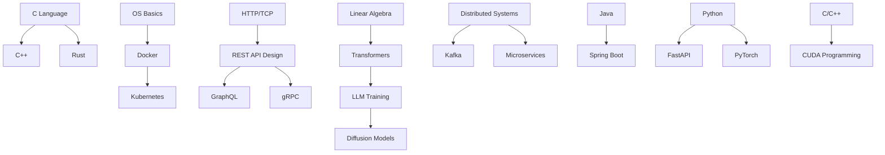

# Topic Backlog

> Auto-maintained by research agents. Topics discovered during expansion that need coverage.
> Priority: HIGH (interview-critical) | MEDIUM (important) | LOW (nice-to-have)
> Status: 🔴 Not Started | 🟡 In Progress | 🟢 Complete | ⏸️ Deferred

---

## Status Summary

| Priority | Total | Not Started | In Progress | Complete |
|----------|-------|-------------|-------------|----------|
| HIGH | 28 | 28 | 0 | 0 |
| MEDIUM | 18 | 18 | 0 | 0 |
| LOW | 6 | 6 | 0 | 0 |
| **Total** | **52** | **52** | **0** | **0** |

---

## HIGH Priority

### Programming Languages — Missing Entirely 🔴

| Topic | Key Subtopics | Est. Effort | Dependencies |
|-------|--------------|-------------|--------------|
| **C** | Memory management, ABI, compilation, undefined behavior, POSIX, performance | 3-4 days | OS basics |
| **C++** | Templates, STL, memory model, RAII, smart pointers, move semantics, concurrency | 4-5 days | C basics |
| **Rust** | Ownership, borrow checker, lifetimes, traits, async, Tokio, unsafe | 3-4 days | None |
| **Java** | JVM internals, GC algorithms, memory model, threads, Spring, performance tuning | 3-4 days | None |
| **Python** | CPython internals, GIL, asyncio, typing, packaging, performance | 2-3 days | None |
| **Go** | Scheduler (GMP), goroutines, channels, memory model, runtime, interfaces | 2-3 days | None |
| **JavaScript** | Runtime, event loop, V8 internals, async/promises, Node.js, closures | 2-3 days | None |
| **OCaml** | Functional programming, pattern matching, type system, modules, algebraic types | 2-3 days | None |

### Frameworks & Tools — Missing Entirely 🔴

| Topic | Key Subtopics | Est. Effort | Dependencies |
|-------|--------------|-------------|--------------|
| **Docker** | Images, containers, networking, volumes, multi-stage builds, security | 2 days | Linux basics |
| **Kubernetes** | Pods, services, deployments, ingress, operators, Helm, CRDs | 3-4 days | Docker |
| **Redis** | Data structures, pub/sub, Lua scripting, clustering, persistence | 1-2 days | None |
| **Kafka** | Topics, partitions, consumer groups, exactly-once, schema registry | 2 days | Distributed systems |
| **Spring Boot** | Architecture, auto-configuration, dependency injection, testing, JPA | 2-3 days | Java |
| **FastAPI** | Async, Pydantic, dependency injection, OpenAPI, middleware | 1-2 days | Python |
| **PyTorch** | Autograd, modules, DataLoader, distributed training, ONNX export | 2-3 days | ML basics |
| **gRPC** | Protobuf, streaming, interceptors, error handling, load balancing | 1-2 days | None |
| **GraphQL** | Schema, resolvers, N+1 problem, subscriptions, federation | 1-2 days | REST basics |

### Backend Engineering — Missing Entirely 🔴

| Topic | Key Subtopics | Est. Effort | Dependencies |
|-------|--------------|-------------|--------------|
| **REST API Design** | Richardson maturity model, HATEOAS, versioning, pagination, error handling | 1-2 days | HTTP |
| **CI/CD** | GitHub Actions, Jenkins, ArgoCD, GitOps, deployment strategies | 1-2 days | Docker, Git |
| **Microservices** | Service mesh, circuit breaker, saga pattern, API gateway, observability | 2-3 days | Distributed systems |

### Machine Learning Expansion 🔴

| Topic | Key Subtopics | Est. Effort | Dependencies |
|-------|--------------|-------------|--------------|
| **Transformers** | Attention mechanism, positional encoding, layer normalization, scaling laws | 2-3 days | Linear algebra |
| **LLM Training** | GPT architecture, BERT, fine-tuning, RLHF, DPO, RL reasoning | 3-4 days | Transformers |
| **Diffusion Models** | DDPM, score matching, guidance, latent diffusion, Stable Diffusion | 2-3 days | Probability |
| **CUDA Programming** | Thread hierarchy, memory model, kernels, optimization, profiling | 2-3 days | C/C++ |
| **Distributed Training** | Data parallelism, model parallelism, pipeline parallelism, FSDP, DeepSpeed | 2-3 days | ML basics |

---

## MEDIUM Priority

### Operating Systems Expansion 🟡

| Topic | Key Subtopics | Est. Effort |
|-------|--------------|-------------|
| **Linux Kernel Modules** | Loading, unloading, parameters, sysfs interaction | 1 day |
| **eBPF** | Programs, maps, hooks, tracing, XDP, security | 2 days |
| **io_uring** | Submission queue, completion queue, async I/O, polling | 1-2 days |
| **Namespaces** | PID, net, mount, user, cgroup, UTS, IPC | 1 day |
| **Cgroups v2** | CPU, memory, I/O controllers, pressure stall info | 1 day |
| **System Calls** | Syscall interface, VDSO, seccomp, strace | 1 day |

### DBMS Expansion 🟡

| Topic | Key Subtopics | Est. Effort |
|-------|--------------|-------------|
| **PostgreSQL Internals** | MVCC, VACUUM, WAL, planner/optimizer, indexes | 2-3 days |
| **Query Optimization** | Cost-based optimization, join ordering, statistics, explain plans | 1-2 days |
| **Storage Engines** | B-tree variants, LSM-tree, hash indexes, write amplification | 2 days |
| **Distributed SQL** | CockroachDB, TiDB, Spanner, Raft consensus, MVCC | 2-3 days |
| **Time-Series DBs** | InfluxDB, TimescaleDB, compression, downsampling | 1 day |

### Networks Expansion 🟡

| Topic | Key Subtopics | Est. Effort |
|-------|--------------|-------------|
| **QUIC** | Connection migration, multiplexing, 0-RTT, loss recovery | 1-2 days |
| **HTTP/3** | QPACK, server push deprecation, performance improvements | 1 day |
| **eBPF Networking** | XDP, TC hooks, socket filters, Cilium | 1-2 days |
| **Service Mesh** | Istio, Envoy, sidecar pattern, mTLS, observability | 1-2 days |
| **BGP Deep Dive** | Path selection, route aggregation, BGP security (RPKI) | 1-2 days |

### System Design Expansion 🟡

| Topic | Key Subtopics | Est. Effort |
|-------|--------------|-------------|
| **Message Queues** | RabbitMQ, SQS, at-least-once vs exactly-once, dead letter queues | 1-2 days |
| **Rate Limiting** | Token bucket, sliding window, distributed rate limiting | 1 day |
| **Caching Deep Dive** | Cache invalidation, write-through/back/around, cache stampede | 1-2 days |
| **Observability** | Metrics (Prometheus), logs (ELK), traces (Jaeger), SLOs/SLIs | 1-2 days |

---

## LOW Priority

### Advanced Topics 🔴

| Topic | Key Subtopics | Est. Effort |
|-------|--------------|-------------|
| **Quantum Computing** | Qubits, gates, Shor's algorithm, Grover's algorithm, NISQ | 2-3 days |
| **Blockchain** | Consensus (PoW, PoS), smart contracts, DeFi, scalability | 2 days |
| **Edge Computing** | CDN compute, edge functions, WebAssembly at edge | 1-2 days |
| **Federated Learning** | Privacy-preserving ML, aggregation strategies, differential privacy | 1-2 days |
| **Homomorphic Encryption** | FHE schemes, practical applications, performance trade-offs | 2 days |
| **WebAssembly** | Compilation target, browser runtime, WASI, performance | 1-2 days |

---

## Topic Dependency Graph

---

## Action Items

### Immediate (Next Sprint)
1. [ ] C language fundamentals and interview questions
2. [ ] Docker containerization deep dive
3. [ ] Kubernetes architecture and common patterns
4. [ ] Redis internals and use cases
5. [ ] Transformer architecture explanation

### Short-Term (Next 2 Weeks)
1. [ ] C++ modern features and interview prep
2. [ ] Rust ownership model
3. [ ] Java JVM internals
4. [ ] Kafka architecture
5. [ ] CI/CD pipeline design

### Medium-Term (Next Month)
1. [ ] Python internals (GIL, asyncio)
2. [ ] Go scheduler and concurrency
3. [ ] System design: message queues, rate limiting
4. [ ] PostgreSQL internals
5. [ ] LLM training pipeline

---

## How to Use This Backlog

1. **Pick a topic** from HIGH priority based on your interview schedule
2. **Check dependencies** — some topics require prerequisites
3. **Create the file** following the book's structure (Overview, Key Concepts, Diagrams, Interview Questions, References)
4. **Update status** in this file when complete
5. **Add new topics** as you discover gaps during research

## Cross-References

- [Book Structure](../SUMMARY.md) — Full table of contents
- [Interview Guide](../interview/README.md) — Interview preparation
- [System Design](../system-design/README.md) — System design patterns
- [Coding](../coding/README.md) — DSA and coding preparation
