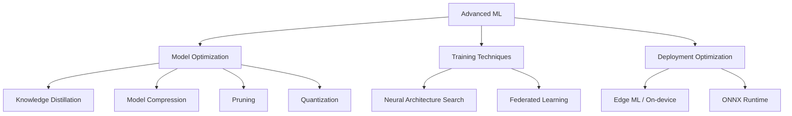
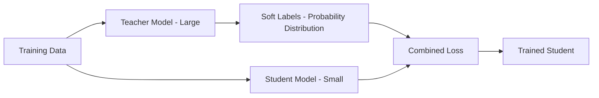
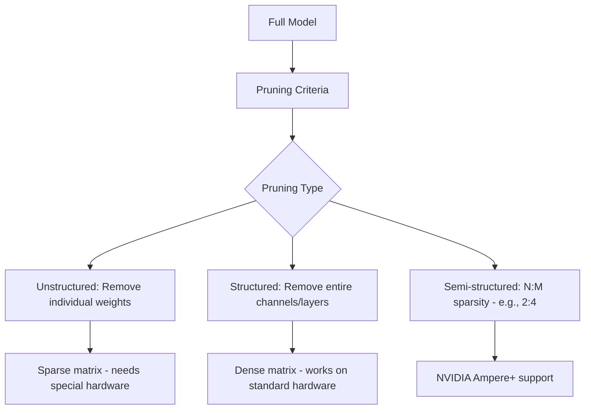
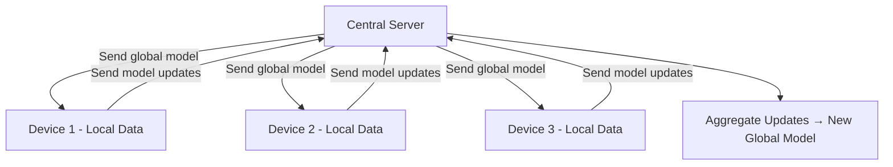
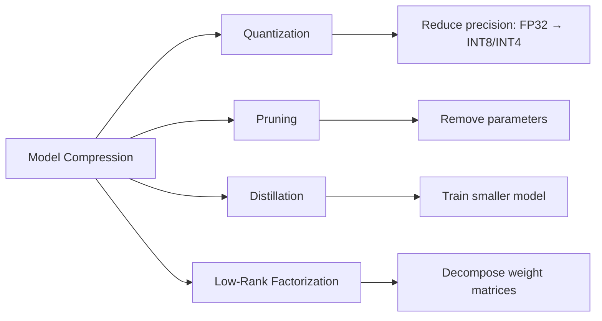

# Advanced ML Topics

## Overview

This section covers advanced machine learning techniques that are critical for production systems, model optimization, and cutting-edge research. These topics frequently appear in ML interviews at top tech companies and are essential for understanding how to deploy ML models efficiently.

## Topics Covered

## Knowledge Distillation

Knowledge distillation transfers knowledge from a large, powerful model (teacher) to a smaller, faster model (student). The student learns to mimic the teacher's output distribution, not just the hard labels.

**Key insight:** Soft labels contain more information than hard labels. A teacher predicting [0.7, 0.2, 0.1] tells the student that class 0 and 1 are somewhat similar — this "dark knowledge" is lost in hard labels [1, 0, 0].

### Distillation Loss

\\[
L = \alpha \cdot L_{CE}(y, \hat{y}_{student}) + (1-\alpha) \cdot T^2 \cdot KL(\hat{y}_{teacher}/T \| \hat{y}_{student}/T)
\\]

- **Temperature (T)**: Higher T → softer probability distributions (typically T=3-20)
- **α**: Balance between hard label loss and distillation loss
- **KL divergence**: Measures difference between teacher and student distributions

### Real-World Examples

| Teacher | Student | Result |
|---------|---------|--------|
| BERT-large (340M) | DistilBERT (66M) | 97% performance, 40% smaller, 60% faster |
| GPT-4 | GPT-4o-mini | Competitive performance, much cheaper |
| ResNet-152 | MobileNet | Deployable on mobile devices |

## Model Quantization

Quantization reduces the precision of model weights and activations from 32-bit floating point to lower bit-widths (16, 8, 4, or even 2 bits).

| Precision | Bits | Size Reduction | Speed Gain | Accuracy Loss |
|-----------|------|---------------|------------|---------------|
| FP32 | 32 | 1× (baseline) | 1× | None |
| FP16/BF16 | 16 | 2× | ~2× | Negligible |
| INT8 | 8 | 4× | ~3-4× | Small |
| INT4 | 4 | 8× | ~5-8× | Moderate |
| Binary | 1 | 32× | ~10×+ | Significant |

### Quantization Methods

| Method | When Applied | Description |
|--------|-------------|-------------|
| **Post-Training Quantization (PTQ)** | After training | Quantize weights directly, no retraining |
| **Quantization-Aware Training (QAT)** | During training | Simulate quantization in forward pass |
| **Dynamic Quantization** | At inference | Quantize activations on-the-fly |
| **GPTQ / AWQ / GGUF** | LLM-specific | Advanced 4-bit quantization for LLMs |

**Interview tip:** INT8 quantization is the sweet spot for most production systems — 4× size reduction with minimal accuracy loss. For LLMs, 4-bit quantization (GPTQ/AWQ) enables running 70B parameter models on a single GPU.

## Model Pruning

Pruning removes unnecessary weights, neurons, or entire structures from a neural network.

| Pruning Type | Example | Hardware Requirement | Speedup |
|-------------|---------|---------------------|---------|
| Unstructured | Remove 50% of smallest weights | Sparse matrix support | 2-3× (with support) |
| Structured | Remove entire CNN filters | Standard GPU | Direct speedup |
| N:M Sparsity | Keep N of every M weights | NVIDIA A100+ | ~2× |

## Neural Architecture Search (NAS)

NAS automates the design of neural network architectures, searching over a space of possible architectures to find the optimal one.

| NAS Component | Options |
|--------------|---------|
| **Search Space** | Cell-based, macro search, hierarchical |
| **Search Strategy** | Reinforcement learning, evolutionary, gradient-based (DARTS) |
| **Evaluation Strategy** | Full training, weight sharing, one-shot |

**DARTS (Differentiable NAS):** Makes the search space continuous and differentiable, enabling gradient-based search — much faster than RL-based approaches.

## Federated Learning

Federated learning enables training models across multiple decentralized devices/servers holding local data, without sharing the raw data.

| Aspect | Description |
|--------|-------------|
| **Privacy** | Raw data never leaves the device |
| **Communication** | Only model updates are transmitted |
| **Challenges** | Non-IID data, communication cost, Byzantine failures |
| **Aggregation** | FedAvg (averaging), FedProx (constrained optimization) |
| **Applications** | Keyboard prediction (Google), healthcare (hospitals), finance (banks) |

## Edge ML / On-Device Inference

Running ML models directly on edge devices (phones, IoT, embedded systems) instead of sending data to the cloud.

| Framework | Platform | Format |
|-----------|----------|--------|
| TensorFlow Lite | Android, IoT | .tflite |
| Core ML | iOS, macOS | .mlmodel |
| ONNX Runtime Mobile | Cross-platform | .onnx |
| TensorRT | NVIDIA GPUs | .engine |
| ExecuTorch | Cross-platform (PyTorch) | .pte |

### Optimization Techniques for Edge

1. **Quantization**: FP32 → INT8 (most impactful)
2. **Pruning**: Remove redundant parameters
3. **Architecture design**: MobileNet, EfficientNet, TinyBERT
4. **Knowledge distillation**: Train small model from large teacher
5. **Operator fusion**: Combine multiple operations into one kernel
6. **Hardware-specific compilation**: TVM, XLA, Core ML compiler

## Model Compression Comparison

## Interview Questions

### Theory Questions

1. **Explain knowledge distillation. Why does it work?**
   A small student model is trained to match the soft probability distribution of a large teacher model. It works because soft labels contain "dark knowledge" — information about inter-class relationships that hard labels lack. The temperature parameter controls how much this knowledge is revealed.

2. **What is the difference between PTQ and QAT?**
   PTQ (Post-Training Quantization): quantize after training, no retraining needed, fast but may lose more accuracy. QAT (Quantization-Aware Training): simulate quantization during training, better accuracy but requires training infrastructure. Use PTQ when you need quick deployment; QAT when accuracy is critical.

3. **When would you use structured vs unstructured pruning?**
   Structured pruning: removes entire channels/heads, works on standard hardware, but less granular. Unstructured pruning: removes individual weights, higher compression but needs sparse matrix support. In practice, structured pruning is preferred for production.

4. **What is federated learning and when would you use it?**
   Training models across decentralized devices without sharing raw data. Use when data is privacy-sensitive (healthcare, finance), distributed by nature (mobile keyboards), or too large to centralize.

### Practical Questions

5. **You need to deploy a 7B parameter LLM on a single GPU with 24GB VRAM. How?**
   A 7B model in FP16 is ~14GB. Options: (1) 4-bit quantization (GPTQ/AWQ) → ~3.5GB. (2) 8-bit quantization → ~7GB. (3) Use vLLM with paged attention for efficient KV cache. (4) GGUF format with llama.cpp for CPU+GPU hybrid inference.

6. **How do you compress a model for mobile deployment?**
   Pipeline: (1) Train full model. (2) Knowledge distillation to smaller architecture. (3) Pruning (structured). (4) Quantization (INT8). (5) Export to mobile format (TFLite/CoreML). (6) Benchmark on target device. (7) Iterate on accuracy/latency tradeoff.

7. **What is the relationship between model size and performance?**
   Scaling laws show performance improves predictably with more parameters, data, and compute. However, smaller models trained with better data/techniques can match larger ones (e.g., Llama 3 8B outperforms Llama 2 70B on some tasks).

## Summary

Advanced ML techniques enable deploying accurate models within real-world constraints. Knowledge distillation, quantization, pruning, and compression reduce model size and latency. NAS automates architecture design. Federated learning enables privacy-preserving training. Edge ML brings inference to devices.

## References

- Hinton, G. et al. (2015). "Distilling the Knowledge in a Neural Network" — Foundational distillation paper
- Jacob, B. et al. (2018). "Quantization and Training of Neural Networks for Efficient Integer-Arithmetic-Only Inference" — INT8 quantization
- Han, S. et al. (2015). "Learning both Weights and Connections for Efficient Neural Networks" — Pruning
- McMahan, B. et al. (2017). "Communication-Efficient Learning of Deep Networks from Decentralized Data" — FedAvg
- Frantar, E. et al. (2022). "GPTQ: Accurate Post-Training Quantization for Generative Pre-trained Transformers" — LLM quantization
- Lin, J. et al. (2024). "AWQ: Activation-aware Weight Quantization for LLM Compression and Acceleration"

## Cross-References

- [Deep Learning](../deep-learning/README.md) — Foundation concepts
- [Transformers](../transformers/README.md) — Architecture details
- [MLOps](../mlops/README.md) — Production deployment
- [Model Serving](../system-design/model-serving.md) — Serving architecture
