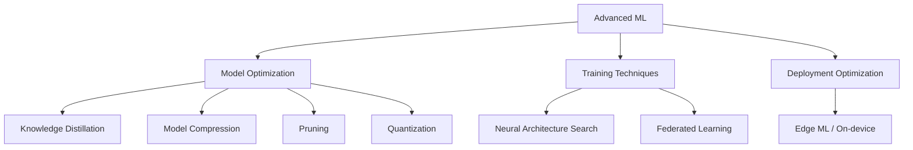

# Advanced ML Topics

## Overview

This section covers advanced machine learning techniques that are critical for production systems, model optimization, and cutting-edge research. These topics frequently appear in ML interviews at top tech companies and are essential for understanding how to deploy ML models efficiently.

## Topics Covered

## Interview Questions

1. **Why are these techniques important?** — Production ML models need to be fast, small, and efficient. These techniques bridge the gap between research accuracy and production constraints.

2. **When would you use model compression?** — When deploying to resource-constrained environments (mobile, IoT), reducing inference costs, or meeting latency requirements.

3. **What is the trade-off between model size and accuracy?** — Compression techniques typically sacrifice some accuracy for significant gains in size and speed. The key is finding the right balance for your use case.

## Summary

Advanced ML techniques enable deploying accurate models within real-world constraints. Knowledge distillation, quantization, pruning, and compression reduce model size and latency. NAS automates architecture design. Federated learning enables privacy-preserving training. Edge ML brings inference to devices.

## Cross-References

- [Deep Learning](../deep-learning/README.md) — Foundation concepts
- [Transformers](../transformers/README.md) — Architecture details
- [MLOps](../mlops/README.md) — Production deployment
- [Model Serving](../system-design/model-serving.md) — Serving architecture
