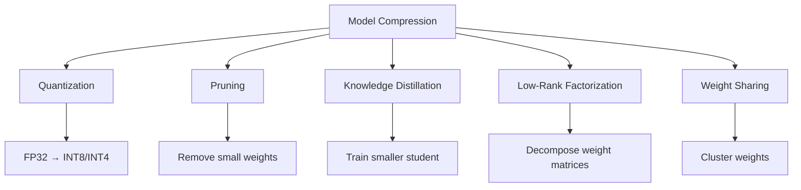

# Model Compression

## Overview

Model compression reduces the size and computational cost of ML models while preserving accuracy. This is essential for deploying models on resource-constrained devices (mobile, IoT, embedded systems) or reducing inference costs in the cloud. The main techniques are quantization, pruning, knowledge distillation, and low-rank factorization.

## Compression Techniques Overview



## Technique Comparison

| Technique | Size Reduction | Speedup | Accuracy Loss | Complexity |
|-----------|---------------|---------|---------------|------------|
| Quantization | 2-4x | 2-4x | Low | Low |
| Pruning | 2-10x | 2-5x | Low-Medium | Medium |
| Distillation | 2-10x | 2-10x | Medium | High |
| Low-Rank | 2-4x | 2-4x | Low | Medium |
| Weight Sharing | 2-8x | 1x | Low | Low |

## Low-Rank Factorization

Decompose large weight matrices into smaller factors:

```python
import torch

def low_rank_decompose(weight, rank):
    """Decompose W (m×n) into U (m×r) @ V (r×n)"""
    U, S, V = torch.svd(weight)
    U_r = U[:, :rank] * S[:rank].sqrt()
    V_r = V[:, :rank].T * S[:rank].sqrt().unsqueeze(-1)
    return U_r, V_r

# Original: Linear(512, 512) = 262,144 parameters
# Decomposed: Linear(512, 64) + Linear(64, 512) = 65,536 parameters
# 4x compression
```

## Weight Sharing (K-Means)

```python
from sklearn.cluster import KMeans

def weight_sharing(model, num_clusters=256):
    """Cluster weights and share centroids"""
    for name, param in model.named_parameters():
        weights = param.data.cpu().numpy().flatten()

        # Cluster weights
        kmeans = KMeans(n_clusters=num_clusters, random_state=42)
        kmeans.fit(weights.reshape(-1, 1))

        # Replace weights with cluster centroids
        shared_weights = kmeans.cluster_centers_[kmeans.labels_].reshape(param.shape)
        param.data = torch.tensor(shared_weights, dtype=param.dtype)

        # Store codebook (centroids + indices)
        centroids = kmeans.cluster_centers_.flatten()
        indices = kmeans.labels_

    return model, centroids, indices
```

## Combining Techniques

```python
def compress_model(model):
    """Apply multiple compression techniques"""
    # Step 1: Pruning
    model = prune_model(model, sparsity=0.5)

    # Step 2: Quantization
    model = quantize_model(model, bits=8)

    # Step 3: Distillation (optional, train a smaller model)
    student = create_student(model, compression_ratio=4)
    student = distill(model, student, train_data)

    return student
```

## Interview Questions

1. **What are the main model compression techniques?** — Quantization (reduce precision), pruning (remove weights), distillation (train smaller model), low-rank factorization (decompose matrices), and weight sharing (cluster weights).

2. **When would you use each technique?** — Quantization: easiest, general-purpose. Pruning: when model is overparameterized. Distillation: when you need a fundamentally smaller architecture. Low-rank: for large linear layers.

3. **Can you combine compression techniques?** — Yes, they're complementary. Common pipeline: distillation (smaller architecture) → pruning (remove redundancy) → quantization (reduce precision).

4. **What is the accuracy-size trade-off?** — Typically 2-4x compression with <1% accuracy loss. Beyond 10x, accuracy degrades significantly. The exact trade-off depends on the task and model.

5. **How do you evaluate compression quality?** — Compare accuracy, model size, inference latency, and memory usage before and after compression. Test on the target deployment hardware.

## Summary

Model compression is essential for deploying ML models in production. Quantization, pruning, and distillation are the most practical techniques, often combined for maximum effect. The key is balancing compression ratio with accuracy loss for the target deployment environment.

## Cross-References

- [Quantization](./quantization.md) — Detailed quantization
- [Pruning](./pruning.md) — Detailed pruning
- [Knowledge Distillation](./distillation.md) — Detailed distillation
- [Edge ML](./edge.md) — Deployment targets
- [Quantization (LLM)](../../llm/llm-serving/quantization.md) — LLM-specific
