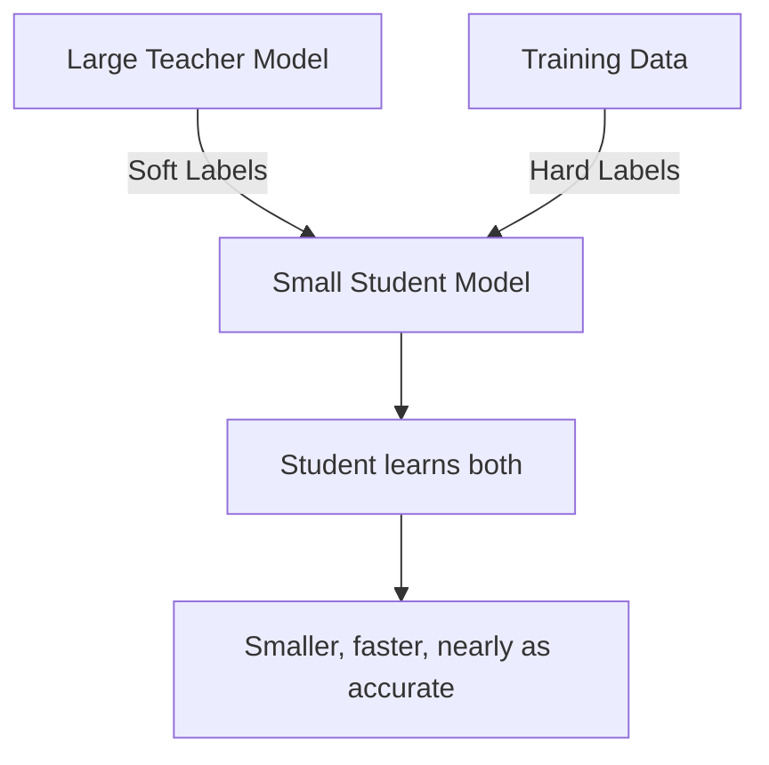

# Knowledge Distillation

## Overview

Knowledge distillation transfers knowledge from a large, complex model (teacher) to a smaller, faster model (student). The student learns not just from the ground truth labels but from the teacher's soft probability distributions, which contain richer information about class relationships. This enables deploying compact models that retain much of the teacher's accuracy.

## The Core Idea



### Why Soft Labels Help

```python
# Hard label: [0, 0, 1, 0]  (just the correct class)
# Soft label: [0.01, 0.05, 0.90, 0.04]  (teacher's confidence distribution)

# Soft labels reveal:
# - Class 2 and 3 are somewhat similar (both have non-zero prob)
# - Class 1 is very different from the correct class
# This "dark knowledge" helps the student learn better representations
```

## Distillation Loss

The student's loss combines two objectives:

$$L = \alpha \cdot L_{hard} + (1 - \alpha) \cdot T^2 \cdot L_{soft}$$

where:
- $L_{hard}$: Cross-entropy with true labels
- $L_{soft}$: KL divergence between teacher and student soft predictions
- $T$: Temperature (softens the probability distribution)
- $\alpha$: Balance between hard and soft losses

```python
import torch
import torch.nn as nn
import torch.nn.functional as F

class DistillationLoss(nn.Module):
    def __init__(self, temperature=4.0, alpha=0.7):
        super().__init__()
        self.temperature = temperature
        self.alpha = alpha
        self.ce_loss = nn.CrossEntropyLoss()
        self.kl_loss = nn.KLDivLoss(reduction='batchmean')

    def forward(self, student_logits, teacher_logits, labels):
        # Hard loss: student vs true labels
        hard_loss = self.ce_loss(student_logits, labels)

        # Soft loss: student vs teacher (with temperature)
        soft_student = F.log_softmax(student_logits / self.temperature, dim=1)
        soft_teacher = F.softmax(teacher_logits / self.temperature, dim=1)
        soft_loss = self.kl_loss(soft_student, soft_teacher)

        # Combined loss
        total_loss = (self.alpha * hard_loss +
                     (1 - self.alpha) * self.temperature ** 2 * soft_loss)
        return total_loss
```

## Temperature Scaling

Temperature $T$ controls how "soft" the probability distribution becomes:

$$p_i = \frac{\exp(z_i / T)}{\sum_j \exp(z_j / T)}$$

- $T = 1$: Standard softmax
- $T > 1$: Softer distribution (more uniform, reveals class relationships)
- $T \to \infty$: Uniform distribution
- $T \to 0$: One-hot (argmax)

```python
def soft_softmax(logits, temperature):
    """Temperature-scaled softmax"""
    return F.softmax(logits / temperature, dim=1)

# Example
logits = torch.tensor([5.0, 3.0, 1.0, 0.5])

print("T=1:", soft_softmax(logits, 1.0))   # [0.84, 0.12, 0.02, 0.01]
print("T=4:", soft_softmax(logits, 4.0))   # [0.38, 0.29, 0.19, 0.14]
print("T=10:", soft_softmax(logits, 10.0)) # [0.30, 0.27, 0.23, 0.21]
```

## Training Procedure

```python
def train_distillation(teacher, student, train_loader, optimizer, epochs):
    teacher.eval()  # Teacher is frozen
    criterion = DistillationLoss(temperature=4.0, alpha=0.7)

    for epoch in range(epochs):
        for inputs, labels in train_loader:
            # Teacher forward (no gradients)
            with torch.no_grad():
                teacher_logits = teacher(inputs)

            # Student forward
            student_logits = student(inputs)

            # Distillation loss
            loss = criterion(student_logits, teacher_logits, labels)

            optimizer.zero_grad()
            loss.backward()
            optimizer.step()
```

## Distillation Variants

| Variant | Description | Use Case |
|---------|-------------|----------|
| Response-based | Match final logits | Standard distillation |
| Feature-based | Match intermediate features | Deeper alignment |
| Relation-based | Match relationships between samples | Structured knowledge |
| Self-distillation | Teacher = student at earlier epoch | No separate teacher needed |
| Online distillation | Teacher and student train together | No pre-trained teacher |

### Feature-Based Distillation

```python
class FeatureDistillation(nn.Module):
    def __init__(self, teacher_dim, student_dim):
        super().__init__()
        # Projection to match dimensions
        self.projector = nn.Linear(student_dim, teacher_dim)

    def forward(self, student_features, teacher_features):
        projected = self.projector(student_features)
        return F.mse_loss(projected, teacher_features)
```

## Interview Questions

1. **What is knowledge distillation?** — Training a small student model to mimic a large teacher model's behavior. The student learns from the teacher's soft probability distributions, which contain richer information than hard labels.

2. **Why does temperature matter?** — Higher temperature produces softer probability distributions that reveal inter-class relationships. This "dark knowledge" helps the student learn better decision boundaries.

3. **What is the distillation loss formula?** — $L = \alpha \cdot L_{CE}(student, labels) + (1-\alpha) \cdot T^2 \cdot L_{KL}(student/T, teacher/T)$. The $T^2$ factor compensates for the reduced gradient magnitude at higher temperatures.

4. **When would you use distillation?** — Deploying large models to mobile/edge devices, reducing inference costs, compressing ensemble models into single models, or transferring knowledge across modalities.

5. **Distillation vs pruning vs quantization?** — Distillation: trains a new smaller model. Pruning: removes weights from existing model. Quantization: reduces precision of existing model. They can be combined.

## Common Mistakes

- Using temperature too high (loses discriminative information)
- Not scaling the soft loss by $T^2$ (gradient magnitude issues)
- Training student and teacher jointly without careful balancing
- Using a weak teacher (student can't learn much)
- Not matching the student architecture to the target deployment

## Summary

Knowledge distillation transfers rich knowledge from large teacher models to compact student models through soft probability distributions. The temperature parameter controls distribution softness, and the loss balances hard and soft objectives. Distillation is a powerful technique for deploying efficient models that retain much of the teacher's accuracy.

## Cross-References

- [Neural Network Basics](../deep-learning/nn-basics.md) — Foundation
- [Loss Functions](../foundations/loss-functions.md) — KL divergence
- [Quantization](./quantization.md) — Complementary technique
- [Pruning](./pruning.md) — Complementary technique
- [Edge ML](./edge.md) — Deployment target
