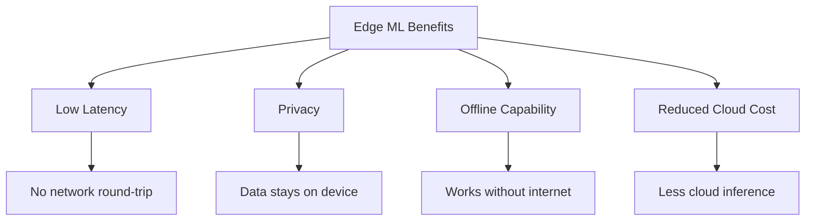

# Edge ML / On-Device ML

## Overview

Edge ML refers to running machine learning models directly on edge devices — smartphones, IoT sensors, embedded systems, and browsers — rather than in the cloud. This enables real-time inference, offline operation, data privacy, and reduced latency. The challenge is fitting accurate models within the severe compute, memory, and power constraints of edge devices.

## Why Edge ML?



## Edge Hardware

| Platform | Compute | Memory | Frameworks |
|----------|---------|--------|------------|
| Mobile (Android) | CPU/GPU/NPU | 2-8 GB | TFLite, NNAPI |
| Mobile (iOS) | CPU/GPU/Neural Engine | 2-8 GB | Core ML |
| Raspberry Pi | CPU/GPU | 1-8 GB | TFLite, ONNX RT |
| Microcontroller | CPU only | 256KB-2MB | TFLite Micro |
| Browser | CPU/WebGL/WASM | Limited | TensorFlow.js |
| Jetson | GPU (NVIDIA) | 4-64 GB | TensorRT |

## Model Optimization for Edge

### 1. Architecture Design

```python
# MobileNet: Depthwise separable convolutions
class DepthwiseSeparable(nn.Module):
    def __init__(self, in_ch, out_ch, stride=1):
        super().__init__()
        # Depthwise: one filter per channel
        self.depthwise = nn.Conv2d(in_ch, in_ch, 3, stride, 1, groups=in_ch)
        self.bn1 = nn.BatchNorm2d(in_ch)
        # Pointwise: 1x1 conv to combine
        self.pointwise = nn.Conv2d(in_ch, out_ch, 1)
        self.bn2 = nn.BatchNorm2d(out_ch)

    def forward(self, x):
        x = F.relu(self.bn1(self.depthwise(x)))
        x = F.relu(self.bn2(self.pointwise(x)))
        return x

# Regular conv: 3×3×Cin×Cout = 9×Cin×Cout parameters
# Depthwise separable: 3×3×Cin + Cin×Cout = Cin×(9 + Cout) parameters
# For 256→512: 1,179,648 → 133,376 (≈8.8x reduction)
```

### 2. TensorFlow Lite

```python
import tensorflow as tf

# Convert model
converter = tf.lite.TFLiteConverter.from_saved_model("model/")
tflite_model = converter.convert()

# Quantize
converter.optimizations = [tf.lite.Optimize.DEFAULT]
converter.target_spec.supported_types = [tf.float16]  # FP16 quantization
tflite_quant_model = converter.convert()

# Run inference
interpreter = tf.lite.Interpreter(model_content=tflite_quant_model)
interpreter.allocate_tensors()
input_details = interpreter.get_input_details()
output_details = interpreter.get_output_details()

interpreter.set_tensor(input_details[0]['index'], input_data)
interpreter.invoke()
output = interpreter.get_tensor(output_details[0]['index'])
```

### 3. Core ML (iOS)

```python
import coremltools as ct

# Convert PyTorch to CoreML
model = MyModel()
traced = torch.jit.trace(model, example_input)
coreml_model = ct.convert(
    traced,
    inputs=[ct.TensorType(shape=example_input.shape)],
    compute_units=ct.ComputeUnit.ALL,  # CPU + GPU + Neural Engine
)
coreml_model.save("Model.mlpackage")
```

### 4. ONNX Runtime Mobile

```python
import onnxruntime as ort

# Optimize for mobile
from onnxruntime.transformers import optimizer
optimized_model = optimizer.optimize_model("model.onnx", model_type='bert')

# Run on mobile
session = ort.InferenceSession("model_mobile.onnx",
    providers=['CPUExecutionProvider'])
output = session.run(None, {"input": input_data})
```

## Model Size Budget

| Device | Model Size | Latency Target |
|--------|-----------|----------------|
| Flagship phone | 10-100 MB | < 50ms |
| Budget phone | 1-10 MB | < 100ms |
| Smartwatch | < 5 MB | < 200ms |
| Microcontroller | < 1 MB | < 500ms |
| Browser | < 20 MB | < 100ms |

## Interview Questions

1. **What are the key challenges of Edge ML?** — Limited compute (CPU/GPU), memory constraints, power consumption, model size restrictions, and diverse hardware platforms.

2. **How do you optimize models for mobile?** — Architecture design (MobileNet, EfficientNet), quantization (INT8/FP16), pruning, knowledge distillation, and framework-specific optimization (TFLite, CoreML).

3. **What is MobileNet and why is it efficient?** — Uses depthwise separable convolutions, which split a standard convolution into depthwise (per-channel) and pointwise (1×1) operations, reducing parameters by ~8x.

4. **TFLite vs CoreML vs ONNX?** — TFLite: Android, cross-platform. CoreML: iOS, Apple hardware optimization. ONNX: cross-framework, cross-platform. Choose based on target platform.

5. **How do you handle on-device training?** — Federated learning, on-device fine-tuning with limited data, or transfer learning with frozen layers. Challenge: limited compute and data on device.

## Summary

Edge ML enables real-time, privacy-preserving inference on resource-constrained devices. Key techniques include efficient architectures (MobileNet), quantization, pruning, and platform-specific optimizations (TFLite, CoreML). The challenge is balancing model accuracy with device constraints.

## Cross-References

- [Quantization](./quantization.md) — Precision reduction
- [Pruning](./pruning.md) — Weight removal
- [Knowledge Distillation](./distillation.md) — Smaller models
- [Model Compression](./compression.md) — Compression overview
- [Federated Learning](./federated.md) — On-device training
- [Cloud Lambda](../../cloud/aws/lambda.md)
