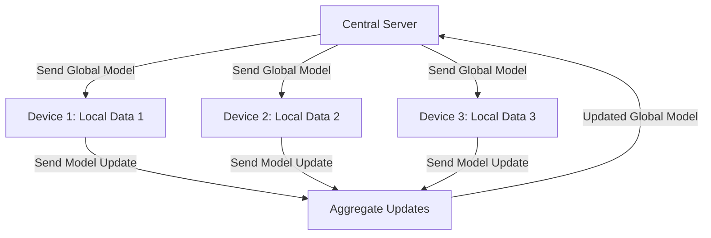
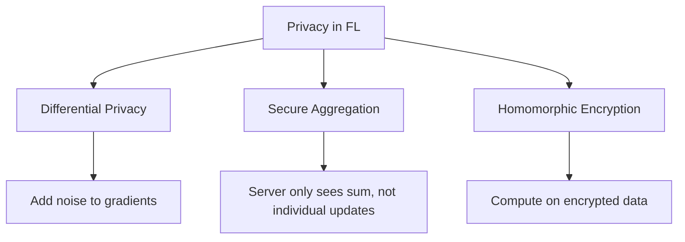

# Federated Learning

## Overview

Federated Learning (FL) enables training ML models across multiple decentralized devices or servers holding local data, without exchanging raw data. Instead of centralizing data, each participant trains locally and shares only model updates. This preserves privacy, reduces data transfer, and enables training on sensitive data (healthcare, finance, mobile keyboards).

## How Federated Learning Works



### Federated Averaging (FedAvg)

```python
import copy

def federated_averaging(global_model, client_data, num_rounds=100, local_epochs=5):
    for round in range(num_rounds):
        # Select subset of clients
        selected_clients = random.sample(list(client_data.keys()), k=10)

        # Each client trains locally
        client_updates = []
        for client_id in selected_clients:
            local_model = copy.deepcopy(global_model)
            local_model = train_local(local_model, client_data[client_id], local_epochs)
            client_updates.append(get_model_params(local_model))

        # Aggregate updates (weighted average)
        global_params = aggregate(client_updates)
        set_model_params(global_model, global_params)

    return global_model

def aggregate(client_updates):
    """FedAvg: weighted average of client model parameters"""
    avg_params = {}
    for key in client_updates[0].keys():
        avg_params[key] = sum(update[key] for update in client_updates) / len(client_updates)
    return avg_params
```

## Privacy Techniques



### Differential Privacy

```python
def add_noise_to_gradients(gradients, noise_multiplier=1.0, max_grad_norm=1.0):
    """Add calibrated noise for differential privacy"""
    # Clip gradients
    grad_norm = torch.norm(torch.stack([torch.norm(g) for g in gradients]))
    clip_factor = min(1.0, max_grad_norm / grad_norm)
    clipped_grads = [g * clip_factor for g in gradients]

    # Add Gaussian noise
    noise_std = noise_multiplier * max_grad_norm
    noisy_grads = [g + torch.randn_like(g) * noise_std for g in clipped_grads]

    return noisy_grads
```

## Challenges

| Challenge | Description | Solution |
|-----------|-------------|----------|
| Non-IID Data | Clients have different data distributions | FedProx, personalized FL |
| Communication Cost | Sending model updates is expensive | Compression, sparsification |
| Stragglers | Slow clients delay training | Asynchronous FL |
| Byzantine Failures | Malicious clients send bad updates | Robust aggregation |
| Heterogeneous Devices | Different compute capabilities | Adaptive local computation |

## Federated Learning Variants

| Variant | Description | Use Case |
|---------|-------------|----------|
| FedAvg | Average model weights | Standard FL |
| FedProx | Proximal term prevents divergence | Non-IID data |
| FedMA | Match-and-average | Different architectures |
| Personalized FL | Per-client models | Heterogeneous tasks |
| Cross-device | Millions of mobile devices | Mobile keyboard |
| Cross-silo | Few organizations | Healthcare, finance |

## Interview Questions

1. **What is federated learning?** — Training ML models across decentralized devices without sharing raw data. Each device trains locally and shares only model updates, which are aggregated centrally.

2. **How does FedAvg work?** — Each selected client trains the global model on local data for several epochs. The server averages the resulting model parameters weighted by client dataset size.

3. **What are the privacy guarantees of FL?** — Raw data never leaves the device. Additional privacy comes from differential privacy (noise), secure aggregation (server only sees sum), and encryption.

4. **What is the non-IID problem in FL?** — Clients have different data distributions (e.g., different typing patterns). This causes model divergence. Solutions include FedProx, personalized FL, and data sharing strategies.

5. **When would you use federated learning?** — When data is sensitive (healthcare, finance), when data is too large to centralize (mobile devices), or when regulations prevent data sharing (GDPR).

## Summary

Federated Learning enables privacy-preserving model training across decentralized data sources. FedAvg is the foundational algorithm, with variants addressing non-IID data, communication efficiency, and robustness. Privacy techniques (DP, secure aggregation) provide additional guarantees. FL is essential for healthcare, finance, and mobile applications.

## Cross-References

- [Neural Network Basics](../deep-learning/nn-basics.md) — Foundation
- [Optimization](../foundations/optimization.md) — SGD, aggregation
- [Distributed Systems](../../distributed/overview.md) — Distributed computation
- [Edge ML](./edge.md) — On-device deployment
- [MLOps](../mlops/README.md) — Production ML
