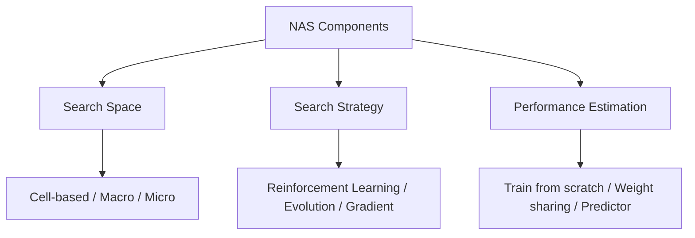
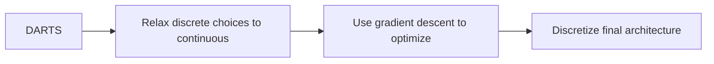

# Neural Architecture Search (NAS)

## Overview

Neural Architecture Search (NAS) automates the design of neural network architectures. Instead of manually designing architectures through trial and error, NAS defines a **search space** of possible architectures and uses an optimization strategy to find the best one. NAS has discovered architectures that outperform human-designed ones on benchmarks like ImageNet.

## NAS Framework



## Search Space

### Cell-Based Search

Instead of searching the entire network, search for a **cell** (building block) that is repeated:

```python
# Cell = DAG of operations
# Each edge can be: conv 3x3, conv 5x5, max pool, avg pool, skip, none
search_space = {
    "operations": [
        "conv_3x3", "conv_5x5", "conv_7x7",
        "max_pool_3x3", "avg_pool_3x3",
        "skip_connect", "none"
    ],
    "num_nodes": 4,  # Intermediate nodes in cell
    "num_edges_per_node": 2,  # Each node takes 2 inputs
}
```

### DARTS (Differentiable Architecture Search)

Instead of discrete search, relax the architecture to be continuous and use gradient descent:

```python
import torch
import torch.nn as nn
import torch.nn.functional as F

class DARTSCell(nn.Module):
    def __init__(self, num_ops, C):
        super().__init__()
        self.ops = nn.ModuleList([
            nn.Sequential(nn.Conv2d(C, C, 3, padding=1), nn.BatchNorm2d(C), nn.ReLU()),
            nn.Sequential(nn.Conv2d(C, C, 5, padding=2), nn.BatchNorm2d(C), nn.ReLU()),
            nn.MaxPool2d(3, 1, 1),
            nn.Identity(),  # Skip connection
        ])
        # Architecture parameters (softmax over operations)
        self.arch_params = nn.Parameter(torch.randn(num_ops))

    def forward(self, x):
        weights = F.softmax(self.arch_params, dim=0)
        # Weighted sum of all operations
        return sum(w * op(x) for w, op in zip(weights, self.ops))
```



## Search Strategies

| Strategy | Method | Pros | Cons |
|----------|--------|------|------|
| Reinforcement Learning | Controller RNN samples architectures | Principled, effective | Very expensive |
| Evolution | Mutation + selection | Flexible, no gradients | Slow |
| Gradient (DARTS) | Differentiable relaxation | Fast (GPU hours) | Can overfit |
| Bayesian Optimization | Surrogate model | Sample efficient | Limited to small spaces |
| One-shot | Train supernet, sample subnets | Very fast | Weight sharing bias |

### RL-Based NAS

```python
class NASController(nn.Module):
    """RNN controller that samples architectures"""
    def __init__(self, num_ops, hidden_size=64):
        super().__init__()
        self.rnn = nn.LSTM(num_ops, hidden_size)
        self.fc = nn.Linear(hidden_size, num_ops)

    def sample_architecture(self, num_layers):
        actions = []
        hidden = None
        input = torch.zeros(1, 1, num_ops)  # Start token

        for _ in range(num_layers):
            output, hidden = self.rnn(input, hidden)
            logits = self.fc(output.squeeze())
            probs = F.softmax(logits, dim=0)
            action = torch.multinomial(probs, 1)
            actions.append(action.item())
            input = F.one_hot(action, num_ops).unsqueeze(0).unsqueeze(0)

        return actions  # Architecture specification
```

## Performance Estimation

Training every candidate from scratch is prohibitively expensive. Alternatives:

| Method | Speed | Accuracy | Description |
|--------|-------|----------|-------------|
| Full training | Slow | High | Train to convergence |
| Weight sharing | Fast | Medium | Share weights in supernet |
| Early stopping | Medium | Medium | Train for few epochs |
| Predictor | Very fast | Low | Predict accuracy from architecture |

### Weight Sharing (One-Shot NAS)

```python
class OneShotNAS(nn.Module):
    """Supernet where all operations exist simultaneously"""
    def __init__(self, num_ops, num_layers, C):
        super().__init__()
        self.layers = nn.ModuleList([
            DARTSCell(num_ops, C) for _ in range(num_layers)
        ])
        self.classifier = nn.Linear(C, 10)

    def forward(self, x, arch_params_list):
        for layer, arch_params in zip(self.layers, arch_params_list):
            layer.arch_params = arch_params
            x = layer(x)
        return self.classifier(x.mean(dim=[2, 3]))
```

## Discovered Architectures

| Architecture | Source | Key Innovation |
|-------------|--------|---------------|
| NASNet | RL (Google) | Cell-based search |
| DARTS | Gradient | Differentiable search |
| EfficientNet | NAS + scaling | Compound scaling |
| MnasNet | RL | Multi-objective (latency + accuracy) |
| Once-for-All | One-shot | Train once, deploy many |

## Interview Questions

1. **What is NAS?** — Automating neural network architecture design by defining a search space and optimization strategy. NAS discovers architectures that outperform human-designed ones.

2. **What are the three components of NAS?** — Search space (what architectures are possible), search strategy (how to explore), and performance estimation (how to evaluate candidates efficiently).

3. **How does DARTS work?** — It relaxes the discrete architecture choice to a continuous softmax over operations, enabling gradient-based optimization. After search, the architecture is discretized.

4. **Why is NAS expensive?** — The search space is enormous (billions of architectures). Each evaluation requires training a network. Weight sharing (one-shot NAS) dramatically reduces cost.

5. **What is EfficientNet and how was it discovered?** — EfficientNet was found via NAS combined with compound scaling (uniformly scaling depth, width, and resolution). It achieves state-of-the-art accuracy with fewer FLOPs.

## Common Mistakes

- Using too large a search space (combinatorial explosion)
- Not accounting for hardware constraints (latency, memory)
- Evaluating on proxy task (small dataset) without validating on target
- Overfitting the architecture to the validation set

## Summary

NAS automates architecture design through search spaces, strategies, and efficient evaluation. DARTS enables gradient-based search, while one-shot methods dramatically reduce cost. NAS-discovered architectures like EfficientNet set new efficiency benchmarks. While computationally expensive, NAS is increasingly practical with modern techniques.

## Cross-References

- [CNNs](../deep-learning/cnn.md) — Convolutional building blocks
- [Transformers](../transformers/README.md) — Architecture design
- [Optimization](../foundations/optimization.md) — Search strategies
- [Edge ML](./edge.md) — Deployment constraints
- [Model Compression](./compression.md) — Post-search optimization
