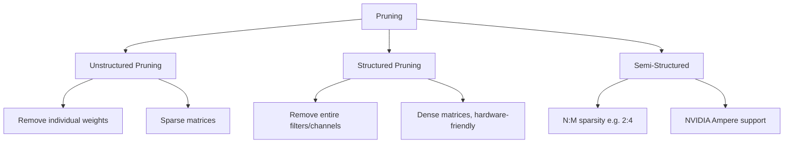

# Pruning

## Overview

Pruning removes redundant parameters (weights, neurons, or entire layers) from a trained model to reduce size and improve inference speed. The key insight is that trained neural networks are heavily overparameterized — many weights contribute little to the output. Pruning identifies and removes these unimportant parameters while preserving accuracy.

## Types of Pruning



## Unstructured Pruning

```python
import torch.nn.utils.prune as prune

def magnitude_pruning(model, sparsity=0.5):
    """Remove smallest weights globally"""
    for name, module in model.named_modules():
        if isinstance(module, (torch.nn.Linear, torch.nn.Conv2d)):
            prune.l1_unstructured(module, name='weight', amount=sparsity)

    # Make pruning permanent
    for name, module in model.named_modules():
        if isinstance(module, (torch.nn.Linear, torch.nn.Conv2d)):
            prune.remove(module, 'weight')

    return model
```

### Global vs Local Pruning

```python
# Global pruning: prune across all layers
parameters_to_prune = [
    (module, 'weight')
    for module in model.modules()
    if isinstance(module, (torch.nn.Linear, torch.nn.Conv2d))
]

prune.global_unstructured(
    parameters_to_prune,
    pruning_method=prune.L1Unstructured,
    amount=0.5,  # 50% of all weights globally
)
```

## Structured Pruning

```python
def structured_pruning(model, sparsity=0.3):
    """Remove entire channels/filters"""
    for name, module in model.named_modules():
        if isinstance(module, torch.nn.Conv2d):
            prune.ln_structured(
                module,
                name='weight',
                amount=sparsity,
                n=2,  # L2 norm
                dim=0  # Prune output channels
            )
    return model
```

### Why Structured Pruning?

| Aspect | Unstructured | Structured |
|--------|-------------|------------|
| Sparsity pattern | Random | Regular |
| Hardware support | Needs sparse libs | Standard dense ops |
| Speedup | Potentially high | Guaranteed |
| Accuracy | Better at same ratio | Slightly worse |
| Implementation | Sparse matrices | Smaller dense model |

## N:M Sparsity (Semi-Structured)

NVIDIA Ampere GPUs support 2:4 sparsity — exactly 2 out of every 4 weights are zero:

```python
def apply_2_4_sparsity(model):
    """Apply 2:4 structured sparsity"""
    for name, module in model.named_modules():
        if isinstance(module, torch.nn.Linear):
            prune.ln_structured(
                module, name='weight',
                amount=0.5, n=1, dim=1
            )
    return model
```

## Iterative Pruning

```python
def iterative_pruning(model, train_loader, target_sparsity=0.9, steps=10):
    """Gradually prune and fine-tune"""
    sparsity_per_step = 1 - (1 - target_sparsity) ** (1 / steps)

    for step in range(steps):
        # Prune
        for module in model.modules():
            if isinstance(module, torch.nn.Linear):
                prune.l1_unstructured(module, 'weight', sparsity_per_step)

        # Fine-tune
        fine_tune(model, train_loader, epochs=3)

        # Evaluate
        accuracy = evaluate(model)
        print(f"Step {step+1}: sparsity={get_sparsity(model):.1%}, accuracy={accuracy:.4f}")

    return model

def get_sparsity(model):
    total, zeros = 0, 0
    for p in model.parameters():
        total += p.numel()
        zeros += (p == 0).sum().item()
    return zeros / total
```

## Lottery Ticket Hypothesis

Frankle & Carlin (2019): A randomly initialized network contains a sparse subnetwork ("winning ticket") that, when trained in isolation, matches the full network's accuracy.

```python
def lottery_ticket(model, train_loader, sparsity=0.8):
    """Find the lottery ticket"""
    # 1. Train original model
    train(model, train_loader)

    # 2. Save initial weights
    initial_state = {k: v.clone() for k, v in model.state_dict().items()}

    # 3. Prune
    magnitude_pruning(model, sparsity)

    # 4. Reset remaining weights to initial values
    for name, param in model.named_parameters():
        mask = param != 0
        param.data[mask] = initial_state[name][mask]

    # 5. Retrain the sparse network
    train(model, train_loader)

    return model
```

## Pruning Criteria

| Criterion | Method | Description |
|-----------|--------|-------------|
| Magnitude | L1/L2 norm | Remove smallest weights |
| Gradient | Weight × Gradient | Remove weights with small impact on loss |
| Hessian | Second-order | Remove weights with small Hessian diagonal |
| Activation | Output magnitude | Remove neurons with low activation |
| Taylor | First-order Taylor | Approximate impact on loss |

## Interview Questions

1. **What is pruning?** — Removing redundant parameters from a trained model to reduce size and improve speed. Types: unstructured (individual weights), structured (entire channels), semi-structured (N:M sparsity).

2. **Unstructured vs structured pruning?** — Unstructured: removes individual weights, creates sparse matrices, needs special hardware. Structured: removes entire filters/channels, creates smaller dense models, guaranteed speedup.

3. **What is the Lottery Ticket Hypothesis?** — A randomly initialized dense network contains a sparse subnetwork that, when trained from the same initialization, matches the full network's accuracy.

4. **How do you decide what to prune?** — Magnitude pruning (simplest): remove smallest weights. Gradient-based: remove weights with small gradient × weight. Hessian-based: most principled but expensive.

5. **How does pruning interact with quantization?** — They're complementary. Prune first (remove redundancy), then quantize (reduce precision). Order matters: prune → fine-tune → quantize.

## Common Mistakes

- Pruning too aggressively without fine-tuning (accuracy collapse)
- Not using structured pruning for deployment (sparse matrices need special libraries)
- Pruning before training (lottery ticket needs trained weights)
- Not measuring actual speedup (theoretical vs real)

## Summary

Pruning removes redundant parameters to create smaller, faster models. Unstructured pruning achieves high sparsity but needs sparse hardware support. Structured pruning creates standard dense models with guaranteed speedup. The Lottery Ticket Hypothesis shows that sparse trainable subnetworks exist within large networks. Combined with quantization and distillation, pruning enables efficient model deployment.

## Cross-References

- [Model Compression](./compression.md) — Compression overview
- [Quantization](./quantization.md) — Precision reduction
- [Knowledge Distillation](./distillation.md) — Smaller models
- [Edge ML](./edge.md) — Deployment targets
- [Optimization](../foundations/optimization.md) — Training fundamentals
