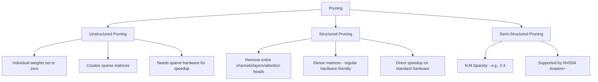
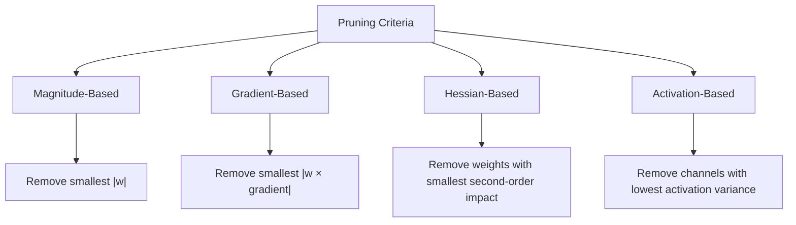
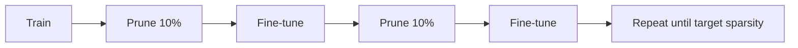

# Pruning

## Overview

Pruning removes **redundant or unimportant** components from a neural network — weights, neurons, channels, or even entire layers — to create a smaller, faster model with minimal accuracy loss. Inspired by biological neural development where synaptic connections are pruned over time.

## Why Prune?

- **Size reduction**: Remove 50-90% of parameters
- **Speedup**: Fewer computations, especially with structured pruning
- **Memory**: Lower RAM/VRAM requirements
- **Generalization**: Pruning can reduce overfitting (less overparameterization)
- **Energy**: Fewer operations = less power consumption

## Types of Pruning

### Unstructured Pruning
- Set individual weights to zero based on magnitude
- Achieves high sparsity (90%+) with minimal accuracy loss
- **Problem**: Sparse matrices need specialized hardware for actual speedup
- Without sparse hardware support, only saves storage, not compute

### Structured Pruning
- Remove entire **channels, filters, or attention heads**
- Results in a smaller dense model — works on standard hardware
- Direct speedup without sparse computation support
- More accuracy impact than unstructured at same sparsity level

### Semi-Structured (N:M) Pruning
- In every group of M consecutive weights, keep exactly N non-zero
- Example: **2:4 sparsity** — 2 out of every 4 weights are zero (50% sparsity)
- Supported by **NVIDIA Ampere (A100)** and newer GPUs with sparse tensor cores
- Best of both worlds: structured enough for hardware, flexible enough for accuracy

## Pruning Criteria

How to decide which weights/structures to prune:

| Criterion | Method | Pros | Cons |
|-----------|--------|------|------|
| **Magnitude** | Remove smallest \|w\| | Simple, effective | Ignores gradient info |
| **Gradient** | \|w × ∂L/∂w\| | Considers loss impact | Requires gradient computation |
| **Hessian** | Second-order information | Theoretically optimal | Computationally expensive |
| **Activation** | Low-variance activations | Data-aware | Requires forward passes |
| **Taylor** | First-order Taylor expansion | Good balance | Moderate cost |

## Pruning Strategies

### One-Shot Pruning
1. Train model to completion
2. Prune once
3. Optionally fine-tune to recover accuracy

**Pros**: Simple, fast
**Cons**: Accuracy drop can be large at high sparsity

### Iterative Pruning
1. Train → Prune small amount → Fine-tune → Repeat
2. Gradually increase sparsity over multiple rounds

**Pros**: Better accuracy preservation
**Cons**: More expensive (multiple train/prune cycles)

### Gradual Pruning
- Smoothly increase sparsity during training
- Schedule: start dense, linearly/cosinely increase sparsity
- Example: "During epochs 1-100, linearly increase sparsity from 0% to 90%"

### Lottery Ticket Hypothesis
Frankle & Carlin (2019):
> Within a randomly initialized dense network, there exists a sparse subnetwork ("winning ticket") that, when trained from the same initialization, matches the full network's accuracy.

**Implication**: Pruning finds efficient subnetworks, not just removes noise.

**How to find winning tickets:**
1. Train the full network
2. Prune smallest-magnitude weights
3. Reset remaining weights to **original initialization**
4. Retrain — if it matches full accuracy, it's a winning ticket

## LLM Pruning

Pruning large language models is a specialized challenge:

### Layer Pruning
- Remove entire transformer layers
- Middle layers are often more redundant than first/last
- Can remove 20-30% of layers with minimal impact

### Attention Head Pruning
- Remove less important attention heads
- Importance measured by: attention entropy, gradient-based scores
- Many heads are redundant (especially in larger models)

### Width Pruning
- Reduce hidden dimension (e.g., 4096 → 3072)
- Remove FFN intermediate neurons
- Often combined with distillation for recovery

### LLM-Pruner (2023)
- Task-agnostic structured pruning for LLMs
- Uses first-order and second-order information
- Followed by LoRA fine-tuning to recover performance

## Interview Questions

**Q1: What's the difference between structured and unstructured pruning?**
> Unstructured prunes individual weights, creating sparse matrices — high sparsity but needs specialized hardware for speedup. Structured removes entire channels/layers, creating smaller dense models — works on standard hardware but more accuracy impact at the same sparsity ratio.

**Q2: Explain the lottery ticket hypothesis.**
> Dense networks contain sparse subnetworks that can achieve comparable accuracy when trained from the same initialization. This suggests overparameterization helps training but isn't needed for inference. The original paper uses iterative magnitude pruning to find these "winning tickets."

**Q3: How does iterative pruning differ from one-shot pruning?**
> One-shot: prune once, fine-tune. Simple but large accuracy drop at high sparsity. Iterative: prune a little, fine-tune, repeat. More expensive but preserves accuracy much better. The key insight is that gradually removing weights gives the remaining weights time to adapt.

**Q4: Why is magnitude-based pruning so popular despite being simple?**
> Because it works remarkably well in practice. Large-magnitude weights tend to be important, small ones tend to be redundant. It's computationally cheap (just sort by absolute value), doesn't require gradient data, and has strong empirical results across domains. More sophisticated methods often show marginal improvement.

**Q5: How do you prune an LLM without destroying its capabilities?**
> (1) Use structured pruning (layer/head/width) for hardware-friendly results, (2) Measure importance using calibration data and gradient-based criteria, (3) Follow with LoRA fine-tuning to recover performance, (4) Evaluate on multiple benchmarks to ensure broad capability preservation, (5) Consider task-specific pruning if the model serves a narrow use case.

**Q6: What is N:M sparsity and why is it important?**
> N:M sparsity requires exactly N non-zero weights out of every M consecutive weights. 2:4 (50% sparsity) is supported by NVIDIA Ampere+ GPUs with dedicated sparse tensor cores, enabling actual 2× speedup. It bridges the gap between unstructured (hard to accelerate) and structured (too restrictive) pruning.

## Common Mistakes

1. **Pruning without fine-tuning** — Always fine-tune after pruning to recover accuracy
2. **Using unstructured pruning without sparse hardware** — You get size reduction but no speedup
3. **Same sparsity for all layers** — Some layers are more sensitive; use sensitivity analysis
4. **Pruning too aggressively** — There's a threshold beyond which accuracy collapses
5. **Not measuring actual speedup** — FLOPs reduction ≠ latency reduction; profile on hardware

## Summary

| Aspect | Detail |
|--------|--------|
| **Goal** | Remove redundant parameters for efficiency |
| **Types** | Unstructured (sparse), Structured (dense), N:M (semi-structured) |
| **Criteria** | Magnitude, gradient, Hessian, activation-based |
| **Strategy** | One-shot, iterative, gradual |
| **LLM Pruning** | Layer, head, width pruning + LoRA recovery |
| **Key Finding** | Lottery ticket hypothesis — sparse subnetworks match dense performance |

Pruning, combined with quantization and distillation, forms the holy trinity of model compression.
