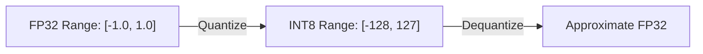
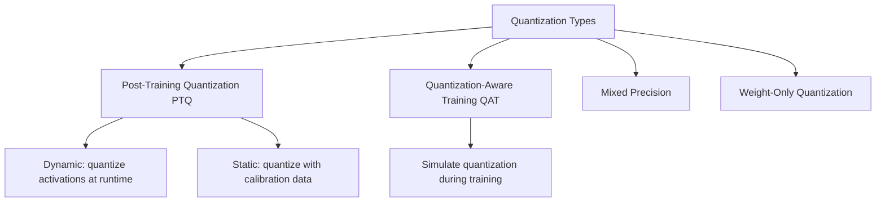
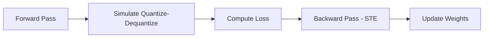
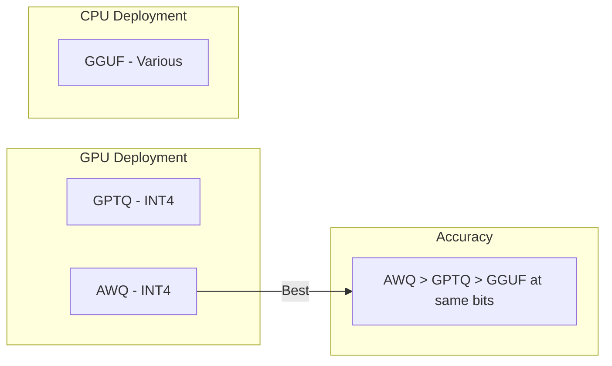

# Quantization

## Overview

Quantization reduces the **numerical precision** of model weights, activations, and/or gradients. Instead of storing parameters in 32-bit floating point (FP32), we use lower-precision formats like FP16, INT8, or even INT4 — dramatically reducing model size and inference time.

## Why Quantization?

| Benefit | FP32 → INT8 | FP32 → INT4 |
|---------|-------------|-------------|
| **Model Size** | 4× smaller | 8× smaller |
| **Memory Bandwidth** | 4× less | 8× less |
| **Inference Speed** | 2-4× faster | 4-8× faster (with hardware support) |
| **Accuracy Loss** | < 1% typically | 1-3% typically |

## Quantization Fundamentals

### Uniform Quantization

Maps floating-point values to a grid of discrete integers:

**Formula:**
$$q = \text{round}\left(\frac{x}{\text{scale}}\right) + \text{zero\_point}$$
$$\hat{x} = (q - \text{zero\_point}) \times \text{scale}$$

Where:
- **scale** = (max_val - min_val) / (q_max - q_min)
- **zero_point** = round(q_min - min_val / scale)

### Symmetric vs Asymmetric Quantization

| Type | Range | Zero Point | Best For |
|------|-------|------------|----------|
| **Symmetric** | [-α, α] | 0 | Weights (typically centered around 0) |
| **Asymmetric** | [β, α] | Non-zero | Activations (e.g., ReLU outputs are always positive) |

## Types of Quantization

### 1. Post-Training Quantization (PTQ)
Apply quantization **after** training is complete.

**Dynamic PTQ:**
- Weights quantized offline
- Activations quantized dynamically at runtime (observed range)
- No calibration data needed
- Slightly less accurate than static

**Static PTQ:**
- Both weights and activations quantized offline
- Requires a **calibration dataset** (100-1000 samples) to determine activation ranges
- Better accuracy, faster inference (no runtime quantization overhead)

### 2. Quantization-Aware Training (QAT)
Simulate quantization **during training** so the model learns to compensate.

- Uses **Straight-Through Estimator (STE)**: forward pass quantizes, backward pass passes gradients through as-is
- More accurate than PTQ but requires training infrastructure
- Used for production models where accuracy is critical

### 3. Mixed Precision
Use different precisions for different layers:
- Sensitive layers (first/last) in FP16
- Robust layers in INT8
- Often guided by sensitivity analysis

## LLM-Specific Quantization

### GPTQ (2023)
- **Weight-only** quantization (INT4/INT3 weights, FP16 activations)
- Uses approximate second-order information (Hessian) to minimize quantization error
- Quantizes layer-by-layer with calibration data
- GPU-optimized inference
- Popular for 4-bit LLM deployment

### AWQ (Activation-Aware Weight Quantization, 2024)
- Identifies **salient weights** based on activation magnitudes
- Protects important channels from quantization error
- ~2× faster than GPTQ for inference
- Better accuracy at same bit-width
- State-of-the-art for INT4 LLM quantization

### GGUF (llama.cpp)
- CPU-friendly quantization format
- Multiple quantization levels: Q2_K, Q3_K, Q4_K, Q5_K, Q6_K, Q8_0
- Runs on consumer hardware without GPU
- Most popular format for local LLM deployment

### Comparison

| Method | Precision | Target | Speed | Accuracy |
|--------|-----------|--------|-------|----------|
| **GPTQ** | INT4/INT3 | GPU | Fast | Good |
| **AWQ** | INT4 | GPU | Fastest | Best |
| **GGUF** | Q2-Q8 | CPU | Moderate | Good |
| **bitsandbytes** | INT8/INT4 | GPU | Good | Good |

## Interview Questions

**Q1: Explain the difference between PTQ and QAT.**
> PTQ quantizes a trained model without retraining — fast and easy but may lose accuracy. QAT simulates quantization during training using STE, so the model learns to be robust to precision loss. QAT is more accurate but requires training infrastructure. PTQ is preferred for quick deployment; QAT for accuracy-critical production.

**Q2: What is the straight-through estimator (STE)?**
> During QAT, quantization is non-differentiable (rounding). STE passes the gradient through as if quantization didn't exist — the gradient of the quantized value is set equal to the gradient of the original value. It's an approximation but works well in practice.

**Q3: Why does AWQ outperform GPTQ?**
> AWQ identifies salient weights based on activation patterns and protects them from quantization error. GPTQ uses second-order information but treats all weights equally. AWQ's activation-aware approach better preserves the model's knowledge, especially for important channels that have high activation magnitudes.

**Q4: How do you calibrate static PTQ?**
> Run a representative dataset (100-1000 samples) through the model and record the activation ranges (min/max) at each layer. These ranges determine the scale and zero-point for quantization. The calibration data should represent the actual inference distribution.

**Q5: What is weight-only quantization vs weight+activation quantization?**
> Weight-only: quantize weights (INT4), keep activations in FP16. Good for memory-bound LLM inference where loading weights is the bottleneck. Weight+activation: quantize both (INT8). Good for compute-bound scenarios. For LLMs, weight-only (GPTQ/AWQ) is more popular because activation quantization has higher accuracy impact.

**Q6: What is channel-wise vs tensor-wise quantization?**
> Tensor-wise: one scale/zero-point for the entire weight tensor. Channel-wise: separate scale/zero-point per output channel. Channel-wise is more accurate (each channel has different dynamic range) and is the standard for modern quantization.

## Common Mistakes

1. **Not using representative calibration data** — Calibration on random data gives poor ranges
2. **Ignoring outlier features** — A few extreme values can dominate the scale and waste precision
3. **Quantizing too early** — Always evaluate FP32 baseline first, then quantize
4. **Not measuring end-to-end gains** — Quantized model speedup depends on hardware support
5. **Mixing quantization formats** — Ensure hardware/framework supports your chosen format

## Summary

| Aspect | Detail |
|--------|--------|
| **Goal** | Reduce model precision for size/speed gains |
| **Methods** | PTQ (post-training), QAT (during training) |
| **LLM Formats** | GPTQ (GPU), AWQ (GPU, best quality), GGUF (CPU) |
| **Typical Precision** | FP16 (mild), INT8 (moderate), INT4 (aggressive) |
| **Accuracy Impact** | INT8: <1% loss, INT4: 1-3% loss |
| **Key Concept** | Scale + zero_point map float ↔ integer |

Quantization is the single most impactful compression technique for production deployment — every major model serving system uses it.
