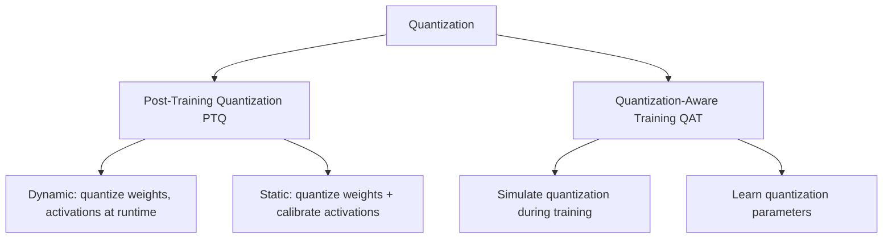

# Quantization (Advanced)

## Overview

Quantization reduces the numerical precision of model weights and activations — from 32-bit floating point (FP32) to 16-bit (FP16), 8-bit integers (INT8), or even 4-bit. This reduces model size by 2-8x and speeds up inference on hardware that supports integer arithmetic, with minimal accuracy loss. Quantization is the most widely used model optimization technique in production.

## Quantization Types



## How Quantization Works

### Linear Quantization

$$x_q = \text{round}\left(\frac{x}{s}\right) + z$$

where $s$ is the scale factor and $z$ is the zero point.

```python
def quantize_tensor(tensor, num_bits=8):
    """Symmetric quantization to INT8"""
    qmin = -2 ** (num_bits - 1)
    qmax = 2 ** (num_bits - 1) - 1

    # Compute scale
    scale = tensor.abs().max() / qmax

    # Quantize
    quantized = torch.clamp(torch.round(tensor / scale), qmin, qmax).to(torch.int8)

    return quantized, scale

def dequantize_tensor(quantized, scale):
    """Restore floating point values"""
    return quantized.float() * scale
```

### Quantization Granularity

| Granularity | Scale per | Use Case |
|-------------|-----------|----------|
| Per-tensor | Entire tensor | Simplest, least accurate |
| Per-channel | Each output channel | Better accuracy, common |
| Per-group | Group of values | Best accuracy, more overhead |

## Post-Training Quantization (PTQ)

### Dynamic Quantization

```python
import torch.quantization

# PyTorch dynamic quantization
model_quantized = torch.quantization.quantize_dynamic(
    model,
    {torch.nn.Linear, torch.nn.LSTM},  # Layers to quantize
    dtype=torch.qint8
)

# Size comparison
import os
torch.save(model.state_dict(), "original.pt")
torch.save(model_quantized.state_dict(), "quantized.pt")
print(f"Original: {os.path.getsize('original.pt') / 1e6:.1f} MB")
print(f"Quantized: {os.path.getsize('quantized.pt') / 1e6:.1f} MB")
```

### Static Quantization (with Calibration)

```python
# Step 1: Prepare model with quantization observers
model.qconfig = torch.quantization.get_default_qconfig('fbgemm')
model_prepared = torch.quantization.prepare(model)

# Step 2: Calibrate with representative data
with torch.no_grad():
    for batch in calibration_loader:
        model_prepared(batch)

# Step 3: Convert to quantized model
model_quantized = torch.quantization.convert(model_prepared)
```

## Quantization-Aware Training (QAT)

```python
import torch.quantization

# Step 1: Prepare for QAT
model.qconfig = torch.quantization.get_default_qat_qconfig('fbgemm')
model_prepared = torch.quantization.prepare_qat(model.train())

# Step 2: Train with simulated quantization
optimizer = torch.optim.SGD(model_prepared.parameters(), lr=0.001)
for epoch in range(5):
    for inputs, labels in train_loader:
        outputs = model_prepared(inputs)
        loss = criterion(outputs, labels)
        optimizer.zero_grad()
        loss.backward()
        optimizer.step()

# Step 3: Convert to quantized model
model_quantized = torch.quantization.convert(model_prepared.eval())
```

## Mixed Precision Training

```python
from torch.cuda.amp import autocast, GradScaler

scaler = GradScaler()

for inputs, labels in train_loader:
    optimizer.zero_grad()

    # Forward pass in FP16
    with autocast():
        outputs = model(inputs)
        loss = criterion(outputs, labels)

    # Backward pass with gradient scaling
    scaler.scale(loss).backward()
    scaler.step(optimizer)
    scaler.update()
```

## INT4 Quantization (GPTQ, AWQ)

For LLMs, extreme quantization:

```python
# Using AutoGPTQ
from auto_gptq import AutoGPTQForCausalLM

model = AutoGPTQForCausalLM.from_pretrained(
    "model-name",
    quantize_config={
        "bits": 4,
        "group_size": 128,
        "desc_act": True
    }
)
model.quantize(calibration_data)
```

## Accuracy vs Size Trade-off

| Precision | Size | Speed | Accuracy | Use Case |
|-----------|------|-------|----------|----------|
| FP32 | 1x | 1x | Baseline | Training |
| FP16 | 0.5x | 2x | ~Same | Mixed precision training |
| INT8 | 0.25x | 2-4x | < 1% loss | Production inference |
| INT4 | 0.125x | 3-4x | 1-3% loss | LLM serving |
| INT2 | 0.0625x | 4-8x | 5-10% loss | Extreme compression |

## Interview Questions

1. **What is quantization?** — Reducing numerical precision of weights and activations (FP32 → INT8/INT4). Reduces model size and speeds up inference on integer-capable hardware.

2. **PTQ vs QAT?** — PTQ: quantize after training, no retraining needed, faster but may lose more accuracy. QAT: simulate quantization during training, learns to compensate, better accuracy.

3. **What is calibration in static quantization? — Running representative data through the model to determine the optimal scale and zero-point for activation quantization. Without it, activation ranges are estimated poorly.

4. **What is mixed precision training?** — Using FP16 for forward/backward passes and FP32 for master weights and gradient accumulation. Reduces memory and speeds up training with minimal accuracy impact.

5. **How does INT4 quantization work for LLMs?** — Methods like GPTQ and AWQ analyze weight importance and quantize to 4 bits with group-wise scaling. Critical weights retain higher precision.

## Common Mistakes

- Not calibrating with representative data (poor activation ranges)
- Quantizing too aggressively (INT4 without careful calibration)
- Not measuring actual speedup (some hardware doesn't benefit)
- Ignoring accuracy on edge cases (quantization can affect rare classes)
- Not testing on target hardware (CPU vs GPU quantization differs)

## Summary

Quantization reduces model precision from FP32 to INT8/INT4, enabling faster inference and smaller models. PTQ is simple and effective; QAT provides better accuracy. Mixed precision training accelerates GPU training. For LLMs, INT4 quantization (GPTQ, AWQ) enables serving large models on consumer hardware.

## Cross-References

- [Model Compression](./compression.md) — Compression overview
- [Knowledge Distillation](./distillation.md) — Complementary technique
- [Pruning](./pruning.md) — Complementary technique
- [Edge ML](./edge.md) — Deployment targets
- [LLM Quantization](../../llm/llm-serving/quantization.md) — LLM-specific details
