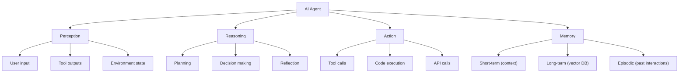
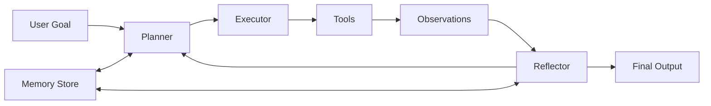
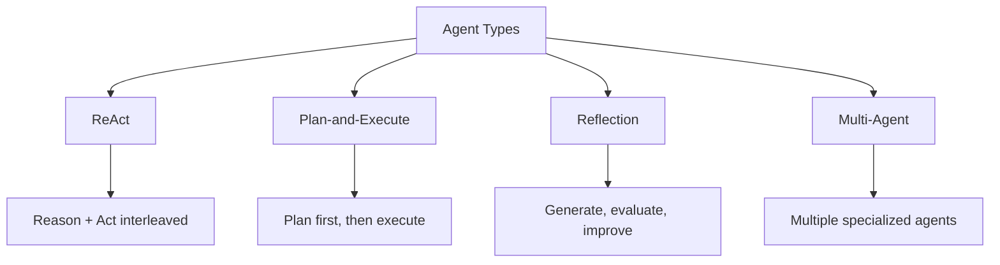
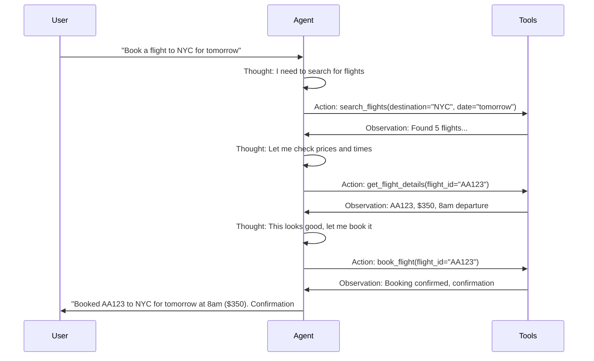

# AI Agents Overview

## Overview

AI Agents are systems that use LLMs as their reasoning engine to autonomously plan, execute actions, and interact with the environment. Unlike simple chatbots that respond to single prompts, agents can break down complex tasks, use tools, maintain memory, and iterate on solutions. They represent the next evolution of LLM applications — from passive text generators to active problem solvers.

## What Makes an Agent?



## Agent vs Chatbot vs Copilot

| Capability | Chatbot | Copilot | Agent |
|---|---|---|---|
| **Input** | Single message | Context + message | Goal/task |
| **Reasoning** | Simple response | Context-aware response | Multi-step planning |
| **Tools** | None | Limited | Extensive |
| **Autonomy** | Reactive | Suggestive | Proactive |
| **Memory** | Session only | Session + context | Long-term |
| **Error handling** | Fail | Suggest fix | Retry, reflect, adapt |

## Agent Architecture



### The Agent Loop

```python
def agent_loop(goal, tools, memory, max_iterations=10):
    plan = planner.create_plan(goal, memory)
    
    for step in plan:
        # Execute the step
        action = executor.decide_action(step, tools)
        result = tools.execute(action)
        
        # Reflect on the result
        reflection = reflector.analyze(result, goal)
        
        if reflection.is_satisfactory:
            continue
        elif reflection.needs_replanning:
            plan = planner.replan(goal, results_so_far, memory)
        else:
            # Try again with different approach
            pass
    
    return compile_output(plan_results)
```

## Types of Agents



| Type | Pattern | Best For |
|---|---|---|
| **ReAct** | Reason → Act → Observe → Repeat | General tasks |
| **Plan-and-Execute** | Plan → Execute steps → Replan if needed | Complex multi-step tasks |
| **Reflection** | Generate → Critique → Improve | Quality-critical outputs |
| **Multi-Agent** | Multiple agents collaborating | Complex systems |

## Tool Use

Agents interact with the world through tools:

| Tool Category | Examples |
|---|---|
| **Search** | Web search, knowledge base, RAG |
| **Code** | Python interpreter, shell, code search |
| **Data** | SQL, API calls, file operations |
| **Communication** | Email, messaging, notifications |
| **Creation** | Image generation, document creation |

## Agent Loop (ReAct)



## Interview Questions

### Q1: What is an AI agent and how does it differ from a simple LLM application?
**Answer:** An AI agent uses an LLM as a reasoning engine to autonomously plan, execute actions using tools, and iterate on solutions. Unlike a simple LLM application (single prompt → single response), an agent can:
- Break down complex tasks into sub-tasks
- Use tools (search, code, APIs) to gather information and take actions
- Maintain memory across interactions
- Reflect on results and adjust its approach
- Make multiple LLM calls to solve a single problem

### Q2: Describe the ReAct pattern for agents.
**Answer:** ReAct (Reasoning + Acting) interleaves reasoning and action steps:
1. **Thought**: The agent reasons about what to do next
2. **Action**: The agent takes an action (tool call, code execution)
3. **Observation**: The agent observes the result
4. **Repeat** until the task is complete

This pattern makes the agent's reasoning transparent and allows it to adjust based on observations.

### Q3: What are the key components of an agent system?
**Answer:**
1. **LLM (Brain)**: Reasoning and decision-making
2. **Tools**: Actions the agent can take (search, code, APIs)
3. **Memory**: Short-term (conversation), long-term (vector DB), episodic (past tasks)
4. **Planning**: Task decomposition and strategy
5. **Reflection**: Evaluating results and improving approach

## Common Mistakes

- ❌ Making agents too autonomous without guardrails
- ❌ Not limiting the number of iterations (infinite loops)
- ❌ Poor tool descriptions (agent doesn't know when to use them)
- ❌ No error handling (agent crashes on tool failures)
- ❌ Over-engineering when a simple prompt would suffice

## Summary

AI Agents combine LLMs with tools, memory, and planning to solve complex tasks autonomously. The ReAct pattern (Reason → Act → Observe) is the foundational pattern. Key components: LLM brain, tools, memory, planning, and reflection. Agents are the next evolution of LLM applications.

## Cross-References

- [ReAct →](react.md) Detailed ReAct pattern
- [Tool Calling →](tool-calling.md) How agents use tools
- [Memory →](memory.md) Agent memory systems
- [Planning →](planning.md) Task decomposition
- [Multi-Agent →](multi.md) Multiple agent systems
- [Frameworks →](frameworks.md) Agent development frameworks
- [LLM Tool Calling](../../llm/llm-serving/systems.md)
- [Agent Architecture](./architecture.md)
- [LLM Prompt Engineering](../../llm/llm-serving/prompt-engineering.md)
- [Interview System Design](../../interview/system-design/README.md)
