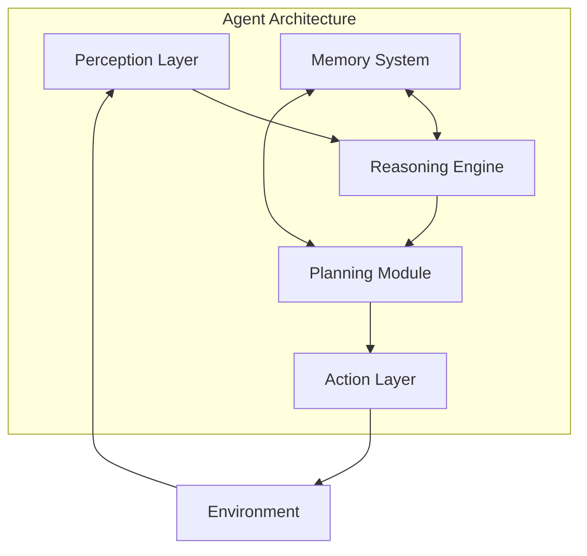
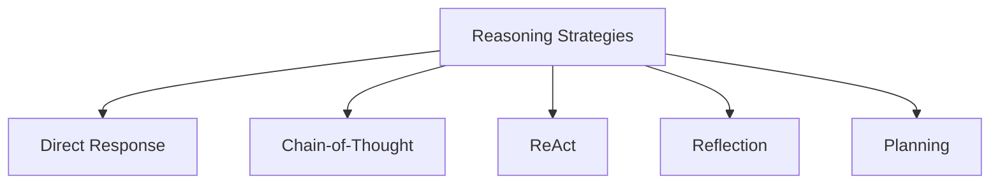
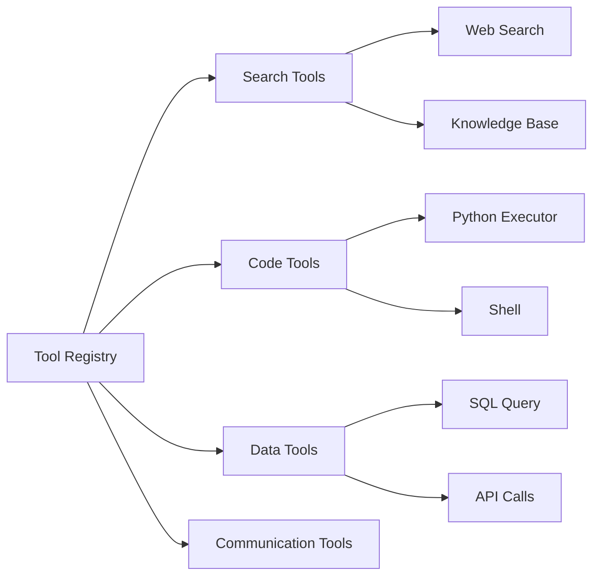
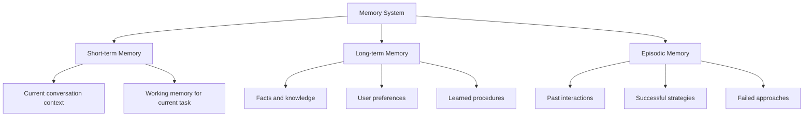
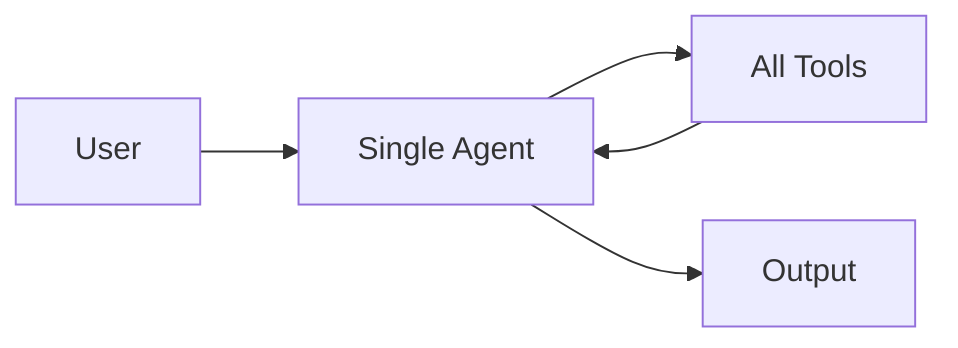
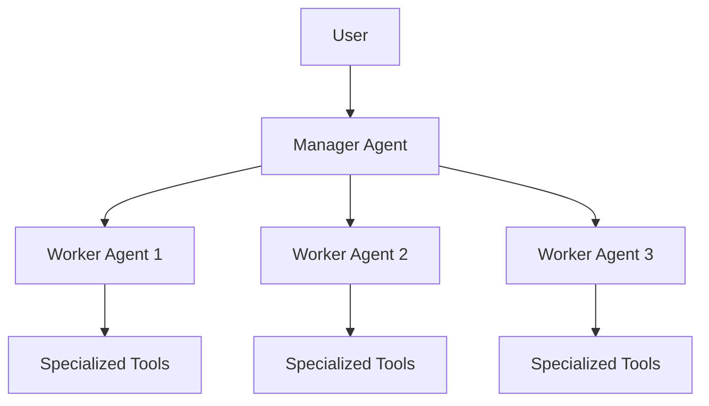
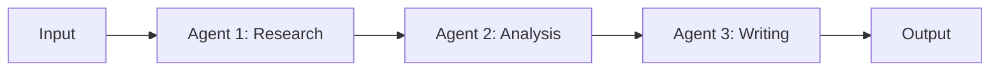
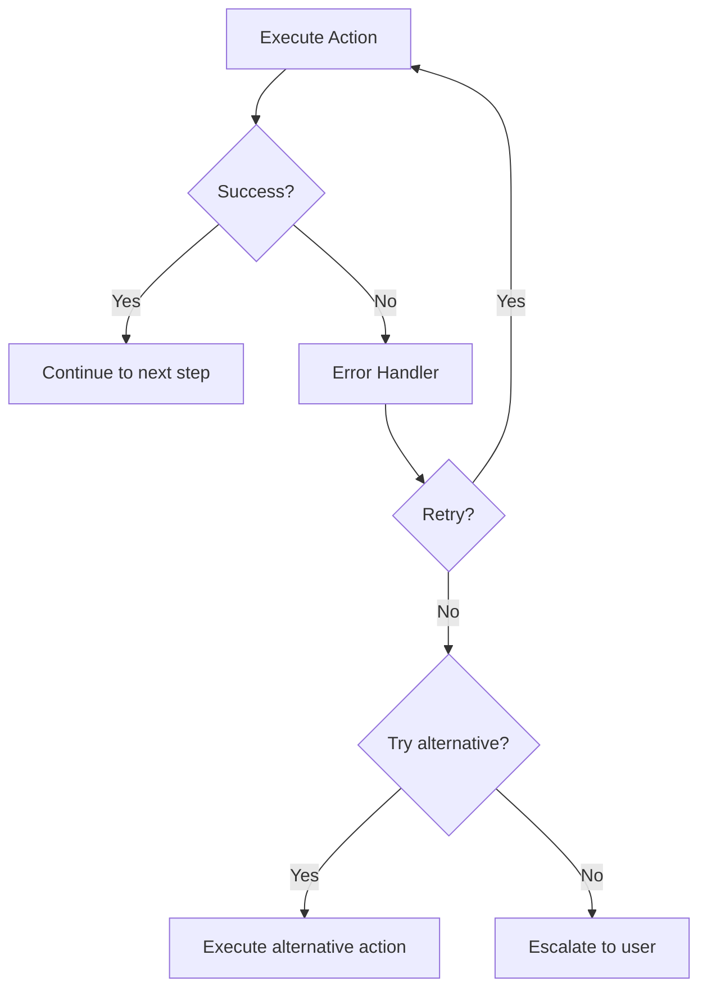

# Agent Architecture

## Overview

An AI agent's architecture defines how it perceives its environment, reasons about tasks, takes actions, and learns from experience. The architecture determines the agent's capabilities, reliability, and scalability. This page covers the core components and design patterns for building effective agents.

## Core Components



## Perception Layer

The perception layer processes inputs from the environment:

| Input Type | Source | Processing |
|---|---|---|
| **User messages** | Chat interface | Parse intent, extract entities |
| **Tool outputs** | API responses | Parse, validate, summarize |
| **Environment state** | System state | Monitor changes |
| **Documents** | Files, web | Extract, chunk, index |

```python
class PerceptionLayer:
    def process(self, raw_input):
        # Parse input
        parsed = self.parser.parse(raw_input)
        
        # Extract relevant information
        entities = self.entity_extractor.extract(parsed)
        intent = self.intent_classifier.classify(parsed)
        
        # Update context
        context = Context(entities=entities, intent=intent)
        return context
```

## Reasoning Engine

The LLM serves as the reasoning engine. Different strategies are used depending on the task:



| Strategy | When to Use | Complexity |
|---|---|---|
| **Direct** | Simple questions | Low |
| **CoT** | Multi-step reasoning | Medium |
| **ReAct** | Tasks requiring tools | Medium |
| **Reflection** | Quality-critical outputs | High |
| **Planning** | Complex multi-step tasks | High |

## Action Layer

The action layer executes decisions from the reasoning engine:

```python
class ActionLayer:
    def __init__(self, tools):
        self.tools = {tool.name: tool for tool in tools}
    
    def execute(self, action_plan):
        tool = self.tools[action_plan.tool_name]
        
        try:
            result = tool.execute(action_plan.parameters)
            return ActionResult(success=True, result=result)
        except Exception as e:
            return ActionResult(success=False, error=str(e))
```

### Tool Registry



## Memory System



## Planning Module

```python
class PlanningModule:
    def create_plan(self, goal, context):
        # Decompose goal into sub-tasks
        sub_tasks = self.decompose(goal)
        
        # Order sub-tasks (dependencies)
        ordered = self.topological_sort(sub_tasks)
        
        # Create execution plan
        plan = Plan(tasks=ordered, context=context)
        return plan
    
    def replan(self, plan, results, failures):
        # Analyze what went wrong
        analysis = self.analyze_failures(failures)
        
        # Adjust plan
        new_plan = self.adjust(plan, analysis)
        return new_plan
```

## Agent Design Patterns

### Single Agent



Simple, good for focused tasks. Doesn't scale well for complex systems.

### Hierarchical Agent



Manager delegates tasks to specialized workers. Better for complex tasks with distinct sub-problems.

### Pipeline Agent



Sequential processing. Each agent specializes in one stage.

## Error Handling



## Interview Questions

### Q1: What are the core components of an agent architecture?
**Answer:** The five core components are:
1. **Perception**: Processes inputs (user messages, tool outputs, environment state)
2. **Reasoning**: The LLM that makes decisions (direct, CoT, ReAct, reflection)
3. **Action**: Executes decisions via tools (search, code, APIs)
4. **Memory**: Short-term (context), long-term (vector DB), episodic (past interactions)
5. **Planning**: Decomposes goals into sub-tasks, handles dependencies, replans on failure

### Q2: How do you handle errors in an agent system?
**Answer:** A robust error handling strategy includes:
1. **Retry with backoff**: For transient failures (API timeouts)
2. **Alternative tools**: If one tool fails, try another
3. **Graceful degradation**: Return partial results if possible
4. **User escalation**: When the agent can't resolve the issue
5. **Reflection**: Analyze the error and adjust approach
6. **Maximum iterations**: Prevent infinite retry loops

### Q3: Compare single-agent vs multi-agent architectures.
**Answer:**
- **Single agent**: Simpler, easier to debug, good for focused tasks. All tools and context in one place.
- **Multi-agent**: Better for complex tasks with distinct sub-problems. Each agent specializes (research, coding, writing). Enables parallel execution. But harder to debug, coordinate, and may have communication overhead.
- Rule of thumb: Start with single agent. Move to multi-agent when the single agent's prompt becomes too long or the task has clearly separable sub-tasks.

## Common Mistakes

- ❌ No maximum iteration limit (agent runs forever)
- ❌ Poor error handling (agent crashes on tool failures)
- ❌ Making agents too complex when simple solutions work
- ❌ Not validating tool outputs before using them
- ❌ Ignoring memory (agent forgets important context)

## Summary

Agent architecture consists of perception, reasoning, action, memory, and planning components. Design patterns include single-agent, hierarchical, and pipeline architectures. Robust error handling and iteration limits are essential for production agents.

## Cross-References

- [ReAct →](react.md) Reasoning + Acting pattern
- [Memory →](memory.md) Memory systems in detail
- [Planning →](planning.md) Task decomposition
- [Tool Calling →](tool-calling.md) Tool integration
- [Multi-Agent →](multi.md) Multi-agent systems
