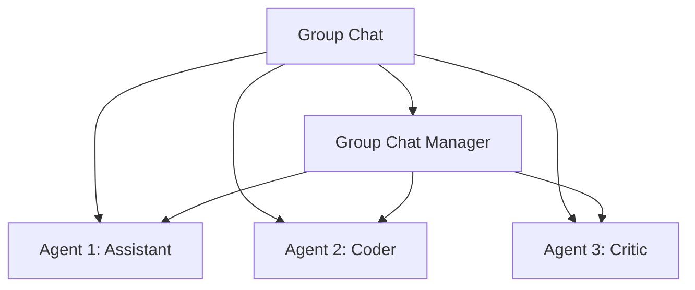
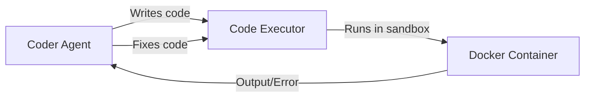

# AutoGen

## Overview

AutoGen (by Microsoft) is a framework for building multi-agent conversational systems. Agents communicate through messages in a group chat, with a manager coordinating the conversation. It's particularly strong for tasks requiring code execution, as it has built-in sandboxed code execution capabilities.

## Core Concepts



## Agent Types

| Agent | Role | Special Feature |
|---|---|---|
| **AssistantAgent** | General assistant | LLM-powered responses |
| **UserProxy** | Human proxy | Executes code, asks for input |
| **GroupChatManager** | Coordinator | Manages multi-agent conversations |

## Basic Setup

```python
from autogen import AssistantAgent, UserProxyAgent, GroupChat, GroupChatManager

# Create agents
assistant = AssistantAgent(
    name="assistant",
    llm_config={"model": "gpt-4"},
    system_message="You are a helpful AI assistant."
)

coder = AssistantAgent(
    name="coder",
    llm_config={"model": "gpt-4"},
    system_message="You are an expert Python coder. Write clean, working code."
)

critic = AssistantAgent(
    name="critic",
    llm_config={"model": "gpt-4"},
    system_message="You review code and provide constructive feedback."
)

# User proxy (can execute code)
user_proxy = UserProxyAgent(
    name="user",
    human_input_mode="NEVER",  # No human input needed
    code_execution_config={"work_dir": "coding", "use_docker": True}
)

# Group chat
group_chat = GroupChat(
    agents=[user_proxy, assistant, coder, critic],
    messages=[],
    max_round=10
)

manager = GroupChatManager(group_chat=group_chat)

# Start conversation
user_proxy.initiate_chat(
    manager,
    message="Write a Python function to find prime numbers up to N."
)
```

## Code Execution

AutoGen's key feature — sandboxed code execution:



```python
# Configuration for code execution
code_execution_config = {
    "work_dir": "output",           # Working directory
    "use_docker": True,             # Run in Docker (safe)
    "timeout": 120,                 # Timeout in seconds
    "last_n_messages": 3,           # Check last N messages for code
}
```

## Conversation Patterns

### Two-Agent Conversation

```python
# Simple assistant + user proxy
assistant = AssistantAgent(name="assistant", llm_config=config)
user = UserProxyAgent(name="user", human_input_mode="TERMINATE")

user.initiate_chat(assistant, message="Explain recursion")
```

### Group Chat with Speaker Selection

```python
group_chat = GroupChat(
    agents=[planner, coder, reviewer],
    messages=[],
    max_round=15,
    speaker_selection_method="auto"  # Manager picks next speaker
)
```

### Nested Conversations

```python
# Inner team for complex sub-tasks
inner_team = GroupChat(
    agents=[researcher, analyst],
    messages=[]
)
inner_manager = GroupChatManager(group_chat=inner_team)

# Outer team uses inner team
outer_team = GroupChat(
    agents=[coordinator, inner_manager, writer],
    messages=[]
)
```

## Interview Questions

### Q1: What is AutoGen and what makes it unique?
**Answer:** AutoGen is Microsoft's multi-agent conversation framework. Its unique features are:
1. **Code execution**: Built-in sandboxed code execution (Docker support)
2. **Conversation-based**: Agents communicate through natural language messages
3. **Group chat**: Multiple agents in one conversation with a manager
4. **Human-in-the-loop**: Flexible human input modes (ALWAYS, TERMINATE, NEVER)
5. **Nested conversations**: Teams within teams

### Q2: How does AutoGen handle code execution safely?
**Answer:** AutoGen executes code in a sandboxed environment:
- **Docker containers**: Code runs in isolated containers
- **Timeout limits**: Prevents infinite loops
- **Work directory**: Limited file system access
- **Output capture**: stdout/stderr captured and returned to agents
- **No network access**: By default, preventing data exfiltration

### Q3: Compare AutoGen and CrewAI.
**Answer:**
- **AutoGen**: Conversation-based, code execution focus, flexible but verbose
- **CrewAI**: Role-based, intuitive team metaphor, less code execution
- AutoGen is better for coding tasks (built-in execution). CrewAI is better for role-based collaboration.
- AutoGen has more Microsoft backing. CrewAI has simpler API.

## Common Mistakes

- ❌ Not using Docker for code execution (security risk)
- ❌ Too many agents in one group chat (chaos)
- ❌ Not setting max_round (infinite conversations)
- ❌ Poor system messages (agents don't know their role)

## Summary

AutoGen enables multi-agent conversations with built-in code execution. Agents communicate through messages in a group chat managed by a coordinator. Key features: sandboxed code execution, flexible human input, and nested conversations. Best for coding tasks and research workflows.

## Cross-References

- [Multi-Agent →](multi.md) Multi-agent patterns
- [CrewAI →](crewai.md) Alternative multi-agent framework
- [Frameworks →](frameworks.md) Framework comparison
