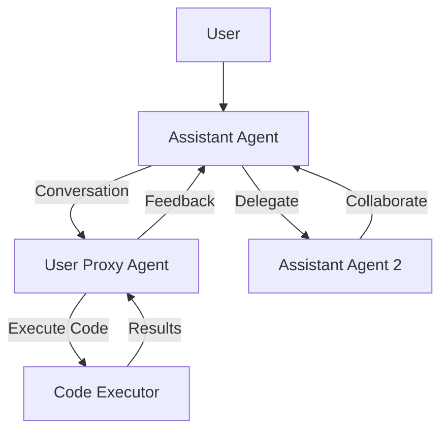
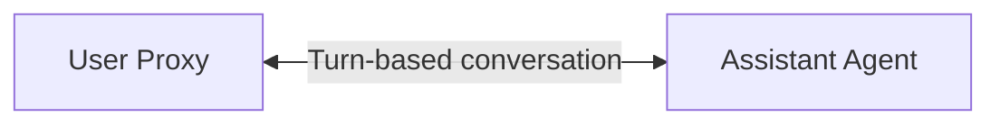
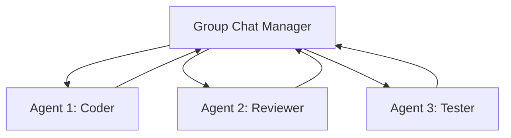
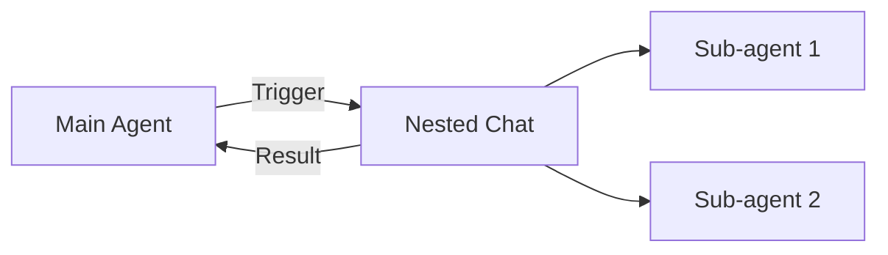

# AutoGen

## Overview

AutoGen, developed by Microsoft Research, is a framework for building **multi-agent conversation systems** where agents collaborate through structured dialogue. It enables creating agent teams that can solve complex tasks through conversation, code execution, and tool use. AutoGen's core innovation is treating agent interactions as **conversations between customizable agents**.

## Core Architecture



## Key Concepts

### ConversableAgent

The base class for all agents — can send, receive, and process messages:

```python
from autogen import ConversableAgent

agent = ConversableAgent(
    name="assistant",
    system_message="You are a helpful AI assistant.",
    llm_config={"model": "gpt-4", "temperature": 0},
    human_input_mode="NEVER",  # or "ALWAYS", "TERMINATE"
)
```

### AssistantAgent

An LLM-powered agent that generates responses:

```python
from autogen import AssistantAgent

assistant = AssistantAgent(
    name="coder",
    system_message="You are an expert Python developer. Write clean, "
                   "well-documented code. When you're done, say TERMINATE.",
    llm_config={"model": "gpt-4"}
)
```

### UserProxyAgent

Executes code and provides human feedback:

```python
from autogen import UserProxyAgent

user_proxy = UserProxyAgent(
    name="user",
    human_input_mode="ALWAYS",  # Ask human for input
    code_execution_config={
        "work_dir": "coding",
        "use_docker": True,  # Safer execution
    }
)
```

## Multi-Agent Conversation

```python
from autogen import AssistantAgent, UserProxyAgent, GroupChat, GroupChatManager

# Create agents
coder = AssistantAgent(
    name="Coder",
    system_message="You write Python code."
)

reviewer = AssistantAgent(
    name="Reviewer",
    system_message="You review code for bugs and improvements."
)

tester = AssistantAgent(
    name="Tester",
    system_message="You write and run tests for the code."
)

user = UserProxyAgent(
    name="User",
    human_input_mode="TERMINATE"
)

# Group chat
group_chat = GroupChat(
    agents=[user, coder, reviewer, tester],
    messages=[],
    max_round=20
)

manager = GroupChatManager(group_chat=group_chat)

# Start conversation
user.initiate_chat(
    manager,
    message="Build a web scraper for news articles with error handling and tests."
)
```

## Conversation Patterns

### Two-Agent Chat



### Group Chat



### Nested Chat



## Code Execution

AutoGen can execute code in various environments:

```python
# Local execution
user_proxy = UserProxyAgent(
    name="executor",
    code_execution_config={
        "work_dir": "output",
        "use_docker": False,  # Local execution
        "timeout": 60,
        "last_n_messages": 3,
    }
)

# Docker execution (safer)
user_proxy = UserProxyAgent(
    name="executor",
    code_execution_config={
        "work_dir": "output",
        "use_docker": "python:3.11",  # Docker image
        "timeout": 120,
    }
)
```

## Teaching and Feedback

```python
# Agent with teaching mode
assistant = AssistantAgent(
    name="teacher",
    system_message="You teach by providing examples and explanations.",
    teach_config={
        "teach_agent": student_agent,
        "max_rounds": 5,
    }
)
```

## Interview Questions

### Q1: What is AutoGen and how does it work?
**Answer:** AutoGen is a Microsoft framework for multi-agent conversation systems. Agents communicate through structured dialogue, can execute code, use tools, and collaborate. The key abstraction is ConversableAgent — all agents can send/receive messages. Conversations can be two-agent, group chat, or nested.

### Q2: How does AutoGen handle code execution?
**Answer:** AutoGen's UserProxyAgent can execute code generated by other agents. It supports local execution and Docker containers for safety. The agent receives code blocks from the conversation, executes them, and feeds results back. Error handling includes automatic retry with error messages sent back to the coding agent.

### Q3: Compare AutoGen with CrewAI.
**Answer:**
- **AutoGen**: Conversation-centric, flexible agent communication, strong code execution, group chat with dynamic speaker selection
- **CrewAI**: Role-centric, structured task delegation, sequential/hierarchical processes, simpler API for common patterns
- AutoGen is more flexible; CrewAI is more opinionated and easier for standard workflows.

### Q4: What is a GroupChatManager?
**Answer:** GroupChatManager orchestrates multi-agent group conversations. It selects the next speaker, manages message history, and enforces conversation rules. The speaker selection can be round-robin, random, or LLM-driven (the manager decides who should speak next based on the conversation context).

## Common Mistakes

- ❌ Not setting `human_input_mode` correctly (infinite loops waiting for input)
- ❌ Not using Docker for code execution (security risk)
- ❌ Too many agents in group chat (expensive, hard to control)
- ❌ No clear termination condition (agents keep chatting)
- ❌ Not limiting max_rounds (cost explosion)

## Summary

AutoGen enables multi-agent collaboration through structured conversation. Key abstractions: ConversableAgent (base), AssistantAgent (LLM-powered), UserProxyAgent (code execution/human input). Supports two-agent chat, group chat with dynamic speaker selection, and nested conversations. Strong code execution capabilities with Docker support.

## Cross-References

- [Frameworks →](frameworks.md) Agent framework overview
- [Multi-Agent →](multi-agent.md) Multi-agent patterns
- [CrewAI →](crewai.md) Role-based multi-agent
- [LangChain →](langchain.md) Alternative framework
- [Tool Calling →](tool-calling.md) How agents use tools
