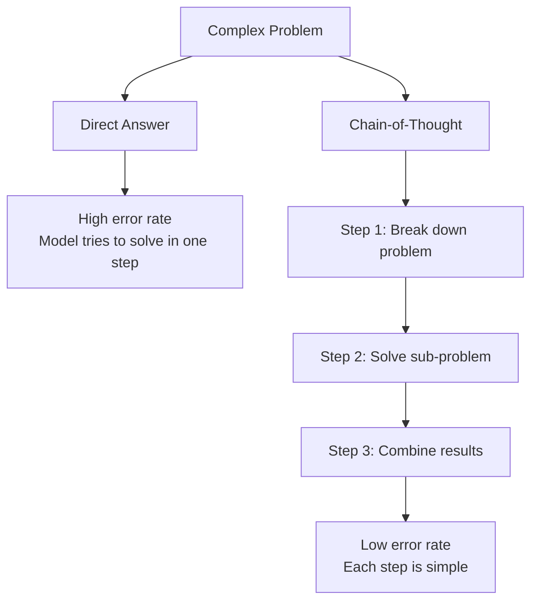
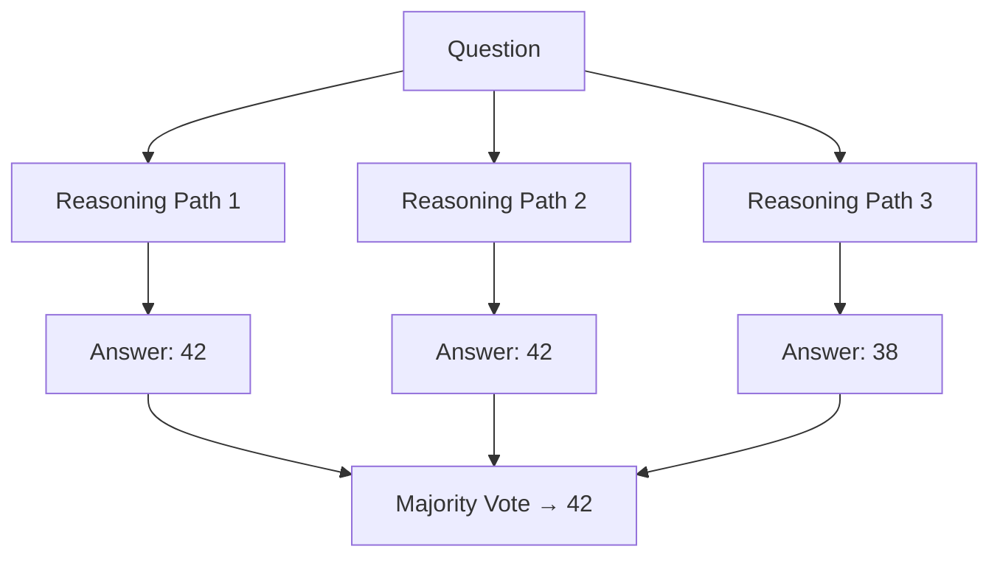

# Chain-of-Thought Prompting

## Overview

Chain-of-Thought (CoT) prompting encourages LLMs to show intermediate reasoning steps before giving a final answer. This dramatically improves performance on tasks requiring multi-step reasoning, math, logic, and complex analysis. CoT is the foundation for more advanced agent patterns like ReAct and Tree-of-Thought.

## Zero-Shot CoT

Simply add "Let's think step by step" to the prompt:

```
Q: If a train travels 60 mph for 2.5 hours, then 80 mph for 1.5 hours, 
   what is the total distance?

A: Let's think step by step.
```

**Model output:**
```
Step 1: First leg: 60 mph × 2.5 hours = 150 miles
Step 2: Second leg: 80 mph × 1.5 hours = 120 miles  
Step 3: Total distance: 150 + 120 = 270 miles

The answer is 270 miles.
```

## Few-Shot CoT

Provide examples with reasoning chains:

```
Q: Roger has 5 tennis balls. He buys 2 cans of 3 balls each. How many does he have?
A: Roger starts with 5 balls. He buys 2 × 3 = 6 balls. 5 + 6 = 11. The answer is 11.

Q: A cafeteria had 23 apples. They used 20 and bought 6 more. How many now?
A: The cafeteria starts with 23 apples. They use 20, leaving 23 - 20 = 3. 
   They buy 6 more: 3 + 6 = 9. The answer is 9.

Q: [Your question here]
A:
```

## Why CoT Works



**Key reasons:**
1. **Decomposition**: Complex problems become simple sub-problems
2. **Intermediate computation**: Model can "use" previous steps as scratchpad
3. **Error localization**: Mistakes are visible and correctable
4. **Reduced cognitive load**: Each step requires less reasoning

## CoT Variants

### Manual CoT

You write the reasoning chain examples:

```python
examples = [
    {
        "question": "What is 15% of 80?",
        "chain": "15% means 15/100 = 0.15. 0.15 × 80 = 12. The answer is 12."
    },
    {
        "question": "If you buy 3 items at $4.50 each with 8% tax, what's the total?",
        "chain": "Subtotal: 3 × $4.50 = $13.50. Tax: 8% of $13.50 = 0.08 × 13.50 = $1.08. Total: $13.50 + $1.08 = $14.58."
    }
]
```

### Auto-CoT

Let the model generate its own reasoning chains:

```python
def auto_cot(question, num_chains=3):
    """Generate multiple reasoning chains and take majority vote."""
    answers = []
    for _ in range(num_chains):
        chain = llm.generate(f"Q: {question}\nA: Let's think step by step.\n")
        answer = extract_answer(chain)
        answers.append(answer)
    
    # Majority vote
    return most_common(answers)
```

### Self-Consistency

Sample multiple CoT paths and vote:



## CoT for Different Tasks

### Math

```
Q: What is the derivative of x³ + 2x² - 5x + 3?
A: Let me apply the power rule to each term:
- d/dx(x³) = 3x²
- d/dx(2x²) = 4x
- d/dx(-5x) = -5
- d/dx(3) = 0
Combining: 3x² + 4x - 5
```

### Logic

```
Q: All cats are animals. Some animals are pets. Are all cats pets?
A: Let me reason through this:
- Premise 1: All cats are animals (cats ⊆ animals)
- Premise 2: Some animals are pets (animals ∩ pets ≠ ∅)
- This doesn't mean all cats are pets. Cats could be in the "animals that are not pets" subset.
- The answer is: Not necessarily. We cannot conclude all cats are pets.
```

### Code

```
Q: What does this Python code output? x = [1, 2, 3]; y = x; y.append(4); print(x)
A: Let me trace through:
1. x = [1, 2, 3] → x references list [1, 2, 3]
2. y = x → y references the SAME list (not a copy)
3. y.append(4) → the shared list becomes [1, 2, 3, 4]
4. print(x) → prints [1, 2, 3, 4] because x and y point to the same list
The answer is [1, 2, 3, 4].
```

## Interview Questions

### Q1: What is Chain-of-Thought prompting and why does it work?
**Answer:** CoT prompting encourages the model to show intermediate reasoning steps before the final answer. It works because:
1. Decomposes complex problems into simpler sub-problems
2. Provides a "scratchpad" for intermediate computations
3. Reduces the reasoning load per step
4. Makes errors visible and correctable
5. Leverages the model's ability to follow patterns in the prompt

Zero-shot CoT ("Let's think step by step") is simple but effective. Few-shot CoT (examples with reasoning) is more reliable for complex tasks.

### Q2: When does CoT fail?
**Answer:** CoT can fail when:
- The task doesn't require reasoning (simple lookup)
- The model generates plausible-sounding but incorrect reasoning
- The reasoning chain is too long (model loses context)
- The problem requires knowledge the model doesn't have
- The model "reasons backward" from a wrong answer to justify it

### Q3: What is self-consistency and how does it improve CoT?
**Answer:** Self-consistency samples multiple independent CoT reasoning paths for the same question, then takes the majority vote of the final answers. It works because:
- Different paths may make different mistakes
- The correct answer is more likely to appear across multiple paths
- It's a simple ensemble method that improves reliability

Trade-off: More samples = better accuracy but higher cost (typically 3-5 samples).

## Common Mistakes

- ❌ Using CoT for simple tasks that don't need reasoning (wastes tokens)
- ❌ Not validating that the model's reasoning chain is actually correct
- ❌ Assuming CoT always helps (it can amplify errors if the model reasons incorrectly)
- ❌ Too few examples in few-shot CoT (2-3 is often insufficient)

## Summary

CoT prompting improves LLM reasoning by showing intermediate steps. Zero-shot CoT is simple ("think step by step"), few-shot CoT provides examples with reasoning chains. Self-consistency improves reliability by sampling multiple paths. CoT is the foundation for agent patterns like ReAct.

## Cross-References

- [ReAct →](react.md) CoT with tool use
- [Tree-of-Thought →](tree-of-thought.md) Exploring multiple reasoning paths
- [Prompt Engineering →](../../llm/llm-serving/prompt-engineering.md) General prompting techniques
