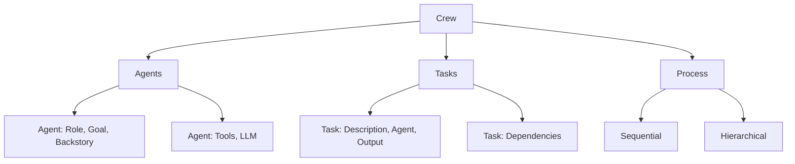
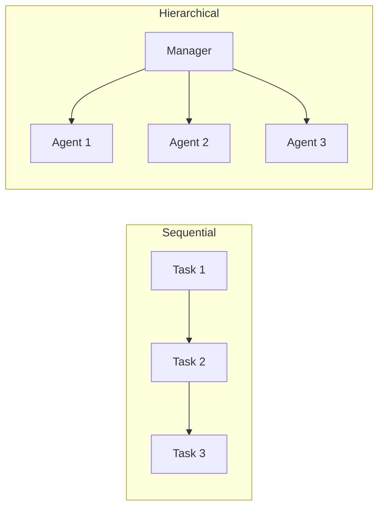

# CrewAI

## Overview

CrewAI is a multi-agent framework where agents have roles, goals, and backstories, and collaborate like a team. Each agent specializes in a specific function (researcher, writer, reviewer), and a "crew" orchestrates their collaboration. It's designed to be intuitive — model your AI team like a real team.

## Core Concepts



## Agent Definition

```python
from crewai import Agent

researcher = Agent(
    role="Senior Research Analyst",
    goal="Find comprehensive information about the given topic",
    backstory="""You are an experienced researcher with a knack for 
    finding reliable sources and extracting key insights.""",
    tools=[search_tool, web_scraper],
    llm="gpt-4",
    verbose=True
)

writer = Agent(
    role="Technical Writer",
    goal="Write clear, engaging content based on research",
    backstory="""You are a skilled writer who can make complex topics 
    accessible to a general audience.""",
    llm="gpt-4"
)

reviewer = Agent(
    role="Quality Reviewer",
    goal="Ensure content is accurate and well-written",
    backstory="""You are a meticulous reviewer who catches errors 
    and improves clarity.""",
    llm="gpt-4"
)
```

## Task Definition

```python
from crewai import Task

research_task = Task(
    description="Research the latest developments in quantum computing",
    expected_output="A comprehensive summary of key developments",
    agent=researcher
)

writing_task = Task(
    description="Write a blog post based on the research",
    expected_output="A 1000-word blog post",
    agent=writer,
    context=[research_task]  # Depends on research
)

review_task = Task(
    description="Review the blog post for accuracy and clarity",
    expected_output="Review feedback and suggested edits",
    agent=reviewer,
    context=[writing_task]
)
```

## Crew Orchestration

```python
from crewai import Crew, Process

crew = Crew(
    agents=[researcher, writer, reviewer],
    tasks=[research_task, writing_task, review_task],
    process=Process.sequential,  # Execute tasks in order
    verbose=True
)

# Execute the crew
result = crew.kickoff()
print(result)
```

### Process Types

| Process | How It Works | Best For |
|---|---|---|
| **Sequential** | Tasks execute in order | Linear workflows |
| **Hierarchical** | Manager delegates to agents | Complex projects |



## Delegation

Agents can delegate tasks to other agents:

```python
manager = Agent(
    role="Project Manager",
    goal="Coordinate the team to complete the project",
    backstory="You are an experienced PM who delegates effectively.",
    allow_delegation=True  # Can delegate to other agents
)
```

## Interview Questions

### Q1: What is CrewAI and when should you use it?
**Answer:** CrewAI is a multi-agent framework where agents have roles, goals, and backstories, and collaborate like a team. Use it when:
- Task requires multiple specialized skills
- You want to model AI collaboration like a human team
- Tasks have clear separation (research, writing, review)
- You need delegation between agents

Don't use it for simple single-agent tasks.

### Q2: How does CrewAI differ from LangGraph?
**Answer:**
- **CrewAI**: Higher-level, role-based, intuitive team metaphor. Less flexible but easier to use.
- **LangGraph**: Lower-level, graph-based, maximum flexibility. More complex but more powerful.
- CrewAI is better for quick multi-agent setups. LangGraph is better for complex workflows with custom state.

### Q3: How does delegation work in CrewAI?
**Answer:** When `allow_delegation=True`, an agent can ask another agent for help. The manager agent identifies which agent is best suited for a sub-task and delegates it. This mirrors how a human project manager delegates work. The delegation is automatic based on agent roles and capabilities.

## Common Mistakes

- ❌ Making all agents too similar (specialization matters)
- ❌ Not defining clear expected outputs for tasks
- ❌ Using CrewAI for simple tasks (overhead not worth it)
- ❌ Not providing enough backstory (agents need context for good decisions)

## Summary

CrewAI models multi-agent collaboration as a team with roles, goals, and backstories. Tasks are assigned to agents and orchestrated by a crew. Processes can be sequential or hierarchical. Delegation allows agents to ask each other for help. Best for tasks requiring multiple specialized skills.

## Cross-References

- [Multi-Agent →](multi.md) Multi-agent patterns
- [Frameworks →](frameworks.md) Framework comparison
- [AutoGen →](autogen.md) Alternative multi-agent framework
