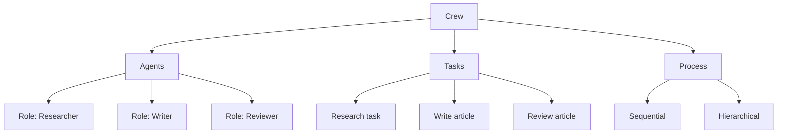
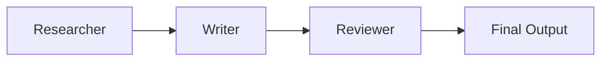
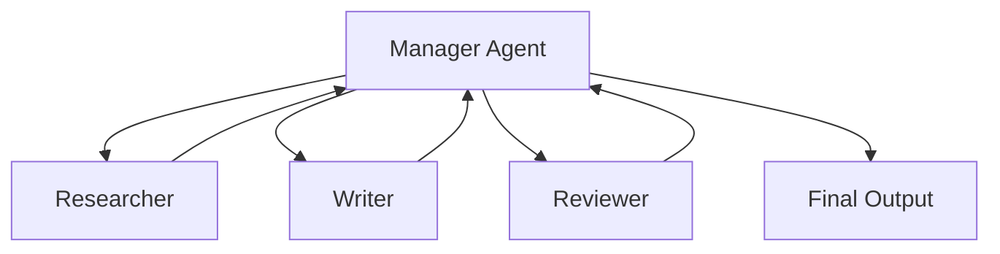

# CrewAI

## Overview

CrewAI is an open-source framework for orchestrating **role-playing AI agents** that collaborate to complete complex tasks. Unlike single-agent systems, CrewAI assigns specialized roles (e.g., Researcher, Writer, Reviewer) to different agents, enabling structured multi-agent workflows with delegation, collaboration, and quality control.

## Core Concepts



### Agent

An agent has a **role**, **goal**, and **backstory** that shape its behavior:

```python
from crewai import Agent

researcher = Agent(
    role="Senior Research Analyst",
    goal="Find comprehensive information about the given topic",
    backstory="You are an experienced researcher with expertise in "
              "analyzing complex topics and finding reliable sources.",
    tools=[search_tool, web_scraper],
    llm="gpt-4",
    verbose=True,
    allow_delegation=True  # Can delegate to other agents
)
```

### Task

A task defines **what** needs to be done and **which agent** does it:

```python
from crewai import Task

research_task = Task(
    description="Research the latest developments in quantum computing, "
                "focusing on practical applications and recent breakthroughs.",
    expected_output="A comprehensive research report with key findings, "
                    "statistics, and source references.",
    agent=researcher,
    output_file="research_report.md"  # Optional: save output
)
```

### Crew

A crew orchestrates agents and tasks:

```python
from crewai import Crew, Process

crew = Crew(
    agents=[researcher, writer, reviewer],
    tasks=[research_task, writing_task, review_task],
    process=Process.sequential,  # or Process.hierarchical
    verbose=True,
    memory=True  # Enable crew memory
)

result = crew.kickoff()
```

## Process Types

### Sequential Process

Tasks execute in order, each receiving output from the previous:



### Hierarchical Process

A manager agent delegates and coordinates:



## Delegation

Agents can delegate sub-tasks to other agents:

```python
agent_with_delegation = Agent(
    role="Project Manager",
    goal="Coordinate team to deliver high-quality output",
    backstory="Experienced PM who delegates effectively",
    allow_delegation=True  # Can assign work to other crew members
)
```

## Tools Integration

```python
from crewai_tools import SerperDevTool, WebsiteSearchTool, FileReadTool

agent = Agent(
    role="Analyst",
    goal="Analyze data and provide insights",
    tools=[
        SerperDevTool(),          # Web search
        WebsiteSearchTool(),      # Search website content
        FileReadTool(),           # Read local files
        # Custom tools
    ],
    llm="gpt-4"
)
```

## Code: Complete CrewAI Example

```python
from crewai import Agent, Task, Crew, Process
from crewai_tools import SerperDevTool

# Define agents
researcher = Agent(
    role="Market Research Analyst",
    goal="Conduct thorough market research on {topic}",
    backstory="Expert analyst with 10 years of experience in market research.",
    tools=[SerperDevTool()],
    verbose=True
)

writer = Agent(
    role="Content Writer",
    goal="Write engaging, well-structured content based on research",
    backstory="Professional writer specializing in technical and business content.",
    verbose=True
)

editor = Agent(
    role="Senior Editor",
    goal="Ensure content quality, accuracy, and readability",
    backstory="20 years of editing experience at top publications.",
    verbose=True
)

# Define tasks
research = Task(
    description="Research {topic} including market size, trends, and key players.",
    expected_output="Detailed research report with data and sources.",
    agent=researcher
)

writing = Task(
    description="Write a comprehensive article based on the research.",
    expected_output="Well-structured 1500-word article.",
    agent=writer
)

editing = Task(
    description="Review and edit the article for quality and accuracy.",
    expected_output="Polished, publication-ready article.",
    agent=editor
)

# Create crew
crew = Crew(
    agents=[researcher, writer, editor],
    tasks=[research, writing, editing],
    process=Process.sequential,
    verbose=True
)

# Execute
result = crew.kickoff(inputs={"topic": "AI in healthcare"})
print(result)
```

## Interview Questions

### Q1: What is CrewAI and how does it differ from single-agent frameworks?
**Answer:** CrewAI is a multi-agent orchestration framework where specialized agents with distinct roles collaborate on tasks. Unlike single-agent systems (LangChain), CrewAI assigns different personas, goals, and tools to different agents, enabling structured collaboration with delegation, quality control, and parallel execution.

### Q2: When would you use CrewAI over a single agent?
**Answer:** Use CrewAI when: 1) tasks benefit from specialization (research + writing + editing), 2) quality control through review is needed, 3) the task is too complex for a single prompt chain, 4) you need structured workflows with clear responsibilities. Single agents suffice for simple, linear tasks.

### Q3: What is the difference between sequential and hierarchical processes?
**Answer:** Sequential: tasks run in fixed order, each receiving previous output. Hierarchical: a manager agent dynamically delegates tasks to worker agents, can re-plan and re-delegate. Sequential is simpler and more predictable; hierarchical is more flexible for complex, dynamic tasks.

## Common Mistakes

- ❌ Too many agents for simple tasks (overhead not worth it)
- ❌ Poorly defined roles (agents don't know their responsibilities)
- ❌ No clear expected output format (inconsistent results)
- ❌ Not using delegation when tasks need dynamic coordination
- ❌ Ignoring cost — multiple agents mean multiple LLM calls

## Summary

CrewAI enables multi-agent collaboration with role-based specialization. Agents have roles, goals, and backstories. Tasks are assigned to agents and executed via sequential or hierarchical processes. Delegation allows dynamic task coordination. Best for complex tasks requiring multiple specialized perspectives.

## Cross-References

- [Frameworks →](frameworks.md) Agent framework overview
- [Multi-Agent →](multi-agent.md) Multi-agent patterns
- [LangChain →](langchain.md) Alternative framework
- [AutoGen →](autogen.md) Microsoft's multi-agent framework
- [Architecture →](architecture.md) Agent architecture patterns
- [Multi-Agent](./multi-agent.md)
- [AutoGen](./autogen.md)
- [LangChain](./langchain.md)
- [Agent Planning](./planning.md)

