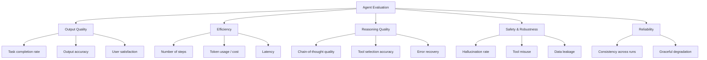
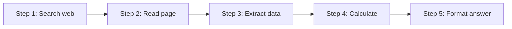

# Agent Evaluation

## Overview

Evaluating AI agents is significantly harder than evaluating traditional ML models or simple LLM outputs. Agents make **multi-step decisions**, use **tools**, interact with **environments**, and produce **non-deterministic** results. Effective evaluation requires measuring not just final output quality, but also reasoning quality, efficiency, safety, and reliability.

## Evaluation Dimensions



## Benchmark Suites

| Benchmark | What It Measures | Tasks |
|-----------|-----------------|-------|
| **WebArena** | Web browsing agents | E-commerce, CMS, maps |
| **SWE-bench** | Code agents | Real GitHub issues |
| **GAIA** | General AI assistants | Multi-step reasoning + tools |
| **AgentBench** | Agent capabilities | Web, code, DB, OS tasks |
| **τ-bench** | Real-world agent tasks | Customer service, data analysis |
| **ToolBench** | Tool use | 16K+ real-world APIs |

## Evaluation Metrics

### Task-Level Metrics

```python
def evaluate_agent(agent, test_cases):
    results = {
        "success_rate": 0,
        "avg_steps": 0,
        "avg_cost": 0,
        "avg_latency": 0,
        "tool_accuracy": 0,
    }
    
    for case in test_cases:
        start_time = time.time()
        output, trace = agent.run(case["input"])
        latency = time.time() - start_time
        
        # Task completion
        success = check_success(output, case["expected"])
        results["success_rate"] += success
        
        # Efficiency
        results["avg_steps"] += len(trace.steps)
        results["avg_cost"] += trace.total_tokens * COST_PER_TOKEN
        results["avg_latency"] += latency
        
        # Tool usage
        correct_tools = sum(1 for s in trace.steps 
                          if s.tool in case["expected_tools"])
        results["tool_accuracy"] += correct_tools / len(case["expected_tools"])
    
    n = len(test_cases)
    return {k: v / n for k, v in results.items()}
```

### Reasoning Quality Metrics

| Metric | Description | Method |
|--------|-------------|--------|
| **Coherence** | Logical flow of reasoning | LLM-as-judge |
| **Grounding** | Claims supported by evidence | Fact-checking |
| **Completeness** | All required info gathered | Checklist comparison |
| **Efficiency** | Unnecessary steps avoided | Step count analysis |

### LLM-as-Judge

Use a stronger model to evaluate agent outputs:

```python
def llm_judge(task, agent_output, criteria):
    prompt = f"""Evaluate this agent output for the given task.

Task: {task}

Agent Output: {agent_output}

Criteria:
{criteria}

Rate each criterion 1-5 and provide an overall score.
Output JSON: {{"criterion1": score, ..., "overall": score}}
"""
    return llm.evaluate(prompt)
```

## Agent Trajectory Evaluation

An agent's **trajectory** (sequence of actions) is as important as the final answer:



### Trajectory Metrics

| Metric | Formula | Description |
|--------|---------|-------------|
| **Path efficiency** | $\frac{\text{optimal steps}}{\text{actual steps}}$ | How efficient vs. optimal |
| **Error rate** | $\frac{\text{failed steps}}{\text{total steps}}$ | How often the agent makes mistakes |
| **Recovery rate** | $\frac{\text{recovered errors}}{\text{total errors}}$ | How well the agent recovers |
| **Redundancy** | $\frac{\text{repeated actions}}{\text{total actions}}$ | Wasted effort |

## Automated Evaluation Pipeline

```python
class AgentEvaluator:
    def __init__(self, agent, test_suite, judge_model="gpt-4"):
        self.agent = agent
        self.test_suite = test_suite
        self.judge = LLM(model=judge_model)
    
    def evaluate(self):
        results = []
        for test in self.test_suite:
            # Run agent
            output, trajectory = self.agent.run(test.task)
            
            # Automated checks
            exact_match = output.strip() == test.expected.strip()
            semantic_sim = self.compute_similarity(output, test.expected)
            
            # LLM judge
            quality_score = self.judge.evaluate(
                task=test.task, output=output, reference=test.expected
            )
            
            # Trajectory analysis
            trajectory_metrics = self.analyze_trajectory(
                trajectory, test.optimal_trajectory
            )
            
            results.append({
                "task": test.task,
                "exact_match": exact_match,
                "semantic_similarity": semantic_sim,
                "quality_score": quality_score,
                "trajectory": trajectory_metrics,
                "cost": trajectory.total_tokens,
                "latency": trajectory.duration,
            })
        
        return self.aggregate(results)
```

## Human Evaluation

For critical applications, human evaluation is essential:

| Aspect | Human Evaluation | Automated |
|--------|-----------------|-----------|
| Output quality | ✅ Gold standard | ⚠️ Approximation |
| Reasoning | ✅ Nuanced | ⚠️ Surface-level |
| Safety | ✅ Context-aware | ⚠️ Rule-based |
| Cost | ❌ Expensive | ✅ Cheap |
| Scale | ❌ Limited | ✅ Unlimited |

**Best practice**: Use automated metrics for iteration, human evaluation for final validation.

## Interview Questions

### Q1: How do you evaluate an AI agent?
**Answer:** Agent evaluation has multiple dimensions: 1) Task completion (did it solve the problem?), 2) Efficiency (how many steps/tokens?), 3) Reasoning quality (logical, grounded?), 4) Safety (hallucinations, misuse?), 5) Reliability (consistent across runs?). Use benchmarks like WebArena or SWE-bench, automated metrics, LLM-as-judge, and human evaluation.

### Q2: Why is evaluating agents harder than evaluating classifiers?
**Answer:** Agents have: 1) Multi-step trajectories (not single predictions), 2) Non-deterministic behavior (same input → different paths), 3) Tool interactions (side effects), 4) Open-ended outputs (not fixed labels), 5) Environment dependencies. You can't just compute accuracy — you need trajectory analysis, cost tracking, and quality assessment.

### Q3: What is LLM-as-judge?
**Answer:** Using a strong LLM to evaluate another model's outputs. You provide the task, output, and evaluation criteria, and the judge LLM scores quality, correctness, and other dimensions. It's cheaper than human evaluation and more nuanced than automated metrics. Limitations: position bias, verbosity bias, self-preference.

### Q4: How do you measure agent reliability?
**Answer:** Run the same tasks multiple times and measure: 1) Variance in success rate, 2) Consistency of outputs, 3) Worst-case performance, 4) Graceful degradation under perturbations. A reliable agent should succeed consistently, not just occasionally.

## Common Mistakes

- ❌ Evaluating only final output, ignoring the reasoning process
- ❌ Using too few test cases (not statistically significant)
- ❌ Not accounting for non-determinism (need multiple runs)
- ❌ Optimizing for one metric at the expense of others
- ❌ Not testing edge cases and failure modes

## Summary

Agent evaluation requires multi-dimensional assessment: task completion, efficiency, reasoning quality, safety, and reliability. Benchmarks like WebArena and SWE-bench provide standardized test suites. LLM-as-judge offers scalable quality assessment. Human evaluation remains the gold standard for critical applications. Always evaluate trajectories, not just final outputs.

## Cross-References

- [Frameworks →](frameworks.md) Building agents to evaluate
- [Safety →](safety.md) Safety evaluation specifically
- [Architecture →](architecture.md) Agent architecture
- [Planning →](planning.md) Reasoning quality
- [Tool Calling →](tool-calling.md) Tool usage evaluation
- [LLM Evaluation](../../llm/llm-serving/evaluation.md)
- [ML Foundations Evaluation](../foundations/evaluation.md)
- [Agent Safety](./safety.md)
- [MLOps Monitoring](../mlops/monitoring.md)

