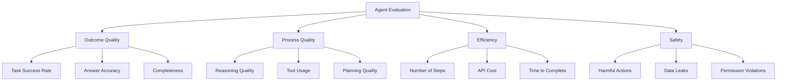
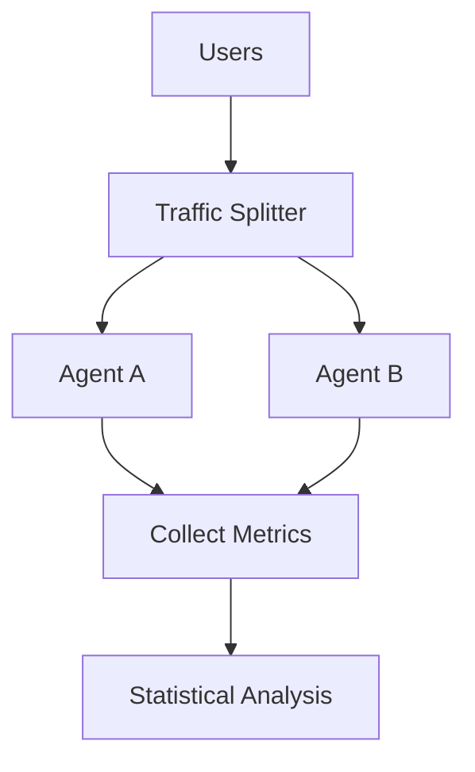

# Agent Evaluation

## Overview

Evaluating AI agents is harder than evaluating simple LLM outputs. Agents take multiple steps, use tools, and make decisions — a correct final answer can come from wrong reasoning, and correct reasoning can lead to wrong answers. Effective evaluation requires measuring both the process and the outcome.

## Evaluation Dimensions



## Key Metrics

| Metric | What It Measures | How to Compute |
|---|---|---|
| **Success Rate** | % of tasks completed correctly | Correct / Total tasks |
| **Pass@k** | Success in k attempts | At least 1 correct in k tries |
| **Step Accuracy** | % of correct intermediate steps | Correct steps / Total steps |
| **Tool Call Accuracy** | Correct tool selection and parameters | Correct calls / Total calls |
| **Efficiency** | Resources used per task | Steps, cost, time |
| **Human Rating** | Human judgment of quality | Likert scale or ranking |

## Evaluation Methods

### Benchmark Evaluation

Standardized test suites:

| Benchmark | Task Type | What It Tests |
|---|---|---|
| **SWE-bench** | Real GitHub issues | Software engineering |
| **WebArena** | Web browsing tasks | Web agent capabilities |
| **GAIA** | General assistant tasks | Multi-step reasoning |
| **AgentBench** | Various environments | General agent ability |
| **ToolBench** | API calls | Tool usage |

### Trajectory Evaluation

Evaluate the agent's step-by-step process:

```python
def evaluate_trajectory(trajectory, ground_truth):
    """Evaluate each step of the agent's process."""
    scores = {
        "planning": evaluate_plan(trajectory.plan, ground_truth.plan),
        "tool_selection": evaluate_tools(trajectory.tool_calls, ground_truth.expected_tools),
        "reasoning": evaluate_reasoning(trajectory.thoughts, ground_truth.expected_reasoning),
        "outcome": evaluate_outcome(trajectory.result, ground_truth.expected_result)
    }
    return scores
```

### LLM-as-Judge

Use a strong model to evaluate agent behavior:

```python
def llm_judge(task, agent_output, trajectory):
    prompt = f"""
    Evaluate this agent's performance:
    
    Task: {task}
    Agent trajectory: {trajectory}
    Final output: {agent_output}
    
    Rate on a scale of 1-10:
    1. Task completion (did it solve the problem?)
    2. Reasoning quality (was the thinking sound?)
    3. Tool usage (were tools used correctly?)
    4. Efficiency (was it resource-efficient?)
    """
    return llm.generate(prompt)
```

### A/B Testing

Compare agents in production:



## Evaluation Frameworks

| Framework | Focus | Features |
|---|---|---|
| **RAGAS** | RAG agents | Faithfulness, relevance |
| **DeepEval** | General LLM | Multiple metrics |
| **LangSmith** | LangChain | Tracing, evaluation |
| **Braintrust** | Production | Online evaluation |

## Interview Questions

### Q1: How do you evaluate an AI agent?
**Answer:** A comprehensive evaluation includes:
1. **Outcome**: Did the agent complete the task correctly? (success rate)
2. **Process**: Was the reasoning sound? Were the right tools used? (trajectory evaluation)
3. **Efficiency**: How many steps/cost/time? (resource metrics)
4. **Safety**: Did the agent take harmful actions? (safety metrics)
5. **Robustness**: Does it handle edge cases and errors? (stress testing)

Use benchmarks for standardization, LLM-as-judge for scalability, and human evaluation for quality.

### Q2: What is trajectory evaluation?
**Answer:** Trajectory evaluation assesses the agent's step-by-step process, not just the final answer. It checks:
- Was the plan reasonable?
- Were the right tools selected?
- Were tool parameters correct?
- Was the reasoning at each step sound?
- Were errors handled properly?

This is important because a correct final answer from bad reasoning is fragile, and good reasoning with a wrong answer may indicate a tool issue.

### Q3: How do you handle non-deterministic agent evaluation?
**Answer:** Agents are non-deterministic — the same input can produce different outputs. Handle this with:
1. **Multiple runs**: Run each test case 3-5 times, report success rate
2. **Pass@k**: Report if at least 1 of k runs succeeds
3. **Statistical significance**: Use enough test cases for reliable results
4. **Seed control**: Set random seeds when possible for reproducibility
5. **Focus on trends**: Individual runs matter less than patterns across many runs

## Common Mistakes

- ❌ Only evaluating final answers (ignoring process quality)
- ❌ Too few test cases (not statistically significant)
- ❌ Not testing edge cases and error handling
- ❌ Using automated metrics without human validation
- ❌ Not evaluating in realistic conditions (synthetic benchmarks ≠ production)

## Summary

Agent evaluation requires measuring outcome quality, process quality, efficiency, and safety. Methods include benchmarks, trajectory evaluation, LLM-as-judge, and A/B testing. Key metrics: success rate, step accuracy, tool call accuracy, and efficiency. Non-determinism requires multiple runs and statistical analysis.

## Cross-References

- [LLM Evaluation →](../../llm/llm-serving/evaluation.md) General LLM evaluation
- [Agent Safety →](safety.md) Safety evaluation
- [Monitoring →](../mlops/monitoring.md) Production monitoring
