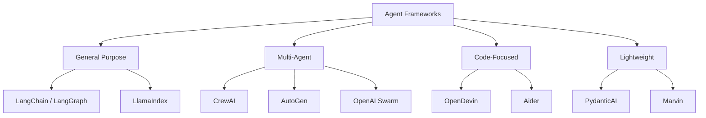
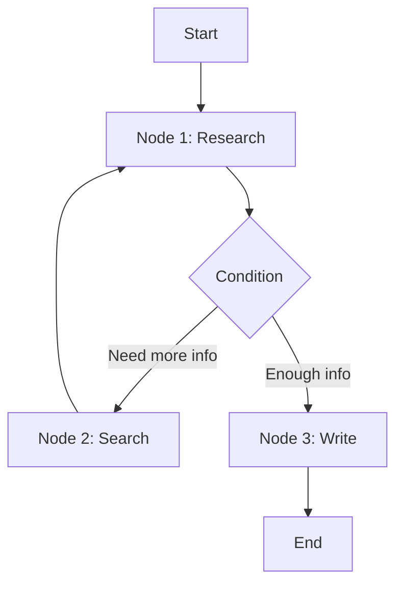
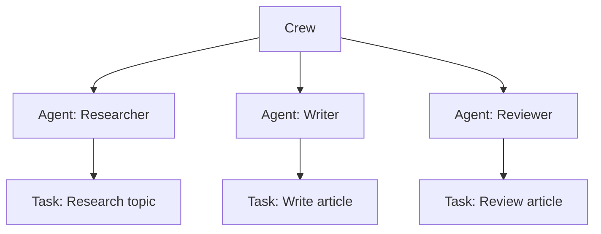
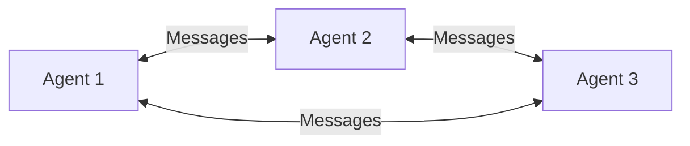

# Agent Frameworks Overview

## Overview

Agent frameworks provide the building blocks for creating AI agents — tool integration, memory management, planning, and orchestration. Instead of building everything from scratch, frameworks handle the plumbing so you can focus on agent logic. Understanding the landscape is essential for choosing the right tool for your use case.

## Framework Comparison

| Framework | Best For | Complexity | Multi-Agent |
|---|---|---|---|
| **LangChain/LangGraph** | General agents | Medium-High | ✅ |
| **LlamaIndex** | RAG-focused agents | Medium | ❌ |
| **CrewAI** | Role-based multi-agent | Low-Medium | ✅ |
| **AutoGen** | Multi-agent conversations | Medium | ✅ |
| **PydanticAI** | Type-safe agents | Low | ❌ |
| **OpenAI Swarm** | Lightweight multi-agent | Low | ✅ |

## Key Features to Compare

| Feature | LangGraph | CrewAI | AutoGen | PydanticAI |
|---|---|---|---|---|
| **Tool integration** | ✅ Extensive | ✅ Built-in | ✅ Via code | ✅ Clean API |
| **Memory** | ✅ Multiple types | ✅ Basic | ✅ Shared | ❌ Manual |
| **Planning** | ✅ Graph-based | ✅ Built-in | ✅ Conversation | ❌ Manual |
| **Streaming** | ✅ | ✅ | ✅ | ✅ |
| **Human-in-loop** | ✅ | ✅ | ✅ | ✅ |
| **Type safety** | ❌ | ❌ | ❌ | ✅ Pydantic |
| **Debugging** | ✅ LangSmith | ✅ Basic | ✅ Logging | ✅ |

## When to Use What

| Use Case | Recommended Framework |
|---|---|
| Simple tool-calling agent | PydanticAI or raw OpenAI |
| Complex workflow with state | LangGraph |
| Multi-agent team | CrewAI or AutoGen |
| RAG-focused agent | LlamaIndex |
| Research/experimentation | LangChain |
| Production (type-safe) | PydanticAI |
| Lightweight multi-agent | OpenAI Swarm |

## Framework Architecture Patterns

### Graph-Based (LangGraph)

Agents as nodes in a state graph. Edges define transitions. Supports cycles, conditions, and human-in-the-loop.

### Role-Based (CrewAI)

Agents have roles, goals, and backstories. Tasks are assigned to agents. Crew orchestrates execution.

### Conversation-Based (AutoGen)

Agents communicate through messages. Group chat manager coordinates. Code execution is built-in.

## Interview Questions

### Q1: How do you choose an agent framework?
**Answer:** Consider:
1. **Task complexity**: Simple → PydanticAI. Complex → LangGraph.
2. **Multi-agent needed?** Yes → CrewAI or AutoGen. No → LangChain or PydanticAI.
3. **Type safety important?** Yes → PydanticAI. No → any.
4. **RAG-focused?** Yes → LlamaIndex. No → general framework.
5. **Production readiness?** Check community size, maintenance, documentation.
6. **Learning curve**: CrewAI is easiest. LangGraph is most flexible but complex.

### Q2: What are the trade-offs of using a framework vs building from scratch?
**Answer:**
- **Framework pros**: Faster development, best practices built-in, community support, integrations
- **Framework cons**: Abstraction overhead, dependency on framework, may not fit exact needs, version churn
- **Scratch pros**: Full control, no dependencies, optimized for your use case
- **Scratch cons**: More development time, must handle edge cases, maintenance burden

Rule: Start with a framework. Only go custom if the framework genuinely can't handle your use case.

## Common Mistakes

- ❌ Choosing a framework based on hype, not fit
- ❌ Over-engineering with a complex framework for simple tasks
- ❌ Not understanding what the framework does under the hood
- ❌ Ignoring framework updates (breaking changes are common)

## Summary

Agent frameworks provide building blocks for tool integration, memory, planning, and orchestration. LangGraph offers flexibility, CrewAI simplifies multi-agent, AutoGen enables agent conversations, and PydanticAI provides type safety. Choose based on task complexity, multi-agent needs, and production requirements.

## Cross-References

- [LangChain →](langchain.md) Deep dive
- [CrewAI →](crewai.md) Deep dive
- [AutoGen →](autogen.md) Deep dive
- [Agent Architecture →](architecture.md) Design patterns
- [LangChain](./langchain.md)
- [AutoGen](./autogen.md)
- [CrewAI](./crewai.md)
- [MLOps Platforms](../mlops/platforms.md)

