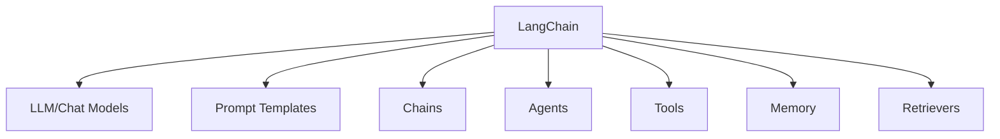
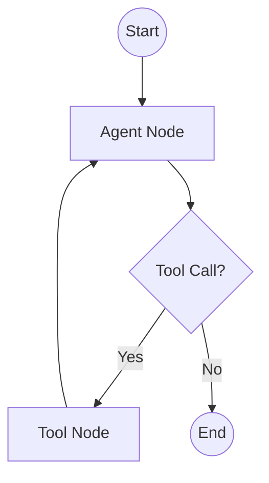

# LangChain & LangGraph

## Overview

LangChain is the most widely-used framework for building LLM applications. LangGraph, its companion for agent workflows, provides a graph-based architecture for complex, stateful agent systems. Together, they handle tool integration, memory, retrieval, and orchestration.

## LangChain Core Concepts



### Chains

Sequential operations:

```python
from langchain_openai import ChatOpenAI
from langchain_core.prompts import ChatPromptTemplate
from langchain_core.output_parsers import StrOutputParser

# Simple chain
prompt = ChatPromptTemplate.from_template(
    "Explain {topic} in simple terms."
)
model = ChatOpenAI(model="gpt-4")
parser = StrOutputParser()

chain = prompt | model | parser
result = chain.invoke({"topic": "quantum computing"})
```

### LCEL (LangChain Expression Language)

Pipe-based composition:

```python
# Complex chain with retrieval
retriever = vectorstore.as_retriever()
prompt = ChatPromptTemplate.from_template("""
Answer based on context:
{context}
Question: {question}
""")

chain = (
    {"context": retriever, "question": RunnablePassthrough()}
    | prompt
    | model
    | parser
)
```

## LangGraph

LangGraph models agent workflows as state graphs:



### Basic Agent

```python
from langgraph.graph import StateGraph, MessagesState, START, END
from langgraph.prebuilt import ToolNode

# Define tools
tools = [search_tool, calculator_tool]

# Create agent
model = ChatOpenAI(model="gpt-4").bind_tools(tools)

def agent_node(state: MessagesState):
    response = model.invoke(state["messages"])
    return {"messages": [response]}

def should_use_tools(state: MessagesState):
    last_message = state["messages"][-1]
    if last_message.tool_calls:
        return "tools"
    return END

# Build graph
graph = StateGraph(MessagesState)
graph.add_node("agent", agent_node)
graph.add_node("tools", ToolNode(tools))
graph.add_edge(START, "agent")
graph.add_conditional_edges("agent", should_use_tools)
graph.add_edge("tools", "agent")

app = graph.compile()
result = app.invoke({"messages": [("user", "What's the weather?")]})
```

### Stateful Agent with Custom State

```python
from typing import TypedDict, Annotated
from langgraph.graph import StateGraph

class AgentState(TypedDict):
    messages: list
    plan: list
    completed_steps: list
    current_step: str

def planner_node(state: AgentState):
    plan = create_plan(state["messages"][-1].content)
    return {"plan": plan, "current_step": plan[0]}

def executor_node(state: AgentState):
    result = execute_step(state["current_step"])
    return {
        "completed_steps": state["completed_steps"] + [result],
        "current_step": get_next_step(state["plan"], state["completed_steps"])
    }

# Build graph
graph = StateGraph(AgentState)
graph.add_node("planner", planner_node)
graph.add_node("executor", executor_node)
graph.add_edge(START, "planner")
graph.add_edge("planner", "executor")
graph.add_conditional_edges("executor", should_continue)
```

### Human-in-the-Loop

```python
from langgraph.checkpoint.memory import MemorySaver

# Add checkpointing for human-in-the-loop
checkpointer = MemorySaver()
app = graph.compile(
    checkpointer=checkpointer,
    interrupt_before=["tools"]  # Pause before tool execution
)

# Run until interrupt
config = {"configurable": {"thread_id": "1"}}
result = app.invoke(input_data, config)

# Human reviews and approves
# Resume execution
result = app.invoke(None, config)
```

## Key LangGraph Features

| Feature | Description |
|---|---|
| **State management** | Typed state objects passed between nodes |
| **Conditional edges** | Dynamic routing based on state |
| **Cycles** | Loops for iterative agent behavior |
| **Checkpointing** | Save/restore state for long-running tasks |
| **Human-in-the-loop** | Pause execution for human approval |
| **Streaming** | Stream tokens and state updates |
| **Persistence** | SQLite/PostgreSQL for state storage |

## Interview Questions

### Q1: What is the difference between LangChain and LangGraph?
**Answer:**
- **LangChain**: Higher-level abstractions (chains, agents, tools). Good for simple sequential workflows. LCEL for composing operations.
- **LangGraph**: Lower-level graph-based architecture. Models workflows as state machines with nodes and edges. Supports cycles, conditional routing, human-in-the-loop.
- LangGraph is better for complex agents with state. LangChain is better for simple chains and retrieval.

### Q2: How does LangGraph handle state?
**Answer:** LangGraph uses TypedDict for state definition. State is passed between nodes, and each node returns partial state updates. The graph merges updates automatically. This enables:
- Tracking conversation history
- Maintaining plans and progress
- Sharing data between agent steps
- Checkpointing for persistence

### Q3: What is LCEL?
**Answer:** LCEL (LangChain Expression Language) is a pipe-based composition syntax:
```python
chain = prompt | model | parser
```
It creates a RunnableSequence. Benefits: automatic async support, streaming, batch processing, and fallbacks. It replaces the older `LLMChain` class.

## Common Mistakes

- ❌ Using LangChain for simple tasks (overhead not worth it)
- ❌ Not understanding LangGraph's state management
- ❌ Ignoring checkpointing (lose state on failures)
- ❌ Over-complicating graphs (keep them simple)

## Summary

LangChain provides building blocks for LLM applications. LangGraph models agent workflows as state graphs with nodes, edges, and conditional routing. Key features: state management, checkpointing, human-in-the-loop, and streaming. Use LangGraph for complex agents, LangChain for simple chains.

## Cross-References

- [Agent Architecture →](architecture.md) Design patterns
- [Tool Calling →](tool-calling.md) Tool integration
- [Memory →](memory.md) Memory management
- [Frameworks →](frameworks.md) Framework comparison
