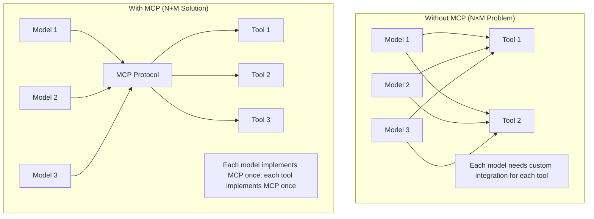
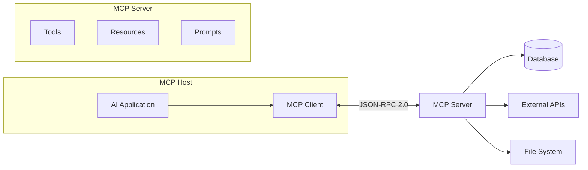

# MCP Protocol (Model Context Protocol)

## Overview

MCP (Model Context Protocol) is an open standard developed by Anthropic that provides a unified interface for connecting AI models to external tools, data sources, and systems. Think of it as "USB-C for AI" — a single protocol that lets any AI model connect to any tool or data source.

## Why MCP?



| Without MCP | With MCP |
|---|---|
| N models × M tools = N×M integrations | N + M implementations |
| Each tool has different API | Standardized interface |
| Vendor lock-in | Interoperable |
| Hard to maintain | Easy to add new tools |

## MCP Architecture



### Components

| Component | Role | Examples |
|---|---|---|
| **Host** | The AI application | Claude Desktop, IDE, custom app |
| **Client** | Manages connections to servers | Built into the host |
| **Server** | Exposes tools/resources | File system, database, API |

## MCP Primitives

### 1. Tools

Functions the model can call:

```json
{
  "name": "query_database",
  "description": "Execute a SQL query against the database",
  "inputSchema": {
    "type": "object",
    "properties": {
      "sql": {
        "type": "string",
        "description": "SQL query to execute"
      }
    },
    "required": ["sql"]
  }
}
```

### 2. Resources

Data sources the model can read:

```json
{
  "uri": "file:///path/to/document.md",
  "name": "Project Documentation",
  "mimeType": "text/markdown"
}
```

### 3. Prompts

Reusable prompt templates:

```json
{
  "name": "code_review",
  "description": "Review code for issues",
  "arguments": [
    {
      "name": "code",
      "description": "Code to review",
      "required": true
    }
  ]
}
```

## MCP Server Example

```python
from mcp import Server, Tool

server = Server("my-tools")

@server.tool()
def search_web(query: str, max_results: int = 5) -> str:
    """Search the web for information."""
    results = web_search(query, max_results=max_results)
    return json.dumps(results)

@server.tool()
def read_file(path: str) -> str:
    """Read the contents of a file."""
    with open(path, "r") as f:
        return f.read()

@server.resource("file:///{path}")
def get_file(path: str) -> str:
    """Get file contents as a resource."""
    with open(path, "r") as f:
        return f.read()

# Run the server
server.run()
```

## MCP Client Example

```python
from mcp import Client

async def main():
    client = Client()
    
    # Connect to a server
    await client.connect("stdio", command=["python", "my_server.py"])
    
    # List available tools
    tools = await client.list_tools()
    
    # Call a tool
    result = await client.call_tool(
        "search_web",
        arguments={"query": "latest AI research"}
    )
    
    print(result)
```

## Transport Mechanisms

| Transport | Use Case |
|---|---|
| **stdio** | Local processes (CLI tools) |
| **SSE (Server-Sent Events)** | Remote servers, web apps |
| **WebSocket** | Real-time bidirectional |

## MCP vs Tool Calling

| Aspect | Tool Calling | MCP |
|---|---|---|
| **Standard** | Vendor-specific | Open standard |
| **Interoperability** | Per-provider | Universal |
| **Capabilities** | Tools only | Tools + Resources + Prompts |
| **Discovery** | Manual | Dynamic (list tools at runtime) |
| **Transport** | HTTP usually | stdio, SSE, WebSocket |

## Interview Questions

### Q1: What is MCP and why is it important?
**Answer:** MCP (Model Context Protocol) is an open standard for connecting AI models to tools and data sources. It solves the N×M integration problem — without MCP, each model needs custom integration for each tool. With MCP, each model and tool implements the protocol once. It's important because:
- Enables interoperability between any AI model and any tool
- Reduces integration effort from N×M to N+M
- Provides a standard interface for tools, resources, and prompts
- Enables dynamic tool discovery at runtime

### Q2: What are the three primitives in MCP?
**Answer:**
1. **Tools**: Functions the model can call (like function calling)
2. **Resources**: Data sources the model can read (files, databases, APIs)
3. **Prompts**: Reusable prompt templates for common tasks

Tools are for actions, resources are for data, prompts are for workflows.

### Q3: How does MCP differ from OpenAI function calling?
**Answer:**
- **Function calling**: Vendor-specific, tools only, defined per request
- **MCP**: Open standard, tools + resources + prompts, dynamic discovery
- MCP is more comprehensive (not just tools) and more interoperable (not vendor-locked)
- MCP servers can be reused across different AI applications
- Function calling is simpler for basic use cases

## Common Mistakes

- ❌ Confusing MCP with function calling (MCP is a broader protocol)
- ❌ Not implementing proper error handling in MCP servers
- ❌ Making MCP servers too complex (keep them focused)
- ❌ Not providing good descriptions for tools (model can't use them effectively)

## Summary

MCP is an open standard for connecting AI models to tools and data sources. It provides three primitives: tools (actions), resources (data), and prompts (templates). It solves the N×M integration problem by providing a universal protocol. MCP is to AI what USB-C is to hardware — a single standard for connectivity.

## Cross-References

- [Tool Calling →](tool-calling.md) The mechanism MCP standardizes
- [Agent Architecture →](architecture.md) Where MCP fits in
- [Frameworks →](frameworks.md) How frameworks use MCP
