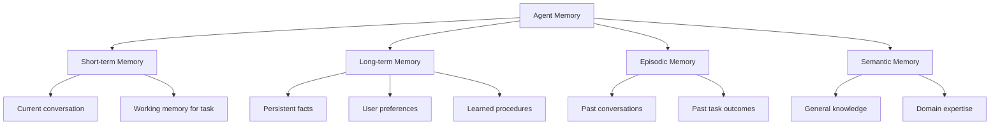
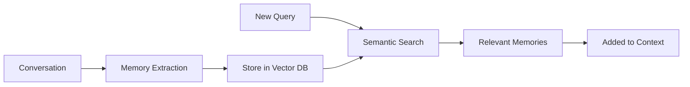
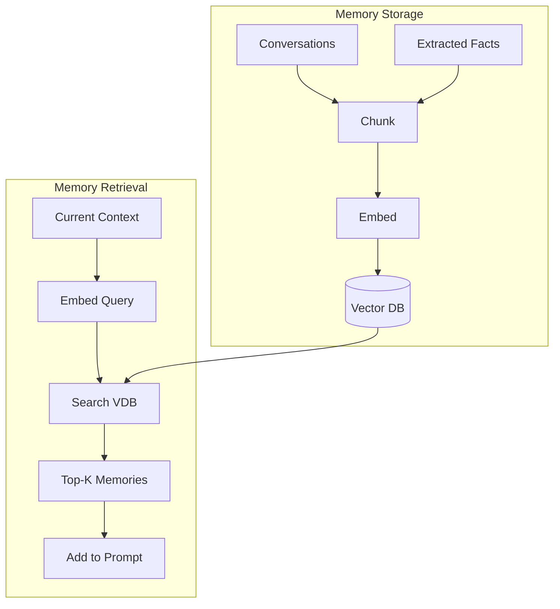

# Agent Memory

## Overview

Agent memory systems allow agents to retain and retrieve information across interactions. Without memory, agents start fresh each time. With memory, they can learn user preferences, recall past conversations, and build on previous work. Memory is what transforms a stateless LLM into a persistent assistant.

## Types of Memory



| Memory Type | Duration | Storage | Example |
|---|---|---|---|
| **Short-term** | Current session | Context window | Current conversation |
| **Working** | Current task | Context + scratchpad | Intermediate calculations |
| **Long-term** | Persistent | Vector DB / file | User preferences |
| **Episodic** | Past interactions | Vector DB | "Last time we discussed X" |
| **Semantic** | Permanent | Knowledge base | Facts, procedures |

## Short-term Memory

The conversation context window:

```python
class ShortTermMemory:
    def __init__(self, max_tokens=4096):
        self.messages = []
        self.max_tokens = max_tokens
    
    def add(self, role, content):
        self.messages.append({"role": role, "content": content})
        self.trim()  # Remove old messages if over limit
    
    def trim(self):
        """Remove oldest messages when over token limit."""
        while self.token_count() > self.max_tokens:
            self.messages.pop(0)  # Remove oldest
    
    def get_context(self):
        return self.messages
```

**Challenges:**
- Fixed window size (can't remember everything)
- "Lost in the middle" (important info in the middle gets forgotten)
- Cost (long context = more tokens = more money)

## Long-term Memory

Persistent storage across sessions:



### Implementation

```python
class LongTermMemory:
    def __init__(self, vector_db):
        self.db = vector_db
    
    def store(self, memory, metadata=None):
        """Store a memory with embedding."""
        embedding = embed(memory)
        self.db.add(embedding, memory, metadata)
    
    def recall(self, query, top_k=5):
        """Recall relevant memories."""
        query_embedding = embed(query)
        results = self.db.search(query_embedding, top_k=top_k)
        return results
    
    def summarize_and_store(self, conversation):
        """Extract key information from conversation."""
        summary = llm.generate(f"""
        Extract key information from this conversation:
        {conversation}
        
        Return as structured facts:
        - User preferences
        - Decisions made
        - Important information
        """)
        self.store(summary)
```

## Episodic Memory

Memory of past interactions and their outcomes:

```python
class EpisodicMemory:
    def __init__(self):
        self.episodes = []
    
    def record_episode(self, task, actions, outcome):
        """Record a complete task episode."""
        episode = {
            "task": task,
            "actions": actions,
            "outcome": outcome,
            "timestamp": datetime.now(),
            "success": outcome.success
        }
        self.episodes.append(episode)
        self.store_in_vector_db(episode)
    
    def recall_similar(self, current_task, top_k=3):
        """Find similar past episodes."""
        return self.vector_db.search(current_task, top_k=top_k)
```

## RAG-based Memory

Using RAG as a memory system:



## Memory Management

### What to Store

```python
def should_store(message, response):
    """Decide if this interaction is worth storing."""
    return (
        contains_preference(message) or
        contains_decision(message) or
        contains_fact(message) or
        contains_correction(response)  # User corrected the agent
    )
```

### Memory Consolidation

Periodically consolidate memories:

```python
def consolidate_memories(memories):
    """Merge related memories, remove duplicates."""
    prompt = f"""
    Consolidate these memories into a concise summary:
    {memories}
    
    - Remove duplicates
    - Merge related facts
    - Keep the most important information
    """
    return llm.generate(prompt)
```

## Interview Questions

### Q1: What are the different types of agent memory?
**Answer:**
1. **Short-term**: Current conversation context (context window)
2. **Working**: Intermediate results for current task (scratchpad)
3. **Long-term**: Persistent information across sessions (vector DB)
4. **Episodic**: Past interactions and outcomes (what happened before)
5. **Semantic**: General knowledge and facts (knowledge base)

Each serves a different purpose. Short-term is fast but limited. Long-term persists but requires retrieval. Episodic helps learn from experience.

### Q2: How do you implement long-term memory for an agent?
**Answer:**
1. **Storage**: Use a vector database (Chroma, Qdrant) to store memory embeddings
2. **Extraction**: After each conversation, extract key facts, preferences, decisions
3. **Embedding**: Convert memories to vectors using an embedding model
4. **Retrieval**: At the start of each session, search for relevant memories
5. **Injection**: Add retrieved memories to the system prompt or context
6. **Consolidation**: Periodically merge related memories, remove outdated ones

### Q3: How do you handle memory window limitations?
**Answer:**
1. **Summarization**: Compress old messages into summaries
2. **Sliding window**: Keep only recent N messages
3. **Importance-based**: Keep important messages, summarize the rest
4. **RAG retrieval**: Store all messages in vector DB, retrieve relevant ones
5. **Hierarchical**: Recent messages in full, older in summary, oldest in vector DB

## Common Mistakes

- ❌ Storing everything (noise overwhelms signal)
- ❌ Not consolidating memories (redundancy grows)
- ❌ Poor extraction (missing key information)
- ❌ Not testing retrieval quality (irrelevant memories in context)
- ❌ Ignoring privacy (storing sensitive information without safeguards)

## Summary

Agent memory includes short-term (context), long-term (vector DB), episodic (past interactions), and semantic (knowledge) types. RAG-based memory retrieves relevant past information. Key challenges: what to store, how to retrieve, and managing window limits.

## Cross-References

- [RAG →](../../llm/llm-serving/rag.md) Retrieval mechanism for memory
- [Embeddings →](../../llm/llm-serving/embeddings.md) Vectorizing memories
- [Agent Architecture →](architecture.md) Where memory fits
- [LangChain →](langchain.md) Memory implementation in frameworks
