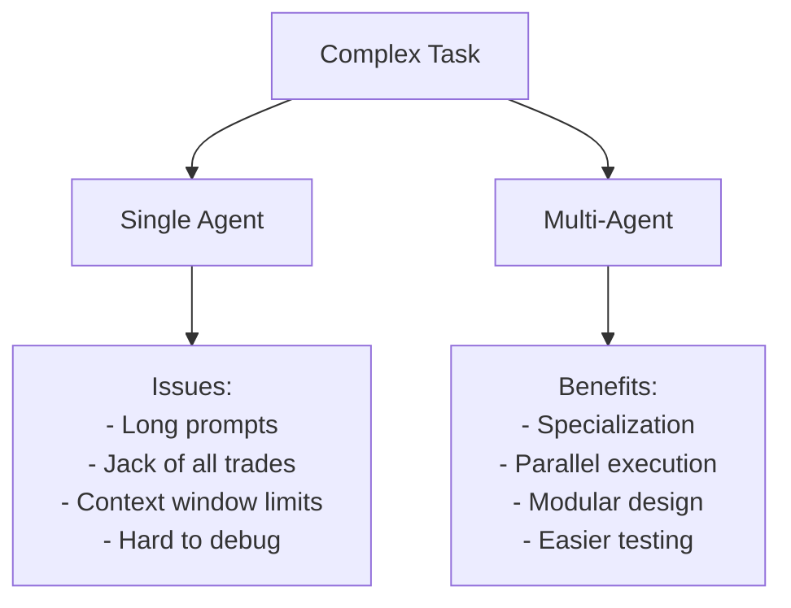
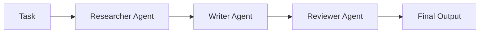
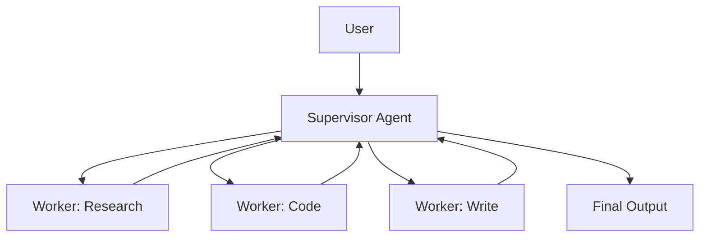
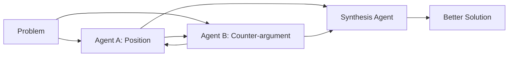
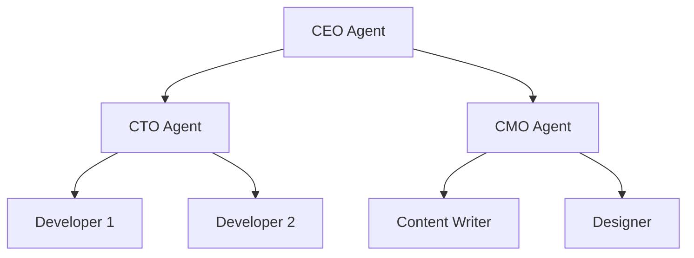
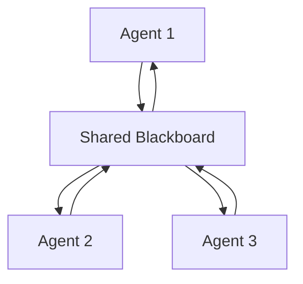
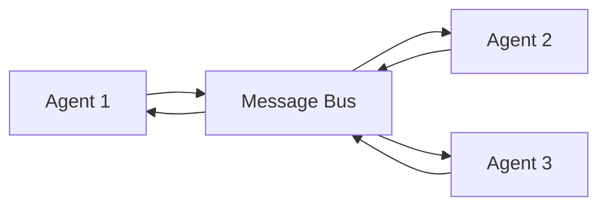

# Multi-Agent Systems

## Overview

Multi-agent systems use multiple specialized AI agents that collaborate to solve complex tasks. Instead of one agent doing everything, each agent has a specific role (researcher, coder, reviewer) and they communicate to achieve a shared goal. This mirrors how human teams work — specialization and collaboration.

## Why Multi-Agent?



## Multi-Agent Patterns

### 1. Sequential Pipeline



Each agent processes the task in order. Good for tasks with clear stages.

### 2. Supervisor/Worker



Supervisor delegates tasks and aggregates results. Good for complex tasks with distinct sub-problems.

### 3. Debate/Discussion



Agents debate to find better solutions. Good for decision-making and analysis.

### 4. Hierarchical



Multi-level delegation. Good for large, complex projects.

## Agent Communication

### Direct Messaging

```python
class Agent:
    def send(self, message, recipient):
        recipient.receive(message, sender=self)
    
    def receive(self, message, sender):
        # Process message and potentially respond
        response = self.process(message)
        if response:
            self.send(response, sender)
```

### Shared Blackboard



Agents read/write to a shared state. Simple but can have conflicts.

### Message Bus



Agents communicate through a central bus. Supports pub/sub patterns.

## Implementation Example

```python
class MultiAgentSystem:
    def __init__(self):
        self.agents = {}
        self.message_queue = []
    
    def add_agent(self, name, agent):
        self.agents[name] = agent
    
    def route_message(self, message, from_agent, to_agent):
        self.message_queue.append({
            "from": from_agent,
            "to": to_agent,
            "content": message
        })
    
    def run(self, task):
        # Supervisor decomposes task
        plan = self.agents["supervisor"].plan(task)
        
        results = {}
        for step in plan:
            agent = self.agents[step.agent]
            result = agent.execute(step.task, context=results)
            results[step.name] = result
        
        return self.agents["supervisor"].synthesize(results)
```

## Coordination Strategies

| Strategy | How It Works | Best For |
|---|---|---|
| **Round-robin** | Agents take turns | Simple collaboration |
| **Voting** | Agents vote on decisions | Democratic decisions |
| **Market-based** | Agents bid on tasks | Resource allocation |
| **Consensus** | Agents negotiate until agreement | Important decisions |

## Interview Questions

### Q1: When should you use multi-agent vs single agent?
**Answer:** Use multi-agent when:
- Task has clearly separable sub-tasks (research, code, review)
- Different expertise is needed (specialized agents)
- Parallel execution would speed things up
- Quality requires multiple perspectives (debate/review)
- Single agent's prompt is too long or complex

Use single agent when:
- Task is straightforward
- Latency is critical (multi-agent adds communication overhead)
- Debugging simplicity is important

### Q2: How do you handle conflicts between agents?
**Answer:**
1. **Supervisor arbitration**: Supervisor agent makes final decisions
2. **Voting**: Majority vote among agents
3. **Priority**: Certain agents have higher authority
4. **Debate**: Agents argue their positions, synthesis agent decides
5. **Fallback to human**: Escalate to user when agents can't agree

### Q3: What are the challenges of multi-agent systems?
**Answer:**
- **Coordination overhead**: Communication costs time and tokens
- **Consistency**: Agents may give conflicting outputs
- **Debugging**: Harder to trace issues across multiple agents
- **Cost**: More LLM calls = higher cost
- **Latency**: Sequential communication adds delay
- **State management**: Shared state can cause conflicts

## Common Mistakes

- ❌ Using multi-agent when single agent would suffice
- ❌ Not defining clear agent responsibilities (overlap causes confusion)
- ❌ Poor communication protocol (agents misunderstand each other)
- ❌ No supervisor or coordination (agents work at cross purposes)
- ❌ Not limiting message rounds (infinite discussion loops)

## Summary

Multi-agent systems use specialized agents that collaborate through structured communication. Patterns include sequential pipeline, supervisor/worker, debate, and hierarchical. Key challenges: coordination, consistency, and cost. Use when tasks have separable sub-tasks requiring different expertise.

## Cross-References

- [Agent Architecture →](architecture.md) Single agent design
- [CrewAI →](crewai.md) Multi-agent framework
- [AutoGen →](autogen.md) Multi-agent conversations
- [Planning →](planning.md) Task decomposition for agents
