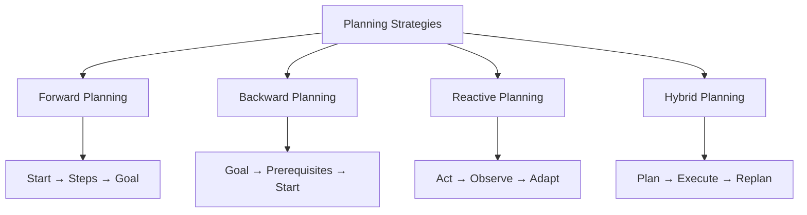
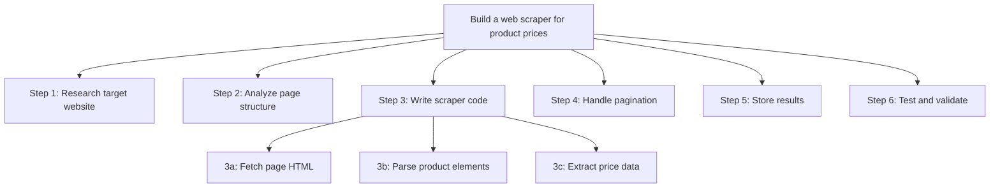
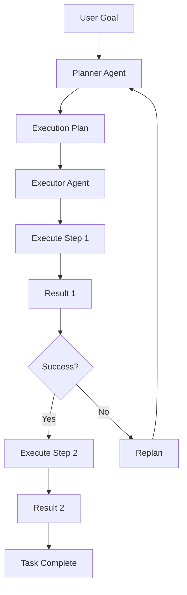
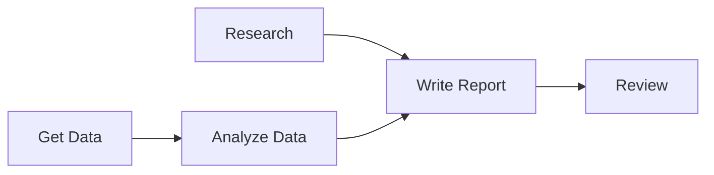

# Agent Planning

## Overview

Planning is the ability of an agent to decompose complex tasks into manageable sub-tasks, determine the order of execution, and adapt when things go wrong. Good planning is what separates a capable agent from one that gets stuck or produces poor results.

## Planning Strategies



## Task Decomposition

Breaking a complex task into sub-tasks:



### Decomposition Prompt

```python
def decompose_task(task):
    prompt = f"""
    Break this task into clear, sequential sub-tasks:
    
    Task: {task}
    
    For each sub-task, specify:
    - Description
    - Dependencies (which sub-tasks must complete first)
    - Expected output
    
    Return as a numbered list.
    """
    return llm.generate(prompt)
```

## Plan-and-Execute Pattern



```python
class PlanAndExecuteAgent:
    def __init__(self, planner, executor):
        self.planner = planner
        self.executor = executor
    
    def run(self, goal, max_replans=3):
        plan = self.planner.create_plan(goal)
        
        for replan_count in range(max_replans):
            for step in plan.steps:
                result = self.executor.execute(step)
                
                if not result.success:
                    # Replan from current state
                    plan = self.planner.replan(
                        goal, 
                        completed=plan.completed_steps,
                        failed=step,
                        error=result.error
                    )
                    break  # Start new plan
            else:
                return result  # All steps completed
        
        return "Max replans reached"
```

## Replanning

When to replan:

| Trigger | Action |
|---|---|
| Step fails | Analyze failure, adjust plan |
| Unexpected result | Incorporate new information |
| New constraint | Adjust plan to accommodate |
| Better approach found | Switch strategy |

```python
def replan(self, goal, completed, failed, error):
    prompt = f"""
    Goal: {goal}
    Completed steps: {completed}
    Failed step: {failed}
    Error: {error}
    
    Create a new plan considering:
    1. What has already been done
    2. What went wrong
    3. Alternative approaches
    """
    return self.planner.generate(prompt)
```

## Goal Setting

### SMART Goals for Agents

| Component | Description | Example |
|---|---|---|
| **Specific** | Clear, unambiguous | "Extract product prices from Amazon" |
| **Measurable** | Quantifiable success | "At least 100 products" |
| **Achievable** | Within capabilities | "Using web scraping tools" |
| **Relevant** | Aligns with user need | "For price comparison" |
| **Time-bound** | Has deadline | "Complete within 5 minutes" |

## Planning with Dependencies



```python
class DependencyPlanner:
    def create_plan(self, tasks):
        # Build dependency graph
        graph = self.build_dependency_graph(tasks)
        
        # Topological sort
        ordered = self.topological_sort(graph)
        
        # Identify parallelizable tasks
        levels = self.group_by_level(ordered)
        
        return Plan(steps=ordered, parallel_groups=levels)
```

## Interview Questions

### Q1: How do agents plan complex tasks?
**Answer:** Agents use several planning strategies:
1. **Task decomposition**: Break complex tasks into smaller sub-tasks
2. **Dependency analysis**: Determine which sub-tasks depend on others
3. **Plan-and-Execute**: Create a plan, execute steps, replan if needed
4. **Hierarchical planning**: High-level plan → detailed sub-plans
5. **Reactive planning**: Adapt based on observations (ReAct pattern)

The key is combining upfront planning with reactive replanning when things go wrong.

### Q2: How do you handle plan failures?
**Answer:**
1. **Analyze the failure**: What went wrong and why?
2. **Partial progress**: Keep what worked, retry what failed
3. **Alternative approach**: Try a different method for the failed step
4. **Replan**: Create a new plan considering the failure
5. **Escalate**: Ask the user for guidance if stuck
6. **Maximum retries**: Limit replanning to prevent infinite loops

### Q3: What is the difference between planning and reasoning?
**Answer:**
- **Planning**: Deciding what to do in what order (strategic)
- **Reasoning**: Figuring out how to do each step (tactical)
- Planning is about task decomposition and sequencing
- Reasoning is about executing each step correctly
- Good agents need both: planning for the big picture, reasoning for each step

## Common Mistakes

- ❌ No planning at all (just react to each step)
- ❌ Over-planning (spending too much time on the plan)
- ❌ Not replanning when things change
- ❌ Ignoring dependencies (executing steps in wrong order)
- ❌ No maximum iteration limit (infinite replanning)

## Summary

Agent planning involves decomposing tasks, ordering steps with dependencies, and replanning when failures occur. The Plan-and-Execute pattern separates planning from execution. Replanning is essential for handling real-world complexity. Good planning is the foundation of effective agent behavior.

## Cross-References

- [ReAct →](react.md) Reactive planning pattern
- [Tree-of-Thought →](tree-of-thought.md) Exploring multiple plans
- [Multi-Agent →](multi.md) Planning with multiple agents
- [Agent Architecture →](architecture.md) Where planning fits
