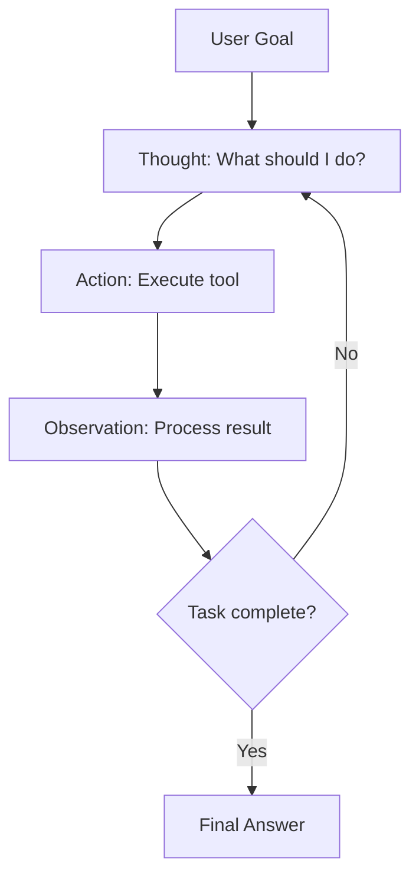
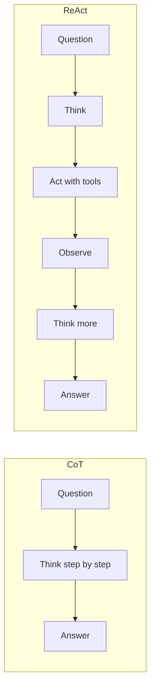
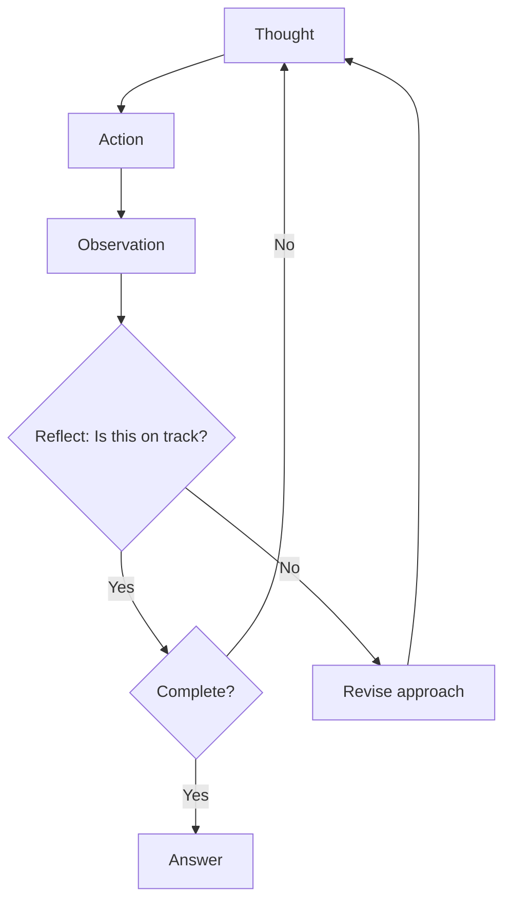

# ReAct Pattern

## Overview

ReAct (Reasoning + Acting) is the foundational pattern for LLM agents. It interleaves reasoning (thinking about what to do) with acting (taking an action via tools) and observing (processing the result). This pattern makes agent behavior transparent, debuggable, and effective for complex tasks.

## The ReAct Loop



## How ReAct Works

### Step-by-Step Example

```
Question: "What is the population of the capital of France?"

Thought 1: I need to find the capital of France first.
Action 1: search("capital of France")
Observation 1: Paris is the capital of France.

Thought 2: Now I need to find the population of Paris.
Action 2: search("population of Paris 2024")
Observation 2: Paris has approximately 2.1 million people (city proper).

Thought 3: I now have all the information needed.
Answer: The capital of France is Paris, with a population of approximately 2.1 million people.
```

### Another Example (Code Task)

```
Task: "Read the CSV file and calculate the average salary by department."

Thought 1: I need to read the CSV file first.
Action 1: python_execute("import pandas as pd; df = pd.read_csv('salaries.csv'); print(df.head())")
Observation 1: 
   name  department  salary
0  Alice  Engineering  120000
1  Bob    Marketing    95000
...

Thought 2: Now I'll group by department and calculate averages.
Action 2: python_execute("print(df.groupby('department')['salary'].mean())")
Observation 2:
department
Engineering    125000
Marketing       92000
Sales           88000

Thought 3: I have the results. Let me present them clearly.
Answer: Average salary by department:
- Engineering: $125,000
- Marketing: $92,000
- Sales: $88,000
```

## ReAct Prompt Template

```
You are a helpful assistant that can use tools to answer questions.

Available tools:
{tool_descriptions}

Use the following format:

Thought: [your reasoning about what to do next]
Action: [tool_name]([parameters])
Observation: [result from the tool]
... (repeat Thought/Action/Observation as needed)
Thought: I now have enough information to answer
Final Answer: [your answer to the user's question]

Begin!

Question: {user_question}
```

## ReAct vs Chain-of-Thought

| Aspect | CoT | ReAct |
|---|---|---|
| **Reasoning** | ✅ Step-by-step | ✅ Step-by-step |
| **Tool use** | ❌ No | ✅ Yes |
| **Grounding** | ❌ May hallucinate | ✅ Uses real data |
| **Complexity** | Simple | More complex |
| **Best for** | Math, logic | Tasks requiring external info |



## Implementation

```python
def react_agent(question, tools, max_iterations=10):
    prompt = build_react_prompt(question, tools)
    
    for i in range(max_iterations):
        # Generate next thought/action
        response = llm.generate(prompt)
        
        # Parse response
        if "Final Answer:" in response:
            return extract_answer(response)
        
        thought = extract_thought(response)
        action = extract_action(response)
        
        # Execute action
        observation = tools.execute(action)
        
        # Update prompt
        prompt += f"\nThought: {thought}\nAction: {action}\nObservation: {observation}"
    
    return "Max iterations reached. Could not complete task."
```

## ReAct Variants

### ReAct with Reflection



### ReAct with Self-Correction

```python
# After a failed action
thought = """
The previous action failed with error: {error}.
Let me analyze what went wrong and try a different approach.
I'll try {alternative_action} instead.
"""
```

## Interview Questions

### Q1: What is the ReAct pattern and why is it effective?
**Answer:** ReAct interleaves Thought (reasoning), Action (tool use), and Observation (result processing) in a loop. It's effective because:
1. **Grounded reasoning**: Unlike CoT, ReAct uses real tool outputs, reducing hallucination
2. **Transparency**: Each thought explains the reasoning, making debugging easy
3. **Flexibility**: Can adjust based on observations (error recovery)
4. **Composability**: Works with any tools (search, code, APIs)

### Q2: How do you prevent ReAct agents from going in circles?
**Answer:**
1. **Maximum iterations**: Hard limit on loop count (typically 5-15)
2. **Thought deduplication**: Detect if the agent repeats the same thought
3. **Observation tracking**: Monitor if observations are making progress
4. **Reflection**: Periodically ask "Am I making progress toward the goal?"
5. **Fallback**: If stuck, try a completely different approach or ask the user

### Q3: When should you use ReAct vs simple prompting?
**Answer:** Use ReAct when:
- Task requires external information (search, databases)
- Task involves multiple steps with dependencies
- Task needs code execution or API calls
- Accuracy is critical (hallucination is costly)

Use simple prompting when:
- Task is straightforward (translation, summarization)
- Model has sufficient knowledge
- Latency is critical (fewer LLM calls)

## Common Mistakes

- ❌ No iteration limit (infinite loops)
- ❌ Poor tool descriptions (agent doesn't know which tool to use)
- ❌ Not parsing action format correctly (malformed tool calls)
- ❌ Ignoring error observations (agent doesn't adapt to failures)
- ❌ Making the prompt too long (agent loses focus)

## Summary

ReAct is the foundational agent pattern: Thought → Action → Observation → repeat. It grounds reasoning in real tool outputs, making agents more reliable than pure CoT. Key implementation details: clear tool descriptions, structured output format, error handling, and iteration limits.

## Cross-References

- [Chain-of-Thought →](chain-of-thought.md) Reasoning without tools
- [Tool Calling →](tool-calling.md) How actions work
- [Planning →](planning.md) More structured planning
- [Reflection →](../agents/architecture.md) Self-improvement patterns
