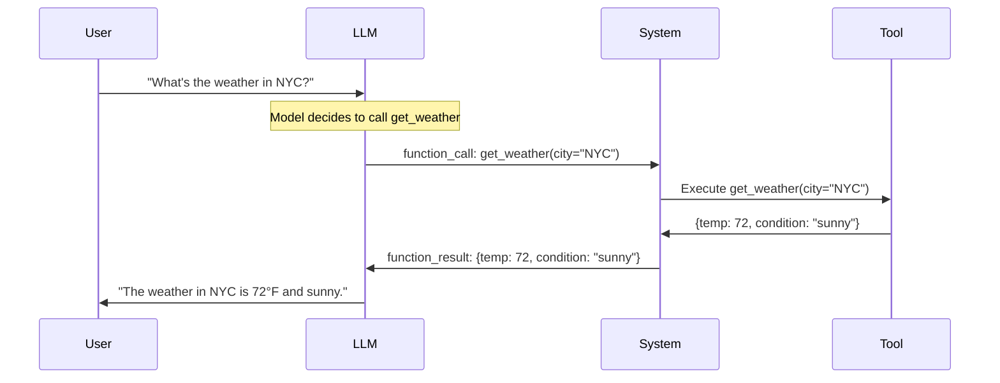
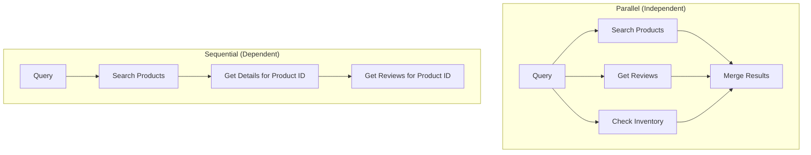

# Tool Calling / Function Calling

## Overview

Tool calling (also called function calling) allows LLMs to invoke external functions and APIs. Instead of just generating text, the model can output structured function calls that the system executes, returning results back to the model. This is the primary mechanism for agents to interact with the real world.

## How Tool Calling Works



## Tool Definition Schema

Tools are defined using JSON Schema:

```json
{
  "type": "function",
  "function": {
    "name": "get_weather",
    "description": "Get current weather for a city",
    "parameters": {
      "type": "object",
      "properties": {
        "city": {
          "type": "string",
          "description": "City name (e.g., 'New York')"
        },
        "units": {
          "type": "string",
          "enum": ["celsius", "fahrenheit"],
          "description": "Temperature units"
        }
      },
      "required": ["city"]
    }
  }
}
```

### Schema Best Practices

| Element | Good | Bad |
|---|---|---|
| **Name** | `get_weather` | `weather` (ambiguous: get? set?) |
| **Description** | "Get current weather for a city" | "Weather function" (vague) |
| **Parameters** | Clear types, enums, descriptions | Missing descriptions |
| **Required** | Only truly required params | Everything required |

## OpenAI Function Calling

```python
from openai import OpenAI

client = OpenAI()

tools = [
    {
        "type": "function",
        "function": {
            "name": "search_products",
            "description": "Search for products in the catalog",
            "parameters": {
                "type": "object",
                "properties": {
                    "query": {"type": "string", "description": "Search query"},
                    "max_results": {"type": "integer", "description": "Max results to return"}
                },
                "required": ["query"]
            }
        }
    }
]

response = client.chat.completions.create(
    model="gpt-4",
    messages=[{"role": "user", "content": "Find me a blue laptop under $1000"}],
    tools=tools,
    tool_choice="auto"  # Let model decide when to call
)

# Check if model wants to call a function
if response.choices[0].message.tool_calls:
    tool_call = response.choices[0].message.tool_calls[0]
    function_name = tool_call.function.name
    arguments = json.loads(tool_call.function.arguments)
    
    # Execute the function
    result = execute_function(function_name, arguments)
    
    # Send result back to model
    messages.append(response.choices[0].message)
    messages.append({
        "role": "tool",
        "tool_call_id": tool_call.id,
        "content": json.dumps(result)
    })
    
    final_response = client.chat.completions.create(
        model="gpt-4",
        messages=messages
    )
```

## Tool Choice Options

| Option | Behavior |
|---|---|
| `"auto"` | Model decides whether to call a tool |
| `"none"` | Model must not call any tool |
| `"required"` | Model must call a tool |
| `{"function": {"name": "..."}}` | Model must call this specific tool |

## Multiple Tool Calls

Models can request multiple tool calls in one response:

```python
# Model outputs two tool calls:
# 1. search_products(query="laptop")
# 2. get_reviews(product_id=123)

# Execute both and return results
for tool_call in response.choices[0].message.tool_calls:
    result = execute_tool(tool_call)
    messages.append({
        "role": "tool",
        "tool_call_id": tool_call.id,
        "content": json.dumps(result)
    })
```

## Parallel vs Sequential Tool Calls



## Tool Implementation Patterns

### Simple Function

```python
def get_weather(city: str, units: str = "fahrenheit") -> dict:
    """Get current weather for a city."""
    response = requests.get(f"https://api.weather.com/{city}")
    data = response.json()
    return {
        "temperature": data["temp"],
        "condition": data["condition"],
        "humidity": data["humidity"]
    }
```

### Tool Registry

```python
class ToolRegistry:
    def __init__(self):
        self.tools = {}
    
    def register(self, name, func, description, parameters):
        self.tools[name] = {
            "function": func,
            "schema": {
                "name": name,
                "description": description,
                "parameters": parameters
            }
        }
    
    def execute(self, name, arguments):
        tool = self.tools[name]
        return tool["function"](**arguments)
    
    def get_schemas(self):
        return [tool["schema"] for tool in self.tools.values()]
```

## Interview Questions

### Q1: How does function calling work in LLMs?
**Answer:** Function calling works through structured prompting and output parsing:
1. Tool definitions (JSON Schema) are included in the system prompt
2. The model is trained/fine-tuned to output structured function calls when appropriate
3. The system parses the function call, executes it, and returns the result
4. The model incorporates the result into its response

The model doesn't actually execute code — it generates a structured text output that the system interprets as a function call.

### Q2: What makes a good tool description?
**Answer:** Good tool descriptions have:
- **Clear name**: Verb-noun format (get_weather, search_products)
- **Specific description**: What it does AND when to use it
- **Parameter descriptions**: Each param explained with examples
- **Required vs optional**: Clearly marked
- **Enum constraints**: For parameters with limited values
- **Examples**: Show expected input/output when possible

Bad descriptions lead to wrong tool selection or incorrect parameters.

### Q3: How do you handle tool execution errors?
**Answer:**
1. **Catch errors gracefully**: Don't crash, return error message
2. **Return error to model**: Include error in tool response so model can adapt
3. **Retry logic**: For transient errors (API timeouts)
4. **Fallback tools**: If one tool fails, suggest alternatives
5. **User escalation**: If the model can't resolve the error

```python
try:
    result = tool.execute(args)
except Exception as e:
    result = {"error": str(e), "suggestion": "Try a different approach"}
```

### Q4: What is the difference between function calling and structured output?
**Answer:**
- **Function calling**: Model outputs a function invocation; system executes it and returns result. Used for tool use.
- **Structured output**: Model outputs data in a specific format (JSON, XML). Used for data extraction.
- Both use JSON Schema for definition. Function calling has an execution step; structured output is just formatting.

## Common Mistakes

- ❌ Poor tool descriptions (model picks wrong tool)
- ❌ Not handling tool errors (agent crashes)
- ❌ Too many tools (model gets confused, context window fills up)
- ❌ Not validating tool arguments before execution
- ❌ Trusting tool outputs without validation

## Summary

Tool calling allows LLMs to invoke external functions through structured outputs. Tools are defined with JSON Schema (name, description, parameters). The model decides when to call tools, the system executes them, and results are fed back. Good tool descriptions and error handling are critical for reliable agents.

## Cross-References

- [ReAct →](react.md) Pattern that uses tool calling
- [MCP →](mcp.md) Standard protocol for tool interfaces
- [Agent Architecture →](architecture.md) Where tools fit in
- [Prompt Engineering →](../../llm/llm-serving/prompt-engineering.md) Structured output techniques
