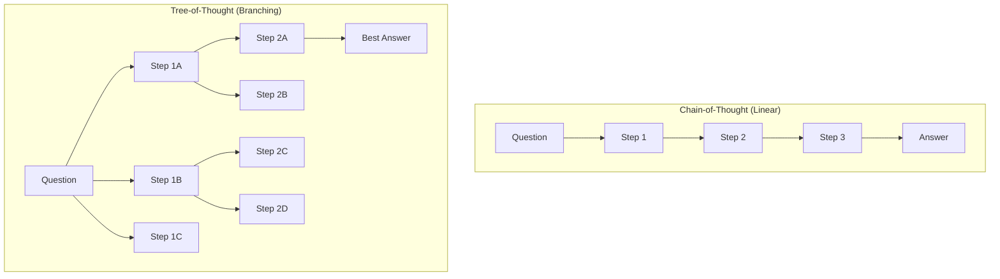
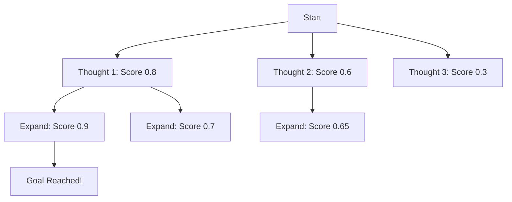
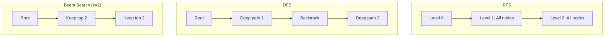

# Tree-of-Thought

## Overview

Tree-of-Thought (ToT) is a reasoning framework that explores multiple reasoning paths simultaneously, evaluates them, and selects the most promising ones. Unlike Chain-of-Thought (single linear path), ToT creates a tree of possibilities, enabling backtracking when a path seems unproductive. It's inspired by classical search algorithms like BFS and DFS.

## CoT vs ToT



## How ToT Works

### Step 1: Generate Thoughts

At each step, generate multiple possible next steps:

```python
def generate_thoughts(state, num_thoughts=3):
    """Generate multiple possible next steps."""
    prompt = f"""
    Current state: {state}
    Generate {num_thoughts} different possible next steps:
    """
    thoughts = llm.generate(prompt, n=num_thoughts)
    return thoughts
```

### Step 2: Evaluate Thoughts

Score each thought's promise:

```python
def evaluate_thought(thought, goal):
    """Score how promising this thought is (0-1)."""
    prompt = f"""
    Goal: {goal}
    Current approach: {thought}
    Rate how likely this approach will reach the goal (0-100):
    """
    score = llm.generate(prompt)
    return float(score) / 100
```

### Step 3: Search

Explore the tree using BFS or DFS:



```python
def tree_of_thought(problem, max_depth=5, beam_width=3):
    """BFS-based Tree-of-Thought search."""
    root = State(problem)
    candidates = [root]
    
    for depth in range(max_depth):
        all_thoughts = []
        for state in candidates:
            thoughts = generate_thoughts(state)
            for thought in thoughts:
                new_state = state.apply(thought)
                score = evaluate_thought(new_state, problem)
                all_thoughts.append((new_state, score))
        
        # Keep top-k candidates (beam search)
        all_thoughts.sort(key=lambda x: x[1], reverse=True)
        candidates = [t[0] for t in all_thoughts[:beam_width]]
        
        # Check if any candidate solves the problem
        for state in candidates:
            if is_solution(state, problem):
                return state
    
    return candidates[0]  # Best available
```

## ToT Search Strategies

| Strategy | How It Works | Best For |
|---|---|---|
| **BFS** | Explore all nodes at current depth first | Short solutions, broad search |
| **DFS** | Explore one path deeply, then backtrack | Long solutions, deep search |
| **Beam Search** | Keep top-k candidates at each depth | Balanced exploration |



## Example: Creative Writing with ToT

```
Task: Write a short story about a robot learning to paint.

Step 1 (Generate 3 openings):
A: "Unit-7 stared at the blank canvas, its optical sensors whirring..."
B: "The first stroke was the hardest. Not because of the paint..."
C: "In a world where creativity was banned, one robot dared to dream..."

Step 2 (Evaluate):
A: Score 0.7 - Good technical detail
B: Score 0.8 - Intriguing, focuses on difficulty
C: Score 0.6 - Cliché dystopian opening

Step 3 (Expand top 2: A and B):
[Continue developing from A and B...]
```

## When ToT Helps

| Task | CoT | ToT | Why ToT Helps |
|---|---|---|---|
| **Game puzzles** (24-point) | 7% | 74% | Multiple strategies to explore |
| **Creative writing** | Good | Better | Multiple creative directions |
| **Math proofs** | Moderate | Better | Different proof strategies |
| **Planning** | Good | Better | Multiple plan options |
| **Simple QA** | Great | Same | No benefit from branching |

## Interview Questions

### Q1: What is Tree-of-Thought and how does it differ from Chain-of-Thought?
**Answer:** ToT explores multiple reasoning paths simultaneously (a tree), while CoT follows a single linear path. ToT:
1. Generates multiple possible next steps at each point
2. Evaluates each step's promise
3. Explores the most promising paths (beam search/DFS/BFS)
4. Can backtrack from unproductive paths

This is more expensive (more LLM calls) but much more effective for tasks requiring exploration (puzzles, planning, creative work).

### Q2: When should you use ToT vs CoT vs ReAct?
**Answer:**
- **CoT**: Linear reasoning tasks (math, logic). Single path is sufficient.
- **ToT**: Tasks requiring exploration (puzzles, creative, planning). Multiple paths needed.
- **ReAct**: Tasks requiring external information (search, APIs). Need tool use.
- **ToT + ReAct**: Complex tasks needing both exploration and tool use.
Rule: Start with CoT. If the model gets stuck, try ToT. If external info is needed, use ReAct.

### Q3: How do you implement beam search in ToT?
**Answer:** Beam search maintains the top-k most promising candidates at each depth:
1. Generate all possible next thoughts for each candidate
2. Score each thought using an evaluator (LLM or heuristic)
3. Keep only the top-k thoughts overall
4. Repeat until a solution is found or max depth is reached
k=3-5 is typical. Larger k explores more but costs more LLM calls.

## Common Mistakes

- ❌ Using ToT for simple tasks (unnecessary overhead)
- ❌ Not limiting search depth (exponential blowup)
- ❌ Poor evaluation function (exploring bad paths)
- ❌ Too many branches (cost becomes prohibitive)

## Summary

Tree-of-Thought explores multiple reasoning paths in a tree structure, evaluates them, and searches for the best solution using BFS/DFS/beam search. It's more powerful than CoT for tasks requiring exploration but more expensive. Best for puzzles, planning, and creative tasks.

## Cross-References

- [Chain-of-Thought →](chain-of-thought.md) Linear reasoning (simpler alternative)
- [ReAct →](react.md) Reasoning with tools
- [Planning →](planning.md) Task decomposition
- [Agent Architecture →](architecture.md) Where ToT fits in agent design
