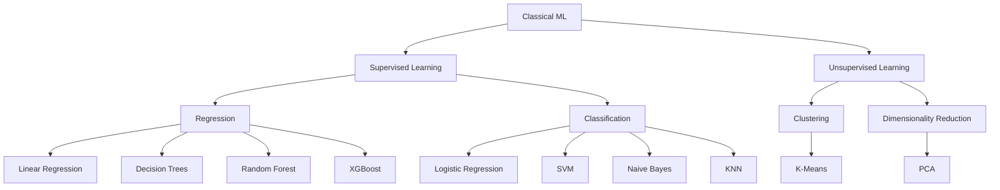
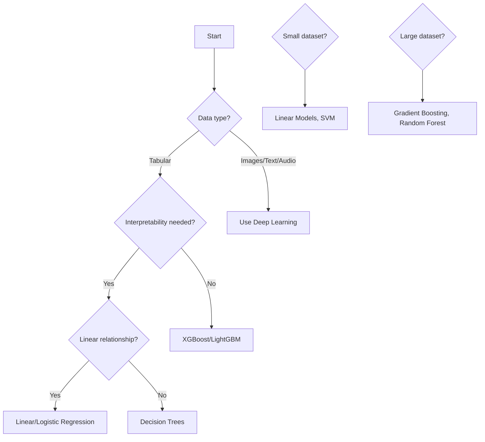
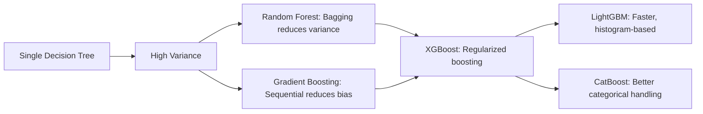

# Classical Machine Learning

## Overview

Classical ML algorithms are the **workhorses of industry**. While deep learning gets headlines, classical ML models are used extensively in production systems due to their interpretability, efficiency, and strong performance on structured/tabular data.

## Why Classical ML Still Matters

| Advantage | Deep Learning |
|-----------|--------------|
| Interpretable (trees, linear models) | Often black-box |
| Fast training and inference | Expensive compute |
| Works on small datasets | Needs lots of data |
| No GPU required | GPU essential for large models |
| Strong on tabular data | Strong on images, text, audio |
| Well-understood theory | Active research area |

## Models in This Section

| Model | Type | Key Idea | Interview Frequency |
|-------|------|----------|-------------------|
| [Linear Regression](linear-regression.md) | Regression | Linear relationship | ⭐⭐⭐⭐⭐ |
| [Logistic Regression](logistic-regression.md) | Classification | Sigmoid + cross-entropy | ⭐⭐⭐⭐⭐ |
| [Decision Trees](decision-trees.md) | Both | Recursive partitioning | ⭐⭐⭐⭐ |
| [Random Forest](random-forest.md) | Both | Bagging of trees | ⭐⭐⭐⭐ |
| [Gradient Boosting](gradient-boosting.md) | Both | Sequential error correction | ⭐⭐⭐⭐ |
| [XGBoost](xgboost.md) | Both | Regularized boosting | ⭐⭐⭐⭐⭐ |
| [LightGBM](lightgbm.md) | Both | Histogram-based boosting | ⭐⭐⭐⭐ |
| [CatBoost](catboost.md) | Both | Ordered boosting | ⭐⭐⭐ |
| [SVM](svm.md) | Both | Maximum margin | ⭐⭐⭐⭐ |
| [KNN](knn.md) | Both | Instance-based | ⭐⭐⭐ |
| [Naive Bayes](naive-bayes.md) | Classification | Bayes + independence | ⭐⭐⭐ |
| [K-Means](kmeans.md) | Clustering | Centroid-based | ⭐⭐⭐ |
| [PCA](pca.md) | Dim. Reduction | Variance maximization | ⭐⭐⭐⭐ |
| [Ensemble](ensemble.md) | Meta-method | Combine models | ⭐⭐⭐⭐ |

## When to Use What

## The Ensemble Hierarchy

Each subsequent model builds on the ideas of the previous, adding improvements for speed, accuracy, or handling specific data types.

## Cross-References

- [ML Foundations](../foundations/README.md)
- [Deep Learning](../deep-learning/README.md)
- [Ensemble Methods](./ensemble.md)
- [Feature Engineering](../foundations/feature-engineering.md)
- [ML Interview Questions](../../interview/ml-questions.md)
