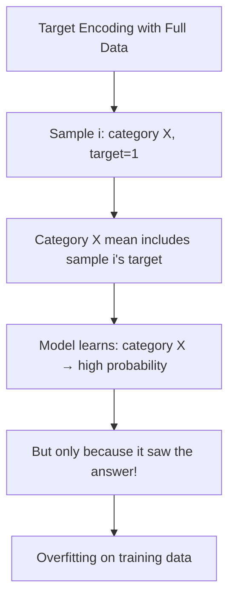
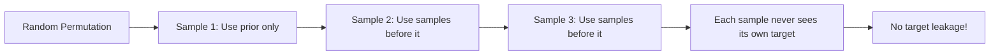
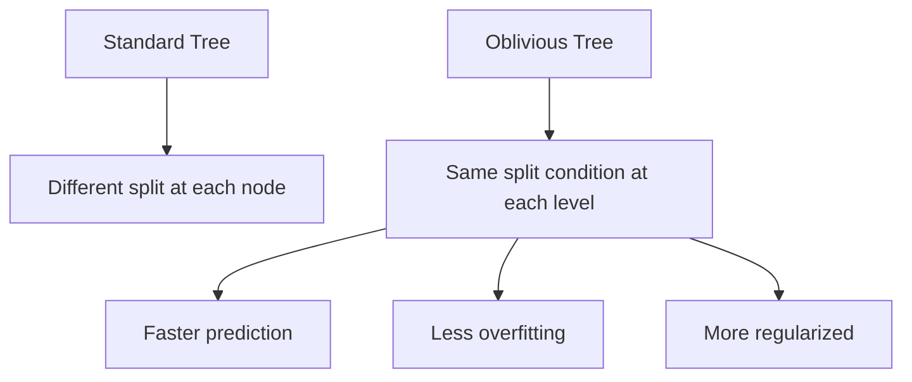

# CatBoost

## Overview

CatBoost (Categorical Boosting) is a gradient boosting library developed by Yandex that excels at handling **categorical features** natively. Its key innovation — **ordered boosting** — prevents target leakage that plagues other gradient boosting implementations when encoding categorical variables.

## The Target Leakage Problem

When encoding categorical features using target statistics (e.g., mean target per category), you create **target leakage** if you use the same data for encoding and training:

```python
# Problematic: Using full dataset for target encoding
# Category "rare_event" has target mean = 0.8 in training data
# But this includes the current sample's own target!
# → The model "cheats" by seeing the answer

# This is called "target leakage" or "conditional shift"
```



## Ordered Boosting

CatBoost's solution: **Ordered Target Statistics**

```python
# For each sample, compute target statistics using only 
# samples that appear BEFORE it in a random permutation

def ordered_target_statistics(data, target, cat_feature, n_permutations=1):
    """Compute ordered target statistics"""
    result = np.zeros(len(data))
    
    for perm in range(n_permutations):
        # Random permutation
        permutation = np.random.permutation(len(data))
        permuted_data = data.iloc[permutation]
        permuted_target = target.iloc[permutation]
        
        # For each sample, use only prior samples for statistics
        running_sum = {}
        running_count = {}
        
        for i, (idx, row) in enumerate(permuted_data.iterrows()):
            cat = row[cat_feature]
            
            # Current estimate (with prior smoothing)
            prior = target.mean()
            count = running_count.get(cat, 0)
            total = running_sum.get(cat, 0)
            
            # Bayesian smoothing: (count * mean + prior * m) / (count + m)
            m = 10  # Smoothing parameter
            if count > 0:
                result[permutation[i]] += (total + prior * m) / (count + m)
            else:
                result[permutation[i]] += prior
            
            # Update running statistics
            running_sum[cat] = total + permuted_target.iloc[i]
            running_count[cat] = count + 1
    
    return result / n_permutations
```



## Ordered Boosting for Model Updates

Beyond target statistics, CatBoost also applies ordering to the boosting process itself:

```python
# Standard gradient boosting:
# At step t, ALL training samples use the same model M_{t-1}
# to compute gradients → target leakage through gradients

# Ordered boosting:
# Each sample uses a model trained on DIFFERENT subset
# (samples that appeared before it in permutation)
```

## Symmetric Trees (Oblivious Trees)

CatBoost uses **oblivious decision trees** — the same split condition is used at each level:



```python
# Oblivious tree: At level i, ALL nodes use the same feature and threshold
# This means:
# - 2^d leaves for depth d
# - Prediction is just a lookup table
# - Very fast inference

# Example depth-3 oblivious tree:
# Level 1: feature_1 < 5
# Level 2: feature_3 < 10 (both left and right child use same condition)
# Level 3: feature_2 < 3 (all four nodes use same condition)
```

## CatBoost Usage

```python
from catboost import CatBoostClassifier, Pool

# Create Pool with categorical features specified
train_pool = Pool(X_train, y_train, cat_features=cat_feature_indices)
val_pool = Pool(X_val, y_val, cat_features=cat_feature_indices)

# Train
model = CatBoostClassifier(
    iterations=1000,
    learning_rate=0.05,
    depth=6,
    loss_function='Logloss',
    eval_metric='AUC',
    cat_features=cat_feature_indices,
    od_type='Iter',           # Early stopping type
    od_wait=50,               # Early stopping patience
    verbose=100,
    random_seed=42
)

model.fit(train_pool, eval_set=val_pool, early_stopping_rounds=50)

# Feature importance
importance = model.get_feature_importance()
```

### Handling Categorical Features

```python
# CatBoost handles categorical features automatically
# But you can also specify how:

model = CatBoostClassifier(
    cat_features=[0, 1, 5],  # Column indices
    one_hot_max_size=10,     # One-hot if < 10 categories
    # For high cardinality: uses ordered target statistics
)

# Text features are also supported!
model = CatBoostClassifier(
    text_features=[3],  # Column index for text
    tokenizers=[{'tokenizer_id': 'Space', 'separator_type': 'ByDelimiter', 'delimiter': ' '}],
    dictionaries=[{'dictionary_id': 'Word', 'gram_order': '1'}],
    feature_calcers=['BoW:top_tokens_count=100']
)
```

## CatBoost vs XGBoost vs LightGBM

| Feature | XGBoost | LightGBM | CatBoost |
|---------|---------|----------|---------|
| Categorical handling | One-hot | Native (split-based) | Ordered target stats |
| Tree type | Level-wise | Leaf-wise | Oblivious (symmetric) |
| Target leakage | Possible | Possible | Prevented |
| Training speed | Fast | Fastest | Moderate |
| Inference speed | Fast | Fast | Fast (oblivious trees) |
| GPU support | Yes | Yes | Yes |
| Default performance | Good | Good | Often best (with categoricals) |
| Overfitting control | Moderate | Needs tuning | Strong (ordered boosting) |

## Interview Questions

### Beginner

**Q: What makes CatBoost different from XGBoost?**

A: CatBoost's main innovations:
1. **Ordered boosting**: Prevents target leakage when using target statistics for categorical features
2. **Oblivious trees**: Same split at each level → faster inference, less overfitting
3. **Native categorical handling**: No need for one-hot encoding

**Q: When should you use CatBoost?**

A: When your data has:
- Many categorical features (especially high cardinality)
- You want strong default performance without much tuning
- You need fast inference (oblivious trees)
- You're concerned about overfitting

### Intermediate

**Q: Explain the "ordered" in ordered boosting.**

A: "Ordered" refers to using a random permutation of the data. For each sample, we only use information from samples that appear before it in the permutation. This applies to both:
1. **Target statistics**: Computing mean target per category using only prior samples
2. **Gradient computation**: Using models trained on different subsets

This breaks the feedback loop that causes target leakage, making the model more robust.

**Q: Why are oblivious trees less prone to overfitting?**

A: Oblivious trees use the same split condition at each level across all nodes. This means:
1. Fewer parameters (same condition vs. different per node)
2. More structured hypothesis space
3. The model can't "memorize" specific samples as easily
4. Prediction is a simple lookup → very fast inference

### FAANG-Level

**Q: You have a dataset with 100 categorical features, some with 10,000+ unique values. How do you configure CatBoost?**

A:
1. **Specify categorical features**: Let CatBoost handle them natively
2. **Target statistics**: Uses ordered target statistics with Bayesian smoothing
3. **one_hot_max_size=10**: Categories with < 10 values use one-hot; others use target stats
4. **Regularization**: Increase depth slowly, use early stopping
5. **GPU training**: Use `task_type='GPU'` for faster training
6. **Feature selection**: CatBoost provides feature importance to identify useless categoricals
7. **Monitoring**: Watch for overfitting on rare categories — the smoothing parameter helps

## Common Mistakes

1. **One-hot encoding before CatBoost**: Let CatBoost handle categoricals natively
2. **Not specifying cat_features**: CatBoost will treat categoricals as numbers
3. **Using too many iterations without early stopping**: CatBoost can overfit
4. **Ignoring ordered boosting benefits**: The default ordered boosting is a key advantage
5. **Not using GPU for large datasets**: CatBoost's GPU implementation is very efficient

## Summary

| Innovation | Purpose |
|-----------|---------|
| Ordered Target Statistics | Prevent target leakage |
| Ordered Boosting | Break gradient feedback loop |
| Oblivious Trees | Faster inference, less overfitting |
| Native categorical handling | No preprocessing needed |

## Cross-References

- [Gradient Boosting](gradient-boosting.md) — The foundation
- [XGBoost](xgboost.md) — Main competitor
- [LightGBM](lightgbm.md) — Another fast alternative
- [Feature Engineering](../foundations/feature-engineering.md) — Categorical encoding methods
