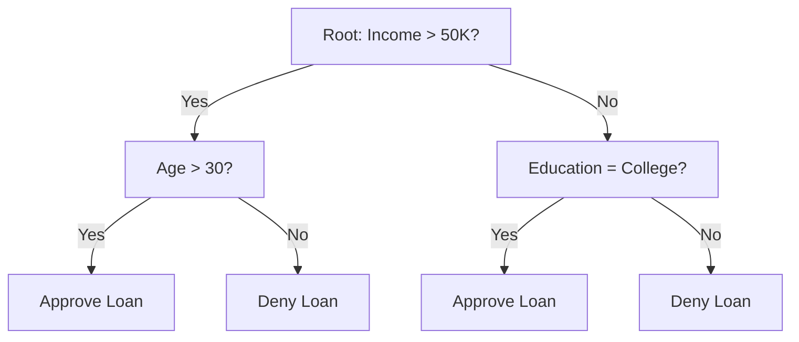

# Decision Trees

## Overview

Decision trees make predictions by learning a series of **if-then rules** from the data. They're intuitive, interpretable, and form the foundation for powerful ensemble methods like Random Forest and XGBoost.

## How Decision Trees Work



At each node, the algorithm:
1. Selects the **best feature** and **threshold** to split on
2. Creates two child nodes
3. Repeats recursively until stopping criteria are met

## Splitting Criteria

### Information Gain (ID3, C4.5)

Based on **entropy** — a measure of impurity:

\\[H(S) = -\sum_{k=1}^{K} p_k \log_2(p_k)\\]

Where $p_k$ is the proportion of class $k$ in set $S$.

```python
import numpy as np

def entropy(y):
    """Calculate entropy of a label array"""
    if len(y) == 0:
        return 0
    _, counts = np.unique(y, return_counts=True)
    probs = counts / len(y)
    return -np.sum(probs * np.log2(probs + 1e-10))

# Information Gain = H(parent) - weighted_avg(H(children))
def information_gain(y, y_left, y_right):
    n = len(y)
    h_parent = entropy(y)
    h_left = entropy(y_left)
    h_right = entropy(y_right)
    weighted_h = (len(y_left)/n)*h_left + (len(y_right)/n)*h_right
    return h_parent - weighted_h
```

### Gini Impurity (CART)

\\[Gini(S) = 1 - \sum_{k=1}^{K} p_k^2\\]

```python
def gini(y):
    """Calculate Gini impurity"""
    if len(y) == 0:
        return 0
    _, counts = np.unique(y, return_counts=True)
    probs = counts / len(y)
    return 1 - np.sum(probs**2)
```

### Gain Ratio (C4.5)

Addresses Information Gain's bias toward features with many values:

\\[GainRatio = \frac{InformationGain}{SplitInfo}\\]

Where $SplitInfo = -\sum_{i=1}^{m} \frac{|S_i|}{|S|} \log_2\frac{|S_i|}{|S|}$

### Comparison

| Criterion | Formula | Used By | Range |
|-----------|---------|---------|-------|
| Information Gain | H(S) - Σ H(Sᵢ) | ID3, C4.5 | [0, log₂K] |
| Gini Impurity | 1 - Σ pᵢ² | CART | [0, 0.5] for binary |
| Gain Ratio | IG / SplitInfo | C4.5 | [0, 1] |

## Tree Algorithms

### ID3

- Uses Information Gain
- Only handles categorical features
- No pruning
- No missing value handling

### C4.5 (Improvement over ID3)

- Uses Gain Ratio (handles multi-valued features)
- Handles continuous features (binary split)
- Handles missing values (surrogate splits)
- Post-pruning (pessimistic pruning)

### CART (Classification and Regression Trees)

- Uses Gini impurity (classification) or MSE (regression)
- Always produces binary splits
- Supports regression (outputs mean of leaf)
- Cost-complexity pruning

```python
class DecisionTreeNode:
    def __init__(self):
        self.feature_idx = None
        self.threshold = None
        self.left = None
        self.right = None
        self.is_leaf = False
        self.prediction = None
        self.samples = 0

class DecisionTree:
    def __init__(self, max_depth=5, min_samples_split=2, min_samples_leaf=1):
        self.max_depth = max_depth
        self.min_samples_split = min_samples_split
        self.min_samples_leaf = min_samples_leaf
        self.root = None
    
    def fit(self, X, y):
        self.root = self._build_tree(X, y, depth=0)
    
    def _build_tree(self, X, y, depth):
        node = DecisionTreeNode()
        node.samples = len(y)
        
        # Stopping criteria
        if (depth >= self.max_depth or 
            len(y) < self.min_samples_split or
            len(np.unique(y)) == 1):
            node.is_leaf = True
            node.prediction = np.bincount(y).argmax()
            return node
        
        # Find best split
        best_gain = -1
        best_feature = None
        best_threshold = None
        
        for feature_idx in range(X.shape[1]):
            thresholds = np.unique(X[:, feature_idx])
            for threshold in thresholds:
                left_mask = X[:, feature_idx] <= threshold
                right_mask = ~left_mask
                
                if (left_mask.sum() < self.min_samples_leaf or 
                    right_mask.sum() < self.min_samples_leaf):
                    continue
                
                gain = information_gain(y, y[left_mask], y[right_mask])
                if gain > best_gain:
                    best_gain = gain
                    best_feature = feature_idx
                    best_threshold = threshold
        
        if best_gain == -1:
            node.is_leaf = True
            node.prediction = np.bincount(y).argmax()
            return node
        
        node.feature_idx = best_feature
        node.threshold = best_threshold
        
        left_mask = X[:, best_feature] <= best_threshold
        node.left = self._build_tree(X[left_mask], y[left_mask], depth+1)
        node.right = self._build_tree(X[~left_mask], y[~left_mask], depth+1)
        
        return node
    
    def predict(self, X):
        return np.array([self._predict_one(x, self.root) for x in X])
    
    def _predict_one(self, x, node):
        if node.is_leaf:
            return node.prediction
        if x[node.feature_idx] <= node.threshold:
            return self._predict_one(x, node.left)
        return self._predict_one(x, node.right)
```

## Pruning

### Pre-pruning (Early Stopping)

Stop growing the tree before it's fully grown:

```python
# Common pre-pruning parameters
tree = DecisionTreeClassifier(
    max_depth=5,           # Maximum depth
    min_samples_split=10,  # Minimum samples to split a node
    min_samples_leaf=5,    # Minimum samples in a leaf
    max_features='sqrt',   # Number of features to consider
    max_leaf_nodes=50      # Maximum number of leaves
)
```

### Post-pruning (Cost-Complexity Pruning)

Grow full tree, then remove branches that don't improve validation performance:

```python
from sklearn.tree import DecisionTreeClassifier

# Cost-complexity pruning
tree = DecisionTreeClassifier(random_state=42)
path = tree.cost_complexity_pruning_path(X_train, y_train)
ccp_alphas = path.ccp_alphas

# Train trees with different alpha values
trees = []
for ccp_alpha in ccp_alphas:
    tree = DecisionTreeClassifier(ccp_alpha=ccp_alpha, random_state=42)
    tree.fit(X_train, y_train)
    trees.append(tree)

# Select best alpha via cross-validation
```

## Feature Importance

```python
from sklearn.tree import DecisionTreeClassifier

tree = DecisionTreeClassifier(max_depth=5)
tree.fit(X_train, y_train)

# Mean decrease in impurity (MDI)
importances = tree.feature_importances_
# Sum of impurity decreases for each feature, weighted by samples

# Permutation importance (more reliable)
from sklearn.inspection import permutation_importance
result = permutation_importance(tree, X_test, y_test, n_repeats=10)
```

## Decision Tree for Regression

```python
class DecisionTreeRegressor:
    def __init__(self, max_depth=5):
        self.max_depth = max_depth
    
    def _mse(self, y):
        if len(y) == 0:
            return 0
        return np.var(y) * len(y)
    
    def _build_tree(self, X, y, depth):
        if depth >= self.max_depth or len(y) <= 1:
            return {'leaf': True, 'value': np.mean(y)}
        
        # Find best split (minimize weighted MSE)
        best_mse = float('inf')
        best_feature, best_threshold = None, None
        
        for feature in range(X.shape[1]):
            for threshold in np.unique(X[:, feature]):
                left = X[:, feature] <= threshold
                right = ~left
                if left.sum() == 0 or right.sum() == 0:
                    continue
                mse = (self._mse(y[left]) + self._mse(y[right]))
                if mse < best_mse:
                    best_mse = mse
                    best_feature = feature
                    best_threshold = threshold
        
        left_mask = X[:, best_feature] <= best_threshold
        return {
            'leaf': False,
            'feature': best_feature,
            'threshold': best_threshold,
            'left': self._build_tree(X[left_mask], y[left_mask], depth+1),
            'right': self._build_tree(X[~left_mask], y[~left_mask], depth+1)
        }
```

## Interview Questions

### Beginner

**Q: What is the difference between Gini impurity and Information Gain?**

A: Both measure node impurity. Gini is faster to compute (no logarithm). Information Gain (entropy-based) tends to produce more balanced trees. In practice, they give very similar results. Gini is the default in sklearn (CART algorithm).

**Q: Why do decision trees overfit?**

A: Without constraints, a tree can keep splitting until each leaf has exactly one sample — perfect training accuracy but zero generalization. The tree memorizes noise in the training data. Solutions: max depth, min samples per leaf, pruning, or use ensembles (Random Forest, XGBoost).

### Intermediate

**Q: How do decision trees handle missing values?**

A: Different approaches:
1. **CART/Surrogate splits**: Find alternative splits that mimic the best split when the primary feature is missing
2. **C4.5**: Distributes samples with missing values proportionally to all branches
3. **XGBoost**: Learns optimal direction for missing values during training
4. **Simple imputation**: Fill missing values before training (median, mode)

**Q: How do decision trees handle categorical features?**

A: 
- **CART**: Requires encoding (one-hot, label) — binary splits only
- **ID3/C4.5**: Can handle natively by splitting on each category
- **CatBoost**: Uses ordered target statistics for native categorical handling
- **LightGBM**: Uses gradient-based one-side sampling for categorical features

### FAANG-Level

**Q: Why are decision trees the base learner for most ensemble methods?**

A: Decision trees have the ideal properties for ensembling:
1. **High variance, low bias**: Trees are unstable (high variance) but can fit complex patterns (low bias). Averaging high-variance models reduces variance without increasing bias.
2. **Non-linear**: They capture complex interactions without feature engineering
3. **Fast to train**: Individual trees are fast, enabling many ensemble members
4. **Parallelizable**: Each tree can be trained independently (bagging)
5. **Handles mixed types**: Numerical and categorical features without preprocessing

The key insight: **Boosting reduces bias, bagging reduces variance** — both exploit trees' high variance property.

## Common Mistakes

1. **Not pruning**: Always limit tree depth or use cost-complexity pruning
2. **Using accuracy for imbalanced data**: Trees can be biased toward majority class
3. **Ignoring feature importance**: Use permutation importance over MDI for correlated features
4. **Over-interpreting**: A single tree is unstable — small data changes create very different trees
5. **Not scaling features**: Trees don't need scaling, but if comparing with other models in a pipeline, be aware

## Summary

| Algorithm | Split Criterion | Handles | Pruning |
|-----------|----------------|---------|---------|
| ID3 | Information Gain | Categorical only | None |
| C4.5 | Gain Ratio | Both | Pessimistic |
| CART | Gini/MSE | Both (binary splits) | Cost-complexity |

## Cross-References

- [Random Forest](random-forest.md) — Bagging of decision trees
- [Gradient Boosting](gradient-boosting.md) — Sequential tree building
- [XGBoost](xgboost.md) — Regularized gradient boosting
- [Bias-Variance](../foundations/bias-variance.md) — Why trees overfit
