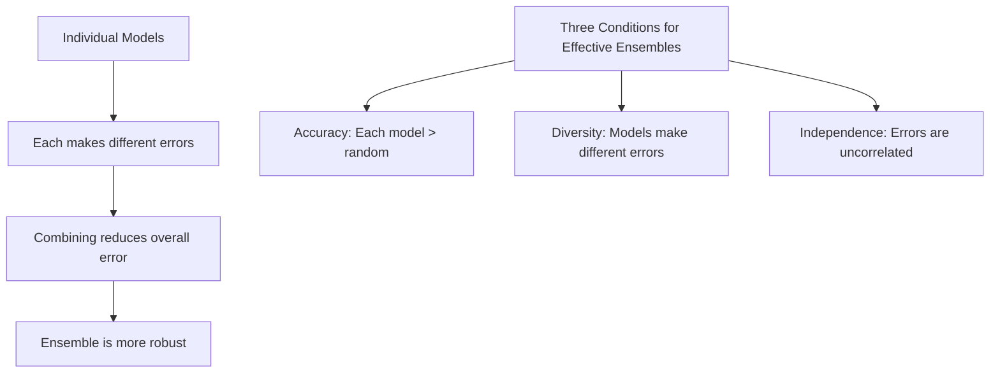
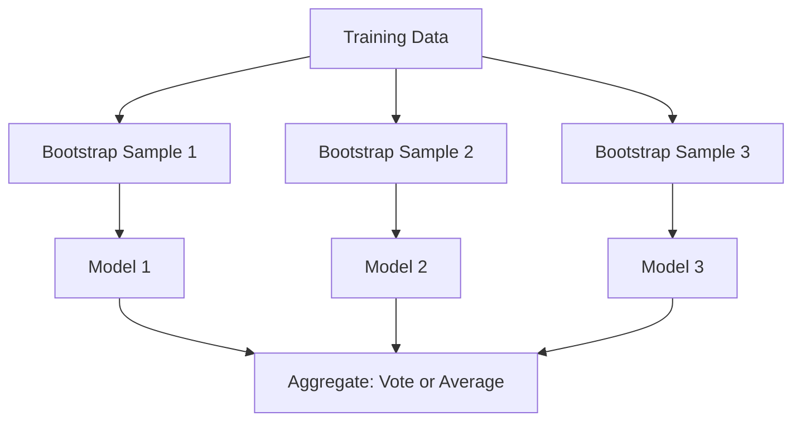
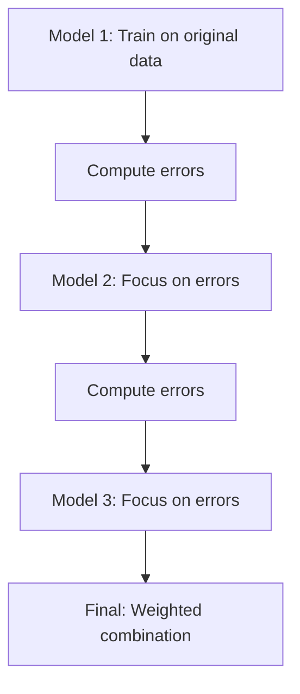
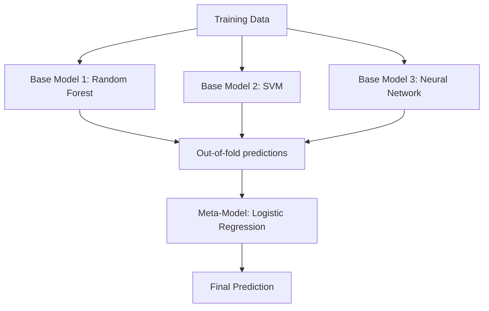
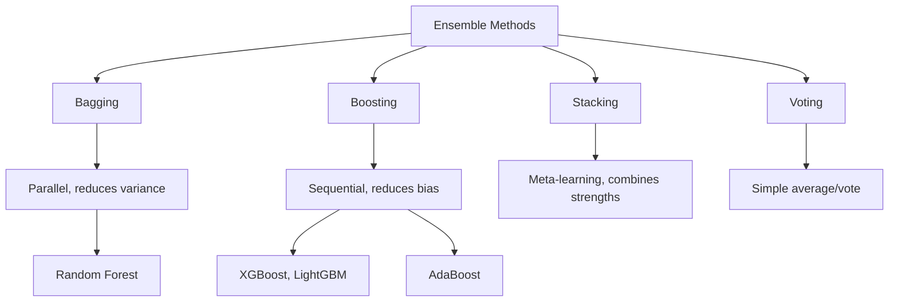

# Ensemble Methods

## Overview

Ensemble methods combine multiple models to produce a **stronger predictor** than any individual model. The key insight: a collection of weak learners can form a strong learner. Ensemble methods are behind most winning solutions in ML competitions.

## Why Ensembles Work



### The Math

For an ensemble of N independent models each with error ε:

\\[P(\text{ensemble wrong}) = \sum_{k=\lceil N/2 \rceil}^{N} \binom{N}{k} \epsilon^k (1-\epsilon)^{N-k}\\]

If ε < 0.5 and models are independent, the ensemble error → 0 as N → ∞.

## Bagging (Bootstrap Aggregating)



### Key Ideas

1. **Bootstrap sampling**: Sample with replacement → different training sets
2. **Parallel training**: Models are independent
3. **Aggregation**: Majority vote (classification) or average (regression)
4. **Effect**: Reduces **variance** without affecting bias

```python
import numpy as np
from sklearn.tree import DecisionTreeClassifier

class BaggingClassifier:
    def __init__(self, base_model, n_estimators=10):
        self.base_model = base_model
        self.n_estimators = n_estimators
        self.models = []
    
    def fit(self, X, y):
        n = len(X)
        for _ in range(self.n_estimators):
            # Bootstrap sample
            indices = np.random.choice(n, n, replace=True)
            X_boot = X[indices]
            y_boot = y[indices]
            
            # Train model
            model = clone(self.base_model)
            model.fit(X_boot, y_boot)
            self.models.append(model)
    
    def predict(self, X):
        predictions = np.array([m.predict(X) for m in self.models])
        # Majority vote
        return np.apply_along_axis(
            lambda x: np.bincount(x).argmax(), 0, predictions
        )
```

### Random Forest = Bagging + Feature Randomness

```python
from sklearn.ensemble import BaggingClassifier, RandomForestClassifier

# These are similar:
bagging = BaggingClassifier(
    estimator=DecisionTreeClassifier(),
    n_estimators=100,
    max_samples=1.0,
    max_features=1.0  # No feature randomness
)

rf = RandomForestClassifier(
    n_estimators=100,
    max_features='sqrt'  # Feature randomness!
)
```

## Boosting

Sequential learning — each model corrects the previous one's errors:



### AdaBoost (Adaptive Boosting)

The original boosting algorithm:

```python
class AdaBoost:
    def __init__(self, n_estimators=50):
        self.n_estimators = n_estimators
        self.models = []
        self.alphas = []
    
    def fit(self, X, y):
        n = len(X)
        weights = np.ones(n) / n  # Equal weights initially
        
        for _ in range(self.n_estimators):
            # Train weighted model
            model = DecisionTreeClassifier(max_depth=1)  # Decision stump
            model.fit(X, y, sample_weight=weights)
            
            # Compute weighted error
            predictions = model.predict(X)
            incorrect = predictions != y
            error = np.sum(weights * incorrect) / np.sum(weights)
            
            # Compute model weight (alpha)
            alpha = 0.5 * np.log((1 - error) / (error + 1e-10))
            
            # Update sample weights
            weights *= np.exp(-alpha * y * predictions)
            weights /= np.sum(weights)  # Normalize
            
            self.models.append(model)
            self.alphas.append(alpha)
    
    def predict(self, X):
        predictions = np.array([alpha * m.predict(X) 
                               for alpha, m in zip(self.alphas, self.models)])
        return np.sign(np.sum(predictions, axis=0))
```

### Gradient Boosting

Uses gradient descent to minimize any differentiable loss:

```python
# See gradient-boosting.md for full implementation
from sklearn.ensemble import GradientBoostingClassifier

gb = GradientBoostingClassifier(
    n_estimators=100,
    learning_rate=0.1,
    max_depth=3
)
```

## Stacking (Stacked Generalization)

Train a **meta-model** on the outputs of base models:



```python
from sklearn.ensemble import StackingClassifier
from sklearn.linear_model import LogisticRegression
from sklearn.ensemble import RandomForestClassifier
from sklearn.svm import SVC

# Define base models
estimators = [
    ('rf', RandomForestClassifier(n_estimators=100)),
    ('svm', SVC(probability=True)),
    ('gb', GradientBoostingClassifier(n_estimators=100))
]

# Stacking with cross-validated predictions
stacking = StackingClassifier(
    estimators=estimators,
    final_estimator=LogisticRegression(),
    cv=5  # Use CV to generate meta-features
)
stacking.fit(X_train, y_train)
```

### Why Stacking Works

1. **Different models capture different patterns**: RF captures interactions, SVM captures margins
2. **Meta-model learns when to trust each base model**: "Use RF for this region, SVM for that"
3. **Reduces both bias and variance**: Combines strengths of different model types

## Voting

Simple combination of model predictions:

```python
from sklearn.ensemble import VotingClassifier

# Hard voting: Majority vote
voting_hard = VotingClassifier(
    estimators=[
        ('rf', RandomForestClassifier()),
        ('svm', SVC()),
        ('lr', LogisticRegression())
    ],
    voting='hard'
)

# Soft voting: Average probabilities
voting_soft = VotingClassifier(
    estimators=[
        ('rf', RandomForestClassifier()),
        ('svm', SVC(probability=True)),
        ('lr', LogisticRegression())
    ],
    voting='soft'
)
```

| Voting | Method | Best When |
|--------|--------|-----------|
| Hard | Majority vote | Models output classes |
| Soft | Average probabilities | Models output probabilities |

## Ensemble Methods Comparison



| Method | Training | Primary Effect | Complexity |
|--------|----------|---------------|------------|
| Bagging | Parallel | Reduce variance | Low |
| Boosting | Sequential | Reduce bias | Medium |
| Stacking | Layered | Both | High |
| Voting | Parallel | Both | Low |

## Practical Tips

### 1. Diversity is Key

```python
# Good ensemble: Different model types
ensemble = [
    RandomForestClassifier(),  # Trees
    SVC(),                     # Kernel method
    LogisticRegression(),      # Linear model
    GradientBoostingClassifier()  # Boosted trees
]

# Bad ensemble: Same model with different seeds
ensemble = [
    RandomForestClassifier(random_state=1),
    RandomForestClassifier(random_state=2),
    RandomForestClassifier(random_state=3)
]
```

### 2. When to Use What

| Scenario | Method |
|----------|--------|
| Quick improvement | Bagging (Random Forest) |
| Competition winning | Stacking + Boosting |
| Production baseline | Single XGBoost/LightGBM |
| Different model types available | Stacking or Voting |
| Need interpretability | Single model or simple voting |

## Interview Questions

### Beginner

**Q: Why do ensembles work better than individual models?**

A: Ensembles work because:
1. **Error reduction**: Individual errors cancel out when averaged
2. **Variance reduction**: Averaging multiple models reduces variance (bagging)
3. **Bias reduction**: Sequential correction reduces bias (boosting)
4. **Different perspectives**: Different models capture different patterns

**Q: What's the difference between bagging and boosting?**

A: 
- **Bagging**: Parallel, bootstrap samples, reduces variance, random forest
- **Boosting**: Sequential, focuses on errors, reduces bias, XGBoost

### Intermediate

**Q: Why does Random Forest use both row and column sampling?**

A: 
- **Row sampling (bootstrap)**: Creates diversity through different training subsets
- **Column sampling**: Creates diversity through different feature subsets
- Together, they decorrelate the trees more than either alone
- Lower correlation → lower ensemble variance → better generalization

**Q: How do you prevent overfitting in stacking?**

A: 
1. **Use out-of-fold predictions**: Generate meta-features using cross-validation, not training predictions
2. **Simple meta-model**: Logistic regression or ridge regression as meta-learner
3. **Limit base models**: Too many base models can overfit the meta-features
4. **Regularization**: Apply regularization to the meta-model

### FAANG-Level

**Q: You have 10 different models with 0.85 AUC each. How do you build the best ensemble?**

A: Systematic approach:
1. **Measure correlation**: Compute pairwise prediction correlations between models
2. **Select diverse models**: Choose models with lowest correlation (different model types > same type with different hyperparameters)
3. **Start simple**: Weighted average with weights proportional to individual AUC
4. **Try stacking**: Use out-of-fold predictions as meta-features, train a simple meta-model
5. **Feature engineering for meta-model**: Include prediction entropy, confidence scores
6. **Cross-validate everything**: Use nested CV to get unbiased estimate
7. **Diminishing returns**: 3-5 diverse models usually capture most of the benefit
8. **Production considerations**: If latency matters, use fewer models or distill ensemble into single model

## Common Mistakes

1. **Using identical models**: No diversity → no ensemble benefit
2. **Not using out-of-fold predictions in stacking**: Leads to severe overfitting
3. **Over-complicated meta-model**: Simple is better for stacking
4. **Ignoring diversity**: Correlated models don't help much
5. **Not cross-validating**: Always validate ensemble performance properly

## Summary

| Method | Key Idea | Reduces | Example |
|--------|----------|---------|---------|
| Bagging | Bootstrap + aggregate | Variance | Random Forest |
| Boosting | Sequential correction | Bias | XGBoost |
| Stacking | Meta-learning | Both | Kaggle solutions |
| Voting | Simple combination | Both | Majority vote |

## Cross-References

- [Random Forest](random-forest.md) — Bagging of decision trees
- [Gradient Boosting](gradient-boosting.md) — Sequential boosting
- [XGBoost](xgboost.md) — Advanced boosting
- [Bias-Variance](../foundations/bias-variance.md) — Theory behind ensembles
