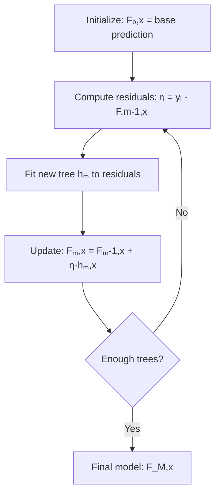
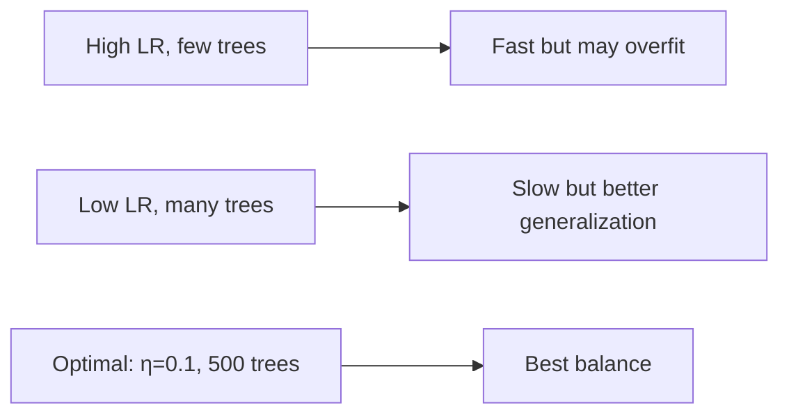

# Gradient Boosting

## Overview

Gradient Boosting is a **sequential ensemble method** that builds models iteratively, with each new model correcting the errors of the previous ensemble. Unlike bagging (parallel, reduces variance), boosting **reduces bias** by focusing on hard-to-predict examples.

## Core Idea



### The Algorithm

1. Start with an initial prediction (e.g., mean for regression)
2. Compute the **negative gradient** (residuals for MSE)
3. Fit a new tree to these residuals
4. Add the new tree to the ensemble (with learning rate)
5. Repeat

```python
import numpy as np
from sklearn.tree import DecisionTreeRegressor

class GradientBoostingRegressor:
    def __init__(self, n_estimators=100, learning_rate=0.1, max_depth=3):
        self.n_estimators = n_estimators
        self.learning_rate = learning_rate
        self.max_depth = max_depth
        self.trees = []
        self.initial_prediction = None
    
    def fit(self, X, y):
        # Step 1: Initial prediction (mean)
        self.initial_prediction = np.mean(y)
        F = np.full(len(y), self.initial_prediction)
        
        for m in range(self.n_estimators):
            # Step 2: Compute negative gradient (residuals for MSE)
            residuals = y - F
            
            # Step 3: Fit tree to residuals
            tree = DecisionTreeRegressor(max_depth=self.max_depth)
            tree.fit(X, residuals)
            
            # Step 4: Update ensemble
            F += self.learning_rate * tree.predict(X)
            self.trees.append(tree)
    
    def predict(self, X):
        F = np.full(X.shape[0], self.initial_prediction)
        for tree in self.trees:
            F += self.learning_rate * tree.predict(X)
        return F
```

## Why Gradient Boosting Works

### Gradient Descent in Function Space

Instead of optimizing parameters, we optimize **functions**:

$$F_m(x) = F_{m-1}(x) + \eta \cdot h_m(x)$$

Where $h_m$ is fit to the **negative gradient** of the loss:

$$r_{im} = -\frac{\partial L(y_i, F(x_i))}{\partial F(x_i)}\bigg|_{F=F_{m-1}}$$

### Different Loss Functions

| Loss | Negative Gradient (Residual) | Use Case |
|------|------------------------------|----------|
| MSE | y - F(x) | Regression |
| MAE | sign(y - F(x)) | Robust regression |
| Huber | Clipped residual | Robust regression |
| Log Loss | y - σ(F(x)) | Classification |
| Cross-Entropy | y_k - p_k(x) | Multi-class |

```python
# For classification with log loss:
# Negative gradient = y - p(x) where p = sigmoid(F)
# This is the same as logistic regression's gradient!
```

## Learning Rate (Shrinkage)

The learning rate η controls the contribution of each tree:

```python
# Small learning rate → more trees needed → better generalization
# Large learning rate → fewer trees → faster but may overfit

# Typical: η = 0.1, n_estimators = 100-1000
# Trade-off: η × n_estimators ≈ constant for similar performance
```



## Stochastic Gradient Boosting

Add randomness for better generalization:

```python
class StochasticGBM(GradientBoostingRegressor):
    def __init__(self, subsample=0.8, **kwargs):
        super().__init__(**kwargs)
        self.subsample = subsample
    
    def fit(self, X, y):
        self.initial_prediction = np.mean(y)
        F = np.full(len(y), self.initial_prediction)
        
        for m in range(self.n_estimators):
            # Subsample: use only a fraction of data for each tree
            n = len(y)
            sample_size = int(n * self.subsample)
            indices = np.random.choice(n, sample_size, replace=False)
            
            residuals = y - F
            tree = DecisionTreeRegressor(max_depth=self.max_depth)
            tree.fit(X[indices], residuals[indices])
            
            F += self.learning_rate * tree.predict(X)
            self.trees.append(tree)
```

**Benefits**: Reduces variance, speeds up training, acts as regularization

## Early Stopping

Stop training when validation error stops improving:

```python
from sklearn.ensemble import GradientBoostingRegressor
from sklearn.model_selection import train_test_split

X_train, X_val, y_train, y_val = train_test_split(X, y, test_size=0.2)

gb = GradientBoostingRegressor(
    n_estimators=1000,
    learning_rate=0.1,
    max_depth=3,
    validation_fraction=0.2,
    n_iter_no_change=20,  # Stop if no improvement for 20 rounds
    tol=0.001
)
gb.fit(X_train, y_train)
print(f"Best number of trees: {gb.n_estimators_}")
```

## Regularization in Gradient Boosting

1. **Learning rate (shrinkage)**: Smaller η → more regularization
2. **Tree complexity**: max_depth, min_samples_split, min_samples_leaf
3. **Subsampling**: Use fraction of data per tree
4. **Column subsampling**: Use fraction of features per tree (like Random Forest)
5. **Early stopping**: Stop before overfitting

## Gradient Boosting vs Random Forest

| Aspect | Random Forest | Gradient Boosting |
|--------|--------------|-------------------|
| Training | Parallel (independent trees) | Sequential (each tree depends on previous) |
| Variance reduction | Primary goal | Secondary |
| Bias reduction | Minimal | Primary goal |
| Overfitting | Rare | More prone |
| Hyperparameters | Fewer, less sensitive | Many, very sensitive |
| Training speed | Faster (parallel) | Slower (sequential) |
| Default performance | Good | Often better (with tuning) |

## Interview Questions

### Beginner

**Q: What is the difference between bagging and boosting?**

A: 
- **Bagging**: Trains models in parallel on bootstrap samples, averages predictions. Reduces variance.
- **Boosting**: Trains models sequentially, each correcting previous errors. Reduces bias.
- Random Forest = bagging of trees. Gradient Boosting = boosting with gradient descent.

**Q: Why do we need a learning rate in gradient boosting?**

A: The learning rate (shrinkage) scales each tree's contribution. Without it, the first few trees dominate and the model overfits. With a small learning rate (e.g., 0.1), each tree makes a small correction → the ensemble learns slowly but generalizes better. It's a bias-variance tradeoff.

### Intermediate

**Q: How does gradient boosting handle different loss functions?**

A: By computing the negative gradient of the loss w.r.t. the current predictions. For MSE, the gradient is (y - F(x)), so we fit trees to residuals. For log loss, the gradient is (y - σ(F(x))). This is why it's called "gradient" boosting — it's gradient descent in function space.

**Q: Why is XGBoost better than vanilla gradient boosting?**

A: XGBoost adds:
1. Regularization (L1/L2 on leaf weights)
2. Column and row subsampling
3. Parallel tree construction (feature-level parallelism)
4. Missing value handling
5. Cache-aware access patterns
6. Approximate split finding (histograms)

### FAANG-Level

**Q: You're training a gradient boosting model and it overfits after 500 trees. What do you do?**

A: Multi-pronged approach:
1. **Reduce learning rate** (e.g., 0.1 → 0.01) and increase n_estimators proportionally
2. **Increase regularization**: max_depth 3→2, min_samples_leaf 1→5
3. **Add subsampling**: subsample=0.8, colsample_bytree=0.8
4. **Early stopping**: Monitor validation loss, stop at best iteration
5. **Reduce model complexity**: Fewer leaves per tree
6. **Feature selection**: Remove noisy features that trees memorize
7. **Data augmentation**: More training data if possible

## Common Mistakes

1. **Not using early stopping**: Always monitor validation loss
2. **Too high learning rate**: η > 0.3 often leads to overfitting
3. **Too deep trees**: max_depth > 6 usually overfits for boosting
4. **Not subsampling**: Missing out on regularization and speed benefits
5. **Using too few trees**: With small learning rate, you need more trees

## Summary

| Component | Purpose |
|-----------|---------|
| Sequential training | Each tree corrects previous errors |
| Gradient descent | Optimize any differentiable loss |
| Learning rate | Controls contribution per tree |
| Subsampling | Adds randomness, reduces overfitting |
| Early stopping | Prevents over-training |

## Cross-References

- [Decision Trees](decision-trees.md) — The base learner
- [Random Forest](random-forest.md) — The parallel alternative
- [XGBoost](xgboost.md) — Regularized gradient boosting
- [LightGBM](lightgbm.md) — Faster gradient boosting
- [CatBoost](catboost.md) — Categorical-friendly boosting
- [Feature Engineering](../foundations/feature-engineering.md)
